## 机器学习概述

### 机器学习的定义

Arthur Samuel 对于机器学习的定义：

> 机器学习是这样的领域，它赋予计算机学习的能力，（这种学习能力）不是通过**显著式编程**获得的。

什么是显著式编程？以区分菊花和玫瑰为例，如果我们认为告诉计算机菊花是黄色，而玫瑰是红色，那么这就是显著式编程。相对地，如果我们没有告诉计算机这两类花的特征，而是给出了一堆菊花和玫瑰的图片，让计算机自己去总结特征，计算机很有可能也会得出菊花是黄色的、玫瑰是红色的结论，甚至还会总结出其他的规律。

这种让计算机自己总结规律的编程方法，叫做**非显著式编程**。

另外一个例子，假设我们要让一个人帮我们去教室外面冲一杯咖啡。

    <b>机器人帮我们冲咖啡</b>

对于显著式编程，我们就需要对于机器人所在的位置、门所在的位置、咖啡机所在的位置、咖啡机按钮所在的位置等进行精确的计算。**显著式编程存在一个很大的劣势**：我们必须帮机器人把它所处的环境调查得一清二楚。有这个时间我们早就可以把咖啡冲好了。

非显著式编程的做法如下：

1. 规定机器人可以采取一系列的行为（前进、后退、取杯子、按按钮等）
2. 规定在特定环境下，机器人做这些行为所带来的收益。我们称之为**收益函数**。（例如机器人摔倒了，我们就会把此时的收益函数设置为**负值**；如果机器人取到了咖啡，那么我们就会**奖励**机器人，将此时的收益函数设置为正值）

我们规定了行为和收益函数后，让计算机自己去找最大化收益函数的行为。只要我们的算法足够好，计算机是可以自己找到**最大化收益函数**的行为模式的。

> 非显著式编程：计算机通过**数据**、**经验**自动的学习，来完成我们交付的任务。

Tom Mitshell 给出的定义为：

> 一个计算机程序被称为可以学习，是指它能够针对某个任务 T 和 某个性能指标 P，从经验 E 中学习。这种学习的特点是，它在 T 上的被 P 所衡量的性能，会随着经验 E 的增加而提高。

还是以分辨菊花和玫瑰为例：

- 任务 T => 编写计算机程序识别菊花和玫瑰
- 经验 E => 一大堆菊花和玫瑰的图片（训练集或者样本集）
- 性能指标 P => 不同的机器学习算法会有不同，比如这里我们可以把**识别率**作为性能指标。

值得一提的是：根据经验 E 来提高性能指标 P 的过程是**数学**中典型的**最优化问题**，因此数学中**各种**的最优化理论都可以应用其中。

下面是一些机器学习的任务，尝试判断它们的经验 E 和性能指标 P：

1. 教计算机下棋
2. 垃圾邮件识别
3. 人脸识别
4. 无人驾驶

### 机器学习的分类

在 1.1 节的末尾，我们给出了四个机器学习的任务，我们可以发现：（1）和（4）是一类，（2）和（3）是一类。那么我们**划分的标准**是什么呢？就是**经验 E**

例如在垃圾邮件识别和人脸识别中，经验完全是由人搜集起来输入进计算机的。我们把告诉计算机每一个训练样本是什么的过程，叫做**为训练数据打标签**。因此，我们输入进计算机的经验 E 就是**训练样本和标签的集合**。

我们把这类将数据手动输入进计算机，同时给样本打标签的机器学习称为**监督学习**。

而对于（1）和（4），经验 E 完全是由计算机与环境互动获得的，计算机会产生一些行为数据，我们只需要规定出针对这些行为数据的**收益函数**，并且设计出让计算机自动改变自己的行为模式去最大化收益函数的算法，完成机器学习的过程。我们把这类机器学习称为**强化学习**，意为：计算机通过与环境的互动逐渐强化自己的行为模式。

**因此，机器学习算法主要分为两类：监督学习和强化学习。**

> 但是这种划分并不绝对，例如 AlphaGo 刚开始的时候，搜集了大量的围棋对局数据，通过监督学习算法得到了一个初始的围棋程序，然后利用强化学习算法继续提升 AlphaGo 的性能。这是监督学习和强化学习结合的典型例子。

监督学习**根据数据标签的存在与否**，可以划分为以下三类：

- 传统的监督学习：每一个训练数据都有对应的标签。在这类中我们会学到**支持向量机**、**人工神经网络**和**深度神经网络**
- 无监督学习：所有的训练数据都没有对应的标签。假设同一类的训练数据在空间中距离更近，那么我们可以收集样本的空间信息，设计出算法将它们聚集为两类，从而实现没有标签的机器学习，即无监督学习。这类算法中我们会学到**聚类**、**EM 算法**、**主成分分析**等

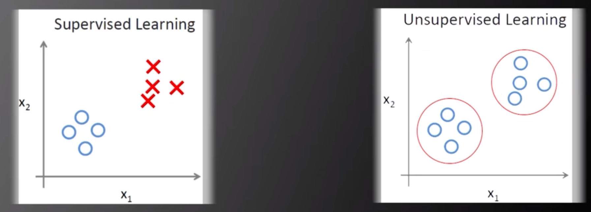

    <b>左边有两类数据标签（x和o），右边只有o，相当于右边没有标签</b>

- 半监督学习：训练数据中一部分有标签，一部分没有标签。值得一提的是，由于网络中有大量的数据，而数据标注确实很耗费时间的工作，因此通过**少量**的标注数据和**大量**未标注数据来设计出**更好**的机器学习算法是一个热点。

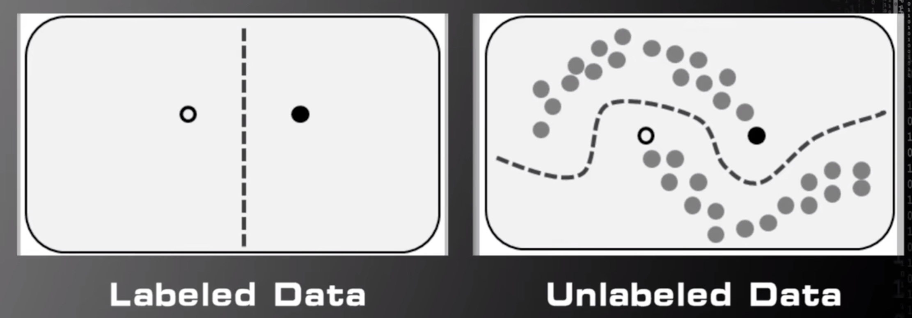

    <b>半监督学习的例子</b>

监督学习根据**标签的固有属性**来分类，又可以分为：

- 分类：标签是离散的值。比如人脸识别
- 回归：标签是连续的值。比如房价预测

> 但是，分类和回归问题的界限其实是非常模糊的。对于分类的问题，加以改造，就可以变成回归的问题，反之亦然。

### 机器学习算法的过程

这里以识别红细胞跟白细胞的过程为例。

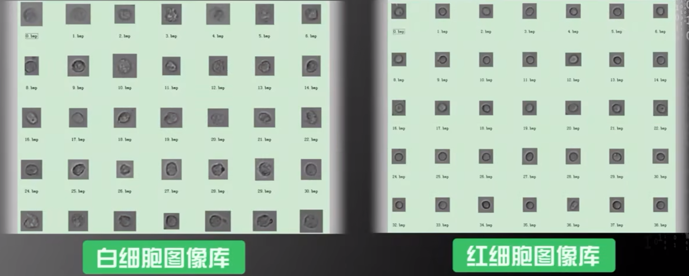

    <b>白细胞和红细胞的图像库</b>

从我们肉眼观察不难发现以下结论：

- 平均来说，白细胞面积比红细胞大
- 白细胞没有红细胞圆
- 白细胞内部纹理比红细胞粗糙

#### 特征提取

首先，我们要对样本的特征进行提取。

> 特征提取（Feature Extraction）：通过训练样本获得的，对机器学习任务有帮助的多维度数据。

根据上面观察出的结果，我们可以提取出：细胞的面积、圆形度和表面粗糙程序这三个特征。

下面简要介绍下特征提取的方法：

- 细胞的面积：通过图像处理中链码来提取细胞的边缘信息，从边缘信息推测出细胞的周长和面积
- 细胞的圆形度：利用边缘信息，通过图像处理中的哈夫变换来推测细胞的圆形度
- 细胞的粗糙程序：灰度共生矩阵

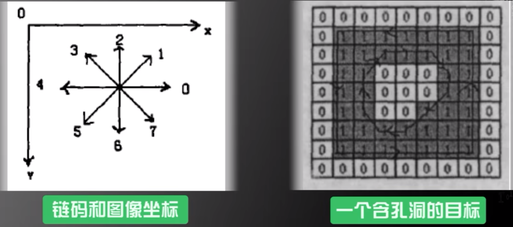

    <b>特征提取</b>

> ​	另外需要强调一下，机器学习的重点**不是**如何提取特征，**而是**假设在已经提取好特征的前提下，如何构造算法获得更好的性能。但是这不是说特征提取不重要，相反，特征提取是非常非常重要的。如果提取出了好的特征，那么即使再差的算法，也会有比较好的性能；相反，如果提取的特征比较差，那么就算是再好的算法，性能也见得会有多高。
>
> ​	那么为什么不重点研究特征提取呢？因为针对不同媒质和不同任务，提取特征的方式千变万化，根本学不完。因此机器学习课程的重点是：**假设已经获得特征的前提下，研究合理的算法，使学习系统获得较好的性能**。

#### 特征选择

特征提取出来之后，下一步要做的就是特征选择。

> 特征选择（Feature Selection）

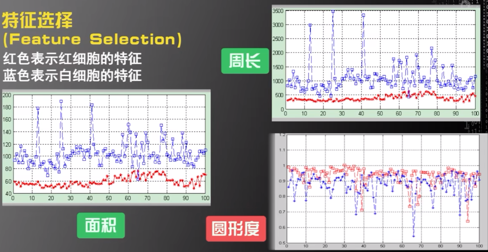

    <b>特征选择</b>

从图中我们可以看到，对于面积和周长这两个特征，红细胞和白细胞基本没有重合的地方，而圆形度中则有很多。因此面积和周长是区分白细胞和红细胞比较好的特征，而圆形度则不是。对于纹理的粗糙程度情况和圆形度类似。

因此我们只选择面积和周长作为区分白细胞和红细胞的特征，来构建机器学习系统。

#### 基于特征构建算法

这里采用了**支持向量机**中的线性内核、多项式核及高斯径向基函数核。

#### 训练结果

对于三种算法，我们都通过训练画出了各自的特征空间。图像中的线段就是区分红细胞和白细胞的界限。

> 特征空间（Feature Space）：我们把由各个特征组成的空间，称作特征空间。当前的例子我们只提取了面积和周长两个特征，因此画出来的是二维平面。

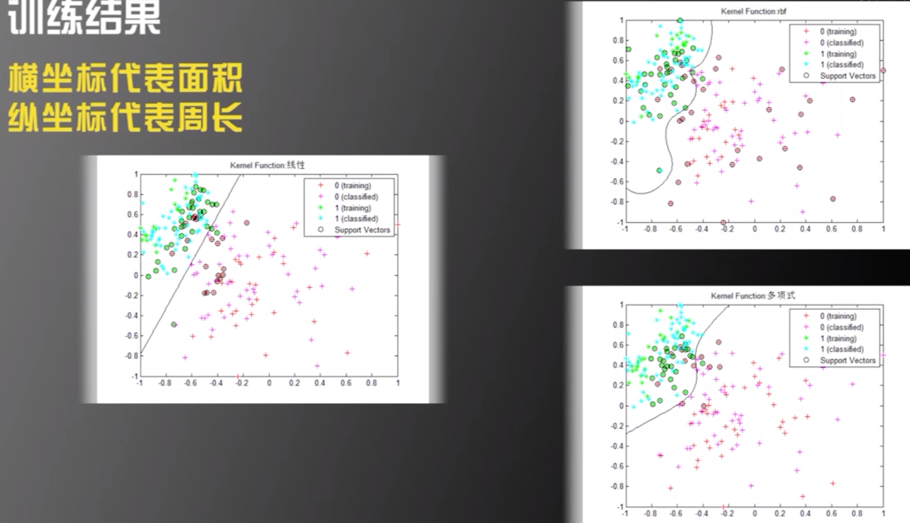

    <b>三种算法的训练结果</b>

我们从图像中也不难发现，不同的算法其特征空闲也有一些差异。比如右边两个图中，在 $(-1,0.4)$ 这里，它们对于红细胞和白细胞的分类标准就产生了差异。

下面是三个算法得出的准确率：

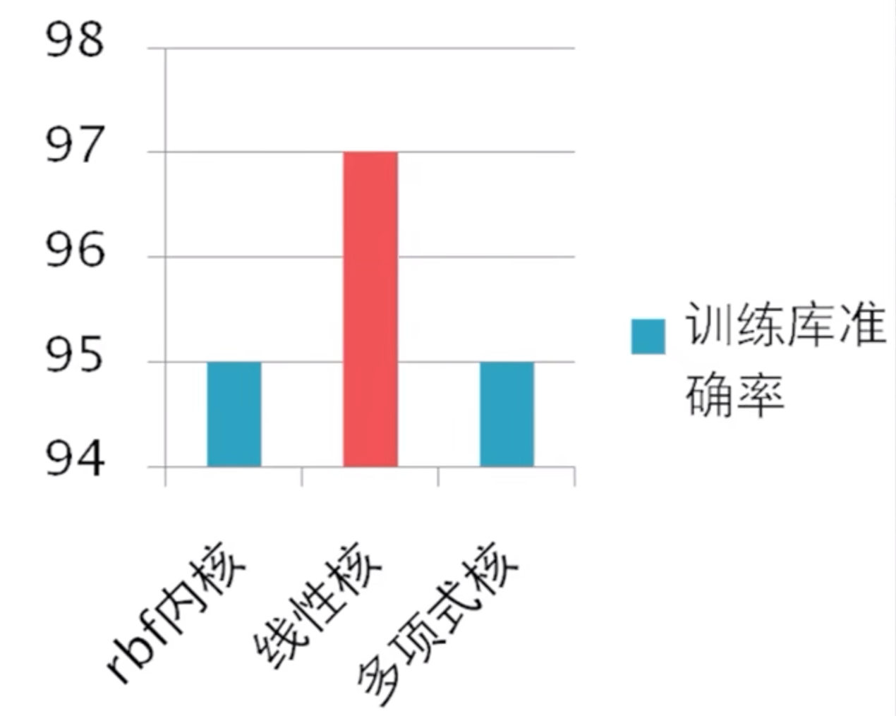

    <b>三种算法的准确率</b>

可以看出线性核算法的准确率更高。

#### 测试结果图像

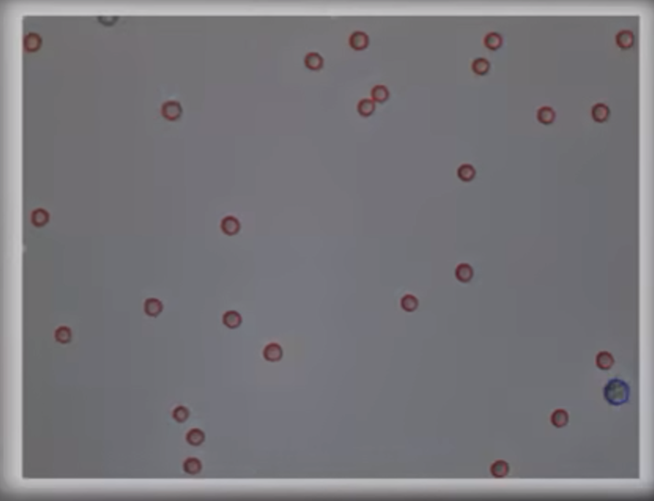

### 没有免费午餐定理

1995 年，D.H.Wolpert 等人提出**没有免费午餐定理**。

> 没有免费午餐定理（No Free Lunch Theorem）：任何一个预测函数，如果在一些训练样本上表现好，那么必然在另外一些训练样本上表现不好，如果不对数据在特征空间的先验分布有一定假设，那么表现好与表现不好的情况一样多。

## 支持向量机

### 线性可分定义

> 线性可分（Linear Separable）：**存在**一条直线，将不同的类别分开

    

         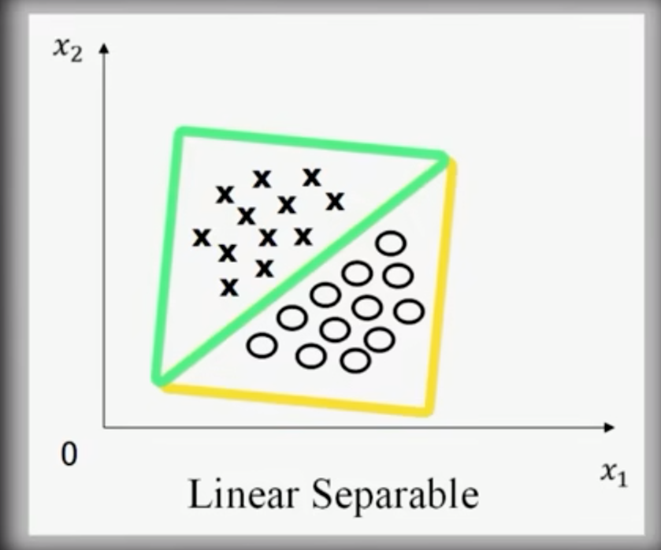
    

     

        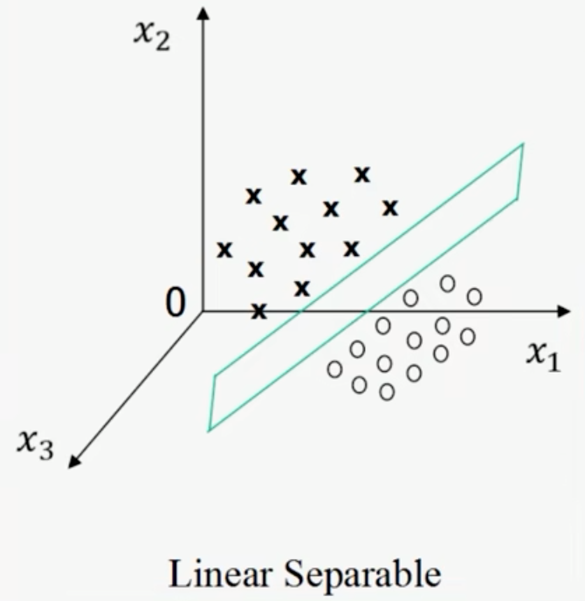
    

    <b>线性可分（二维和三维）</b>

> 线性不可分（Nonlinear Separable）：**不存在**一条可以将不同类别完全分开的直线

    

         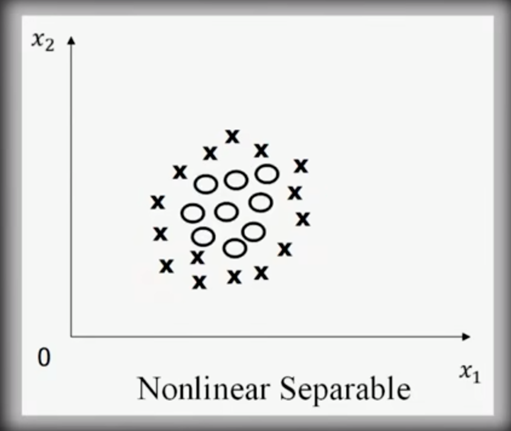
    

     

       
    

    <b>线性不可分（二维和三维）</b>

由于人的眼睛只对三维以下的维度有感知，因此对于高维的问题，我们需要借助于数学。

下面是一个二维线性可分的例子：

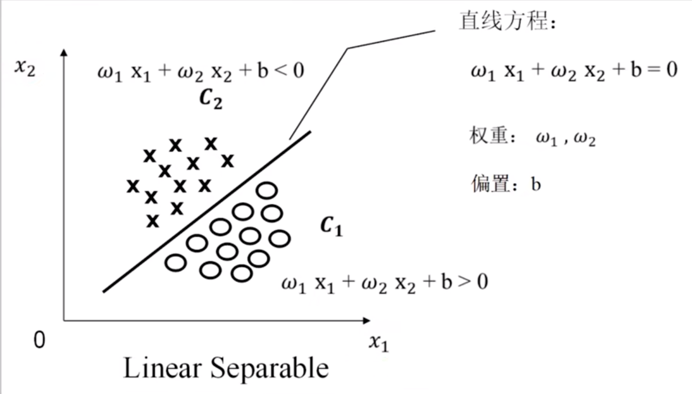

    <b>用数学描述线性可分</b>

接着，我们就能给出线性可分的严格定义：

> 一个训练样本集 $\{(x_i,y_i),...(x_N,y_N)\}$，在 $i=1\sim N$ 线性可分，是指存在 $(\omega _1,\omega _2,b)$ ，使得对 $i=1 \sim N$，有：
> $$
> 若 y_i = +1，则 \omega _1 x_{i1} + \omega _2 x_{i2} + b \gt 0 \\
> 若 y_i = -1，则 \omega _1 x_{i1} + \omega _2 x_{i2} + b \lt 0 
> $$
> 

### 问题描述

支持向量机算法有两个任务，第一个就是**解决线性可分问题**。第二个是再将线性可分问题中获得的结论推广到线性不可分的情况。

那么如何解决线性可分问题呢？在解决这个问题之前，Vladimir Vapnik （支持向量机的提出者）提出了一个问题，在无数多个分开各个类别的超平面中，到底**哪一个最好**呢？

> 前提结论：只要存在一个超平面可以分开各个类别，那么就一定存在无数多个超平面可以分开各个类别。

例如在下面的二维图中的二分类问题中，有三条直线可以将这两个类别分开。但是2号线是其中最好的，因为它**更能抵御训练样本位置的误差**。

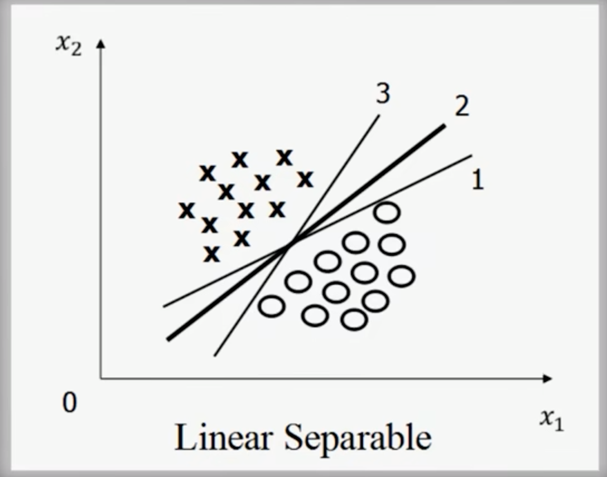

    <b>二维图中的二分类</b>

那么这条2号线是怎么画出来的？作者利用最优化理论解决了该问题：对于**任意**一条可以分开这两类的直线，先将直线向上平移，直到触碰到类别为x的样本；再将直线向下平移，直到触碰到类别为o的样本。

在这个过程中，两条平行线触碰到的样本称为**支持向量**，两条平行线之间的距离称为**间隔（Margin）**。

作者断言，我们要找的**2号线**就存在使得**间隔最大**的这些直线中，并且处于**两条平行线的中间位置**。

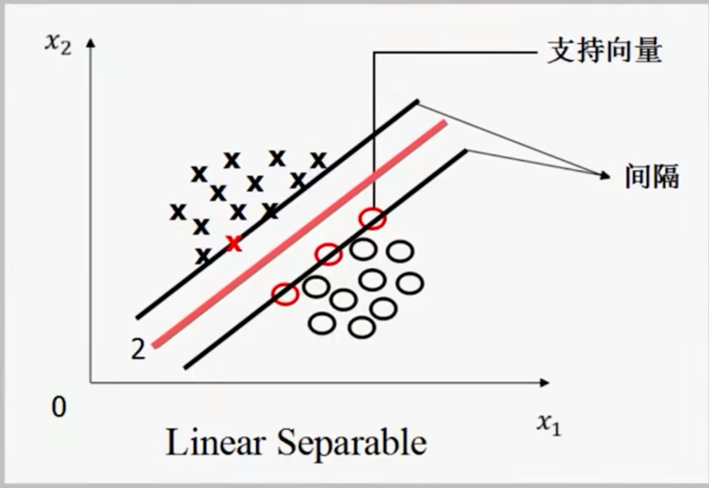

    <b>支持向量和间隔</b>

因此，支持向量机寻找的最优分类直线（超平面）应满足：

1. 该直线（超平面）**分开了两类**
2. 该直线（超平面）**最大化间隔**
3. 该直线（超平面）处于**间隔的中间**，到所有支持向量距离相等

### 优化问题

本节会用严格的数学，将寻找最优分类超平面的过程，写成一个最优化问题。

抽象

