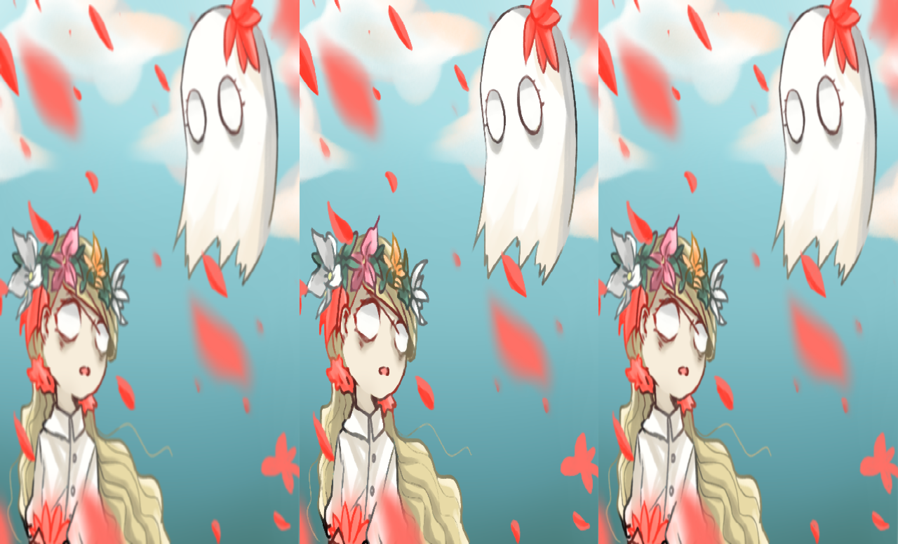
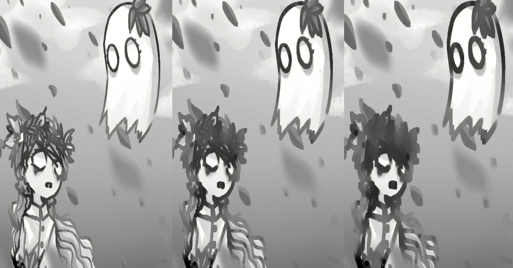
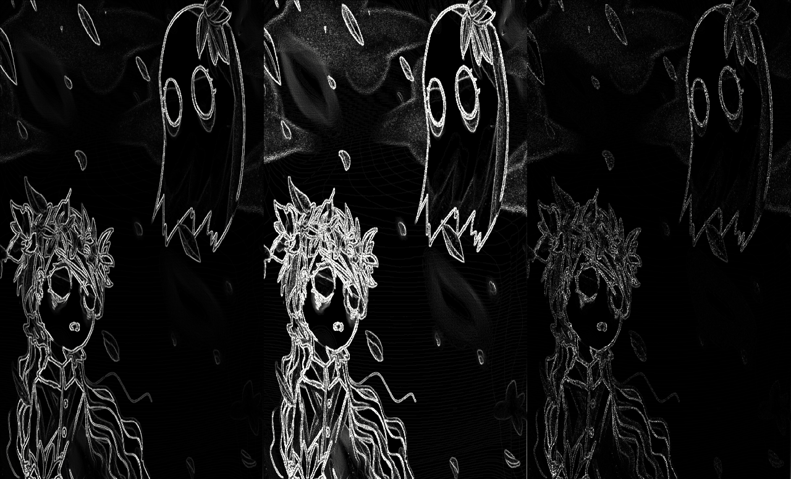

[TOC]


# OpenCV的GUI特性

## 图像入门

`import cv2`

### 读取图像

使用`cv2.imread(a, b)`进行图像读取

- 参数a: 指定图像的路径
- 参数b: 指定读取图像的方式
  - cv2.IMREAD_COLOR | 1: 加载彩色图像
  - cv2.IMREAD_GRAYSCALE | 0: 灰度图
  - cv2.IMREAD_UNCHANGED | -1: 加载图像

```py
import numpy as np
import cv2

# 加载彩色灰度图像
img = cv2.imread('./img/wendi.jpg'，-1)
```


> 即使图片路径错了也不会报错，只是img的值会为None


### 显示图像

使用`cv2.imshow(name, image)`在窗口显示图像。并且窗口大小由图片大小撑开。

- 参数name: 指定窗口的名称
- 参数image: 图片对象

```py
cv.imshow('image'，img)
cv.waitKey(0)
cv.destroyAllWindows()
```


`waitKey()`是一个键盘绑定函数。如果参数为0，那么只有按下任意键，程序才会继续执行。如果参数为1000，那么程序会等待1000ms后才会继续执行，期间可以按下任意键来提前结束等待。如果不想要任意键，而是指定某个键的话，可以加一个判断语句:

```py
import numpy as np
import cv2 as cv
img = cv.imread('messi5.jpg',0)
cv.imshow('image',img)
# 如果是64位计算机，则需要跟上 && 0xFF
# k = cv.waitKey(0)
k = cv.waitKey(0) && 0xFF
if k == 27:         # 等待ESC退出
    cv.destroyAllWindows()
elif k == ord('s'): # 等待关键字，保存和退出
    cv.imwrite('messigray.png',img)
    cv.destroyAllWindows()
```


`destroyAllWindows()`会销毁掉创建出的所有窗口。

如果要销毁特定窗口（由窗口名称进行指定）的话，使用`destroyWindow(name)`。

>在特殊情况下，可以创建一个空窗口，然后再将图像加载到该窗口。在这种情况下，你可以指定窗口是否可调整大小，通过函数`cv.namedWindow(a)`完成。默认情况下a的值为`cv.WINDOW_AUTOSIZE`，即自适应宽高。如果指定为`cv.WINDOW_NORMAL`的话，就可以调整窗口大小了

```py
cv.namedWindow('image'，cv.WINDOW_NORMAL)
cv.imshow('image'，img)
cv.waitKey(0)
cv.destroyAllWindows()
```


### 写入图像

使用`cv.imwrite(a, b)`保存图像

- 参数a: 保存后的图片路径或图片名称
- 参数b: 要保存的图像对象

```py
cv.imwrite('messigray.png'，img)
```


## 视频入门

### 从相机中读取视频

使用`VideoCapture()`创建对象，利用对象进行视频捕获

```py
cap = cv.VideoCapture(0)
```

这里的参数索引表示摄像头的编号。接着就可以逐帧捕获，但是最后要`释放俘虏`

```py
import numpy as np
import cv2 as cv
cap = cv.VideoCapture(0)
if not cap.isOpened():
    print("Cannot open camera")
    exit()
while True:
    # 逐帧捕获
    ret, frame = cap.read()
    # 如果正确读取帧，ret为True
    if not ret:
        print("Can't receive frame (stream end?). Exiting ...")
        break
    # 我们在框架上的操作到这里，重新设置frame的宽高
    ret = cap.set(cv.CAP_PROP_FRAME_WIDTH,320)
    ret = cap.set(cv.CAP_PROP_FRAME_HEIGHT,240)
    gray = cv.cvtColor(frame, cv.COLOR_BGR2GRAY)
    # 显示结果帧e
    cv.imshow('frame', gray)
    if cv.waitKey(1) == ord('q'):
        break
# 完成所有操作后，释放捕获器
cap.release()
cv.destroyAllWindows()
```


> 从结果来看，这是使用了摄像头，并且进行了录像。其中我们对于每一帧的图片都进行了灰度处理，所以显示出来的为灰色。按下q退出捕获，并关闭窗口。

`cap.read()`返回布尔值，用于判断是否正确读帧。可以用此来检查视频是否正常播放。

`cap.isOpened()`用于判断视频/摄像头是否初始化捕获。如果返回值为true，说明已经初始化了。否则就需要使用`cap.open()`来打开（初始化）。

另外，可以使用`cap.set()`和`cap.get()`来修改和获取视频的属性。比如可以使用`cap.get(cv.CAP_PROP_FRAME_WIDTH)`和`cap.get(cv.CAP_PROP_FRAME_HEIGHT)`来获取框架的宽高。然后使用`ret = cap.set(cv.CAP_PROP_FRAME_WIDTH,320)`和`ret = cap.set(cv.CAP_PROP_FRAME_HEIGHT,240)`来设置宽高。

默认情况下，分辨率为640x480

### 从文件播放视频

只需要将摄像头的索引改为视频文件路径就可以了

```py
import numpy as np
import cv2 as cv
cap = cv.VideoCapture('vtest.avi')
while cap.isOpened():
    ret, frame = cap.read()
    # 如果正确读取帧，ret为True
    if not ret:
        print("Can't receive frame (stream end?). Exiting ...")
        break
    gray = cv.cvtColor(frame, cv.COLOR_BGR2GRAY)
    cv.imshow('frame', gray)
    if cv.waitKey(1) == ord('q'):
        break
cap.release()
cv.destroyAllWindows()
```

在显示框架时，要使用适当的时间`cv.waitKey()`。如果太小的话，视频的播放速度将会很快。

>确保安装了正确的 ffmpeg 或 gstreamer 版本。有时，使用视频捕获(Video Capture)是一件令人头疼的事情，主要原因是错误地安装了 ffmpeg / gstreamer。


### 保存视频


```py
import numpy as np
import cv2 as cv
cap = cv.VideoCapture(0)
# 定义编解码器并创建VideoWriter对象
fourcc = cv.VideoWriter_fourcc(*'XVID')
out = cv.VideoWriter('output.avi', fourcc, 20.0, (640,  480))
while cap.isOpened():
    ret, frame = cap.read()
    if not ret:
        print("Can't receive frame (stream end?). Exiting ...")
        break
    frame = cv.flip(frame, 0)
    # 写翻转的框架
    out.write(frame)
    cv.imshow('frame', frame)
    if cv.waitKey(1) == ord('q'):
        break
# 完成工作后释放所有内容
cap.release()
out.release()
cv.destroyAllWindows()
```


# 核心操作

## 图像基本操作

### 访问和修改像素值

先加载彩色图像:

```py
import numpy as np
import cv2 as cv
img = cv.imread('wendi.jpg')
```

通过行列坐标来访问像素值:

```py
# 这个是提取(x, y) = (100, 100)位置的像素
px = img[100, 100]
# array([132, 122, 211], dtype=uint8)

# 仅显示蓝色像素，相当于: blue = px[0]
blue = img[100, 100, 0]
# np.uint8(132)

# 仅显示绿色像素
green = img[100, 100, 1]

# 仅显示红色像素
red = img[100, 100, 2]
```

也可以修改像素值:

```py
# 将x = 0~100和 y = 0~100 都设置为白色
img[0:100, 0:100] = [255, 255, 255]
```


> 另外，也可以通过numpy来访问像素

```py
# 访问red值
img.item(10, 10, 2)
# 修改red值，numpy2.0移除了itemset
# img.itemset((10, 10, 2), 100)
img[(10, 10, 2)] = 100
```


### 访问图像属性

```py
# 访问图像形状，HWC(高度、宽度、通道数)。其中彩色图片有3个通道数，灰度图只有1个通道数
img.shape
# (840, 840, 3)

# 像素总数
img.size
# 2116800

# 图像数据类型
img.dtype
# dtype('uint8')
```


>img.dtype在调试时非常重要，因为OpenCV-Python代码中的大量错误是由无效的数据类型引起的。


### ROI

ROI，即图像感兴趣的区域。比如在做人脸识别时，我们会搜索其眼睛，而不是整个人像。

通过索引获取:

```py
# 获取ROI
ball = img[100:234, 500:700]

# 展示
cv.imshow('ball', ball)
cv.waitKey(0)
cv.destroyAllWindows()
```


### 拆分和合并图像通道

有时候需要分别处理图像的B、G、R通道。此时就可以将图像拆分为单个通道。

```py
# img是三维数组: 行、列、通道数
b, g, r = cv.split(img)
img = cv.merge((b,g,r))
# b、g、r都是二维数组: 行、列
b
"""
array([[238, 238, 238, ..., 126, 125, 126],
       [238, 238, 238, ..., 128, 123, 123],
       [238, 238, 238, ..., 123, 123, 123],
       ...,
       [122, 121, 122, ..., 126, 147, 180],
       [122, 121, 122, ..., 126, 148, 181],
       [122, 122, 122, ..., 126, 149, 182]], dtype=uint8)
"""
# 或者使用numpy索引
b = img[:,:,0]

# 将所有红色像素设置为0
img[:,:,2] = 0
```


> `cv.split()`是一项耗时的操作。因此，仅在必要时才这样做。否则进行numpy索引


### 为图像设置边框（填充）

使用`cv.copyMakeBorder()`实现。但是它在卷积运算，零填充等方面有更多应用。

- **src** - 输入图像
- **top**，**bottom**，**left**，**right** 边界宽度（以相应方向上的像素数为单位）
- **borderType** - 定义要添加哪种边框的标志。它可以是以下类型：
  - **cv.BORDER_CONSTANT** - 添加恒定的彩色边框。该值应作为下一个参数给出。
  - **cv.BORDER_REFLECT** - 边框将是边框元素的镜像，如下所示： *fedcba | abcdefgh | hgfedcb*
  - **cv.BORDER_REFLECT_101** 或 **cv.BORDER_DEFAULT**与上述相同，但略有变化，例如： *gfedcb | abcdefgh | gfedcba*
  - **cv.BORDER_REPLICATE**最后一个元素被复制，像这样： *aaaaaa | abcdefgh | hhhhhhh*
  - **cv.BORDER_WRAP**难以解释，它看起来像这样： *cdefgh | abcdefgh | abcdefg*
- **value** -边框的颜色，如果边框类型为**cv.BORDER_CONSTANT**


```py
import cv2 as cv
import numpy as np
from matplotlib import pyplot as plt
BLUE = [255,0,0]
img1 = cv.imread('./img/wendi.jpg')
replicate = cv.copyMakeBorder(img1,10,10,10,10,cv.BORDER_REPLICATE)
reflect = cv.copyMakeBorder(img1,10,10,10,10,cv.BORDER_REFLECT)
reflect101 = cv.copyMakeBorder(img1,10,10,10,10,cv.BORDER_REFLECT_101)
wrap = cv.copyMakeBorder(img1,10,10,10,10,cv.BORDER_WRAP)
constant= cv.copyMakeBorder(img1,10,10,10,10,cv.BORDER_CONSTANT,value=BLUE)
plt.subplot(231),plt.imshow(img1,'gray'),plt.title('ORIGINAL')
plt.subplot(232),plt.imshow(replicate,'gray'),plt.title('REPLICATE')
plt.subplot(233),plt.imshow(reflect,'gray'),plt.title('REFLECT')
plt.subplot(234),plt.imshow(reflect101,'gray'),plt.title('REFLECT_101')
plt.subplot(235),plt.imshow(wrap,'gray'),plt.title('WRAP')
plt.subplot(236),plt.imshow(constant,'gray'),plt.title('CONSTANT')
plt.show()
```


## 图像运算

### 图像加法

可以使用OpenCV的`cv.add()`或者numpy操作`res = img1 + img2`实现。这两个图像应该具有相同的深度和类型，或者第二个图像可以只是一个标量值

```py
import cv2 as cv
import numpy as np
img = cv.imread('./img/gudu.jpg')
# 相加之前
img[0:5, :, 0]
"""
array([[ 62,  62,  62, ..., 153, 153, 153],
       [ 72,  72,  72, ..., 156, 156, 156],
       [ 75,  75,  75, ..., 157, 157, 157],
       [ 77,  77,  77, ..., 157, 155, 157],
       [ 79,  79,  79, ..., 155, 153, 155]], dtype=uint8)
"""

# numpy相加之后
res = img + 200
res[0:5, :, 0]
"""
array([[  6,   6,   6, ...,  97,  97,  97],
       [ 16,  16,  16, ..., 100, 100, 100],
       [ 19,  19,  19, ..., 101, 101, 101],
       [ 21,  21,  21, ..., 101,  99, 101],
       [ 23,  23,  23, ...,  99,  97,  99]], dtype=uint8)
"""

# cv.add相加之后
res = cv.add(img, 200)
res[0:5, :, 0]
"""
array([[255, 255, 255, ..., 255, 255, 255],
       [255, 255, 255, ..., 255, 255, 255],
       [255, 255, 255, ..., 255, 255, 255],
       [255, 255, 255, ..., 255, 255, 255],
       [255, 255, 255, ..., 255, 255, 255]], dtype=uint8)
"""
```


>OpenCV加法和Numpy加法之间有区别。OpenCV加法是饱和运算，加到255就不能再加了。而Numpy加法是模运算，不管加了多少，最后都要跟255取模运算。


### 图像融合

这是一种权重加法:
$$
G(x) = (1 - α)f_0(x) + αf_1(x)
$$
通过更改α的值，可以实现在一个图像向另外一个图像之间进行过渡。

这里使用了两张图像，img1的权重为0.7，img2的权重为0.3，使用`cv.addWeighted()`进行图像融合，对应公式如下:
$$
dst = α · img1 + \beta · img2 + \gamma
$$
这里的 $γ$ 被视为0

```py
img1 = cv.imread('./img/wendi.jpg')
img2 = cv.imread('./img/gudu.jpg')
# 需要长宽都相等才能融合
img2 = cv.resize(img2, (840, 840))
dst = cv.addWeighted(img1,0.7,img2,0.3,0)
cv.imshow('dst',dst)
cv.waitKey(0)
cv.destroyAllWindows()
```


### 按位运算

```py
```


# 图像处理


## 图像阈值

阈值为人为规定的像素最大值，图像阈值研究的主要为超过阈值或者低于阈值的部分应该怎么处理

### 简单阈值

使用`ret, dst = cv.threshold(a, b, c, d)`(dst为输出图)

- 参数a: 原图像
- 参数b: 设置阈值
- 参数c: 分配超过阈值的像素值得最大值
- 参数d: 阈值类型
  - cv.THRESH_BINARY: 超过阈值的部分取参数c的值，否则取0
  - cv.THRESH_BINARY_INV: 超过阈值的部分取0，否则取参数c的值
  - cv.THRESH_TRUNC: 大于阈值部分设为阈值，否则不变
  - cv.THRESH_TOZERO: 大于阈值部分不变，否则取0
  - cv.THRESH_TOZERO_INV: 大于阈值部分取0，否则不变


```py
import cv2 as cv
import numpy as np
from matplotlib import pyplot as plt
img = cv.imread('./img/wendi.jpg',0)
ret,thresh1 = cv.threshold(img,127,255,cv.THRESH_BINARY)
ret,thresh2 = cv.threshold(img,127,255,cv.THRESH_BINARY_INV)
ret,thresh3 = cv.threshold(img,127,255,cv.THRESH_TRUNC)
ret,thresh4 = cv.threshold(img,127,255,cv.THRESH_TOZERO)
ret,thresh5 = cv.threshold(img,127,255,cv.THRESH_TOZERO_INV)
titles = ['Original Image','BINARY','BINARY_INV','TRUNC','TOZERO','TOZERO_INV']
images = [img, thresh1, thresh2, thresh3, thresh4, thresh5]
for i in range(6):
    plt.subplot(2,3,i+1),plt.imshow(images[i],'gray')
    plt.title(titles[i])
    plt.xticks([]),plt.yticks([])
plt.show()
```


## 图像平滑

图像模糊处理

### 2D卷积


### 均值滤波

比如我这里有一个3x3的过滤器，那么该过滤器的作用，就是把每一个像素点都用3x3的矩形框起来（见中间黄底部分），然后把这9个点的像素相加取均值，然后替代中间的204。


使用`cv.blur(a, b)`实现

- 参数a: 原图像
- 参数b: 内核大小（nxm）

```py
import cv2 as cv
import numpy as np
from matplotlib import pyplot as plt
img = cv.imread('./img/wendi.jpg')
blur = cv.blur(img,(5,5))
plt.subplot(121),plt.imshow(img),plt.title('Original')
plt.xticks([]), plt.yticks([])
plt.subplot(122),plt.imshow(blur),plt.title('Blurred')
plt.xticks([]), plt.yticks([])
plt.show()
```


### 方框滤波

`cv.boxFilter()`，当该函数的最后一个参数为`normalize=True`的话，效果跟均值滤波一样，因为开启了归一化

```py
import cv2 as cv
import numpy as np
from matplotlib import pyplot as plt
img = cv.imread('./img/wendi.jpg')
blur = cv.boxFilter(img, -1, (5,1), normalize = True)
plt.subplot(121),plt.imshow(img),plt.title('Original')
plt.xticks([]), plt.yticks([])
plt.subplot(122),plt.imshow(blur),plt.title('Blurred')
plt.xticks([]), plt.yticks([])
plt.show()
```


如果没有开启归一化的话，那么卷积核的像素相加之后是`不会除以像素个数`的，一旦相加总和超过了255，那么中间像素点的值就是255，所以一般会变成一片白。

```py
import cv2 as cv
import numpy as np
from matplotlib import pyplot as plt
img = cv.imread('./img/wendi.jpg')
blur = cv.boxFilter(img, -1, (2,2), normalize = False)
cv.namedWindow('blur', cv.WINDOW_NORMAL)
cv.imshow('blur', blur)
cv.waitKey(0)
cv.destroyAllWindows()
```


### 高斯滤波

`cv.GaussianBlur(img,(5,5),0)`

还是看下面的图，高斯核认为，上下左右的部分会离中间近一点，因此他们的权重就要重一点；而左上左下、右上右下离中间远一点，那么他们的权重就要低一点。

相比于均值滤波，高斯滤波更注重权重。


```py
import cv2 as cv
import numpy as np
from matplotlib import pyplot as plt
img = cv.imread('./img/wendi.jpg')
blur = cv.GaussianBlur(img,(5,5),0)
cv.namedWindow('blur', cv.WINDOW_NORMAL)
cv.imshow('blur', blur)
cv.waitKey(0)
cv.destroyAllWindows()
```


### 中值滤波

`cv.medianBlur(img,5)`

中值滤波的话会从内核区域寻找一个`中位值`，然后用该中位值来替代中心。比如黄底这里的中位值为113，那么中值滤波之后，中间的204就会被改为113。


```py
import cv2 as cv
import numpy as np
from matplotlib import pyplot as plt
img = cv.imread('./img/wendi.jpg')
blur = cv.medianBlur(img,5)
cv.namedWindow('blur', cv.WINDOW_NORMAL)
cv.imshow('blur', blur)
cv.waitKey(0)
cv.destroyAllWindows()
```


### 同时展示所有滤波图

`np.hstack`或者`np.vstack`

```py
import cv2 as cv
import numpy as np
from matplotlib import pyplot as plt
img = cv.imread('./img/wendi.jpg')
median = cv.medianBlur(img,5)
gauss = cv.GaussianBlur(img,(5,5),0)
blur = cv.blur(img,(5,5))
res = np.hstack((blur, median, gauss))
cv.namedWindow('all', cv.WINDOW_NORMAL)
cv.imshow('all', res)
cv.waitKey(0)
cv.destroyAllWindows()
```





## 形态转换


### 腐蚀操作

就是用一个卷积核，比如3x3的，去给图像中的白色像素做与运算。只有九个点与出来的结果都是1，那么此时核的中心点才会为1，即才会为白色，否则为0（黑色）


使用`cv.erode(a, b, iterations)`实现:

- 参数a: 原图像
- 参数b: 卷积核
- iterations: 腐蚀操作迭代次数

```py
import cv2 as cv
import numpy as np
img = cv.imread('./img/wendi.jpg',0)
kernel = np.ones((5,5),np.uint8)
e1 = cv.erode(img,kernel,iterations = 1)
e2 = cv.erode(img,kernel,iterations = 2)
e3 = cv.erode(img,kernel,iterations = 3)
res = np.hstack((e1, e2, e3))
cv.namedWindow('all', cv.WINDOW_NORMAL)
cv.imshow('all', res)
cv.waitKey(0)
cv.destroyAllWindows()
```




### 膨胀

跟腐蚀相反的操作。

只要卷积核里面有白色的，那么就都变成白色的。


```py
import cv2 as cv
import numpy as np
img = cv.imread('./img/wendi.jpg',0)
kernel = np.ones((5,5),np.uint8)
d1 = cv.dilate(img,kernel,iterations = 1)
d2 = cv.dilate(img,kernel,iterations = 2)
d3 = cv.dilate(img,kernel,iterations = 3)
res = np.hstack((d1, d2, d3))
cv.namedWindow('all', cv.WINDOW_NORMAL)
cv.imshow('all', res)
cv.waitKey(0)
cv.destroyAllWindows()
```


腐蚀和膨胀的简单应用，就是把一些杂质去掉。先腐蚀再膨胀

```py
import cv2 as cv
import numpy as np
img = cv.imread('./img/ed.png')
kernel = np.ones((5,5),np.uint8)
e1 = cv.erode(img,kernel,iterations = 2)
d1 = cv.dilate(e1,kernel,iterations = 2)
res = np.hstack((img, e1, d1))
cv.namedWindow('all', cv.WINDOW_NORMAL)
cv.imshow('all', res)
cv.waitKey(0)
cv.destroyAllWindows()
```


### 开运算和闭运算

开运算: 先腐蚀，后膨胀

闭运算: 先膨胀，后腐蚀

使用`cv.morphologyEx(img, type, kernel) `实现

- img: 原图
- type: 选择开运算还是闭运算
  - cv.MORPH_OPEN: 开运算
  - cv.MORPH_CLOSE: 闭运算
- kernel: 卷积核大小

```py
import cv2 as cv
import numpy as np
img = cv.imread('./img/ed.png')
kernel = np.ones((9,9),np.uint8)
opening = cv.morphologyEx(img, cv.MORPH_OPEN, kernel) 
res = np.hstack((img, opening))
cv.namedWindow('all', cv.WINDOW_NORMAL)
cv.imshow('all', res)
cv.waitKey(0)
cv.destroyAllWindows()
```


### 梯度运算

就是膨胀后的结果，剪去腐蚀后的结果。得到一个类似圆环的东西

使用`cv.morphologyEx(img, cv.MORPH_GRADIENT, kernel) `

```py
import cv2 as cv
import numpy as np
img = cv.imread('./img/wendi.jpg')
kernel = np.ones((9,9),np.uint8)
opening = cv.morphologyEx(img, cv.MORPH_GRADIENT, kernel) 
res = np.hstack((img, opening))
cv.namedWindow('all', cv.WINDOW_NORMAL)
cv.imshow('all', res)
cv.waitKey(0)
cv.destroyAllWindows()
```


### 礼帽和黑帽

- 礼帽: 原始输入 - 开运算结果，cv.MORPH_TOPHAT
- 黑帽: 闭运算结果 - 原始输入，cv.MORPH_BLACKHAT

```py
import cv2 as cv
import numpy as np
img = cv.imread('./img/wendi.jpg')
kernel = np.ones((9,9),np.uint8)
top = cv.morphologyEx(img, cv.MORPH_TOPHAT, kernel) 
black = cv.morphologyEx(img, cv.MORPH_BLACKHAT, kernel) 
res = np.hstack((img, top, black))
cv.namedWindow('all', cv.WINDOW_NORMAL)
cv.imshow('all', res)
cv.waitKey(0)
cv.destroyAllWindows()
```


### 结构元素

之前都是使用numpy创建的卷积核，它的一个特点就是矩形。我们有时候希望用其他形状的卷积核，比如圆形或者椭圆形，此时就可以使用OpenCV的`cv.getStructuringElement()`，只需要考虑卷积核形状和大小，就可以获取到需要的内核

```py
# 矩形内核
cv.getStructuringElement(cv.MORPH_RECT,(5,5))
"""
array([[1, 1, 1, 1, 1],
       [1, 1, 1, 1, 1],
       [1, 1, 1, 1, 1],
       [1, 1, 1, 1, 1],
       [1, 1, 1, 1, 1]], dtype=uint8)
"""

# 椭圆内核
cv.getStructuringElement(cv.MORPH_ELLIPSE,(5,5))
"""
array([[0, 0, 1, 0, 0],
       [1, 1, 1, 1, 1],
       [1, 1, 1, 1, 1],
       [1, 1, 1, 1, 1],
       [0, 0, 1, 0, 0]], dtype=uint8)
"""

# 十字内核
cv.getStructuringElement(cv.MORPH_CROSS,(5,5))
"""
array([[0, 0, 1, 0, 0],
       [0, 0, 1, 0, 0],
       [1, 1, 1, 1, 1],
       [0, 0, 1, 0, 0],
       [0, 0, 1, 0, 0]], dtype=uint8)
"""
```


### 图像梯度

边缘是像素点跃迁的地方

#### Sobel算子


使用`cv.Sobel(src, ddepth, dx, dy, ksize)`

- ddepth: 图像的深度，取`cv.CV_64F`就行了
- dx、dy: 对水平或者竖直方向进行处理。处理则取1，否则取0
- ksize: Sobel算子的大小

```py
import numpy as np
import cv2 as cv
from matplotlib import pyplot as plt
img = cv.imread('./img/black-hole.png', 1)
# 水平
sobelx = cv.Sobel(img,cv.CV_64F,1,0,ksize=5)
# 竖直
sobely = cv.Sobel(img,cv.CV_64F,0,1,ksize=5)
res = np.hstack((img, sobelx, sobely))
cv.namedWindow('all', cv.WINDOW_NORMAL)
cv.imshow('all', res)
cv.waitKey(0)
cv.destroyAllWindows()
```


为什么只有一半，以下面的图为例。在左边部分，是利用黑色-白色（0-255），因为OpenCV中的值为\[0, 255\]，所以负值会直接截断得到0，即黑色。处理右边部分的时候，则是白色-黑色。得到255，即黑色。


想要得到完整的边缘，关键是要把负值转为绝对值，而不是截断，使用到`cv.convertScaleAbs()`:

```py
import numpy as np
import cv2 as cv
from matplotlib import pyplot as plt
img = cv.imread('./img/black-hole.png', -1)
# 水平
sobelx = cv.Sobel(img,cv.CV_64F,1,0,ksize=5)
sobelx = cv.convertScaleAbs(sobelx)
# 竖直
sobely = cv.Sobel(img,cv.CV_64F,0,1,ksize=5)
sobely = cv.convertScaleAbs(sobely)
res = np.hstack((img, sobelx, sobely))
cv.namedWindow('all', cv.WINDOW_NORMAL)
cv.imshow('all', res)
cv.waitKey(0)
cv.destroyAllWindows()
```


此外，还可以给x、y方向添加权重`cv.addWeighted()`: 

```py
import numpy as np
import cv2 as cv
from matplotlib import pyplot as plt
img = cv.imread('./img/black-hole.png', -1)
# 水平
sobelx = cv.Sobel(img,cv.CV_64F,1,0,ksize=5)
sobelx = cv.convertScaleAbs(sobelx)
# 竖直
sobely = cv.Sobel(img,cv.CV_64F,0,1,ksize=5)
sobely = cv.convertScaleAbs(sobely)
sobelxy = cv.addWeighted(sobelx, 0.5, sobely, 0.5, 0)
cv.imshow('all', sobelxy)
cv.waitKey(0)
cv.destroyAllWindows()
```


#### Scharr算子

跟Sobel算子类似，只是值大一点


#### Laplacian算子

跟前面两个的主要区别在于，不需要考虑x、y


#### 三个算子的比较

```py
import numpy as np
import cv2
from matplotlib import pyplot as plt
img = cv2.imread('./img/wendi.jpg' , cv2.IMREAD_GRAYSCALE)

sobelx = cv2.Sobel(img, cv2.CV_64F, 1,0, ksize=3)
sobely = cv2.Sobel(img, cv2.CV_64F,0,1,ksize=3)
sobelx = cv2.convertScaleAbs(sobelx)
sobely = cv2.convertScaleAbs(sobely)
sobelxy = cv2.addWeighted(sobelx, 0.5, sobely, 0.5, 0)

scharrx = cv2.Scharr(img, cv2.CV_64F, 1, 0)
scharry = cv2.Scharr(img,cv2.CV_64F,0,1)
scharrx = cv2.convertScaleAbs(scharrx)
scharry = cv2.convertScaleAbs(scharry)
scharrxy = cv2.addWeighted(scharrx, 0.5, scharry, 0.5, 0)

laplacian = cv2.Laplacian(img, cv2.CV_64F)
laplacian = cv2.convertScaleAbs(laplacian)

res = np.hstack((sobelxy, scharrxy, laplacian))
cv.namedWindow('all', cv.WINDOW_NORMAL)
cv.imshow('all', res)
cv.waitKey(0)
cv.destroyAllWindows()
```


