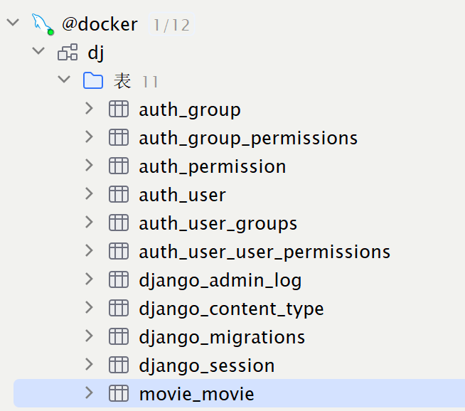

# 入门

## 第一个django项目

### 运行Django

- 命令行: `python manage.py runserver`，默认端口为8000。如果要指定端口号，则可以在命令行的后面指定: `python manage.py runserver 9000`
- 通过Pycharm运行


### 项目结构

- `manage.py`: 以后和项目交互基本上都基于这个文件
- `settings.py`: 项目的设置项，存放项目的配置
- `urls.py`: 用来配置url路由
- `wsgi.py`: 项目与`WSGI`协议兼容的web服务器入口


### project和app的关系

`app`是django项目的组成部分，一个`app`代表项目中的一个模块，所有`url`请求的响应都是由`app`来处理的。一个app就是一个模块，比如创建一个book模块，这个book模块就存放跟book相关的内容。

`python manage.py startapp book`


## 路由

### 发送get请求

三种方式: 

- 通过查询字符串

```py
# 在book/views.py中定义路径的方法
def book_detail(request):
    b_id = request.GET.get('id')
    return HttpResponse(f'你想要查找的图书编号为: {b_id}')

# 在urls.py定义路由
from book import views
urlpatterns = [
    path('book', views.book_detail)
]

# 浏览器访问 http://localhost:8000/book?id=23
你想要查找的图书编号为: 23
```

- 通过路径传参，但不指定类型

```py
# 定义路径方法，此时通过额外的参数来接收变量
def book_detail(request, book_id):
    return HttpResponse(f'你想要查找的图书编号为: {book_id}')

# 定义路由
from book import views
urlpatterns = [
    path('book/<book_id>', views.book_detail)
]

# 浏览器访问 http://localhost:8000/book/23
你想要查找的图书编号为: 23
```

- 通过路径传参并指定类型

```py
from book import views
urlpatterns = [
    path('book/<int:book_id>', views.book_detail)
]
```


### path函数

`path(route, view, name=None, kwargs=None)`

参数详解: 

- route
  - url的匹配规则，其中可以指定参数类型。
  - str、int: 字符串和整型
  - slug: 由`-`或`_`连接英文字符或数字组成的字符串，比如`abc-sd1`
  - `uuid`: 匹配uuid字符串
  - path: 匹配非空的英文字符串，可以包含斜杠
- view
  - 可以是一个视图函数、或者`视图类.as_view()`、或者是`django.urls.include()`函数的返回值
- name
  - 给url取名


### 路由模块化

book的请求由book管理，movie的请求由movie管理。

只需要在每个模块下面创建一个`urls.py`文件，然后引入`from django.urls import path`，定义路由。

```py
from django.urls import path
from . import views

# 指定应用名称（应用命名空间）
app_name = 'movie'
urlpatterns = [
    path('list', views.movie_list)
]
```

并在`views`中写好请求方法

```py
from django.shortcuts import render, HttpResponse


def movie_list(request):
    return HttpResponse('电影列表')
```

然后导入`主urls.py`文件中，进行模块的注册

```py
from django.urls import path, include

urlpatterns = [
    # 注册movie模块，以movie开头的请求都会去movie的urls.py中进行处理
    path('movie/', include('movie.urls'))
]
```

请求测试: `http://localhost:8000/movie/list`


### 路由反转

在path函数中，有一个name参数，他可以给url命令。路由反转就是根据name的值，来得到url的

首先需要从`django.urls`中引入`reverse`函数。可以使用`kwargs`来传递参数，不过仅限于路径传参，如果是查询字符串的话，就只能手动拼接了。

```py
from django.contrib import admin
from django.urls import path, include, reverse
from django.shortcuts import HttpResponse
from book import views


def index(request):
    print(reverse('index'))
    # /
    print(reverse('book_detail', kwargs={'book_id': 1}))
    # /book/1
    return HttpResponse(reverse('index'))


urlpatterns = [
    path('book/<book_id>', views.book_detail, name='book_detail'),
    path('', index, name='index'),
    path('movie/', include('movie.urls'))
]

```

另外，前面在movie模块中的urls.py里，我们声明了app的命名空间为'movie'，我们也可以据此来进行反转，比如`reserve('movie:list') => /movie/list/`


## 操作数据库

### 配置连接数据库

在`settings.py`添加数据库的连接配置

```py
DATABASES = {
    'default': {
        'ENGINE': 'django.db.backends.mysql',
        'NAME': 'dj',
        'USER': 'root',
        'PASSWORD': '200414',
        'HOST': '42.194.138.186',
        'PORT': '3306'
    }
}
```

然后尝试使用`原生sql`语句

```py
from django.shortcuts import render, HttpResponse
from django.db import connection


def movie_list(request):
    # 获取游标对象
    cursor = connection.cursor()
    cursor.execute('select * from movie')
    rows = cursor.fetchall()
    for row in rows:
        print(row)
    return HttpResponse('电影列表')
# 这里需要安装mysqlclient，安装pymysql会报错
```

常用原生API

- `description`: 得到一个列表，列表的每一个元素都是一个元组，而每一个元组的第一个元素就是字段名
- `rowcount`: 执行sql后受到影响的行数
- `close`: 关闭游标
- `execute(sql, [,parameters])`: 执行sql语句，有时需要动态传参
- `fetchone`: 在执行了查询操作以后，获取第一条数据
- `fetchmany(size)`: 在执行查询操作以后，获取size条数据
- `fetchall`: 查询满足sql的所有数据


### 创建ORM模型

就是mapper层

去movie模块的`models.py`里创建一个模型

```py
from django.db import models


class Movie(models.Model):
    name = models.CharField(max_length=100)
    author = models.CharField(max_length=100)
    pub_time = models.DateTimeField(auto_now_add=True)
    price = models.FloatField(default=0)

    # 这里没有写id的话，django就会自动生成一个自增且为int类型的主键，名字就叫int
```

`映射模型到数据库`:

- 在`settings.py`中配置好数据库连接信息
- 在app的`models.py`中定义好模型，该模型必须继承自`django.db.models`
- 将`app`添加到`settings.py`的`INSTALLED_APP`中
- 在命令行终端，进入到项目所在路径，然后执行命令`python manage.py makemigrations`来生成迁移脚本文件
- 同样在命令行中，执行命令`python manage.py migrate`来讲迁移脚本文件映射到数据库中

这些步骤执行完之后，数据库中就会得到下面的表:



除了`movie_movie`之外，其他表都是django封装的模型。可以在`settings.py`中看见:

```py
INSTALLED_APPS = [
    'django.contrib.admin',
    'django.contrib.auth',
    'django.contrib.contenttypes',
    'django.contrib.sessions',
    'django.contrib.messages',
    'django.contrib.staticfiles',
    'movie'
]
```


### ORM的CRUD

#### 增

插入数据:

```py
# 添加数据
def add_movie(request):
    movie = Movie(name='寻子遇仙记', author='卓别林', pub_time=None, price=20.23)
    movie.save()
    return HttpResponse('插入成功')
```

#### 删

```py
movie = Movie.object.get(name='寻子遇仙记')
movie.delete()
```


#### 改

```py
# 找到数据
movie = Movie.objects.first()
# 修改数据
movie.name = '大独裁者'
# 保存数据
movie.save()
```


#### 查

查找数据:

```py
# 查询数据
def query_all_movie(request):
    movies = Movie.objects.all()
    for movie in movies:
        print(movie.id, movie.name, movie.author)
    return HttpResponse('已查找到所有数据')
```


过滤数据:

```py
def filter_movie(request):
    movies = Movie.objects.filter(name='寻子遇仙记1')
    for movie in movies:
        print(movie.id, movie.name, movie.author)
    return HttpResponse('已查找到所有数据')
```


获取单个对象:

```py
movie = Movie.objects.get(name='寻子遇仙记')
# 找不到的话就抛出异常，一般用于登录操作

try:
	movie = Movie.objects.get(name='寻子遇仙记1')
except Movie.DoesNotExist:
```


数据排序:

```py
# 升序
books = Book.objects.order_by('pub_date')
# 降序
books = Book.objects.order_by('-pub_date')
```


### 模型的数据结构

- `AutoField`: 自增类型，默认为64位的整型
- `BigAutoField`: 64位整型
- `BooleanField`: 对应数据库的`tinyint`
- `CharField`: 字符型，对应`varchar`，需要用`max_length`规定最大长度
- `DateField`: 对应`date`类型，并且可以传递以下几个参数
  - `auto_now`: 每次保存数据的时候，都使用当前时间
  - `auto_now_add`: 每一次添加数据的时候，都使用当前时间
- `DateTimeField`: 对应`datetime`
- `TimeField`: 对应`time`
- `FileField`: 用来存储文件
- `ImageField`: 用来存储图片
- `TextField`: 对应`longtext`


### Meta配置

该配置用于控制模型的一些属性，比如可以指定数据库的表名，而不是使用模型的名称。

django默认使用`app_model`来进行表的创建，结果就导致`movie_movie`这样的表诞生了，烦呐。

```py
class Movie(models.Model):
    name = models.CharField(max_length=100)
    author = models.CharField(max_length=100)
    pub_time = models.DateTimeField(auto_now_add=True)
    price = models.FloatField(default=0)

    class Meta:
        # 指定表名为'movie'
        db_table = 'movie'
```

### 外键配置

比如有两个类:User和Book，Book类中的author属性需要跟User关联，所以需要绑定外键。默认会自动生成一个`author_id`跟User的主键进行关联

`User`

```py
# User
from django.db import models


# Create your models here.
class User(models.Model):
    name = models.CharField(max_length=100)
    age = models.IntegerField()
    email = models.EmailField()
    password = models.CharField(max_length=100)

    class Meta:
        db_table = 'user'
```

`Book`

```py
from django.db import models
from user.models import User


# Create your models here.
class Book(models.Model):
    title = models.CharField(max_length=100)
    # 这里绑定了外键
    author = models.ForeignKey(User, on_delete=models.CASCADE)
    year = models.IntegerField()
    pub_date = models.DateTimeField(auto_now_add=True)

    class Meta:
        db_table = 'book'

```

然后定义一个请求方法，用来保存数据:

```py
from django.shortcuts import render, HttpResponse

from user.models import User
from .models import Book


def save_book(request):
    user = User(name='胡桃', age=18, password='123')
    # 必须得先保存用户，这样才有id，否则book跟user不能进行外键关联
    user.save()
    book = Book(title='世界中借钱', year=2024)
    book.author = user
    book.save()
    return HttpResponse('ok')


```

如果想要获取数据的话，可以直接通过`.`

```py
def get_book(request, book_id):
    book = Book.objects.get(id=book_id)
    # .author可以直接获取到User对象，再使用.name可以直接拿到User对象的属性
    print(book.author.name)
    return HttpResponse('ok')
```


### 表关系

#### 一对多

Book类可以通过`book.author`来找到关联的User对象，那么User类该如何才能找到与之关联的所有Book对象呢？

默认的话，django会给外键操作提供一个方法，名称为`外键_set`

比如:

```py
def get_books(request):
    user = User.objects.first()
    books = user.book_set.all()
    for book in books:
        print(book)
    return HttpResponse('ok')
```

或者也可以自定义，在绑定外键的时候

```py
author = models.ForeignKey(User, on_delete=models.CASCADE, related_name='books')
```

此时就可以使用`books`的方法获取用户所著的书了

```py
def get_books(request):
    user = User.objects.first()
    books = user.books.all()
    for book in books:
        print(book)
    return HttpResponse('ok')
```


#### 一对一

一对一的其中一个应用场景时，用户需要登录，所以就有用户名、密码这两个字段，并且存储在用户表里面。但是其实有一个点，密码只有在登录或者修改密码的时候才会用到，并且密码是不会跟其他字段关联的。常规的做法是将一个用户的基本数据都放在user表里面，作为一行记录，但这里的缺陷就是有很多字段并不需要，但是我们也去查询了，这就降低了查询的效率。

django针对这一点提供了一个`xxxExtension`类，并且提供了`OneToOneField`的`Field`，专门用户处理这种一对多的关系。

```py
class User(models.Model):
    name = models.CharField(max_length=100)
    password = models.CharField(max_length=100)

    class Meta:
        db_table = 'user'


class UserExtension(models.Model):
    age = models.IntegerField()
    university = models.CharField(max_length=100)
    # 创建user_extension表之后，会多出一个user_id的字段，用于外键关联
    user = models.OneToOneField(User, on_delete=models.CASCADE)
    
    class Meta:
        db_table = 'user_extension'
```

#### 多对多

应用场景：比如文章和标签的关系。一篇文章可以有多个标签，一个标签可以被多个文章所引用。因此标签和文章的关系是典型的多对多的关系。

可以通过一个标签找到该标签下的所有文章，也可以通过文章找到该文章下的所有标签

实现方式：Django 为这种多对多的实现提供了专门的`Field`。叫做`ManyToManyField`。还是拿文章和标签为例进行讲解。示例代码如下：

```py
from django.db import models
from user.models import User

class Book(models.Model):
    title = models.CharField(max_length=100)
    author = models.ForeignKey(User, on_delete=models.CASCADE, related_name='books')
    year = models.IntegerField()
    pub_date = models.DateTimeField(auto_now_add=True)
    tags = models.ManyToManyField("Tag", related_name='books')

    class Meta:
        db_table = 'book'


class Tag(models.Model):
    name = models.CharField(max_length=100)

```


|      |      |      |
| ---- | ---- | ---- |
|      |      |      |
|      |      |      |
|      |      |      |

