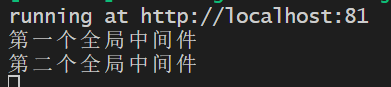

# 概述

## 介绍

`Express`是基于Node.js的快速、开放、极简的Web框架

本质上是一个npm的第三方包，提供了快速创建Web服务器的便捷方法，封装了http模块，并提供了强大的功能

安装命令如下：

```sh
npm i express@4.17.1
```


## 基本使用

```js
// 导入 express
const express = require('express')

// 创建web服务器
const app = express()

// 启动web服务器
app.listen(81, () => {
    console.log('running at http://localhost:81')
})

```


## nodemon

nodemon相当于是`热部署`了，只要代码发送变动，服务就会自动重启，省的我们自己去关闭服务然后启动服务了

安装nodemon：

```sh
npm i -g nodemon
```


使用nodemon：

```sh
# 不再使用node运行js代码，改成下面的
nodemon index.js
```


# 基础

## 请求处理

### 监听请求

```js
// 监听get和post请求
app.get('/user', (req, res) => {
  res.send('This is a GET request')
})

app.post('/user', (req, res) => {
  res.post('This is a POST request')
})
```


### 获取请求参数

```js
// 查询字符串参数，使用query
app.get('/user', (req, res) => {
    // 这是一个json对象
    const queryParams = req.query
    // 将json对象转字符串，方便展示
    res.send(`The query params of the request are ${JSON.stringify(queryParams)}`)
})

// 路径传参，使用params
app.get('/user/:id', (req, res) => {
  const params = req.params
  res.send(`The params of the request is ${JSON.stringify(params)}`)
})
```


### 静态资源托管

使用了`express.static()`可以创建一个静态资源服务器，比如：

```js
// 指定public为资源存放的目录
app.use(express.static('public'))
/*
访问静态资源:
http://localhost:81/img/xxx.png
http://localhost:81/js/xxx.js
http://localhost:81/css/xxx.css
*/

// 托管多个静态资源文件夹(服务器会按照目录顺序依次去寻找静态资源)
app.use(express.static('public1'))
app.use(express.static('public2'))
```


如果希望在访问静态资源的时候，携带上路径前缀，比如`/public/js/my.js`，可以使用如下方式：

```js
app.use('/public', express.static('public'))
```


### 路由

express中的路由分为三部分：`请求类型`、`请求url`和`处理函数`

比如上面的：

```js
app.get('/user', (req, res) => {
  res.send('This is a GET request')
})

app.post('/user', (req, res) => {
  res.post('This is a POST request')
})
```


但是更加推荐`将路由拆分成模块`：

1. 创建路由模块对应的`.js`文件
2. 调用`express.Router()`函数创建路由对象
3. 向路由对象上挂载具体的路由
4. 使用`module.exports`向外共享路由对象
5. 使用`app.use()`函数注册路由模块

```js
// @/router/user.js
const express = require('express')
const router = express.Router()

router.get('/user', (req, res) => {
    res.send('/user')
})

router.get('/book', (req, res) => {
    res.send('/book')
})

module.exports = router


// @/index.js
const express = require('express')
const userRouter = require('./router/user')
const app = express()

// 注册路由模块，并且添加路由访问前缀
app.use('/api', userRouter)

app.listen(81, () => {
    console.log('running at http://localhost:81')
})

```


> 其实，这里的`app.use()`函数是用来注册`全局中间件`的


## 中间件

### 概念

中间件（Middleware），特指业务流程的`中间处理环节`

```js
// 完整格式如下：
app.method(url, (req, res, next) => {
    clg(req)
    clg(res)
    next()
})

// 如果回调函数中没有next，则是一个普通的请求处理函数
// 如果有next，则说明这是一个中间件函数，这个next表示下一步需要执行的中间处理函数
```


> `next()`函数是实现多个中间件连续调用的关键，表示将处理结果转交给下一个中间件或路由


### 基础中间件

```js
const express = require('express')
const app = express()

// 定义中间件函数
const mw = (req, res, next) => {
    console.log('处理流程1')
    // 转交给下一个中间件
    next()
}

app.listen(81, () => {
    console.log('running at http://localhost:81')
})

```


### 全局中间件

客户端每次发起的`任何请求`，到达服务器之后`都会触发的中间件`，叫做`全局生效`的中间件

通过`app.use()`即可定义一个全局生效的中间件：

```js
// 定义中间件函数
const mw = (req, res, next) => {
    console.log('处理流程1')
    // 转交给下一个中间件
    next()
}

// 全局生效中间件
app.use(mw)
```


简化写法：

```js
// 全局生效中间件
app.use((req, res, next) => {
    console.log('处理流程1')
    // 转交给下一个中间件
    next()
})
```


### 中间件的作用

多个中间件之间，`共享`同一份`req`和`res`，基于此，我们可以在`上游`的中间件中，统一为`req`和`res`对象`添加自定义`的`属性`或`方法`，以`供下游`中间件或路由使用

例如可以通过给`req`属性添加一个`startTime`属性，用于记录请求的到达时间：

```js
// @/router/user.js
const express = require('express')
const router = express.Router()

router.get('/user', (req, res) => {
    console.log(`/user - ${req.startTime}`)
    res.send('/user')
})

router.get('/book', (req, res) => {
    console.log(`/book - ${req.startTime}`)
    res.send('/book')
})

module.exports = router


// @/index.js
const express = require('express')
const app = express()
const userRouter = require('./router/user')

// 全局生效中间件
app.use((req, res, next) => {
    // 获取到请求到达服务器的时间
    const time = Date.now()
    // 为req对象挂载自定义属性
    req.startTime = time
    next()
})
app.use(userRouter)

app.listen(81, () => {
    console.log('running at http://localhost:81')
})

```


### 多个全局中间件

可以使用`app.use()`连续定义多个全局中间件。客户端请求达到服务器之后，会按照中间件的`定义的先后顺序`依次进行调用，示例如下：

```js
// 第一个全局中间件
app.use((req, res, next) => {
    console.log('第一个全局中间件')
    next()
})
// 第二个全局中间件
app.use((req, res, next) => {
    console.log('第二个全局中间件')
    next()
})

app.get('/user', (req, res) => {
    res.send('User')
})
```

尝试发送命令：

```sh
curl http://localhost:81/user
```

控制台打印结果如下：




### 局部中间件

`不使用app.use()`定义的中间件就是`局部`中间件

```js
const express = require('express')
const app = express()

// 局部中间件
const mw = (req, res, next) => {
    console.log('局部中间件')
    next()
}

// mw不会影响/user
app.get('/user', (req, res) => {
    res.send('User')
})

// mw中间件只会在这里生效
app.get('/book', mw, (req, res) => {
    res.send('Book')
})

app.listen(81, () => {
    console.log('running at http://localhost:81')
})

```


实际效果如下：

```sh
curl http://localhost:81/book
# 控制台: 局部中间件

curl http://localhost:81/user
# 控制台: <empty>
```


此外，我们也可以`定义多个局部中间件`，同样是会按照定义的顺序依次执行：

```js
const express = require('express')
const app = express()

// 局部中间件
const mw1 = (req, res, next) => {
    console.log('局部中间件1号')
    next()
}

const mw2 = (req, res, next) => {
    console.log('局部中间件2号')
    next()
}


// 也可以写成: app.get('/book', [mw1, mw2], (req, res) => res.send('Book'))
app.get('/book', mw1, mw2, (req, res) => {
    res.send('Book')
})
// 先执行mw1，后执行mw2

app.listen(81, () => {
    console.log('running at http://localhost:81')
})

```


实际效果：

```sh
curl http://localhost:81/book
# 局部中间件1号
# 局部中间件2号
```


### 中间件注意事项

- 一定要在==路由之前注册中间件==
- 客户端发送过来的请求，==可以连续调用多个==中间件进行处理
- 执行完中间件的业务代码之后，==要记得调用`next()`函数==
- 为了==防止代码逻辑混乱==，调用`next()`函数之后不要再写额外的代码
- 连续调用多个中间件时，多个中间件之间，==共享==`req`和`res`对象


### 中间件的分类

#### 应用级别

通过`app.use()`或者`app.method()`，==绑定到app实例上的中间件==，比如：

```js
app.use((req, res, next) => {
    next()
})

app.get('/', mw, (req, res) => {
    res.send('/')
})
```


#### 路由级别

绑定到`express.Router()`实例上的中间件，叫做路由级别的中间件

```js
const app = express()
const router = express.Router()
router.use((req, res, next) => {
    console.log('/')
    next()
})
app.use('/', router)
```


#### 错误级别

错误级别的中间件，作用是：专门==捕获==整个项目中发送的==异常错误==

并且该级别的中间件有四个参数：`(err, req, res, next)`

```js
const express = require('express')
const app = express()

app.get('/', (req, res) => {
    // 发生异常
    throw new Error('服务器内部错误')
    res.send('Home Page')
})

// 错误级别中间件
app.use((err, res, req, next) => {
    // 打印错误
    console.log(err.message)
    res.send('Error! - ' + err.message)
})

app.listen(81, () => {
    console.log('running at http://localhost:81')
})

```


效果如下：


> 注意，错误级别的中间件，==必须注册在所有路由之后==


#### 内置中间件

从`express@4.16.0`开始，Express内置了三个常用中间件：

- `express.static()`：用于托管静态资源
- `express.json()`：解析json格式的请求体数据
- `express.urlencoded()`：解析URL-encoded格式的请求体数据

```js
// 配置json解析中间件
app.use(express.json())

// 配置URL-encoded解析中间
app.use(express.urlencoded({ extended: false}))
```


下面是一个json格式的示例，url-encoded情况类似：

```js
const express = require('express')
const app = express()

app.post('/user', (req, res) => {
    // 使用req.body获取请求体数据
    res.send(`ok ${req.body}`)
})

app.listen(81, () => {
    console.log('running at http://localhost:81')
})
```


服务启动后，我们通过apifox发送请求，请求体的内容如下：

```json
{
    "name": "hutao",
    "age": 18
}
```


然而实际得到的是，这是因为==如果不开启json解析中间件==，`req.body`默认等于`undefined`：

```js
// ok undefined
```


只需要在路由之前加入`app.use(express.json())`，就可以得到json数据了：


#### 第三方中间件

通过`npm`下载，然后`require()`引入中间件，最后通过`app.use()`注册中间件

比如`body-parser`这个第三方中间件，并且express内置的`url-encoded`解析中间件，就是基于`body-parser`进一步封装出来的


### 自定义中间件

下面是一个示例，用于模拟解析表单json的中间件

1. 定义中间件
2. 监听`req`的`data`事件
3. 监听`req`的`end`事件
4. 使用`querystring`模块解析请求体数据
5. 将解析出来的数据对象挂载为`req.body`
6. 将自定义中间件封装为模块


```js
const querystring = require('querystring')

const jsonParse = (req, res, next) => {
    // 中间件具体的业务处理逻辑
    let str = ''

    // 监听req的data事件
    // 由于数据量比较大的话，客户端会进行数据切割，分多次data事件进行发送，因此每次的data事件获取到的只是一部分的数据，需要自己手动进行凭借
    req.on('data', chunk => {
        str += chunk
    })

    // 监听req的end事件
    req.on('end', () => {
        // 解析json数据并挂载到req.body
        const body = querystring.parse(str)
        req.body = body
        // 执行下一步，如果不加的话这个请求将永远不会正常结束
        next()
    })
}

module.exports = jsonParse

```


下面是一个注册自定义中间件的示例：

```js
const express = require('express')
// 导入自定义中间件
const jsonParse = require('./module/custom')
const app = express()

app.use(express.json())

// 注册自定义中间件
app.use(jsonParse)

app.post('/user', (req, res) => {
    res.send(req.body)
})

app.listen(81, () => {
    console.log('running at http://localhost:81')
})

```


在apifox中的效果：


## 接口


### 创建基本的api路由模块

编写路由模块：

```js
const express = require('express')
const router = express.Router()

// code

module.exports = router

```


注册路由模块：

```js
const express = require('express')
const app = express()

// 注册全局的解析中间件
app.use(express.json())
app.use(express.urlencoded({ extended: false }))

// 导入模块
const userRouter = require('./router/user')

// 注册模块
app.use(userRouter)

app.listen(81, () => {
  console.log('running at http://localhost:81')
})

```


### 编写接口

#### GET

```js
// GET请求

router.get('/user', (req, res) => {
    const query = req.query
    res.send({
        status: 1,
        msg: '请求成功',
        data: query,
    })
})

/*
路径: http://localhost:81/user?id=1&name=胡桃
响应:
{
    "status": 1,
    "msg": "请求成功",
    "data": {
        "id": "1",
        "name": "胡桃"
    }
}
*/
```


#### POST

```js
router.post('/user', (req, res) => {
    const body = req.body

    res.send({
        status: 1,
        msg: '操作成功',
        data: body,
    })
})
```


### 跨域

解决跨域问题的方案主要有两种：

- `CORS`：主流的解决方案，推荐
- JSONP：有缺陷，仅支持GET请求。特点是浏览器通过`<script>`标签的`src`属性来请求服务器上的数据，同时，服务器返回一个函数的调用


那么什么是CORS呢？（Cross-Origin Resource Sharing，跨域资源共享），由一系列的==HTTP响应头==组成，这些HTTP响应头==决定==浏览器==是否阻止==`js`前端代码跨域获取资源

浏览器的==同源安全策略==默认会阻止网页跨域获取资源。但是如果接口服务器配置了`CORS`相关的HTTP响应头，就可以==解除==浏览器端的跨域访问限制

#### 使用CORS

cors是express的第三方中间件，通过配置cors中间件可以很方便地解决跨域问题

主要就三步：

- `npm install cors`：安装cors
- `const cors = require('cors')`：导入中间件
- `app.use(cors())`：在路由之前配置中间件


#### 响应头部

CORS相关的三个响应头部：

```js
/* 
origin指定了允许访问该资源的外域url
Access-Control-Allow-Origin: <origin> | *
*/
// 只允许来自http://www.baidu.com的请求
res.setHeader('Access-Control-Allow-Origin', 'http://www.baidu.com')
// 只允许来自所有的请求
res.setHeader('Access-Control-Allow-Origin', '*')


/*
客户端向服务端发送请求头
Access-Control-Allow-Headers
如果客户端向服务器发送了额外的请求头信息，则需要在服务器端，通过Access-Control-Allow-Headers对额外的请求头进行声明，否则这次请求会失败
*/
// 多个请求头之间用逗号分隔
res.setHeader('Access-Control-Allow-Headers', 'Content-Type, X-Custom-Header')


/*
默认情况下，CORS仅允许客户端发送GET、POST、HEAD请求，如果允许客户端发送PUT、DELETE等请求的话，需要这样设置通过该响应头设置
Access-Control-Allow-Methods
*/

res.setHeader('Access-Control-Allow-Methods', 'POST, GET, DELETE, PUT')
res.setHeader('Access-Control-Allow-Methods', '*')
```


#### 注意事项

- CORS主要在服务端配置
- 只有支持`XMLHttpRequest Level2`的浏览器，才能正常访问开启了CORS服务器接口


## 数据库

### mysql

安装mysql模块：

```sh
npm i mysql
```

配置mysql：

```js
// @/mysql.js
const mysql = require('mysql')

const db = mysql.createPool({
  host: 'localhost',
  user: 'haibara',
  password: '200414',
  database: 'toy',
})

// 连接测试，执行node mysql.js
db.query('select 1', (err, res) => {
  if (err) return console.log(err.message)
  console.log(res)
})

```


==查询==

```js
// 查询，得到的是数组
db.query('select * from sp_item', (err, res) => {
    if (err) return console.log(err.message)
    console.log(res)
})

```


==插入==

方式一：

```js
// 插入数据
const item = {
    img: 'https://pic3.zhimg.com/v2-89f29181ec3023f5ba90f2b0cad398ea_r.jpg',
    name: '云原神',
    url: 'https://ys.mihoyo.com/cloud/#/',
}
// 第一个参数中的?表示占位符，第二个参数使用数组的形式，依次为占位符的值
db.query(
    'insert into sp_item(url, img, name) values(?, ?, ?)',
    [item.url, item.img, item.name],
    (err, res) => {
        if (err) return console.log(err.message)
        // 因为是插入1条数据，如果受影响的行数为1，则说明插入成功
        if (res.affectedRows === 1) {
            console.log('插入成功')
        }
    }
)
```


方式二：如果表字段和对象的属性是`一一对应`的，就可以直接写对象进行插入

```js
// 插入数据
const item = {
    img: 'https://pic3.zhimg.com/v2-89f29181ec3023f5ba90f2b0cad398ea_r.jpg',
    name: '云原神',
    url: 'https://ys.mihoyo.com/cloud/#/',
}
// 这里的句子有点特殊
db.query('insert into sp_item set ?', item, (err, res) => {
    if (err) return console.log(err.message)
    if (res.affectedRows === 1) {
        console.log('插入成功')
    }
})
```


==更新==

方式一：

```js
const item = {
    img: 'xxx',
    name: 'Labbook',
    url: 'xxx',
}

const sql = 'update sp_item set name = ? where name = ?'
db.query(sql, ['labbook', item.name], (err, res) => {
    if (err) return console.log(err.message)
    if (res.affectedRows === 1) {
        console.log('数据更新成功')
    }
})
```


方式二：如果表字段和对象的属性是`一一对应`的，就可以直接写对象进行更新

```js
const item = {
  img: 'http://gd-hbimg.huaban.com/a218744c3db5c2e691388d9c54bb6ee899bce7e7f063d-BxqnP8',
  name: 'alist',
  url: 'http://127.0.0.1:5244',
}

// 注意sql语句的变化
const sql = 'update sp_item set ? where name = ?'

// 依然是使用数组进行占位符赋值
db.query(sql, [item, 'Alist'], (err, res) => {
  if (err) return console.log(err.message)
  if (res.affectedRows === 1) {
    console.log('数据更新成功')
  }
})
```


==删除==

```js
const item = {
    img: 'http://gd-hbimg.huaban.com/a218744c3db5c2e691388d9c54bb6ee899bce7e7f063d-BxqnP8',
    name: 'alist',
    url: 'http://127.0.0.1:5244',
}

const sql = 'delete from sp_item where name = ?'
// 如果只有一个占位符，可以不用写成数组的形式
db.query(sql, 'alist', (err, res) => {
    if (err) return console.log(err.message)
    if (res.affectedRows === 1) {
        console.log('删除成功')
    }
})
```


