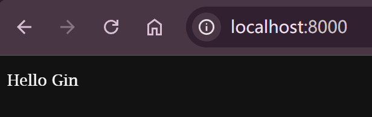
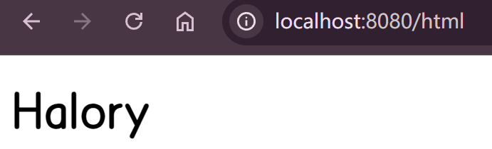

# 入门篇

## 概述

`Gin`是一个由Go编写的轻量级web框架，运行速度非常快，其最擅长的就是Api接口的高并发，如果项目的规模不大，业务相对简单，那么推荐使用Gin。当某个接口的性能遭到较大挑战的时候，也可以考虑使用Gin重写接口。


## 安装

```sh
# 安装gin模块
go get -u github.com/gin-gonic/gin

# 导入gin
import "github.com/gin-gonic/gin"
```

下面是一个入门的Gin服务：

```go
package main

import "github.com/gin-gonic/gin"

func main() {
    // 创建一个默认的路由引擎
    r := gin.Default()

    // 配置路由
    r.GET("/", func(c *gin.Context) {
        c.String(200, "%v", "Hello Gin")
    })

    // 启动一个Web服务，默认是8080端口
    r.Run(":8000")
}

```

访问：`localhost:8000`




## 热加载

Gin官方并没有提供热加载的工具，这个时候实现热加载就可以借助第三方的工具，这里使用`fresh`：

```sh
go install github.com/pilu/fresh@latest
```

然后改用`fresh`启动项目，就可以实现热加载了：

```sh
fresh
```


# 基础篇

## 响应数据

Gin中可以返回多种响应数据类型：`string`、`json`、`jsonp`等。

### json

返回json数据，只需要调用`*gin.Context.JSON()`方法，其第二个参数是一个空接口类型。通常有三种方法传入：

```go
// 1. json（由map、结构体）
r.GET("/json1", func(c *gin.Context) {
    // 由map转为json
    c.JSON(http.StatusOK, map[string]interface{}{
        "code": 0,
        "msg":  nil,
        "data": "token",
    })
})
r.GET("/json2", func(c *gin.Context) {
    // gin.H是Gin给 map[string]any 起的别名
    c.JSON(http.StatusOK, gin.H{
        "code": 0,
        "msg":  nil,
        "data": "token",
    })
})

r.GET("/json3", func(c *gin.Context) {
    // 由结构体转为json
    u := User{
        "Halory",
        20,
    }
    c.JSON(http.StatusOK, u)
})
```


### jsonp

`jsonp`和`json`的区别在于，如果路径后面跟了一个`callback`参数，那么返回的数据就会传入到`callback`指定的回调函数中，用于处理跨域。如果没有跟参数的话，那么返回的结果形式和`json`一致：

```go
r.GET("/jsonp", func(c *gin.Context) {
    u := User{
        "Halory",
        20,
    }
    c.JSONP(http.StatusOK, u)
})
/*
- http://localhost:8080/jsonp?callback=xxx
- xxx({"Name":"Halory","Age":20});

- http://localhost:8080/jsonp
- {"Name":"Halory","Age":20}
*/
```


### xml

Gin也可以返回一个xml类型的数据：

```go
r.GET("/xml", func(c *gin.Context) {
    u := User{
        "Halory",
        20,
    }
    c.XML(http.StatusOK, u)
})
/*
<User>
	<Name>Halory</Name>
	<Age>20</Age>
</User>
*/
```


### html

Gin也可以渲染一个`html`页面，在渲染之前，先在根目录下创建静态页面的目录，比如`templates`，然后在里面创建几个`.html`文件。创建完成之后，在项目启动之前对静态页面进行加载：

```go
r.LoadHTMLGlob("templates/*")
```

然后调用`.HTML()`方法指定状态码、模板以及传入的数据：

```go
r.GET("/html", func(c *gin.Context) {
    c.HTML(http.StatusOK, "user.html", gin.H{
        "name": "Halory",
    })
})
```

在模板中，可以使用`{{.name}}`来获取传入的属性值，并渲染在页面上：

```html
<h1>{{.name}}</h1>
```

访问：`localhost:8080/html`




## 模板渲染

### 模板起名

上一节的末尾，我们使用了`.HTML()`来渲染了静态页面。如果`templates`目录下有多级目录的话，对于`.html`文件的内容和引用得做一些处理。

每一个html文件得用`define`和`end`取一个名：

```html
{{define "web/user.html" }}
<!DOCTYPE html>
<html lang="en">
<head>
    <meta charset="UTF-8">
    <title>Title</title>
</head>
<body>
<h1>{{.name}}</h1>
</body>
</html>
{{end}}
```

然后加载的模板路径也需要修改：

```go
// 加载templates目录下所有的模板
r.LoadHTMLGlob("templates/**/*")
r.GET("/html", func(c *gin.Context) {
    // 模板的名称为：web/user.html
    c.HTML(http.StatusOK, "web/user.html", gin.H{
        "name": "Halory",
    })
})
```


### 定义变量

在模板中，我们可以定义变量来保存传入的值：

```html
<body>
<!--定义变量-->
{{$name := .name}}

<!--使用变量-->
<h1>{{$name}}</h1>
</body>
```


### 突然意识到我是用React写的前端

不学


## 请求传参


### 查询字符串

```go
r.GET("/", func(c *gin.Context) {
    // 根据参数名获取属性
    username := c.Query("username")
    // 根据参数名获取属性，如果为空则返回默认值
    page := c.DefaultQuery("page", "1")
    c.JSON(http.StatusOK, gin.H{
        "username": username,
        "page":     page,
    })
})
/*
访问: http://localhost:8080/?username=halory
返回: {"page":"1","username":"halory"}
*/
```


### 动态路由传参

```go
r.GET("/user/:id", func(c *gin.Context) {
    id := c.Param("id")
    c.String(200, "userId = %s", id)
})
/*
访问：http://localhost:8080/user/4
返回：userId = 4
*/
```


### 表单传参

```go
r.POST("/", func(c *gin.Context) {
    // 获取参数
    name := c.PostForm("name")
    pwd := c.PostForm("pwd")
    // 获取参数，如果参数为空则返回默认值
    sex := c.DefaultPostForm("sex", "男")
    c.JSON(http.StatusOK, gin.H{
        "name": name,
        "pwd":  pwd,
        "sex":  sex,
    })
})
```


### 参数绑定到结构体

```go
// 创建结构体
type User struct {
    Name string `json:"name" form:"name"`
    Age  int    `json:"age" form:"age"`
}

// 定义请求路径（GET和POST都可以）
r.GET("/", func(c *gin.Context) {
    user := User{}
    if err := c.ShouldBind(user); err == nil {
        // 如果user属性不为空，那么则说明参数已经绑定到了结构体上
        fmt.Printf("%#v", user)
        // 结果为：&main.User{Name:"Halory", Age:12}
        c.JSON(http.StatusOK, user)
    } else {
        c.JSON(http.StatusOK, gin.H{
            "err": err.Error(),
        })
    }
})
```

发送请求：

```sh
http://localhost:8080/?name=Halory&age=12
```


### 获取XML数据

使用支付宝的接口时，它返回的就是XML数据，所以还是用得到的：

```go
// 定义用户结构体，标签这里会用到xml
type User struct {
    Name string `json:"name" xml:"name"`
    Pwd  string `json:"pwd" xml:"pwd"`
}

// 定义请求
r.POST("/", func(c *gin.Context) {
    user := &User{}
    // 获取请求体的数据（类型为：[]uint8 => byte切片）
    xmlData, _ := c.GetRawData()
    // 将xml的数据转为结构体
    if err := xml.Unmarshal(xmlData, &user); err == nil {
        c.JSON(http.StatusOK, user)
    } else {
        c.JSON(http.StatusBadRequest, gin.H{
            "err": err.Error(),
        })
    }
})
```

下面是一个请求示例：

```xml
<?xml version="1.0" encoding="UTF-8"?>
<user>
    <name type="string">Halory</name>
    <pwd type="string">123456</pwd>
</user>
```


发送请求：`http://localhost:8080`

返回的结果为：

```json
{
    "name": "Halory",
    "pwd": "123456"
}
```


## 模块化

### 路由分组

我们肯定不能把所有的代码都写到`main.go`里面，需要对所有的请求进行分组，这里创建一个`routers`目录，然后把每一个模块单独创建一个文件：

```sh
router
	/AdminRouter.go
	/UserRouter.go
```

这里以`AdminRouter.go`为例：

```go
package router

import "github.com/gin-gonic/gin"

// 传入路由对象
func AdminRouterInin(r *gin.Engine) {
    // 进行路由分组
    adminRouter := r.Group("/admin")
    {
        adminRouter.GET("/")
        adminRouter.GET("/list")
    }
}
```


然后把这些路由文件都注册到`router`中：

```go
package main

import (
    "demo/router"
    "github.com/gin-gonic/gin"
)

func main() {
    // 创建一个默认的路由引擎（router）
    r := gin.Default()

    // 注册admin路由
    router.AdminRouterInin(r)

    // 启动一个Web服务，默认是8080端口
    r.Run()
}
```

其他的路由也是如此。


### 业务逻辑拆分

我们不可能把业务逻辑的具体代码和路由放在同一文件里面，需要单独创建控制层`controller`的文件夹来专门放置业务逻辑的代码文件。

```sh
controller
	/AdminController.go
```

这里以`AdminController.go`为例：

```go
package controller
import (
    "github.com/gin-gonic/gin"
    "net/http"
)
func adminIndex(c *gin.Context) {
    c.String(http.StatusOK, "管理员首页")
}
```

编写好业务逻辑之后，去路由文件中传入使用：

```go
package router
import (
    "demo/controller"
    "github.com/gin-gonic/gin"
)

func AdminRouterInin(r *gin.Engine) {
    adminRouter := r.Group("/admin")
    {
        // 传入业务逻辑
        adminRouter.GET("/", controller.AdminIndex)
        adminRouter.GET("/list")
    }
}
```

不过最好还是在`controller`里面单独创建一个`admin`文件夹，这样导入业务逻辑函数的时候就更加清晰明了了：

```go
// 修改的时候编译器提醒可以把AdminIndex改为Index
adminRouter.GET("/", admin.Index)
```


---

不过推荐的写法是在`XxxController.go`里面定义一个**结构体**，然后把业务逻辑作为结构体的**接收者函数**：

```go
type AdminController struct {
}

func (admin AdminController) Index(c *gin.Context) {
    c.String(http.StatusOK, "管理员首页")
}
```

相应地，路由文件也需要修改：

```go
func AdminRouterInin(r *gin.Engine) {
    adminRouter := r.Group("/admin")
    {
        adminRouter.GET("/", controller.AdminController{}.Index)
        adminRouter.GET("/list")
    }
}
```

> 相比直接创建文件夹来单独管理，这种采用结构体的方式也可以达到清晰的效果


### 统一响应

由于Go中不存在类，所以之前在Java中的统一响应类就不能拿来用了，如果要使用的话，可以通过结构体**继承**来实现，比如创建一个`ResultController.go`文件;

```go
type ResultController struct {
}

func (r ResultController) Ok(c *gin.Context) {
    c.String(http.StatusOK, "success")
}

func (r ResultController) fail(c *gin.Context) {
    c.String(http.StatusOK, "error")
}
```


然后让其他的控制层文件继承，此时就可以起到和**统一响应类**一样的效果：

```go
type AdminController struct {
    ResultController
}

func (admin AdminController) Index(c *gin.Context) {
    // 调用继承的方法
    admin.Ok(c)
}
```


## 中间件

### 路由中间件

我们观察一下`GET`的原函数，可以看到它的第二个参数是一个**可变参数**，这就意味着我们可以**传递多个函数**进去，并且这里的函数是依次执行的，像这样的函数我们称之为**中间件**：

```go
func (group *RouterGroup) GET(relativePath string, handlers ...HandlerFunc) IRoutes {
    return group.handle(http.MethodGet, relativePath, handlers)
}
```

比如我再传递一个函数进去：

```go
func MiddleWareFunc(c *gin.Context) {
    fmt.Println("我是中间件")
}

func AdminRouterInin(r *gin.Engine) {
    adminRouter := r.Group("/admin")
    {
        // // controller.AdminController{}.Index会在控制台输出: 管理首页
        adminRouter.GET("/", MiddleWareFunc, controller.AdminController{}.Index)
        adminRouter.GET("/list")
    }
}
/*
访问：http://localhost:8080/admin/
打印：
19:21:59 app         | 我是中间件
19:21:59 app         | 管理首页
*/
```

可以看出，`MiddleWareFunc`函数确实是被执行了。并且`gin.Context`中还有一个`Next`函数，它在执行当前中间件的过程中，突然跑去执行下一个中间件的代码，然后又回到原来的中间件继续执行：

```go
func MiddleWareFunc(c *gin.Context) {
	fmt.Println("我是中间件")
    // 暂时中断当前中间件的执行，去执行下一个中间件
	c.Next()
	fmt.Println("我是下一个中间件")
}
/*
打印：
19:22:28 app         | 我是中间件
19:22:28 app         | 管理首页
我是下一个中间件
*/
```

---

此外，`gin.Context`中还提供了一个`Abort`函数，调用该函数的话，则不会去执行接下来的中间件，但是会执行完当前的中间件：

```go
func MiddleWareFunc(c *gin.Context) {
    fmt.Println("我是中间件")
    // 不会执行接下来的中间件
    c.Abort()
    fmt.Println("我是下一个中间件")
}
/*
19:26:35 app         | 我是中间件
19:26:35 app         | 我是下一个中间件
*/
```

---

下面讨论一下**中间件的执行顺序**，比如有两个中间件函数：

```go
func MiddleWareFuncOne(c *gin.Context) {
    fmt.Println("中间件一开始")
    c.Next()
    fmt.Println("中间件一结束")
}
func MiddleWareFuncTwo(c *gin.Context) {
    fmt.Println("中间件二结束")
    c.Next()
    fmt.Println("中间件二结束")
}

func AdminRouterInin(r *gin.Engine) {
    adminRouter := r.Group("/admin")
    {
        adminRouter.GET("/", MiddleWareFuncOne,MiddleWareFuncTwo, controller.AdminController{}.Index)
        adminRouter.GET("/list")
    }
}
/*
中间件一开始
中间件二结束
管理首页
中间件二结束
中间件一结束
*/
```

所以，如果在中间件中使用了`Next`函数的，则执行的顺序为：

```sh
one(Next) -> two(Next) -> finally -> two -> one
```

### 全局中间件

上面的路由中间件是路由级别的，比较适合有特殊需求的路由，那么对于每一个路由都通用的中间件，比如**拦截器**等，就可以使用**全局中间件**，注册了全局中间件之后，每一次请求都执行全局中间件的逻辑，使用`Use()`进行注册：

```go
func MiddleWareFuncOne(c *gin.Context) {
	fmt.Println("中间件一开始")
	c.Next()
	fmt.Println("中间件一结束")
}
func MiddleWareFuncTwo(c *gin.Context) {
	fmt.Println("中间件二结束")
	c.Next()
	fmt.Println("中间件二结束")
}

func main() {
	r := gin.Default()
	// 注册全局中间件
	r.Use(MiddleWareFuncOne, MiddleWareFuncTwo)
	r.Run()
}
```

下面随便发起一个请求，观察控制台的打印信息：

```sh
# 路径为：http://localhost:8080/admin/list，下面为打印结果
中间件一开始
中间件二结束
中间件二结束
中间件一结束
```


### 路由分组中间件

如果我们要配置拦截器的话，首先肯定不会对每一个请求都进行拦截，那么就不能放在全局中间件；其次也不可能逐一给每个路由都配置，因为这样的话不方便管理，所以就有**路由分组中间件**。在路由分组函数`Group`中，它的第二个参数也是数量可变的中间件，给路由分组配置中间件，那么在当前分组下的路由就都配置了：

```go
func (group *RouterGroup) Group(relativePath string, handlers ...HandlerFunc) *RouterGroup {
   // code
}
```

中间件一般放在专门的文件夹中统一管理，类似SpringBoot中的`Config`文件夹，不过这里我们起名为`middleware`

```go
package middleware
import (
    "fmt"
    "github.com/gin-gonic/gin"
)
func LoginInit(c *gin.Context) {
    // 身份校验等代码就可以在这里编写
    fmt.Println(c.Request.URL)
}

```

然后将中间件注册到路由分组中：

```go
func AdminRouterInin(r *gin.Engine) {
    // 中间件注册到路由分组中
    adminRouter := r.Group("/admin", middleware.LoginInit)
    {
        adminRouter.GET("/", controller.AdminController{}.Index)
        adminRouter.GET("/list")
    }
}
/*
访问：http://localhost:8080/admin/list
打印： /admin/list
*/
```


### 数据共享

如果设置了多个中间件，每一个中间件都会有自己的处理结果，那么这些**处理的结果能否在后续的中间件中被使用**呢？肯定是会的，通过`Set`方法可以在请求上下文中设置值，后续的函数可以通过`Get`方法获取该值：

```go
// 中间件
func LoginInit(c *gin.Context) {
    // 将name的键值对存入请求上下文
    c.Set("name", "Halory")
}
```

下面在逻辑处理函数中（一般是最后一个中间件）获取并使用该值：

```go
func (admin AdminController) Index(c *gin.Context) {
    // 由于Get函数返回的第一个参数类型是空接口，所以需要用到类型断言
    name, _ := c.Get("name")
    if v,ok := name.(string);ok {
        c.String(200, "name = %v", v)
    }else{
        c.String(200, "获取失败")
    }
}
/*
访问：http://localhost:8080/admin/
页面：name = Halory
*/
```


### 注意事项

1. `gin.Default()`默认使用了`Logger`和`Recovery`中间件，如果不想使用默认中间件，那么可以用`gin.New`来创建一个没有任何默认中间件的路由，其中：
   - `Logger`中间件将日志写入`gin.DefaultWriter`，即使配置了`GIN_MODE=release`
   - `Recover`中间件会`recover`任何`panic`。如果有`panic`的话，会写入 500 响应码
2. 当在中间件或者handler中启动新的`goroutine`时，**不能使用**原始的上下文（`c *gin.Context`），必须使用其只读副本（`c.Copy()`）


## 其他

### 文件上传


### Cookie共享


### Session


# 整合篇

## GORM

`GORM`是Golang的一个 ORM 框架，用于操作数据库，当前支持的数据库有：MySQL, PostgreSQL, SQLite, SQL Server 和 TiDB


### 入门

#### 连接

这里以建立MySQL为例：

```go
package config
import (
    "fmt"
    "gorm.io/driver/mysql"
    "gorm.io/gorm"
)
var DB *gorm.DB
var err error
func init() {
    dsn := "haibara:200414@tcp(127.0.0.1:3306)/bd?charset=utf8mb4&parseTime=True&loc=Local"
    DB, err = gorm.Open(mysql.Open(dsn), &gorm.Config{})
    if err != nil {
        fmt.Println(err)
    }
}

```


#### 创建模型

```go
package model
// User 如果结构体的名称为User，那么这个模型默认对应users表
type User struct {
    Id   int
    Name string
    Age  int
}

// TableName 我们需要创建一个TableName函数来自定义表名
func (User) TableName() string {
    return "user"
}

```

#### 查询

```go
func (UserController) List(c *gin.Context) {
    var userList []model.User
    config.DB.Where("age < 20").Find(&userList)
    c.JSON(200, gin.H{
        "result": userList,
    })
}
```

响应结果如下：

```json
{
    "result": [
        {
            "Id": 2,
            "Name": "胡桃",
            "Age": 18
        }
    ]
}
```


#### 新增

```go
// Add 添加用户
func (user UserController) Add(c *gin.Context) {
    u := model.User{
        Name: "胡桃",
        Age:  18,
    }
    config.DB.Create(&u)
    c.String(200, "添加成功")

}
```


#### 更新

```go
// Save 更新整个用户
func (UserController) Save(c *gin.Context) {
    // 查询 id = 1 的数据
    user := model.User{Id: 1}
    config.DB.Find(&user)
    // 更新数据
    user.Name = "钟离"
    user.Age = 100
    config.DB.Save(&user)
    c.String(200, "修改成功")
}

// Update 更新用户部分数据
func (UserController) Update(c *gin.Context) {
    // 查询 id = 1 的数据
    user := model.User{Id: 1}
    config.DB.Find(&user)
    config.DB.Model(&user).Where("id = ?", 1).Update("name", "Halory")
    c.String(200, "更新成功")
}
```


#### 删除

```go
// Delete 删除用户
func (UserController) Delete(c *gin.Context) {
    user := model.User{}
    config.DB.Where("name = ?", "胡桃").Delete(&user)
    c.String(200, "删除成功")
}
```


### 查询详解

