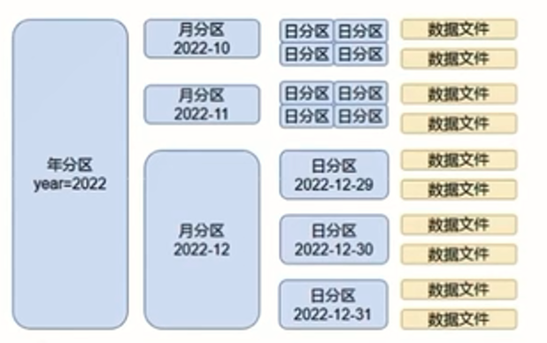

# Linux准备

## 集群免密登录

首先让多个集群之间可以免密登录，这样方便后续在集群之间传输文件

```sh
# 生成ssh密钥，按照rsa的格式，长度为4096
ssh-keygen -t rsa -b 4096

# 然后每台服务器都执行下面的自动免密授权命令
ssh-copy-id 42.194.138.186
ssh-copy-id 110.41.21.116
```


主要是因为后续我们都不会以root用户的身份启动大数据软件，多个服务器中都要创建相同的。

```sh
# 添加用户
useradd halory
# 给用户设置密码
passwd halory

# 密码为：200414

# 切换到halory用户
su - halory

# 给每个用户都创建一个私钥系统
ssh-keygen -t rsa -b 4096
# 一路回车就行

# 然后给服务器用户设置ssh免密登录
ssh-copy-id 110.41.21.116
ssh-copy-id 42.194.138.186
```


但是由于两台服务器都启用了私钥登录，所以似乎免密登录失败了。

不不不，只要把密钥上传到`/root/.ssh`下，然后将`xxx.pem`重命名为`id_rsa`就可以了。

但是针对普通用户的话，还需要在修改root的ssh相关配置，把密钥登陆和密码登录都开放。

所以我就不用普通用户了，直接用root用户学习接下来的课程


## 配置jdk环境

```sh
# 创建jdk存放目录
mkdir -p /export/server

# 解压缩jdk安装包
tar -zxvf xxxjdk.tar.gz -C /export/server

# 配置jdk的软件链接
ln -s /export/server/jdk1.8 /export/server/jdk

# 配置JAVA_HOME环境变量
# 编辑/etc/profile文件
export JAVA_HOME=/export/server/jdk
export PATH=$PATH:$JAVA_HOME/bin

# 生效环境变量
source /etc/profile

# 配置java执行程序的软连接
rm -f /usr/bin/java
ln -s /export/server/jdk/bin/java /usr/bin/java

# 验证
java -version
```


## 修改时区并配置自动时间同步

由于两台服务器的时区和时间都是一样的，所以我就没有做这些

```sh
# 安装ntp软件
yum install -y ntp

# 更新时区
rm -f /etc/localtime;sudo ln -s /usr/share/zoneinfo/Asia/Shanghai /etc/localtime

# 同步时间
ntpdate -u ntp.aliyun.com

# 开启ntp服务并设置开机自启
systemctl start ntpd
systemctl enable ntpd
```


## 创建vpc

vpc就是私有云的私人网络，可以创建多个子网（交换机），相当于拉了一个家庭带宽，一个子网就是相当于放了一个路由器

去云平台上创建。


# 大数据导论

## 数据的价值

我们所使用的每一个软件，浏览的每一个网页，进行的每一个操作都会被记录下来，这就是数据的产生。随着我们操作的次数的增多，久而久之就会产生大量的数据，对这些数据进行分析，我们就可以大概知道用户的一些性格、习惯，给用户打上标签。

比如用户逛淘宝时经常会浏览一些学习书籍、文具之类的，那么该用户就大概率是一个爱学习的好学生，此时淘宝就可以给他推荐一些学习相关的东西，进行精准推销。

这就是大数据的用处之一。


## 大数据的诞生

早些的时候电脑配置很低，却需要有大量的数据要处理，光靠一台电脑、一台服务器肯定是顶不住了，于是产生了`分布式`处理技术。分布式技术就是靠服务器的`数量`来解决大规模的数据处理问题。

接着就要联想到分布式技术需要解决的具体问题：

- 数据存储问题：这么多的数据怎么样保存在多个服务器上
- 数据计算问题：多个服务器怎么使用这些数据
- 数据传输问题：数据要怎么传输到多个服务器上


2008年之前，小企业并没有分布式的解决方案，因此分布式技术是大企业内部自己研发，且自己用的。

但是2008年之后，由于`Hadoop`开源，使得小型企业也能够拥有成熟的分布式数据处理解决方案，大数据从此真正发展起来了。

直到现在，大数据的体系已经非常完善了。

总而言之，大数据的核心在于`分布式`。


## 大数据概述

从狭义上，大数据是一类`技术栈`，用于处理海量数据的软件技术体系

从广义上，大数据是数字化时代、信息化时代的`基础（技术）支撑`，以数据`为生活赋能`

大数据有主要5个特征（5V）：

- 数据体量大（Volume）：采集数据大、存储数据大、计算数据大。TB、PB起步
- 种类、来源多样化（Variety）：
  - 种类：结构化、半结构化和非结构化
  - 来源：日志文本、图片、音频、视频等
- 低价值密度（Value）：信息海量但是价值密度低，深度复杂的挖掘分析需要机器学习参与
- 速度快（Velocity）：数据增长快、获取数据快和数据处理快
- 数据质量（Veracity）：数据的准确性和数据的可信赖度


> 大数据的核心工作：从海量的高增长、多类别、低信息密度的数据中挖掘出高质量的结果。
>
> 即`数据计算`、`数据存储`和`数据传输`


## 大数据软件生态

`数据存储`：

- Hadoop-HDFS：Hadoop内的组件HDFS是大数据体系中使用最为广泛的分布式存储技术
- HBase：基于HDFS之上，是大数据体系内使用非常广泛的NoSQL KV型数据库技术
- KUDU：使用较多的分布式存储引擎
- 云平台存储组件：比如阿里云的OSS


`数据计算`：

- Hadoop-MapReduce：最早一代的大数据分布式计算引擎
- Hive：以SQL开发的分布式计算框架，底层使用了MapReduce
- Spark：`全球最火`的分布式内存计算引擎
- Flink：大数据分布式内存计算引擎，在`实时计算（流计算）`方面占据了大多数国内市场


`数据传输`：

- Kafka：分布式的消息系统，可以完成海量规模的数据传输工作
- Pulsar：分布式的消息系统，使用者也比较多
- Flume：流式数据采集工具，可以从非常多的数据源中完成数据采集传输的任务
- Sqoop：一款`ETL`工具，可以协助大数据体系和关系型数据库之间进行数据传输


## Hadoop概述


Hadoop是Apache下的顶级开源项目，用以提供：

- 分布式数据存储
- 分布式数据计算
- 分布式资源调度

为一体的解决方案，是典型的分布式框架。

Hadoop内部细分为`三个组件`：

- HDFS：分布式存储组件，用于构建分布式文件系统，用于数据存储
- MapReduce：分布式计算组件。提供编程接口供用户开发分布式计算程序
- YARN：分布式资源调度组件。可供用户整体调度大规模集群的资源使用


目前市面上有两种Hadoop`发行版本`：

- 开源社区版：官方发行的版本，更新迭代快，但是兼容稳定性不太行
- 商业发行版：商业公司对开源版本的二次封装。稳定兼容好，但是要钱。
  - `CDH` ，目前使用最多的商业版
  - 星环，国产商业版，国内政企用得比较多


hadoop有三种模式：

- 本地模式：数据存储在linux本地，测试偶尔用
- 伪分布式：数据存储在HDFS，公司差钱时候用
- 完全分布式：数据存储在HDFS，同时是多台服务器工作


## 为什么需要分布式

分布式不仅可以解决大量数据的存储问题，还可以带来网络传输、磁盘读写、CPU等各方面的综合提升。


## 分布式的基础架构

大数据体系中，分布式的调度主要有两类架构：

- 去中心化模式
- 中心化模式

去中心化模式，没有明确的中心。众多服务器之间基于`特定规则`进行同步协调


中心化模式，有一个中心节点来统筹其他服务器的工作，统一指挥，统一调派，避免混乱


大数据框架很多都是符合`中心化模式`的，该模式也称为一主多从模式，简称`主从模式（Master And Slaves）`


# HDFS

## HDFS基础架构

HDFS全称为`Hadoop Distributed File System`，即Hadoop分布式文件系统

HDFS集群中有`三种角色`：

- 主角色：NameNode，`负责管理整个文件系统`，也负责管理DataNode
- 从角色：DataNode，主要`负责数据的存入和取出`
- 主角色辅助角色：SecondaryNameNode，`帮助NameNode完成元数据整理工作`


## 部署HDFS集群

内存稍大的服务器作为主角色，小一点的作为从角色

```sh
# 拉取安装包
wget https://mirrors.tuna.tsinghua.edu.cn/apache/hadoop/common/hadoop-3.4.0/hadoop-3.4.0.tar.gz

# 解压
tar -zxvf xxx.tar.gz

# 软链接
ln -s /export/server/hadoop-3.3.5 hadoop

# 进入hadoop目录，以后主要关注三个目录
bin: 普通命令
etc: 配置
sbin: 管理员命令
```


配置HDFS集群，主要涉及到对以下文件的修改：

- workers：配置从节点
- hadoop-env.sh：配置hadoop的相关环境变量
- core-site.xml：Hadoop核心配置文件
- hdfs-site.xml：HDFS核心配置文件

> 这些文件均存在于`etc/hadoop`文件夹中


配置`workers`文件：

```sh
# 进入配置文件目录
cd etc/hadoop

# 编辑
vim workers

# 写入如下内容，即从节点的ip，自己的ip也要加上
localhost
xxx.xxx.xxx.xxx
```


配置`hadoop-env.sh`文件：

```sh
# 填入以下内容，这些是运行的重要信息

# 指明jdk环境
export JAVA_HOME=/export/server/jdk

# 指明hadoop的安装位置
export HADDOP_HOME=/export/server/hadoop

# 指明hadoop的配置文件目录
export HADDOP_CONF_DIR=$HADOOP_HOME/etc/hadoop

# 指明hadoop的日志目录
export HADOOP_LOG_DIR=$HADOOP_HOME/logs
```


配置`core-site.xml`文件：

```xml
<!-- 填入如下内容，该配置固定了该服务器必须启动NameNode进程 -->
<configuration>
    <property>
        <!-- HDFS文件系统的网络通讯路径 -->
        <name>fs.defaultFS</name>
        <!-- 协议://主节点:端口 -->
        <value>hdfs://110.41.21.116:8020</value>
    </property>

    <property>
        <!-- io操作文件缓冲区大小 -->
        <name>io.file.buffer.size</name>
        <!-- 单位为bit -->
        <value>131072</value>
    </property>

    <property>
        <!-- 指定hadoop的数据存储目录 -->
        <name>hadoop.tmp.dir</name>
        <value>/export/server/hadoop/data</value>
    </property>

    <property>
        <!-- 配置HDFS网页登录使用的静态用户为root -->
        <name>hadoop.http.staticuser.user</name>
        <value>root</value>
    </property>

</configuration>
```


配置`hdfs-site.xml`（黑马版2023）：

```xml
<configuration>
    <property>
        <!-- hdfs文件系统，默认创建的文件权限设置 -->
        <name>dfs.datanode.data.dir.perm</name>
        <value>700</value>
    </property>

    <property>
        <!-- NameNode元数据的存储位置 -->
        <name>dfs.namenode.name.dir</name>
        <!-- 在主节点的/data/nn目录下 -->
        <value>/data/nn</value>
    </property>

    <property>
        <!-- NameNode允许哪几个节点的DataNode链接 -->
        <name>dfs.namenode.hosts</name>
        <value>110.41.21.116,42.194.138.186</value>
    </property>

    <property>
        <!-- hdfs默认块大小 -->
        <name>dfs.blocksize</name>
        <!-- 256MB -->
        <value>268435456</value>
    </property>

    <property>
        <!-- 从节点DataNode的数据存储目录 -->
        <name>dfs.datanode.data.dir</name>
        <!-- 即数据存放在ip1,ip2,ip3的/data/dn内 -->
        <value>/data/dn</value>
    </property>


</configuration>
```


尚硅谷版的`hdfs-site.xml`：

```xml
<configuration>
    <property>
        <!-- namenode 访问web地址 -->
        <name>dfs.namenode.http-address</name>
        <value>110.41.21.116:9870</value>
    </property>
    
        <property>
        <!-- secondnamenode 访问web地址 -->
        <name>dfs.namenode.secondary.http-address</name>
        <value>110.41.21.116:9868</value>
    </property>
</configuration>
```


`yarn-site.xml`，尚硅谷是这些组件同时配置的：

```xml
<configuration>
    <!-- 核心配置 -->
    <property>
        <name>yarn.resourcemanager.hostname</name>
        <value>110.41.21.116</value>
        <description>ResourceManager设置在node1节点</description>
    </property>

    <property>
        <name>yarn.nodemanager.aux-services</name>
        <value>mapreduce_shuffle</value>
        <description>为MapReduce程序开启Shuffle服务</description>
    </property>


    <property>
        <name>yarn.log.server.url</name>
        <value>http://192.168.14.158:19888/jobhistory/logs</value>
        <desciription>设置日志聚集服务器地址</desciription>
    </property>

    <propert>
        <name>yarn.log-aggregation-enable</name>
        <value>true</value>
        <description>开启日志聚合，把每台服务器的每个容器的日志都抽取出来</description>
    </propert>

    <!-- 设置日志保留时间为7天 -->
    <property>
        <name>yarn.log-aggregation.retain-seconds</name>
        <value>604800</value>
    </property>

    <!-- 环境变量的继承 -->
    <property>
        <name>yarn.nodemanager.env-whitelist</name>
        <value>JAVA_HOME,HADOOP_COMMON_HOME,HADOOP_HDFS_HOME,HADOOP_CONF_DIR,CLASSPATH_PREPEND_DISTCACHE,HADOOP_YARN_HOME,HADOOP_MAPRED_HOME</value>
    </property>


</configuration>
```


`mapred-site.xml`，尚硅谷：

```xml
<configuration>
    <!-- 指定mapreduce程序运行在yarn上 -->
    <property>
        <name>mapreduce.framework.name</name>
        <value>yarn</value>
    </property>
    
    <!-- 配置历史服务器端地址 -->
    <property>
        <name>mapreduce.jobhistory.address</name>
        <value>192.168.14.158:10020</value>
    </property>
    
    
    <!-- 配置历史服务器web地址 -->
    <property>
        <name>mapreduce.jobhistory.webapp.address</name>
        <value>192.168.14.158:19888</value>
    </property>
    
</configuration>
```


接着去创建数据存放目录：

```sh
# 主节点
mkdir -p /data/nn
mkdir -p /data/dn

# 从节点
mkdir -p /data/dn
```


分发Hadoop文件夹：

```sh
# 在主节点执行如下命令，用于将文件夹复制一份给从节点
cd /export/server
scp -r hadoop-xxx ip:`pwd`/

# 在从节点内执行，建立软链接
ln -s /export/server/hadoop-xxx /export/server/hadoop
```


将hadoop的bin和sbin目录配到环境变量里

```sh
vim /etc/profile

export HADOOP_HOME=/export/server/hadoop
export PATH=$PATH:$HADOOP_HOME/bin:$HADOOP_HOME/sbin
```


将hadoop文件授权给hadoop（halory）用户，但是我是用root的，所以不必授权

```sh
chown -R hadoop:halory /data
chown -R hadoop:halory /export
```


格式化整个文件系统

```sh
# 格式化namenode
hadoop namenode -format

# 格式化之后，依照前面的配置，在/data目录下应该就有dn和nn两个文件夹了

# 启动hdsf集群
start-dfs.sh

# 关闭hdfs集群
stop-dfs.sh

# 如果环境变量没有配置好，则需要指定路径执行
/export/server/hadoop/sbin/start-dfs.sh
/export/server/hadoop/sbin/stop-dfs.sh
```


HDFS启动起来之后，可以访问`ip:9270`来访问Web，这里可以进行GUI操作，不过仅限`namenode`


## HDFS启停命令

```sh
# 一键启动HDFS集群
start-dfs.sh
# 原理
# 1. 在执行此脚本的机器上，启动SecondaryNameNode
# 2. 读取conre-site.xml中的dfs.defaultFS项，确认NameNode所在机器，启动NameNode
# 3. 读取workers内容，确认DataNode所在机器，启动全部DataNode

# 一键关闭HDFS集群
stop-dfs.sh
# 1. 在执行此脚本的机器上，关闭SecondaryNameNode
# 2. 读取conre-site.xml中的dfs.defaultFS项，确认NameNode所在机器，关闭NameNode
# 3. 读取workers内容，确认DataNode所在机器，关闭全部DataNode

# 单独控制进程的启停
# 方式一 在sbin目录下的hadoop-daemon.sh
hadoop-daemon.sh (start|status|stop) (namenode|secondarynamenode|datanode)

# 方式二 在bin目录下的hdfs
hdfs --deamon (start|status|stop) (namenode|secondarynamenode|datanode)
```


## HDFS文件系统基本信息

HDFS同Linux系统一样，均是以`/`作为根目录的组织形式

比如Linux中路径是`/usr/local/hello.txt`，则HDFS中同样也是`/usr/local/hello.txt`

那么如何区分呢？利用协议头进行区分

- Linux：`file://`/usr/local/hello.txt
- HDFS：`hdfs://namenode:port`/usr/local/hello.txt

但是一般我们不会写出来，Hadoop会自动识别出Linux路径和HDFS路径


## HDFS的操作命令

Hadoop提供了两套命令体系，用法完全一致：

- hadoop：老版本，用法为`hadoop fs [options]`
- hdfs：新版本，用法为`hdfs dfs [options]`


```sh
# 创建文件夹，在hadoop创建，并不是在本机创建。
hadoop fs -mkdir -p /hahaha/dadada
hdfs dfs -mkdir -p /haha1/dada1

# 查看指定目录下的内容
# -h 显示文件大小，带单位
# -R 查看指定路径下的所有目录及其子目录
hdfs dfs -ls -R -h /

# 上传文件到HDFS指定目录下
# -f 会覆盖目标文件，如果有同名文件的话默认会上传失败
# -p 保留访问和修改时间，所有权和权限
# localsrc 本地文件系统
# dst 目标文件系统（HDFS）
# 将Linux的test文件上传到hadoop的根目录下
hdfs dfs -put test.txt /

# 查看HDFS文件内容，可以配合more使用
hdfs dfs -cat /t.txt | more

# 下载HDFS文件
# -f 覆盖目标文件
# -p 保留访问和修改时间，所有权和权限
hdfs dfs -get hdfsPath linuxPath


# 拷贝HDFS文件（源地址和目标地址都是Hadoop的）
hdfs dfs -cp -f source target

# 追加文件内容，本地的追加到HDFS中
hdfs dfs -appendToFile linuxPath HDFSPath

# HDFS数据移动操作（在HDFS中移来移去）
hdfs dfs -mv /t.txt /a.txt

# HDFS数据删除操作
# -r 删除文件夹
# -skipTrash 跳过回收站，直接删除
# URI 要删除的路径
hdfs dfs -rm -r [-skipTrash] URI

[root@anckson ~]# hdfs dfs -rm /test.txt
2024-09-28 20:15:51,992 INFO fs.TrashPolicyDefault: Moved: 'hdfs://192.168.14.158:8020/test.txt' to trash at: hdfs://192.168.14.158:8020/user/root/.Trash/Current/test.txt
# 垃圾桶在HDFS内的/user/用户名/.Trash/Current下
```


回收站功能默认是关闭的，需要在`core-site.xml`中开启：

```xml
<property>
    <name>fs.trash.interval</name>
    <!-- 数据保留时间为1440分钟，即一天 -->
    <value>1440</value>
</property>

<property>
    <name>fs.trash.checkpoint.interval</name>
    <!-- 每120分钟检查回收站，检查超过数据保留时间的文件，超过了就删掉 -->
    <value>120</value>
</property>

<!-- 回收站默认位置在: /usr/用户名/.Trash -->
```


除了使用命令，还可以去Web进行GUI操作，但是需要配置`core-site.xml`，给予指定用户权限才行，但是一般不推荐，因为这样做有很大的安全问题，造成数巨泄露或丢失。简单浏览看看就行了，客户端比这个好用多了。

```xml
<property>
    <name>hadoop.http.staticuser.user</name>
    <value>halory</value>
</property>
```


补充HDFS权限内容

```sh
# 在Hadoop中，谁启动了HDFS集群，谁就是HDFS的超级用户，谁就有最高权限

# 修改所属用户和组
hdfs dfs -chown [-R] root:root /xxx.txt

# 修改文件权限
hdfs dfs -chmod [-R] 777 /xxx.txt
```


## HDFS客户端

### jetbrain插件

IDEA、PyCharm、DataGrip都有这个`Big Data Tools`插件，该插件提供了各种大数据技术的可视化操作

前提是将Hadoop配置到本机，并且将Hadoop的安装目录配置到环境变量中

此外，还需要去[这里](https://github.com/cdarlint/winutils/tree/master/hadoop-3.3.6/bin)下载`winutils.exe`和`hadoop.dll`文件，并存到Hadoop的bin目录下


### NFS

通过NFS，将HDFS挂载到本地磁盘上，然后向操作磁盘那样操作文件系统


可选


## HDFS存储原理


### Block和备份

一个文件上传到HDFS集群中，会被拆分成多个部分，分别存到每个服务器上，然后每一部分会用多个`块`，来进行存储。这个块就是HDFS设定的`统一的管理单位`，默认大小为`256MB`。如果一个部分的大小为`1GB`，则需要使用`4个Block`来进行存储。


要修改block大小的话，可以去`hdfs-site.xml`中修改`dfs.blocksize`的配置


如果服务器中文件的某个部分缺失了，此时我们就不能把该文件取出，针对该情况，HDFS提供了`备份`，每一个`Block块`默认都有`2`个备份，总共`3`份副本，且该备份`分布在其他服务器上`。


如果某一个块缺失了，在其他服务器上可以找到。如果某个服务器故障了，那么所有的文件都可以在其他服务器上找到，这样数据就非常安全了。


如果想要修改默认副本数的话，可以在`hdfs.site.xml`中进行配置：

```xml
<property>
    <name>dfs.replication</name>
    <!-- 默认值就是3份副本，即2份备份 -->
    <value>3</value>
</property>
```


除此之外，还可以通过命令去修改文件的备份数量：

```sh
# 上传文件的时候指定该文件的副本数: 上传text.txt时将副本数修改为2个，即1个备份
hadoop fs -D dfs.replication=2 -put text.txt /tmp/

# 修改已经存在的文件的备份数: 将指定path的内容的副本数修改为2个，加上-R的话会对子目录也生效
hadoop fs -setrep [-R] 2 path
```


### fsck命令

fsck命令用于检查文件的副本情况

```sh
# -files 可以列出路径内的文件状态
# -files -blocks 输出文件块报告（几个块，几个副本）
# files -blocks -locations 输出每一个block的地址
hdfs fsck [-file [-blocks [-locations]]]
```

打印出来内容如下：

```sh
(base) [root@anckson ~]# hdfs dfs -ls /
Found 2 items
-rw-r--r--   6 root supergroup        333 2024-09-29 14:03 /t.txt
drwx------   - root supergroup          0 2024-09-28 20:15 /user
(base) [root@anckson ~]# hdfs fsck /t.txt -files -blocks -locations
Connecting to namenode via http://anckson:9870/fsck?ugi=root&files=1&blocks=1&locations=1&path=%2Ft.txt
FSCK started by root (auth:SIMPLE) from /192.168.14.158 for path /t.txt at Sun Sep 29 14:04:43 CST 2024

/t.txt 333 bytes, replicated: replication=6, 1 block(s):  Under replicated BP-215296264-192.168.14.158-1727497862758:blk_1073741828_1004. Target Replicas is 6 but found 1 live replica(s), 0 decommissioned replica(s), 0 decommissioning replica(s).

# 这里的0表示块的索引号
0. BP-215296264-192.168.14.158-1727497862758:blk_1073741828_1004 len=333 Live_repl=1  [DatanodeInfoWithStorage[192.168.14.158:9866,DS-5565d459-d139-46e3-8ef8-41fe53705a37,DISK]]


Status: HEALTHY
 Number of data-nodes:  1
 Number of racks:               1
 Total dirs:                    0
 Total symlinks:                0

Replicated Blocks:
 Total size:    333 B
 Total files:   1
 Total blocks (validated):      1 (avg. block size 333 B)
 Minimally replicated blocks:   1 (100.0 %)
 Over-replicated blocks:        0 (0.0 %)
 Under-replicated blocks:       1 (100.0 %)
 Mis-replicated blocks:         0 (0.0 %)
 Default replication factor:    3
 Average block replication:     1.0
 Missing blocks:                0
 Corrupt blocks:                0
 Missing replicas:              5 (83.333336 %)
 Blocks queued for replication: 0

Erasure Coded Block Groups:
 Total size:    0 B
 Total files:   0
 Total block groups (validated):        0
 Minimally erasure-coded block groups:  0
 Over-erasure-coded block groups:       0
 Under-erasure-coded block groups:      0
 Unsatisfactory placement block groups: 0
 Average block group size:      0.0
 Missing block groups:          0
 Corrupt block groups:          0
 Missing internal blocks:       0
 Blocks queued for replication: 0
FSCK ended at Sun Sep 29 14:04:43 CST 2024 in 2 milliseconds


The filesystem under path '/t.txt' is HEALTHY
```


### NameNode元数据

NameNode可以对这么多的block进行记录和整理，主要基于`edits`和`fsimage`文件。

`edits`文件是一堆流水账文件，记录了hdfs中的`每一次操作`，以及本次操作影响的文件其对应的block。当某个edits文件内容比较多的时候，就会新创建一个edits1的新文件，继续记录操作。

诸多的edits文件合并完（所谓合并就是把重复的或者没有意义的操作都去掉，比如一个文件修改了多次名字，只要保留最后一个修改名字的操作就行了，中间状态可以删掉）之后，就会得到一个`fsimage`文件。

流程大概如下：

1. 每次对HDFS的操作都记录在edits文件
2. edits文件达到阈值后，开启新的edits文件并继续记录
3. 定期对edits进行合并
   - 如果没有fsimage，则创建一个新的fsimage
   - 如果有fsimage，则将全部的edits文件和已经存在的fsimage进行合并，创建新的fsimage文件
4. 重复


元数据记录的参数可以进行修改：

```sh
# 按时合并元数据
dfs.namenode.checkpoint.period，默认3600秒

# 按量合并元数据
dfs.namenode.checkpoint.txns，默认1000000，即100W次事务

# 定期检查，默认60秒检查一次
dfs.namenode.checkpoint.check.period，默认60秒
```


NameNode负责记录，SecondaryNameNode负责合并。

SecondaryNameNode会通过http从NameNode拉取数据（edits和fsimage），然后进行合并，合并完成之后提供给NameNode使用


### HDFS的读写流程

写：

1. 客户端向NameNode发起请求
2. NameNode审核权限、剩余空间后，满足条件允许写入，并告知客户端写入的DataNode地址
3. 客户端向指定的DataNode发送数据包
4. 被写入数据的DataNode同时完成数据副本的复制工作，将其接收的数据分发给其他DataNode
5. DataNode1复制给DataNode2，然后基于DataNode2复制给其余的DataNode
6. 写入完成客户端通知NameNode，NameNode做元数据记录工作


注意点：

- `NameNode不负责数据写入`，只负责元数据记录和权限审批
- 客户端直接向1台DataNode写数据，一般是`网络离客户端最近的DataNode`
- 数据块副本的复制工作，由DataNode之间自行完成（构建一个`PipLine`，按顺序复制分发）


读：

1. 客户端向NameNode申请读取某文件
2. NameNode判断客户端权限等细节后，允许读取，并返回此文件的block列表
3. 客户端拿到block列表后，自行寻找DataNode读取即可


注意点：

- 数据同样不通过NameNode提供
- NameNode提供的block列表，会基于网络距离计算尽量提供离客户端最近的。


# 分布式计算

## 分布式计算概述

大数据的计算是`对内容进行分析，得到需要的结果`，比如：

- 销售额统计、区域销售占比、季度销售占比
- 利润率走势、客单价走势、成本走势
- 品类分析、消费者分析和店铺分析等


分布式计算就是多个机器同时参与大量的数据计算

分布式计算有两类计算模式：

- 分散-汇总模式：将数据分片，每台服务器各自负责一部分数据，然后对数据进行计算。计算的结果交给特定的服务器进行汇总处理，最后得到结果。比如人口普查
- 中心调度-步骤执行模式：每台服务器各自计算一部分数据，然后每台服务器有需要的话进行数据交换，接着再继续计算，直到计算出最终结果。类似项目经理和项目成员，一个管理分配任务，其余人员领取任务


## MapReduce概述

MapReduce组件采用的就是分散聚合的计算模式，它提供了两个编程接口Map和Reduce：

- Map：提供了`分散`的功能，由服务器分布式对数据进行处理
- Reduce：提供了`汇总`的功能，将分布式的处理结果汇总统计


MapReduce会将要执行的需求分解为多个Map Task和Reduce Task

将Map Task和Reduce Task分配到对应的服务器去执行


## YARN概述

YARN管控整个集群资源进行调度，应用程序运行时，就是在YARN的监管下去运行的。

比如MapReduce有三个Map进程，一个Reduce进程，他们会`向YARN申请使用资源`，YARN分配好资源后运行，空闲的资源可供其他程序使用


## YARN架构

YARN也是主从架构，有两个角色：

- ResourceManager：整个集群的资源调度者，负责协调调度各个程序所需的资源
- NodeManager：单个服务器的资源调度者，负责调度单个服务器上的资源提供给应用程序使用


程序向ResourceManager申请资源，然后RManager确认服务器是否有空闲资源。如果有的话，就会让NodeManager将各自管理的服务器的资源分配给该程序


NodeManager会在服务器上构建一个`容器`，提前把程序申请的资源给占用了，然后将容器内的资源给程序使用。程序只能使用该容器中的资源，无法突破容器的资源限制。


还有两个辅助角色：

- ProxyServer：代理服务器，保障Web UI访问的安全性
- JobHistoryServer：历史服务器，可以将每台服务器的每个容器产生的日志信息都整合在一起，放在HDFS中


## YARN集群部署

MapReduce是在YARN容器中运行的，所以该组件只需要修改配置即可

而YARN既要修改配置，又要部署启动

### 配置

在`$HADOOP_HOME/etc/hadoop`文件夹内，修改：

`mapred-env.sh`：

```sh
# 添加如下环境变量

# jdk路径
export JAVA_HOME=/export/server/jdk

# 将JobHistoryServer进程内存设为256MB
export HADOOP_JOB_HISTORYSERVER_HEAPSIZE=256

# 设置日志级别为INFO
export HADOOP_MAPRED_ROOT_LOGGER=INFO,RFA
```

`mapred-site.xml`：

```xml
<!-- 添加如下配置信息 -->

<property>
    <name>mapreduce.framework.name</name>
    <value>yarn</value>
    <description>MapReduce的运行框架设置为YARN</description>
</property>

<property>
    <name>mapreduce.jobhistory.address</name>
    <value>110.41.21.116:10020</value>
    <description>历史服务器通信端口</description>
</property>

<property>
    <name>mapreduce.jobhistory.webapp.address</name>
    <value>110.41.21.116:19888</value>
    <description>历史服务器的Web端口为19888</description>
</property>

<property>
    <name>mapreduce.jobhistory.intermediate-done-dir</name>
    <value>/data/mr-history/tmp</value>
    <description>历史信息在HDFS的记录临时路径</description>
</property>

<property>
    <name>mapreduce.jobhistory.done-dir</name>
    <value>/data/mr-history/done</value>
    <description>历史信息在HDFS的记录路径</description>
</property>

<property>
    <name>yarn.app.mapreduce.am.env</name>
    <value>HADOOP_MAPRED_HOME=$HADOOP_HOME</value>
    <description>MapReduce HOME设置为HADOOP_HOME</description>
</property>

<property>
    <name>mapreduce.map.env</name>
    <value>HADOOP_MAPRED_HOME=$HADOOP_HOME</value>
    <description>MapReduce HOME设置为HADOOP_HOME</description>
</property>

<property>
    <name>mapreduce.reduce.env</name>
    <value>HADOOP_MAPRED_HOME=$HADOOP_HOME</value>
    <description>MapReduce HOME设置为HADOOP_HOME</description>
</property>
```


上面两个是MapReduce的配置，接下来配置YARN

`yarn-env.sh`：

```sh
export JAVA_HOME=/export/server/jdk

# HADOOP安装路径
export HADOOP_HOME=/export/server/hadoop

# HADOOP配置路径
export HADOOP_CONF_DIR=$HADOOP_HOME/etc/hadoop

# HADOOP日志路径
export HADOOP_LOG_DIR=$HADOOP_HOME/logs
```


`yarn-site.xml`：

```xml
<!-- 核心配置 -->
<property>
    <name>yarn.resourcemanager.hostname</name>
    <value>110.41.21.116</value>
    <description>ResourceManager设置在node1节点</description>
</property>
<property>
    <name>yarn.nodemanager.local-dirs</name>
    <value>/data/nm-local</value>
    <description>NodeManager中间数据本地存储路径</description>
</property>
<property>
    <name>yarn.nodemanager.log-dirs</name>
    <value>/data/nm-logs</value>
    <description>NodeManager数据目志本地存储路径</description>
</property>
<property>
    <name>yarn.nodemanager.aux-services</name>
    <value>mapreduce_shuffle</value>
    <description>为MapReduce程序开启Shuffle服务</description>
</property>

<!-- 额外配置 -->
<property>
    <name>yarn.log.server.url</name>
    <value>http://110.41.21.116:19888/jobhistory/logs</value>
    <desciription>历史服务器uRL</desciription>
</property>

<property>
    <name>yarn.web-proxy.address</name>
    <value>110.41.21.116:8089</value>
    <description>代理服务器主机和端口</description>
</property>

<propert>
    <name>yarn.log-aggregation-enable</name>
    <value>true</value>
    <description>开启日志聚合，把每台服务器的每个容器的日志都抽取出来</description>
</propert>

<property>
    <name>yarn.nodemanager.remote-app-log-dir</name>
    <value>/tmp/logs</value>
    <description>程序日志HDFS的存储路径，抽取出来的日志整合存放在这里</description>
</property>

<property>
    <name>yarn.resourcemanager.scheduler.class</name> <value>org.apache.hadoop.yarn.server.resourcemanager.scheduler.fair.FairScheduler</value>
    <description>选择公平调度器</description>
</property>
```


然后将修改好的配置文件分发到其他服务器：

```sh
scp mapred-env.sh 42.194.138.186:`pwd`/

scp mapred-site.xml 42.194.138.186:`pwd`/

scp yarn-site.xml 42.194.138.186:`pwd`/   

scp yarn-env.sh 42.194.138.186:`pwd`/
```


### 启停

```sh
# 一键启动resourcemanager|nodemanager|proxyserver
start-yarn.sh
# 1. 从yarn-site.xml读取配置，确定ResourceManager所在机器，并启动它
# 2. 读取workers文件，确定机器，启动全部的NodeManager
# 3. 在当前机器启动ProxyServer

# 一键停止
stop-yarn.sh

# 单个控制
yarn --daemon start|stop resourcemanager|nodemanager|proxyserver

# 历史服务器启停
mapred --daemon start|stop historyserver
```

> 有时候会失败，可以将配置中的公网ip换成内网ip，使用ifconfig

查看YARN的WEB UI：`xxx:8088`


## 提交MapReduce到YARN

Hadoop官方内置了一些MapReduce的程序代码，无需编程，只需要通过命令即可使用

常用的有2个，在`$HADOOP_HOME/share/hadoop/`下：

- wordcount：统计文件单词出现的次数
- pi：通过蒙特卡罗算法模拟求圆周率

提交的命令为：

```sh
haddop jar 程序文件 java类名 参数

比如:
hadoop jar /export/server/hadoop/share/hadoop/mapreduce/hadoop-mapreduce-examples-3.4.0.jar wordcount hdfs://192.168.14.158:8020/input/test.txt hdfs://192.168.14.158:8020/output/res

# 可能会出现报错: root is not a leaf queue
# 解决方案是在yarn-site.xml配置添加如下:
<!-- 选择调度器，默认容量 -->
<property>
	<description>The class to use as the resource scheduler.</description>
	<name>yarn.resourcemanager.scheduler.class</name>
	<value>
org.apache.hadoop.yarn.server.resourcemanager.scheduler.capacity.CapacityScheduler
	</value>
</property>

```


## web端

```sh
# namenode
ip:9870

# resourceManager
ip:8088

# 历史服务器
ip:19888
```


# Hive

## Hive概述

分布式SQL计算：以分布式的形式，执行SQL语句，进行数据统计分析

Hive是一款`分布式SQL计算`工具：

- 可以将SQL语句翻译成MapReduce（接口仅支持Java、Python）程序运行


## 模拟Hive

模拟Hive实现SQL翻译的话，需要实现以下几点：

- 元数据管理：帮助记录各类元数据
- SQL解析器：完成SQL到MapReduce程序的转换


## Hive架构

主要有三个部分：

- 元数据存储（MetaStore）：通常存储在关系型数据库中。元数据包括表名、表的列和分区及其属性、表数据所在目录等。Hive提供了MetaStore服务进程提供元数据管理功能
- Driver驱动程序：包括语法解析器、计划编译器、优化器、执行器。这部分封装在Hive所依赖的Jar包中，不是服务进程
- 用户接口：包括CLI、JDBC/ODBC、WebGUI，给用户提供了与Hive的交互接口。Hive提供了Hive Shell、ThriftServer等服务进程向用户提供操作接口


## 部署

Hive是单机工具，只需要部署到一台服务器就可以了。但是却可以提交分布式的MapReduce程序。


首先要部署MySQL，过程略。


### 配置Hadoop

需要将Hadoop用户允许代理其他用户，配置在`core-site.xml`中：

```xml
<property>
    <name>hadoop.proxyuser.root.hosts</name>
    <value>*</value>
</property>
<property>
    <name>hadoop.proxyuser.root.groups</name>
    <value>*</value>
</property>
```


下载hive和mysql驱动

```sh
# hive
wget https://mirrors.tuna.tsinghua.edu.cn/apache/hive/hive-4.0.0/apache-hive-4.0.0-bin.tar.gz

# mysql驱动
wget https://repo1.maven.org/maven2/com/mysql/mysql-connector-j/9.0.0/mysql-connector-j-9.0.0.jar

# 解压hive
tar -zxf apache-hive-xxx.tar.gz

# 将mysql驱动移动到hive的lib目录下
mv mysql-connctor-j-9.0.0.jar /xxx/xxx/xxx/hive/lib/

# 给hive构建软链接
ln -s /export/server/apache-hive-4.0.0-bin hive
```


### 配置hive

```sh
# 配置环境变量，在Hive的conf目录下，新建hive-env.sh文件，添加如下内容
export HADOOP_HOME=/export/server/hadoop
export HIVE_CONF_DIR=/export/server/hive/conf
export HIVE_AUX_JARS_PATH=/export/server/hive/lib
```


在conf目录下，再新建hive-site.xml文件，填入以下内容：

```xml
<configuration>
    <property>
        <name>javax.jdo.option.ConnectionURL</name>
        <value>jdbc:mysql://192.168.14.158:3306/hive?createDatabaseIfNotExist=true</value>	
    </property>

    <property>
        <name>javax.jdo.option.ConnectionDriverName</name>
        <value>com.mysql.cj.jdbc.Driver</value>
    </property>

    <property>
        <name>javax.jdo.option.ConnectionUserName</name>
        <value>root</value>
    </property>

    <property>
        <name>javax.jdo.option.ConnectionPassword</name>
        <value>200414</value>
    </property>

    <property>
        <name>hive.server2.thrift.bind.host</name>
        <value>192.168.14.158</value>
    </property>
   

    <property>
        <name>hive.metastore.uris</name>
        <value>thrift://192.168.14.158:9083</value>
    </property>
    <property>
        <name>hive.metastore.event.db.notification.api.auth</name>
        <value>false</value>
    </property>
</configuration>
```


初始化元数据库：

```sh
# 在mysql中创建hive数据库
create database hive;

# 执行元数据库初始化命令
cd /export/server/hive/bin
./schematool -initSchema -dbType mysql -verbos
```


### 启动hive

```sh
# 启动元数据管理服务
# 前台启动
bin/hive --service metastore

# 后台启动
nohup bin/hive --service metastore >> logs/metastore.log 2>&1 &


# 启动客户端，两种方式
# Hive Shell方式，可以直接写sql语句
bin/hive

# ThriftServer方式，需要外部客户端连接
bin/hive --service hiveserver2
```

> 如果说使用`bin/hive`启动的时候，命令行显示的是`beeline`，则需要去修改`bin/hive`，把`USER_BEELINE_FOR_HIVE_CLI="true"`给注释掉


## hiveserver2

hiveserver2服务可以提供第三方客户端连接到hive中。

启动hiveserver2之前，要先启动metastore服务：

```sh
# 启动hiveserver2服务
nohup bin/hive --service hiveserver2 >> logs/hiveserver2.log 2>&1 &

# 连接
beeline> !connect jdbc:hive2://192.168.14.158:10000

# 尝试操作
0: jdbc:hive2://192.168.14.158:10000> show databases;
```


在IDEA中的数据源，也支持hive的连接：


## hive操作

### 数据库操作

```hive
-- 创建数据库
create database if not exists myhive;
use myhive;

-- 查看数据库详细信息，包括数据库的存放位置。默认为/user/hive/warehouse/xxx.db
desc database myhive;

-- 指定数据库位置创建
create database myhive2 location '/user/hive/test/myhive2';

-- 删除空数据库
drop database myhive;

-- 删除数据库及表数据
drop database myhive2 cascade;
```


### 表操作

#### 简单创建表

hive支持的数据类型和mysql的大差不差。不过在hive中经常用`string`来取代`varchar`

```hive
-- 基础使用(没有选择数据库的话，默认会在Default数据库中创建)
create table myhive.mytable(
	id int,
    name string,
    gender string
);

-- 删除表
drop table mytable;
```


hive中表分为了好几类：内部表、外部表、分区表等


#### 内部表

内部表即普通表，用`create table table_name ...`创建。

内部表的存储位置由`hive.metastore.warehouse.dir`参数决定，默认为`/user/hive/warehouse`。删除内部表会直接`删除元数据以及存储数据`


```hive
-- 创建内部表
create table mytable
(
    id     int,
    name   string
);

show databases ;

-- 尝试插入数据（一般要等几分钟，因为需要将sql翻译成MapReduce）
insert into myhive.mytable values (1, '胡桃'), (2, '甘雨');

```


在hive中，内部表本身就是一个文件夹，比如上面创建的表格`mytable`就会在：

```sh
/user/hive/warehouse/myhive.db/mytable
```

在`mytable`文件夹下，就会有一个`000000_0`的文件，使用cat查看内容的话，会显示如下：

```
1胡桃
2甘雨
```

但是如果用vim来编辑文件的话，则会发现id和name之间，其实是有分割符的：

```sh
# ^A其实是ASCII码中的/001字符，明文不可见
1^A胡桃
2^A甘雨
```

分割符的类型可以在创建表的时候自己指定：

```hive
create table if not exists stu(id int, name string) row format delimited fields terminated by '\t';
-- row format delimited fields terminated by '\t'
-- 表示每一列的值用\t进行分割
```


#### 外部表


外部表会在创建表的时候，增加一个`external`修饰符，并且需要用`location`关键字指定表的位置。删除外部表只会删除元数据，`不会删除数据本身`。外部表用于临时连接外部数据用。

`create external table table_name ... location ...`


外部表实现了表结构和表数据之间的独立。`可以先有表数据，再有表结构`。

比如可以先创建一个`stu.txt`文件，内容如下：

```
1	胡桃
2	宵宫
```

然后创建一张外部表：

```hive
-- 创建外部表
create external table stu(id int, name string) row format delimited fields terminated by '\t' location '/tmp/stu';
```

然后将`stu.txt`文件上传到`/tmp/stu/`的目录下面：

```sh
hadoop fs -put stu.txt /tmp/stu/
```

最后再执行表查询操作，结果会发现是可以查出数据的：

```hive
select * from stu;

/*
1	胡桃
2	宵宫
*/
```


也可以基于数据文件所在的文件夹，来创建同名的表结构。比如数据文件在`/tmp/aaa/stu.txt`，

那么就可以创建：

```hive
create external table aaa(id int, name string) row format delimited fields terminated by '\t' location '/tmp';
```


#### 内外部表转换

如果放了很多年，已经忘记他是内部表还是外部表了，可以使用：

```hive
-- 查看表数据
desc formatted table_name;
```

内外部表转换：

```hive
-- 内部表转外部表
alter table table_name set tblproperties('EXTERNAL'='TRUE');

-- 外部表转内部表
alter table table_name set tblproperties('EXTERNAL'='FALSE');

-- 'EXTERNAL'='TRUE' 和 'EXTERNAL'='FALSE' 是固定写法，区分大小写
```


#### 数据加载

使用`load`语法，从外部将数据加载到Hive内：

```hive
load data [local] inpath 'filePath' [overwrite] into table table_name;
-- [local]: 如果外部数据在linux，则要加上local。否则就不需要
-- [overwrite]: 覆盖已存在的数据，不加的话则会追加数据
-- inpath: 后面跟上文件路径

-- 栗子
load data local inpath '/root/tmp/stu.txt' into table stu;

-- 提醒: 如果不使用local关键字的话，即文件是在HDFS中，此时执行加载数据，源文件是会消失的，本质上是被移动到了表所在的目录。
```

使用`insert select`，将查询结果插入到表中：

```hive
-- 语法
insert [overwrite | into] table table1 [partition(partcol1=val1, ...) [if not exists] ] select_statement from from_statement;
-- into: 追加
-- overwrite: 覆写

-- 栗子: 将tabl2的数据插入到stu1中
insert into table stu1 select * from tabl2;
```


#### 数据导出

使用`insert overwrite`方式，将数据导出到任意目录，包括linux路径、hdfs路径等

```hive
-- 语法
insert overwrite [local] directory 'path' select_statement from from_statement;

-- 栗子1: 结果导出到本地，默认使用\001作为分隔符
insert overwrite local directory '/home/hadoop/export1' select * from stu;

-- 栗子2: 结果导出到本地，并指定列分隔符
insert overwrite local directory '/home/hadoop/export2' row format delimited fields terminated by '\t' select * from stu;

-- 栗子3: 结果导出到HDFS，不带local
insert overwrite directory '/tmp/export' row format delimited fields terminated by '\t' select * from stu;
```


使用`hive shell`工具，执行脚本：

```sh
# -e 指定sql语句，将标准输出内容重定向至指定文件
bin/hive -e "select * from stu;" > /home/hadoop/export3/stu.txt

# -f 指定sql脚本，将标准输出内容重定向至指定文件
bin/hive -f exp.sql > /home/hadoop/export4/stu.txt
```


#### 分区表

分区是一种分治的思想，我们可以把数据按照某一特征划分为多个层级，此后符合该层级特征的数据便存到对应的位置。

比如商品表可以按照年份进行分区，而这个分区其实就是一个文件夹。2023年的数据放在一个文件夹、2024年的数据放在一个文件夹。分区表支持`多级分区`，比如2023年的数据又可以根据月份进行分区，每个月份的数据又可以根据每一天进行分区。这样我们的数据存储和读取效率都会有很大的提升。



```hive
-- 基本语法
create table tablename(...) partitioned by (分区列 列类型, ......) row format delimited fields terminated by '\t';
-- partitioned 就是分区用的


-- 创建单分区表，按照月份分区
create table score(id string, cid string, score int) partitioned by (month string) row format delimited fields terminated by '\t';

-- 加载数据到分区表中
load data local inpath '/home/hadoop/score.txt' into table score partition(month='202005');
load data local inpath '/home/hadoop/score.txt' into table score partition(month='202006');

/*
此时/user/hive/warehouse/myhive.db/score/目录下有两个文件夹:
/user/hive/warehouse/myhive.db/score/month=202005
/user/hive/warehouse/myhive.db/score/month=202006

并且，如果此时执行: select * from score;的话，会发现查出来的数据有四个字段:
id, cid, score, month

可见分区也会变成一个字段
*/


-- 创建多分区的表，分区层次是年、月、日
create table score(id string, cid string, score int) partitioned by (year string, month string, day string) row format delimited fields terminated by '\t';

-- 加载数据到分区表中
load data local inpath '/home/hadoop/score.txt' into table score partition(year='2022', month='01', day='10');
-- 下面这句会报错，有多少分区，插入数据时都要指定出来
load data local inpath '/home/hadoop/score.txt' into table score partition(year='2022');

/*
此时数据存储在:/user/hive/warehouse/myhive.db/score/year=2022/month=01/day=10

并且使用select * from score;将查询出6个字段:
id, cid, score, year, month, day
*/
```


那么这种分区跟我直接在字段上添加年月日有什么差异呢？

在多分区中，可以执行：

```hive
select * from score where year = '2023' and month = '01' and day = '10';
```

而hive则会先去`year=2023`文件夹找，然后去`month=01`找，再去`day=10`下面去找。就效率而言会快很多。

> 使用了分区之后，分区的字段必须也要给出，否则会报错。


#### 分桶表

分桶规定了一个区域内有多少个文件。

如果桶数为`3`的话，则表示每一个区域最多有3个文件。

我们分桶的时候，会根据某一个字段进行分桶（cluster）

那么存储数据的时候，就需要把数据的用于分桶的字段值拿出来，对他进行hash操作来确定该数据是要放到哪个文件中（0、1、2三个文件）

由于这里涉及到计算，就需要经过MapReduce，而`load data`是不经过MapReduce的，所以分桶表不支持`load data`进行数据加载。

分桶的优势在于可以避免单个文件过于庞大，方便数据查询，对于过滤、join、分组等操作都能有性能提升


```hive
-- 开启分桶的自动优化(自动匹配reduce task数量和桶数量一致)
set hive.enforce.bucketing = true;

-- 创建分桶表
create table course(c_id string, c_name string, t_id string) clustered by(c_id) into 3 buckets row format delimited fields terminated by '\t';

-- 分桶表不能通过load data加载数据，只能通过insert select
-- 因此最好先创建一个临时表，通过load data加载数据进表，然后通过insert select从临时表向桶表插入数据

-- 创建临时表
create table course_common(c_id string, c_name string, t_id string) row format delimited fields terminated by '\t';

-- 普通表中加载数据
load data local inpath '/export/server/hivedatas/course.txt' into table course_common;

-- 通过insert overwrite给桶表中加载数据
insert overwrite table course select * from course_common cluster by (c_id);
```


#### 修改表

```hive
/*
表属性操作
*/

-- 表重命名
alter table old_name rename to new_name;

-- 修改表属性值
alter table table_name set tblproperties (p1 = v1, p2 = v2, ...);

-- 栗子: 将表格修改为内部表
alter table table_name set tblproperties ('EXTERNAL'='TRUE');

-- 栗子: 修改表注释
alter table table_name set tblproperties ('comment' = '我是注释');

/*
分区操作，不建议操作
*/

-- 添加分区（只是添加文件夹）
alter table table_name add partition (month='201101');

-- 修改分区值（只是修改了元数据记录，实体的文件夹并不会改名）
alter table table_name partition (month='202005') rename to partition (month='201105');

-- 删除分区（只是删除了元数据的记录，数据实体还是在的）
alter table table_name drop partition (month='201105');

/*
表字段和数据操作
*/

-- 添加列
alter table table_name add columns (v1 int, v2 string, ...);

-- 修改列名（数据类型只是标注用的，不能被修改）
alter table table_name change old new int;

-- 删除表
drop table table_name;

-- 清空表（只可以清空内部表）
truncate table table_name;
```

## 复杂数据类型

### array

使用array数据类型，就可以在一个字段中存放多个值。比如一个课程的授课班级可能有多个，此时一行记录就可以搞定了。

```hive
-- 创建一个有array类型的表
create table course(name string, classes array<string>)
row format delimited fields terminated by '\t'
collection items terminated by ',';

/*
班级名称是一个array类型
collection items terminated by ',' 意味着数组中的每一个元素都用逗号隔开，如:
计科221,计科222,计科223
*/

-- 查询数组中的某一个值（数组下标从0开始）
select name, classes[0] from course;

-- 查询数组中的元素个数（size是内置函数）
select name, size(classes) from course;

-- 查询计科222班的课程（array_contains是内置函数）
select * from course where array_contains(classes, '计科222');
```


### map

map就是k-v型的数据类型，比如每一个同学都有许多的家庭成员

```hive
-- 建表语句
create table stu (name string, members map<string, string>)
row format delimited
fields terminated by ','
collection items terminated by '#'
map keys terminated by ':';

/*
collection items terminated by '#' 用于声明每一个键值对之间的分隔符
map keys terminated by ':' 用于声明键和值之间用冒号分隔
*/

-- 查看成员中，每个人的父亲和母亲
select name, members['father'], member['monther'] from family;

-- 取出map的所有key（map_keys是内置函数）
select map_keys(members) from family;

-- 取出map的所有value（map_values是内置函数）
select map_values(members) from family;

-- 查看map中键值对的数量
select size(members) from family;

-- 查询有sister的同学
select * from family where array_contains(map_keys(members), 'sister');

-- 查询出胡桃是谁的姐姐
select * from family where array_contains(map_values(members), '胡桃');
```


### struct

使用`struct`数据类型，就可以在一个字段中存一个完整对象了

```hive
-- 创建一个带有struct类型的表
create table person(id int, info struct<name string, age int>)
row format delimited
fields terminated by '#'
collection items terminated by ':';

/*
fields terminated by '#' 表示id和info属性之间用井字符分隔
collection items terminated by ':' 每一对name值和age值之间用冒号分隔，比如:
1#胡桃:18
2#mika:16
*/

-- 查询数据
select id, info.name, info.age from person;
```


## 查询

### 基本查询

```hive
-- 基本语法跟mysql差不多，like、order by、desc、limit、group by、having、内联、左右关联表
```


### 正则匹配

hive支持使用正则来进行匹配

```hive
-- 查找广东省的数据
select * from orders where address rlike '.*广东.*';

-- 查找手机号符合188****0***的规则
select * from orders where phone rlik '188\\d{4}0\\d{3}';
```


### union联合

无需多言，但要注意union的两个结果集字段必须一致

```hive
-- union（去重）

-- union all（不去重）

-- union还可以用于子查询中
select id, count(*) from
(
    select id from course where id = '1'
    union all
    select id from course where id = '2'
) as u group by id;

-- union还可以用于insert select 数据加载
insert overwrite table course
select id from course where id = '1'
union all
select id from course where id = '2';
```


## 数据抽样

大数据涉及的数据量一般都非常大，这么大数据使用select语句将会非常慢，即使使用limit限制查询的数量，同样也要花上不少时间。

因此hive提供了快速抽样的函数，能够在短时间内查出一些数据供展示

数据抽样，本质上是使用`tablesample`函数

有两种方式：

- 基于随机分桶抽样
- 基于数据块抽样


```hive
-- 基于随机分桶抽样
select ... from tbl tablesample(bucket x out of y on (colname | rand()))

/*
y			表示将表数据随机划分成y份（桶）
x			表示从y里面随机抽取x份作为样本
colname		表示随机的依据基于某个列的值（用于hash取y个桶）
rand()		表示随机的依据是基于整行（即没有依据，完全随机y个桶）
*/


-- 栗子: 根据username进行hash取模分桶，由于hash值相同，所以该方式只要数据库数据不变，则每次都会取一样的结果
select * from tablesample(bucket 3 out of 10 on username);

-- 栗子: 完全随机，结果每次都不一样
select * from tablesample(bucket 3 out of 10 on rand());


-- 基于数据块抽样
select ... from tbl tablesample(num rows | num percent | num(K|M|G));

/*
num rows		抽取前num条数据
num percent		抽取前num百分比的数据
num(K|M|G)		表示抽取num大小的数据，单位可以是KB、MB、GB
*/
```


## 虚拟列

虚拟列是hive内置的可以在查询语句中使用的特殊标记，可以查询数据本身的详细参数

目前有三个：

- `INPUT_FILE_NAME`：显示数据行所在的具体文件
- `BLOCK_OFFSET_INSIDE_FILE`：显示数据行所在文件的偏移量
- `ROW_OFFSET_INSIDE_BLOCK`：显示数据行所在HDFS块的偏移量
  - 该虚拟列需要设置`set hive.exec.rowoffset=true`才可以使用


```hive
-- 查看某个表的完整数据
select *, INPUT_FILE_NAME, BLOCK_OFFSET_INSIDE_FILE, ROW_INSIDE_BLOCK from stu;

-- 统计某个分桶表里面每个文件的记录数
select INPUT_FILE_NAME, count(*) from orders group by INPUT_FILE_NAME;
```


## 函数

hive中函数有两类：内置函数、用户自定义函数UDF

内置函数：

- 数值函数
- 集合函数
- 类型转换函数
- 日期函数
- 条件函数
- 字符串函数
- 数据脱敏函数
- 其他函数


### 查看函数列表

```hive
-- 查看可用的所有函数
show functions;

-- 查看函数的使用方式
describe function extended funcname;
-- 查看count函数的使用方式
describe function extended count;
```


### 常用数值函数

```hive
-- 取整，四舍五入
select round(3.1415926); -- 3

-- 保留指定小数位数
select round(3.1415926, 4); -- 3.1415

-- 取随机数，取值范围0-1
select rand();

-- 指定种子取随机数，种子相同，返回的结果相同
select rand(3);

-- 求绝对值
select abs(-3); -- 3

-- 取pi（小数点后15位）
select pi();
```


### 集合函数

```hive
-- 返回map、array类型元素的格式
size(m)
size(a)

-- 返回map的全部键、全部值
map_keys(m)
map_values(m)

-- 判断array是否包含某个值
array_contains(a, '胡桃')

-- 给array类型升序排序
sort_array(a)
```


### 类型转换函数

```hive
-- 将字符串转为二进制
binary('我是字符串')

-- 将表达式转为指定类型: 将字符串1转为数值型1，转换成功返回转换后的值，否则返回null
cast('1' as int)
```


### 常用日期函数

```hive
-- 获取当前时间戳
select current_timestamp()

-- 获取当前日期
select current_date()

-- 年月日季度等
year('2022-01-11')
month('2022-01-11')
day('2022-0-11')
quarter('2022-01-11')

-- 计算日期之间的天数
datediff('2022-01-01', '2021-02-03')

-- 日期加减
date_add('2022-01-01', 1)
date_sub('2022-01-01', 1)
```


### 条件函数

```hive
-- 条件成立，则返回value1，否则返回value2
if(condition, value1, value2)
select if(name is NULL, '佚名', name) from users;

-- 这个效果和上面的一样
nvl(name, '佚名')

-- 判断是否为空
isnull(a)

-- 非空判断
isnotnull()

-- 等等
```


### 字符串函数


### 数据脱敏函数

```hive
-- 对字符串进行hash加密，非字符串加密对得到NULL
mask_hash()
```


### 其他函数

```hive
-- 返回参数的hash数字
hash()

-- 返回当前登录用户
current_user()

-- 返回当前选择的数据库
current_database()

-- 返回当前hive的版本
version()

-- 返回给定参数的md5值
md5()
```


# 实例

## 数据清洗

数据清洗就是`ETL`，抽取（extract）、转换（transform）和加载（load）

该工作主要是：

- `过滤空数据`：where
- `根据时间额外构建出年、月、日、小时的字段`：日期函数
- `将地理位置的经度和纬度拆开，各用一个单独的字段存放`：split
- `将清洗后的数据保存在一张新的hive表中`：insert overwrite


## 奇技淫巧

```hive
-- 我们可以利用统计出的结果进行建表
create table total_msg commit '每日信息量' as 
select msg_day, count(*) as total_msg_cnt from tb_msg group by msg_day;
```


## BI

BI：business intelligence，商业智能。利用BI工具，完成复杂的数据分析、数据统计等需求，为公司决策带来巨大的价值。

常用的BI工具：

- FineBI
- SuperSet
- PowerBI
- TableAu
- 等

