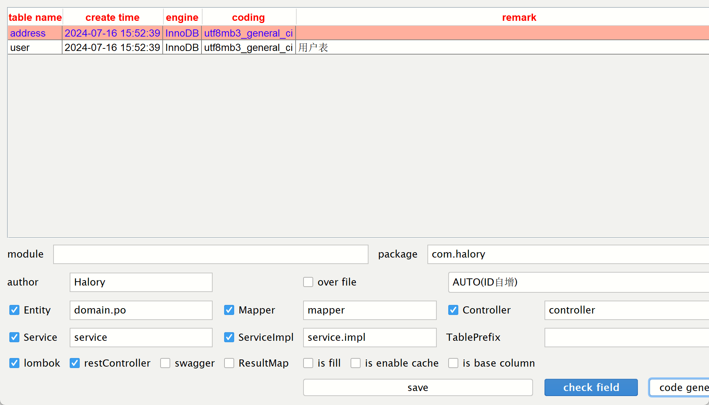

# 常用注解

- `@TableName`：用来指定表名
- `@TableId`：用来指定主键字段
- `@TableField`：用来指定普通字段

```java
@TableName("tb_user")
public class User {
    @TableId(value = "id", type = IdType.AUTO)
    private Long id;
    @TableField("username")
    private String name;
    @TableField("is_married")
    private Boolean isMarried;
    
    // 该字段于数据库中的关键字冲突
    @TableField("`order`")
    private Integer order;
    
    // 数据库中没有该字段
    @TableField(exist = false)
    private String address;
}
```


`IdType`枚举类型：

- AUTO：自增
- INPUT：通过set方法自行输入
- ASSIGN_ID：分配ID，接口`IdentifierGenerator`的方法`nextId`来生成id，默认实现类为`DefaultIdentifierGenerator`雪花算法


# 常用配置

```yaml
mybatis-plus:
  type-aliases-package: com.halory.entity
  # 默认值
  mapper-locations: classpath*:/ mapper/**/*.xml
  configuration:
    # 默认不开启下划线与驼峰映射
    map-underscore-to-camel-case: true
    # 是否开启二级缓存，默认为true
    cache-enabled: false
  global-config:
    db-config:
      # id生成，默认值为雪花算法
      id-type: auto
      # 更新策略：只更新非空字段
      update-strategy: not_null
```


# 核心功能

## 条件构造器

尽量使用`lambda`，避免硬编码


### 基于QueryWrapper


练习一：查询出名字带o的，存款大于等于1000元的人的id、username、info、balance字段

```java
	@Test
	void testQueryWrapper() {
		QueryWrapper<User> wrapper = new QueryWrapper<>();
		wrapper.select("id", "username", "info", "balance")
				.like("username", "o")
				.ge("balance", 1000);
		List<User> users = userMapper.selectList(wrapper);
		users.forEach(System.out::println);
	}
```

练习二：更新用户名为jack的用户的余额为2000

```java
	@Test
	void testUpdateQueryWrapper() {
		User user = new User();
		user.setBalance(3000);
		QueryWrapper<User> wrapper = new QueryWrapper<>();
        // 发现一个问题，属性值好像不区分大小写。数据库里面应该是Jack
		wrapper.eq("username", "jack");
		userMapper.update(user, wrapper);
	}
```


### 基于UpdateWrapper

练习：更新id为1、2、4的用户的余额，扣200

```java
	@Test
	void testUpdateWrapper() {
		List<Long> ids = List.of(1L, 2L, 4L);
		UpdateWrapper<User> wrapper = new UpdateWrapper<>();
		wrapper.setSql("balance = balance - 200")
				.in("id", ids);
		userMapper.update(null, wrapper);
	}
```


### 基于LambdaQueryWrapper

练习一：查询出名字带o的，存款大于等于1000元的人的id、username、info、balance字段

```java
	@Test
	void testLambdaQueryWrapper() {
		LambdaQueryWrapper<User> wrapper = new LambdaQueryWrapper<>();
		wrapper.select(User::getId, User::getUsername, User::getInfo, User::getBalance)
				.like(User::getUsername, "o")
				.ge(User::getBalance, 1000);
		List<User> users = userMapper.selectList(wrapper);
		users.forEach(System.out::println);
	}
```


## 自定义SQL

利用MP的Wrapper来构建复杂的Where条件，然后自己自定义SQL语句中剩下的部分

- 基于Wrapper构建where条件

```java
	@Test
	void testCustomSqlWrapper() {
		// 更新条件
		List<Long> ids = List.of(1L, 2L, 4L);
		int amount = 200;
		// 定义条件
		QueryWrapper<User> wrapper = new QueryWrapper<>();
		wrapper.in("id", ids);
		// 自定义SQL调用
		userMapper.updateBalanceByIds(wrapper, amount);
	}
```

- 在mapper方法参数中用Param注解声明wrapper变量名称，必须是`ew`

```java
void updateBalanceByIds(@Param("ew") QueryWrapper<User> wrapper,
                        @Param("amount") int amount);
```

- 自定义SQL，并使用wrapper条件

```java
@Update("update user set balance = balance - #{amount} ${ew.customSqlSegment}")
```

注意：

- 用Param注解声明的wrapper变量名称必须为`ew`
- 使用ew的`customSqlSegment`来调用自定义的wrapper片段


## Service接口


service：

```java
package com.halory.service;

import com.baomidou.mybatisplus.extension.service.IService;
import com.halory.entity.User;

public interface UserService extends IService<User> {
}

```

impl:

```java
package com.halory.service.impl;

import com.baomidou.mybatisplus.extension.service.impl.ServiceImpl;
import com.halory.entity.User;
import com.halory.mapper.UserMapper;
import com.halory.service.UserService;
import org.springframework.stereotype.Service;

@Service
public class UserServiceImpl extends ServiceImpl<UserMapper, User> implements UserService {
}

```

### 基本案例

基于Restful风格实现下面的接口：


```java
@Slf4j
@RestController
@RequestMapping("/user")
@RequiredArgsConstructor
public class UserController {

    private final UserService userService;

    @PostMapping
    public void addUser(@RequestBody UserFormDTO userDTO) {
        // 1. 把DTO拷贝到PO
        User user = BeanUtil.copyProperties(userDTO, User.class);

        // 2. 新增
        userService.save(user);
    }

    @DeleteMapping("/{id}")
    public void deleteUserById(@PathVariable Long id) {
        userService.removeById(id);
    }

    @GetMapping("/{id}")
    public UserVO queryUserById(@PathVariable Long id) {
        // 1. 查询用户
        User user = userService.getById(id);
        return BeanUtil.copyProperties(user, UserVO.class);
    }

    @GetMapping
    public List<UserVO> queryUserByIds(@RequestParam("ids") List<Long> ids) {
        List<User> users = userService.listByIds(ids);
        return BeanUtil.copyToList(users, UserVO.class);
    }

    @PutMapping("/{id}/deduction/{money}")
    public void deductMoneyById(
            @PathVariable("id") Long id,
            @PathVariable("money") Integer money
    ) {
        userService.deductMoneyById(id, money);
    }
}

```


我是第一次知道还可以这样写：

```java
@Service
public class UserServiceImpl extends ServiceImpl<UserMapper, User> implements UserService {
    @Override
    public void deductMoneyById(Long id, Integer money) {
        // 查询用户，getById是IService里面的方法，而本类实现了它，自然可以直接调用
        User user = getById(id);
        // 校验用户状态
        if (user == null || user.getStatus() == 2) {
            throw new RuntimeException("用户状态异常");
        }
        // 校验余额是否充足
        if (user.getBalance() < money) {
            throw new RuntimeException("用户余额不足");
        }
        // 扣减余额，我们继承了ServiceImpl，而ServiceImpl中自动注入了baseMapper，所以可以直接用
        baseMapper.deductBalance(id, money);
    }
}

```


### Lambda方法

需求：实现一个根据复杂条件查询用户的接口，查询条件如下：

- name：用户名关键字，可以为空
- status：用户状态，可以为空
- minBalance：最小余额，可以为空
- maxBalance：最大余额，可以为空

```java
    @Override
    public List<User> queryUsers(String name, Integer status, Integer minBalance, Integer maxBalance) {
        return lambdaQuery()
                .like(name != null, User::getUsername, name)
                .eq(status != null, User::getStatus, status)
                .ge(minBalance != null, User::getBalance, minBalance)
                .le(maxBalance != null, User::getBalance, maxBalance).list();
    }
/*
.like(name != null, User::getUsername, name)
就相当于
<if test="name != null">
	name like concat('%', #{name}, '%')
</if>
*/
```


需求：改造根据id修改用户余额的接口，要求如下：

- 完成对用户状态校验
- 完成对用户余额校验
- 如果扣减后余额小于0，则将用户status修改为冻结状态（2）

```java
    @Override
    @Transactional
    public void deductMoneyById(Long id, Integer money) {
        // 查询用户
        User user = getById(id);
        // 校验用户状态
        if (user == null || user.getStatus() == 2) {
            throw new RuntimeException("用户状态异常");
        }
        // 校验余额是否充足
        if (user.getBalance() < money) {
            throw new RuntimeException("用户余额不足");
        }
        // 扣减余额
        lambdaUpdate()
                .set(User::getBalance, user.getBalance() - money)
                .set(user.getBalance() - money <= 0, User::getStatus, 2)
                .eq(User::getId, id)
                // 添加乐观锁，保证数据库的数据和查到的数据一致
                .eq(User::getBalance, user.getBalance())
            // 前面都是写sql，这句update才是执行sql语句
                .update();
    }
```


总结：

- 复杂查询用`LambdaQuery`
- 复杂更新用`LambdaUpdate`


### IService实现批量插入

`rewriteBatchedStatements=true`

三种方案：

- 普通的for循环插入

```java
    @Test
    void testSaveOneByOne() {
        
        long b = System.currentTimeMillis();
        for (int i = 0; i < 100000; i++) {
            userService.save(buildUser());
        }
        long e = System.currentTimeMillis();
        System.out.println("耗时：" + (e - b));
    }

// 耗时五分钟
```


- IService的批量插入（基于预编译的批处理，性能不错）

```java
    @Test 
    void testSaveBatch() {
        // 每次批量插入1000条数据，插入100次即10万条数据
        
        // 1. 准备一个容量为1000的集合
        List<User> list = new ArrayList<>(1000);
        long b = System.currentTimeMillis();
        for (int i = 0; i < 100000; i++) {
            list.add(bulidUser(i));
            // 每1000条批量插入一次
            if (i%1000 == 0){
                userService.saveBatch(list);
                // 4. 清空集合，准备下一批数据
                list.clear();
            }
        }
    }

// 耗时26秒
```


- 开启`rewriteBatchedStatements=true`参数

```yaml
url: jdbc:mysql://localhost:3306/mp?rewriteBatchedStatements=true

# 开启后，IService的批处理只需要6秒钟

# 原理：该参数开启后，可以将一条sql语句执行多行数据，就是用values进行插入。不开启的话，就是用value，一条一条执行。
```


# 扩展功能

## 代码生成

使用`mybatisplus`插件

长这个样子：


使用步骤：

- 连接数据库


- 测试连接


- 生成代码


- 根据对应表生成mapper、service、serviceImpl、controller（其中`TablePrefix`这个配置项用于去除表前缀，比如在数据库中有些人使用`tb_user`来命名表，当将`TablePrefix`设置为`tb_user`的话，创建的对象就是`User`了）




## 静态工具

背景：我们在使用IService的时候，只能查询IService对应的那张表的数据。但是很多情况下，一个实体类的属性中，可能还包含了另外一个实体类。但是如果我们还希望把另外一个实体类的属性也查询出来了，那我们就只能单独给这个属性写SQL语句了。

`因此，mybatisPlus提供了静态工具，使得在不继承IService的情况下，也可以使用类似的方法`

这个静态工具就是`com.baomidou.mybatisplus.extension.toolkit.Db`


需求一：改造根据id查询用户的接口，查询用户的同时，查询出用户对应的所有地址

```java
    @Override
    public UserVO queryUserAndAddress(Long id) {
        // 查询用户
        User user = getById(id);
        if (user == null || user.getStatus() == 2) {
            throw new RuntimeException("用户状态异常");
        }
        // 查询地址
        List<Address> addresses = Db.lambdaQuery(Address.class)
                .eq(Address::getUserId, id)
                .list();

        // 封装vo
            // 转user的vo
        UserVO userVO = BeanUtil.copyProperties(user, UserVO.class);

            // 转地址vo
        if(CollUtil.isNotEmpty(addresses)){
            userVO.setAddresses(BeanUtil.copyToList(addresses, AddressVO.class));
        }
        return userVO;
    }
```


需求二：改造根据id批量查询用户的接口，查询用户的同时，查询出用户对应的所有地址

```java
    @Override
    public List<UserVO> queryUserAndAddressByIds(List<Long> ids) {
        // 1. 查询用户
        List<User> users = listByIds(ids);
        if (CollUtil.isEmpty(users)) {
            return Collections.emptyList();
        }
        // 2. 查询地址
        // 2.1 获取用户id集合
        List<Long> userIds = users.stream().map(User::getId).toList();
        // 2.2 根据用户id查询地址
        List<Address> addresses = Db.lambdaQuery(Address.class).in(Address::getUserId, userIds).list();
        // 2.3 转换地址vo
        List<AddressVO> addressVOList = BeanUtil.copyToList(addresses, AddressVO.class);
        // 2.4 用户地址集合进行分组
        Map<Long, List<AddressVO>> addressMap = new HashMap<>();
        if(CollUtil.isNotEmpty(addresses)){
            addressMap = addressVOList.stream().collect(Collectors.groupingBy(AddressVO::getUserId));
        }

        // 3. 转换vo返回
        List<UserVO> list = new ArrayList<>(users.size());
        for (User user : users) {
            UserVO userVO = BeanUtil.copyProperties(user, UserVO.class);
            userVO.setAddresses(addressMap.get(user.getId()));
            list.add(userVO);
        }
        return list;
    }
```


## 逻辑删除

背景：许多时候我们提供了删除的功能，其实并没有真正删除掉数据，只是`逻辑删除`，因为可能年底的时候会对一整年的工作效益进行统计总结，如果真的删掉的话对于统计而言肯定是有影响的。

实现逻辑删除，只需要增加一个字段，用来标识数据是否被删除，比如`deleted`。但是这又引发了一个问题，以后每次执行查询、更新操作都必须跟上`where deleted = 0`这个条件，而MP提供的方法里面又没有这个字段，这该怎么办？

基于此，MP提供了一个逻辑删除的`配置`，使用该配置之后，我们执行CRUD操作的话，就会新增对于的步骤：

- 比如执行`removeById(id)`，MP就会将id对应用户的`deleted`值修改为`deleted = 0`，而且执行SQL语句不是delete，而是`update`，
  `update user set deleted = 0 where id = #{id} and deleted = 1`

```yaml
mybatis-plus:
  global-config:
    db-config:
      # 指定全局逻辑删除的实体字段名称，字段类型可以是Boolean、Integer
      logic-delete-field: deleted
      # 逻辑已删除值，默认为1
      logic-delete-value: 1
      # 逻辑未删除值，默认为0
      logic-not-delete-value: 0
```


## 枚举处理器

背景：在许多实体类中，都会有一些字段用来表示某种状态，通常用0、1表示。但是如果一些判断语句中用0、1来判断状态的话，可读性是比较低的。既然状态是几个有限的常量，为什么我们不用枚举来给状态赋值呢？


但是`UserStatus`这个数据类型和MySQL的数据类型对应不上啊。所以这里出现了`枚举类型`和`MySQL`数据类型的`映射处理`，需要用到`全局枚举处理器`

在mybatis中其实有这种处理器，但是它写得不太好，后来MP写了一个好用一点的处理器，叫做：

`MyBatisEnumTypeHandler`，可以在yaml文件中进行配置：

```yaml
mybatis-plus:
  configuration:
    default-enum-type-handler: com.baomidou.mybatisplus.core.handlers.MybatisEnumTypeHandler
```


创建枚举类`UserStatus`

```java
package com.halory.enums;
import com.baomidou.mybatisplus.annotation.EnumValue;
import com.fasterxml.jackson.annotation.JsonValue;
import lombok.Getter;

@Getter
public enum UserStatus {
    // 枚举默认会以枚举变量名称返回
    NORMAL(1, "正常"),
    FROZEN(2, "冻结"),
    ;
    // 加上EnumValue注解，MP就会将这个值往数据库中去存，用于持久层
    @EnumValue
    private final int value;
    // 加上JsonValue注解，SpringBoot就会将枚举类型按照desc进行返回。加在value上则按照value的值返回
    // 用于vo层
    @JsonValue
    private final String desc;

    UserStatus(int value, String desc) {
        this.value = value;
        this.desc = desc;
    }
}
```


po类和vo类也需要做对应的改动：

```java
private UserStatus status;
```


对应的业务也需要处理：

```java
if (user == null || user.getStatus() == UserStatus.FROZEN) {
	throw new RuntimeException("用户状态异常");
}
```


# 插件


## 分页插件

首先要注册MP的核心插件，同时添加分页插件

```java
```

