> 本笔记参考[React Native中文网](https://rn.nodejs.cn/tutorial/create-your-first-app/)，以及[Expo](https://expo.nodejs.cn/tutorial)。RN的其他第三方库可以前往[RN目录](https://reactnative.directory/)
>
> [其他学习资源](https://expo.nodejs.cn/tutorial/follow-up/)


# 入门

## 创建RN项目

创建第一个项目：

```sh
npx create-expo-app StickerSmash --template blank
```


安装下面的依赖，让项目可以被网络访问：

```sh
npm i expo
npx expo install react-dom @expo/metro-runtime react-native-web 
```


然后启动我们的第一个项目：

```sh
npx expo start
```

启动之后，在控制台中会提供二维码，Web访问链接以及移动端的访问链接（移动端通过expo go访问），不过应该得在同一网段下才能访问到

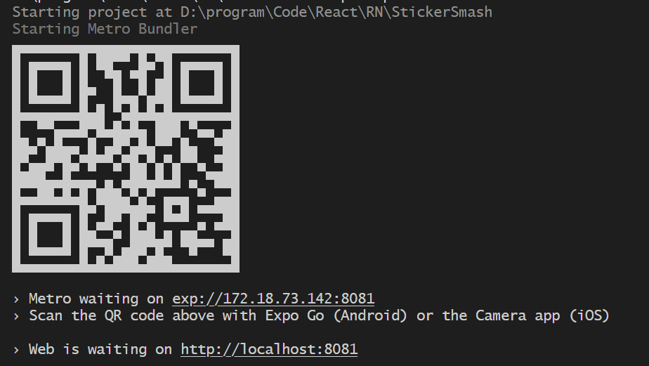


页面显示的内容来自`App.js`。


## RN基本概念

React Native是一个开源框架，使用React开发Android和iOS应用。

下面是RN的核心组件，跟原生的Web组件进行对比：

| React Native | Web                 |
| ------------ | ------------------- |
| <View>       | <div>               |
| <Text>       | <p>                 |
| <Image>      |                |
| <ScrollView> | <div>               |
| <TextInput>  | <input type="text"> |


## 避坑

- 组件名称一定要大写，最好有两个单词
- 在移动端，没有`px`，没有`vw`这些单位，只有数字


## 核心组件

### TextInput

`<TextInput>`用于文本输入，它有一个`onChangeText`属性，在文本更改时触发回调；还有一个`onSubmitEditing`属性，在提交文本时触发回调。

下面是一个示例：

```jsx
import { TextInput, View } from 'react-native'

export default function App() {
    // 第一个参数是输入框的新值
    const handleTextChange = value => {
        console.log(value)
    }
    return (
        <View>
            <TextInput
                onChangeText={handleTextChange}
                placeholder='input sth'
                style={{
                    color: '#fff'
                }}
                />
        </View>
    )
}
```


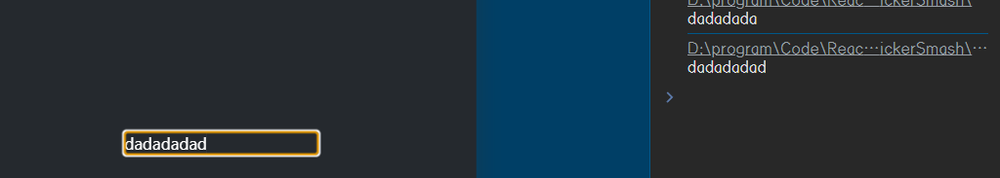


### ScrollView

`ScrollView`是一个滚动容器，通过设置`horizontal`属性来调整滚动的方向，`true`表示水平滚动，`false`表示垂直滚动。

```jsx
import React from 'react'
import { ScrollView, Text } from 'react-native'

const App = () => (
  <ScrollView horizontal={true}>
    <Text style={{ fontSize: 48 }}>Idol Sama!</Text>
    <Text style={{ fontSize: 48 }}>Idol Sama!</Text>
    <Text style={{ fontSize: 48 }}>Idol Sama!</Text>
    <Text style={{ fontSize: 48 }}>Idol Sama!</Text>
    <Text style={{ fontSize: 48 }}>Idol Sama!</Text>
    <Text style={{ fontSize: 48 }}>Idol Sama!</Text>
    <Text style={{ fontSize: 48 }}>Idol Sama!</Text>
    <Text style={{ fontSize: 48 }}>Idol Sama!</Text>
    <Text style={{ fontSize: 48 }}>Idol Sama!</Text>
    <Text style={{ fontSize: 48 }}>Idol Sama!</Text>
    <Text style={{ fontSize: 48 }}>Idol Sama!</Text>
    <Text style={{ fontSize: 48 }}>Idol Sama!</Text>
    <Text style={{ fontSize: 48 }}>Idol Sama!</Text>
    <Text style={{ fontSize: 48 }}>Idol Sama!</Text>
    <Text style={{ fontSize: 48 }}>Idol Sama!</Text>
    <Text style={{ fontSize: 48 }}>Idol Sama!</Text>
    <Text style={{ fontSize: 48 }}>Idol Sama!</Text>
    <Text style={{ fontSize: 48 }}>Idol Sama!</Text>
    <Text style={{ fontSize: 48 }}>Idol Sama!</Text>
    <Text style={{ fontSize: 48 }}>Idol Sama!</Text>
    <Text style={{ fontSize: 48 }}>Idol Sama!</Text>
    <Text style={{ fontSize: 48 }}>Idol Sama!</Text>
    <Text style={{ fontSize: 48 }}>Idol Sama!</Text>
    <Text style={{ fontSize: 48 }}>Idol Sama!</Text>
    <Text style={{ fontSize: 48 }}>Idol Sama!</Text>
    <Text style={{ fontSize: 48 }}>Idol Sama!</Text>
    <Text style={{ fontSize: 48 }}>Idol Sama!</Text>
    <Text style={{ fontSize: 48 }}>Idol Sama!</Text>
    <Text style={{ fontSize: 48 }}>Idol Sama!</Text>
  </ScrollView>
)

export default App

```


> `ScrollView`适合渲染==少量==且==大小有限==的内容，因为它是会将`ScrollView`中的内容全部渲染出来，如果内容比较多的话，应该使用`FlatList`来展示，`FlatList`的特点是页面展示哪部分内容，就渲染哪部分，性能更高。


### FlatList

RN提供了渲染数据列表的组件：`FlatList`或者`SectionList`

与`ScrollView`不同的是，`FlatList`仅仅渲染==当前显示在页面上==的元素。

`FlatList`需要有两个props：

- `data`：列表的信息来源
- `renderItem`：从源中获取一项并返回一个格式化组件进行渲染（因为数据源可能包含了许多信息，而页面上只需要展示每一个item的name，所以就可以选择性地展示数据）

```jsx
import React from 'react'
import { FlatList, StyleSheet, Text, View } from 'react-native'

const styles = StyleSheet.create({
    container: {
        flex: 1,
        paddingTop: 22,
    },
    item: {
        padding: 10,
        fontSize: 18,
        height: 44,
    },
})

const FlatListBasics = () => {
    return (
        <View style={styles.container}>
            <FlatList
                data={[
                    { key: 'Devin' },
                    { key: 'Dan' },
                    { key: 'Dominic' },
                    { key: 'Jackson' },
                    { key: 'James' },
                    { key: 'Joel' },
                    { key: 'John' },
                    { key: 'Jillian' },
                    { key: 'Jimmy' },
                    { key: 'Julie' },
                ]}
                renderItem={({ item }) => <Text style={styles.item}>{item.key}</Text>}
                />
        </View>
    )
}

export default FlatListBasics

```


<center>
    <b>列表展示</b>
</center>


如果列表展示有一个逻辑划分的话，比如通讯录就会有==以某个字母开头==的划分。此时就会用到`SectionList`

```jsx
import React from 'react';
import {SectionList, StyleSheet, Text, View} from 'react-native';

const styles = StyleSheet.create({
    container: {
        flex: 1,
        paddingTop: 22,
    },
    sectionHeader: {
        paddingTop: 2,
        paddingLeft: 10,
        paddingRight: 10,
        paddingBottom: 2,
        fontSize: 14,
        fontWeight: 'bold',
        backgroundColor: 'rgba(247,247,247,1.0)',
    },
    item: {
        padding: 10,
        fontSize: 18,
        height: 44,
    },
});

const SectionListBasics = () => {
    return (
        <View style={styles.container}>
            <SectionList
                sections={[
                    {title: 'D', data: ['Devin', 'Dan', 'Dominic']},
                    {
                        title: 'J',
                        data: [
                            'Jackson',
                            'James',
                            'Jillian',
                            'Jimmy',
                            'Joel',
                            'John',
                            'Julie',
                        ],
                    },
                ]}
                renderItem={({item}) => <Text style={styles.item}>{item}</Text>}
                renderSectionHeader={({section}) => (
                    <Text style={styles.sectionHeader}>{section.title}</Text>
                )}
                keyExtractor={item => `basicListEntry-${item}`}
                />
        </View>
    );
};

export default SectionListBasics;
```


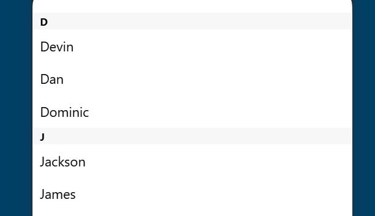

<center>
    <b>有区域划分的列表</b>
</center>


## 平台检测

数智江理就有一个这个东西，导致我们无法在Web端打开它的网页。

RN提供了`Platform`模块来检测运行的平台：

```jsx
import {Platform, StyleSheet} from 'react-native';

const styles = StyleSheet.create({
    height: Platform.OS === 'ios' ? 200 : 100,
});
```


# 基础

从这里开始，我会根据Expo中文网的教程来开发一个简单的app出来

## 构建一个屏幕

这里我们需要实现一个下面的效果：

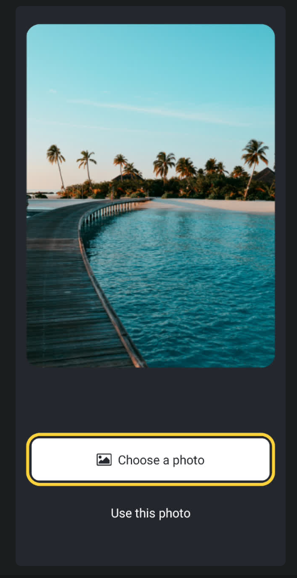

一张图片和两个按钮。第一个按钮用来选择图片，第二个按钮用来显示图片。

1. 首先先修改一下颜色，包括背景颜色和文字颜色：

```jsx
import { StatusBar } from 'expo-status-bar';
import { StyleSheet, Text, View } from 'react-native';

export default function App() {
    return (
        <View style={styles.container}>
            <Text style={{ color: '#fff' }}>
                Open up App.js to start working on your app!
            </Text>
            <StatusBar style="auto" />
        </View>
    );
}

const styles = StyleSheet.create({
    container: {
        flex: 1,
        backgroundColor: '#25292e',
        alignItems: 'center',
        justifyContent: 'center',
    },
});

```


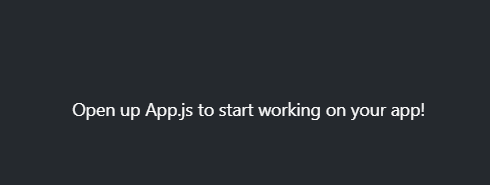

> <center>
>     <b>修改颜色</b>
> </center>
>
> RN提供了一个`StyleSheet`类，可以用来创建一个样式表对象，我们可以在该对象中创建不同场景需要用到的属性。比如这里的`container`属性是用来布局的，因此该属性的值都是一些布局样式。

2. 接着，我们需要显示一下图片。可以使用`<Image>`组件。

```jsx
import { StatusBar } from 'expo-status-bar'
import { StyleSheet, View, Image } from 'react-native'

const PlaceholderImage = require('./assets/images/background-image.png')

export default function App() {
    return (
        <View style={styles.container}>
            <View style={styles.imageContainer}>
                <Image
                    source={PlaceholderImage}
                    style={styles.image}
                    />
            </View>
            <StatusBar style='auto' />
        </View>
    )
}

const styles = StyleSheet.create({
    container: {
        flex: 1,
        backgroundColor: '#25292e',
        alignItems: 'center',
    },
    imageContainer: {
        flex: 1,
        paddingTop: 58,
    },
    image: {
        width: 320,
        height: 440,
        borderRadius: 18,
    },
})

```


<center>
    <b>显示图片</b>
</center>

> 在`<Image>`组件中，图片地址的传入是通过`source`属性实现的。

3. 鉴于图片的可移植性很强，我们可以将图片显示的部分单独拆分成一个组件：

```jsx
// ./components/ImageViewer.jsx
import { StyleSheet, Image } from 'react-native'

export default function ImageViewer({ placeholderImageSource }) {
    return (
        <Image
            source={placeholderImageSource}
            style={styles.image}
            />
    )
}

const styles = StyleSheet.create({
    image: {
        width: 320,
        height: 440,
        borderRadius: 18,
    },
})


// App.js
import { StatusBar } from 'expo-status-bar'
import { StyleSheet, View } from 'react-native'

import ImageViewer from './components/ImageViewer'

const PlaceholderImage = require('./assets/images/background-image.png')

export default function App() {
    return (
        <View style={styles.container}>
            <View style={styles.imageContainer}>
                <ImageViewer placeholderImageSource={PlaceholderImage} />
            </View>
            <StatusBar style='auto' />
        </View>
    )
}

const styles = StyleSheet.create({
    container: {
        flex: 1,
        backgroundColor: '#25292e',
        alignItems: 'center',
    },
    imageContainer: {
        flex: 1,
        paddingTop: 58,
    },
})


```

4. 使用`Pressable`创建按钮。该组件是一个核心组件封装其，可以检测交互的各个阶段，从基本的==单击==事件到==长按==等高级事件，可以用来处理原生平台上的==触摸事件==。
   由于我们会用到两个按钮，所以这里可以封装成一个组件：

   ```jsx
   // ./components/Button.jsx
   import { StyleSheet, View, Pressable, Text } from 'react-native'
   
   export default function Button({ label }) {
       return (
           <View style={styles.buttonContainer}>
               <Pressable
                   style={styles.button}
                   onPress={() => alert('You pressed a button.')}
                   >
                   <Text style={styles.buttonLabel}>{label}</Text>
               </Pressable>
           </View>
       )
   }
   
   const styles = StyleSheet.create({
       buttonContainer: {
           width: 320,
           height: 68,
           marginHorizontal: 20,
           alignItems: 'center',
           justifyContent: 'center',
           padding: 3,
       },
       button: {
           borderRadius: 10,
           width: '100%',
           height: '100%',
           alignItems: 'center',
           justifyContent: 'center',
           flexDirection: 'row',
       },
       buttonIcon: {
           paddingRight: 8,
       },
       buttonLabel: {
           color: '#fff',
           fontSize: 16,
       },
   })
   
   
   // App.js
   import { StatusBar } from 'expo-status-bar'
   import { StyleSheet, View } from 'react-native'
   
   import Button from './components/Button'
   import ImageViewer from './components/ImageViewer'
   
   const PlaceholderImage = require('./assets/images/background-image.png')
   
   export default function App() {
       return (
           <View style={styles.container}>
               <View style={styles.imageContainer}>
                   <ImageViewer placeholderImageSource={PlaceholderImage} />
               </View>
               <View style={styles.footerContainer}>
                   <Button label='Choose a photo' />
                   <Button label='Use this photo' />
               </View>
               <StatusBar style='auto' />
           </View>
       )
   }
   
   const styles = StyleSheet.create({
       container: {
           flex: 1,
           backgroundColor: '#25292e',
           alignItems: 'center',
       },
       imageContainer: {
           flex: 1,
           paddingTop: 58,
       },
       footerContainer: {
           flex: 1 / 3,
           alignItems: 'center',
       },
   })
   
   
   ```

   


<center>
    <b>添加按钮</b>
</center>

5. 给第一个按钮添加图标，这里我们会用到一个图标库`@expo/vector-icons`
   ```sh
   npx expo install @expo/vector-icons
   ```

   

   我们使用到的是其中的`FontAwesome`，修改`Button.jsx`的代码：

   ```jsx
   import { StyleSheet, View, Pressable, Text } from 'react-native'
   import FontAwesome from '@expo/vector-icons/FontAwesome'
   
   export default function Button({ label, theme }) {
       if (theme === 'primary') {
           return (
               <View
                   style={[
                       styles.buttonContainer,
                       { borderWidth: 4, borderColor: '#ffd33d', borderRadius: 18 },
                   ]}
                   >
                   <Pressable
                       style={[styles.button, { backgroundColor: '#fff' }]}
                       onPress={() => alert('You pressed a button.')}
                       >
                       <FontAwesome
                           name='picture-o'
                           size={18}
                           color='#25292e'
                           style={styles.buttonIcon}
                           />
                       <Text style={[styles.buttonLabel, { color: '#25292e' }]}>
                           {label}
                       </Text>
                   </Pressable>
               </View>
           )
       }
   
       return (
           <View style={styles.buttonContainer}>
               <Pressable
                   style={styles.button}
                   onPress={() => alert('You pressed a button.')}
                   >
                   <Text style={styles.buttonLabel}>{label}</Text>
               </Pressable>
           </View>
       )
   }
   
   const styles = StyleSheet.create({
       buttonContainer: {
           width: 320,
           height: 68,
           marginHorizontal: 20,
           alignItems: 'center',
           justifyContent: 'center',
           padding: 3,
       },
       button: {
           borderRadius: 10,
           width: '100%',
           height: '100%',
           alignItems: 'center',
           justifyContent: 'center',
           flexDirection: 'row',
       },
       buttonIcon: {
           paddingRight: 8,
       },
       buttonLabel: {
           color: '#fff',
           fontSize: 16,
       },
   })
   
   // App.js
   export default function App() {
       return (
           <View style={styles.container}>
               <View style={styles.imageContainer}>
                   <ImageViewer placeholderImageSource={PlaceholderImage} />
               </View>
               <View style={styles.footerContainer}>
                   <Button theme="primary" label="Choose a photo" />
                   <Button label="Use this photo" />
               </View>
               <StatusBar style="auto" />
           </View>
       );
   }
   
   
   ```

   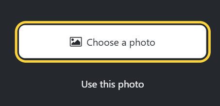

   <center>
       <b>添加图标</b>
   </center>

   > `Button.jsx`其实是做了一个判断，如果父组件（`App.js`）传递了一个`theme`属性，并且该属性值为`primary`，那么就通过==内联样式==来覆盖掉组件原来的样式，这样两个按钮就可以区分开来了。


## 图片选择器

在上一节中，我们对于触摸事件只使用了一个`alert()`函数，在这一节中，我们需要实现图片选择的功能。

RN本身无法实现从设备的媒体库中选择图片，为此我们需要一个第三方库，名为`expo-image-picker`，该库提供了一个`launchImageLibraryAsync()`函数，用于显式从设备的媒体库中选择图片或视频的系统UI

```sh
npx expo install expo-image-picker
```

我们在`App.js`中创建一个`pickImageAsync()`函数：

```jsx
import * as ImagePicker from 'expo-image-picker'

const pickImageAsync = async () => {
    // 返回一个对象，里面包含了所选图片的信息
    let result = await ImagePicker.launchImageLibraryAsync({
        // 选择图片的过程中是否可以裁剪图片（Web端就别想了）
        allowsEditing: true,
        quality: 1,
    })

    if (!result.canceled) {
        console.log(result)
    } else {
        alert('You did not select any image.')
    }
}
```


函数写好了，我们就需要把这个函数传递给子组件：

```jsx
// Button.jsx
<Pressable
    style={[styles.button, { backgroundColor: '#fff' }]}
    onPress={onPress}
    >
</Pressable>

// App.js
<Button theme="primary" label="Choose a photo" onPress={pickImageAsync}></Button>

```

下面是`result`的格式：

```json
{
    "canceled": false,
    "assets": [
        {
            "uri": "data:image/png;base64,....",
            "width": 831,
            "height": 99,
            "type": "image",
            "mimeType": "image/png",
            "fileName": "部署MySQL.png",
            "fileSize": 29475,
            "file": {}
        }
    ]
}
```

其中最关键的是`uri`属性，我们可以获取图片的uri，然后显示到屏幕上。我们可以按照下面的步骤修改`App.js`文件：

- 使用`useState`声明一个`selectedImage`的状态变量
- 将图片的`uri`保存到`selectedImage`变量中
- 将`selectedImage`作为prop传递给`ImageViewer`组件

```jsx
// App.js的比较简单，这里就补充ImageViewer.jsx的部分
export default function ImageViewer({ placeholderImageSource, selectedImage }) {

    // 这里一定要写成对象，不然手机上是加载不了图片的
    const imageSource = selectedImage
    ? {
        uri: selectedImage,
    }
    : placeholderImageSource
    return (
        <Image
            source={imageSource}
            style={styles.image}
            />
    )
}

```


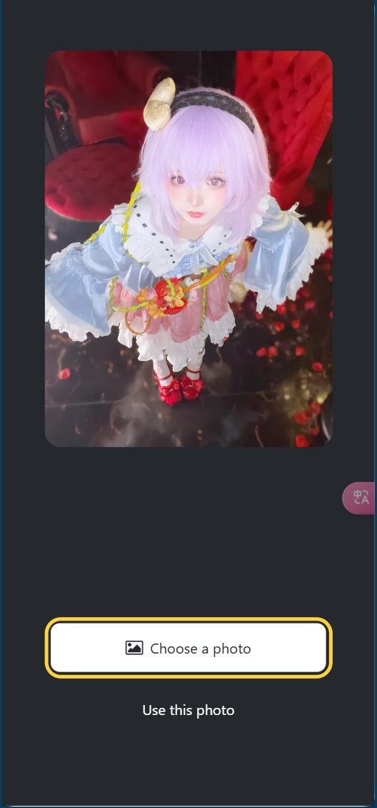


## 创建模态

本节中，我们将创建一个显示表情符号选择器列表的模式。


### 声明一个状态变量来显示按钮

我们先添加三个按钮，仅当用户选择了图片才会显示这些按钮

其中一个按钮可以用来选择符号表情

我们先在`App.js`中声明一个`showAppOptions`的状态变量：

```jsx
export default function App() {
    const [showAppOptions, setShowAppOptions] = useState(false); 
}

```


当用户选择好图片并决定使用该图片之后，将`showAppOptions`设置为`true`，所以接下来修改`pickImageAsync()`函数：

```jsx
const pickImageAsync = async () => {
    // ...rest of the code remains same

    if (!result.canceled) {
        setSelectedImage(result.assets[0].uri);
        setShowAppOptions(true); 

    } else {
        // ...rest of the code remains same
    }
};

```

然后通过添加具有以下值的`onPress`属性来更新没有`theme`的按钮：

```jsx
<Button label="Use this photo"  onPress={() => setShowAppOptions(true)}  />

```

现在我们可以回到`Button.js`中，删除第二个`Button`中的`alert()`并更新：

```jsx
<Pressable style={styles.button} onPress={onPress}/>

```

现在我们就可以根据`showAppOptions`的状态来动态渲染按钮：

```jsx
{showAppOptions ? (
        <View />
      ) : (
        <View style={styles.footerContainer}>
          <Button
            theme={'primary'}
            label='Choose a photo'
            onPress={pickImageAsync}
          />
          <Button
            label='Use this photo'
            onPress={() => setShowAppOptions(true)}
          />
        </View>
)}
```


### 添加按钮

我们需要添加的按钮布局如下：

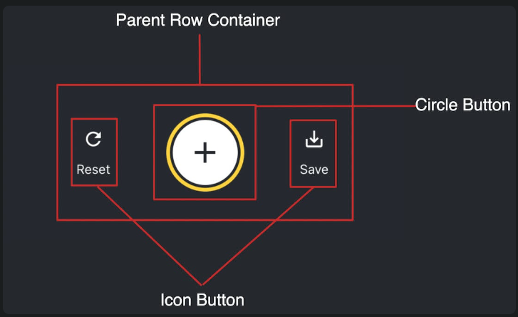


其中有两个`Icon Button`和一个`Circle Button`，我们需要创建对应的组件。

在`components`目录下创建一个名为`CircleButton.js`的新文件：

```jsx
import { View, Pressable, StyleSheet } from 'react-native';
import MaterialIcons from '@expo/vector-icons/MaterialIcons';

export default function CircleButton({ onPress }) {
    return (
        <View style={styles.circleButtonContainer}>
            <Pressable style={styles.circleButton} onPress={onPress}>
                <MaterialIcons name="add" size={38} color="#25292e" />
            </Pressable>
        </View>
    );
}

const styles = StyleSheet.create({
    circleButtonContainer: {
        width: 84,
        height: 84,
        marginHorizontal: 60,
        borderWidth: 4,
        borderColor: '#ffd33d',
        borderRadius: 42,
        padding: 3,
    },
    circleButton: {
        flex: 1,
        justifyContent: 'center',
        alignItems: 'center',
        borderRadius: 42,
        backgroundColor: '#fff',
    },
});

```


> 由于圆形按钮需要用到`+`号图标，这里引用了`MaterialIcons`的一个图标组件

接下来创建`Icon Button`的组件文件：

```jsx
import { Pressable, StyleSheet, Text } from 'react-native';
import MaterialIcons from '@expo/vector-icons/MaterialIcons';

export default function IconButton({ icon, label, onPress }) {
    return (
        <Pressable style={styles.iconButton} onPress={onPress}>
            <MaterialIcons name={icon} size={24} color="#fff" />
            <Text style={styles.iconButtonLabel}>{label}</Text>
        </Pressable>
    );
}

const styles = StyleSheet.create({
    iconButton: {
        justifyContent: 'center',
        alignItems: 'center',
    },
    iconButtonLabel: {
        color: '#fff',
        marginTop: 12,
    },
});

```


> 由于是组件，所以最好是由父组件传入props来定制化。这里需要三个prop：`icon`、`label`和`onPress`，分别对应这按钮的图标、按钮的文本标签和按钮时的回调函数

然后将这些按钮导入到`App.js`的空`<View>`组件中来显示它们，并创建对应的`onPress`函数：

```jsx
// ... rest of the import statements
import CircleButton from './components/CircleButton';
import IconButton from './components/IconButton';

export default function App() {
    // ...rest of the code remains same
    const onReset = () => {
        setShowAppOptions(false);
    };

    const onAddSticker = () => {
        // we will implement this later
    };

    const onSaveImageAsync = async () => {
        // we will implement this later
    };

    return (
        <View style={styles.container}>

            {/* ...rest of the code remains same */}


            {showAppOptions ? (
                <View style={styles.optionsContainer}>
                    <View style={styles.optionsRow}>
                        <IconButton icon="refresh" label="Reset" onPress={onReset} />
                        <CircleButton onPress={onAddSticker} />
                        <IconButton icon="save-alt" label="Save" onPress={onSaveImageAsync} />
                    </View>
                </View>
            ) : (
                // ...rest of the code remains same
            )}
            <StatusBar style="auto" />
        </View>
    );
}

const styles = StyleSheet.create({
    // ...previous styles remain unchanged
    optionsContainer: {
        position: 'absolute',
        bottom: 80,
    },
    optionsRow: {
        alignItems: 'center',
        flexDirection: 'row',
    },
})

```


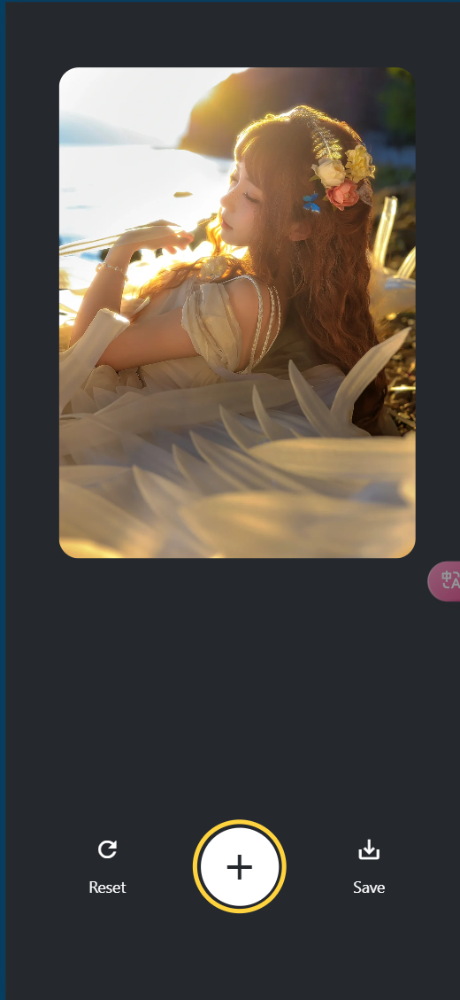

<center>
    <b>效果</b>
</center>


### 创建表情符号选择器

该功能允许用户从可用表情符号列表中选择表情符号。

在组件目录中创建`EmojiPicker.jsx`文件，该组件接收三个props：

- `isVisible`：模式是否可见
- `onClose`：关闭模态框的函数
- `children`：表情符号列表

```jsx
import { Modal, View, Text, Pressable, StyleSheet } from 'react-native';
import MaterialIcons from '@expo/vector-icons/MaterialIcons';

export default function EmojiPicker({ isVisible, children, onClose }) {
    return (
        <Modal animationType="slide" transparent={true} visible={isVisible}>
            <View style={styles.modalContent}>
                <View style={styles.titleContainer}>
                    <Text style={styles.title}>Choose a sticker</Text>
                    <Pressable onPress={onClose}>
                        <MaterialIcons name="close" color="#fff" size={22} />
                    </Pressable>
                </View>
                {children}
            </View>
        </Modal>
    );
}

```


这里使用了`<Modal>`组件，用于显示标题和关闭按钮，这里解释一下它的属性的作用：

- `visible`：控制模式是打开还是关闭
- `transparent`：模态是否填充整个视图
- `animationType`：如何进入和离开屏幕。本例中，它是从屏幕底部滑动进入

用户按下关闭`<Pressable>`时，会调用`onClose`回调。

下面给组件添加样式：

```jsx
const styles = StyleSheet.create({
    modalContent: {
        height: '25%',
        width: '100%',
        backgroundColor: '#25292e',
        borderTopRightRadius: 18,
        borderTopLeftRadius: 18,
        position: 'absolute',
        bottom: 0,
    },
    titleContainer: {
        height: '16%',
        backgroundColor: '#464C55',
        borderTopRightRadius: 10,
        borderTopLeftRadius: 10,
        paddingHorizontal: 20,
        flexDirection: 'row',
        alignItems: 'center',
        justifyContent: 'space-between',
    },
    title: {
        color: '#fff',
        fontSize: 16,
    },
});

```


现在我们将`EmojiPicker`组件导入进`App.js`，并创建`isModalVisible`状态变量控制模式的显示，修改`onAddSticker()`函数，创建一个`onModalClose()`函数来更新`isModalVisible`状态变量

```jsx

const [isModalVisible, setIsModalVisible] = useState(false)

const onAddSticker = () => {
    setIsModalVisible(true)
}

const onModalClose = () => {
    setIsModalVisible(false)
}
<EmojiPicker
    isVisible={isModalVisible}
    onClose={onModalClose}
    />
```


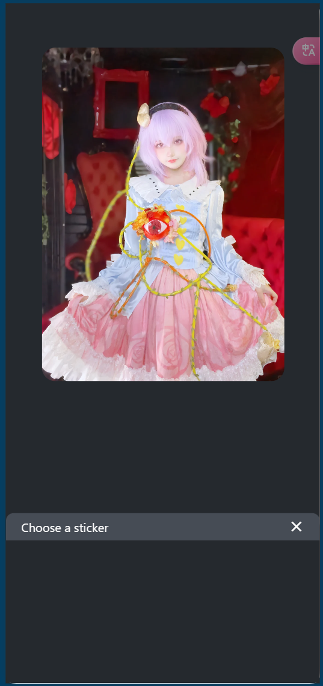


### 显示表情符号列表

我们要在模式内容中水平显示表情符号列表，需要用到RN的`<FlatList>`组件。下面在组件目录下创建一个`EmojiList.jsx`的文件：

```jsx
import { useState } from 'react';
import { StyleSheet, FlatList, Image, Platform, Pressable } from 'react-native';

export default function EmojiList({ onSelect, onCloseModal }) {
    const [emoji] = useState([
        require('../assets/images/emoji1.png'),
        require('../assets/images/emoji2.png'),
        require('../assets/images/emoji3.png'),
        require('../assets/images/emoji4.png'),
        require('../assets/images/emoji5.png'),
        require('../assets/images/emoji6.png'),
    ]);

    return (
        <FlatList
            // 水平显示
            horizontal
            // 仅在Web上显示水平滚动条
            showsHorizontalScrollIndicator={Platform.OS === 'web'}
            data={emoji}
            contentContainerStyle={styles.listContainer}
            renderItem={({ item, index }) => (
                <Pressable
                    onPress={() => {
                        onSelect(item);
                        onCloseModal();
                    }}>
                    <Image source={item} key={index} style={styles.image} />
                </Pressable>
            )}
            />
    );
}

const styles = StyleSheet.create({
    listContainer: {
        borderTopRightRadius: 10,
        borderTopLeftRadius: 10,
        paddingHorizontal: 20,
        flexDirection: 'row',
        alignItems: 'center',
        justifyContent: 'space-between',
    },
    image: {
        width: 100,
        height: 100,
        marginRight: 20,
    },
});

```


现在将`EmojiList`组件导入`App.jsx`，并且修改代码片段：

```jsx
//...rest of the import statements remain same
import EmojiList from './components/EmojiList';

// Inside App component to select the emoji from the list

export default function App() {
    const [pickedEmoji, setPickedEmoji] = useState(null);
    // ...rest of the code remain same

    return (
        <View style={styles.container}>

            {/* rest of the code remains unchanged */}


            <EmojiPicker isVisible={isModalVisible} onClose={onModalClose}>
                <EmojiList onSelect={setPickedEmoji} onCloseModal={onModalClose} />
            </EmojiPicker>
            <StatusBar style="auto" />
        </View>
    );
}

```


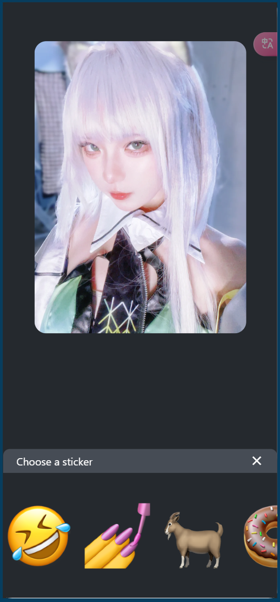

<center>
    <b>添加模态</b>
</center>


### 显示选定的表情符号

现在我们要将表情符号贴纸放在图片上。

首先在组件目录中创建一个名为`EmojiSticker.jsx`的文件：

```jsx
import { View, Image } from 'react-native';

export default function EmojiSticker({ imageSize, stickerSource }) {
    return (
        <View style={{ top: -350 }}>
            <Image
                source={stickerSource}
                resizeMode="contain"
                style={{ width: imageSize, height: imageSize }}
                />
        </View>
    );
}

```


> 该组件接收两个 props：
>
> - `imageSize`：`<App>`组件内定义的值，用来缩放点击时图片的大小（下一节使用）
> - `stickerSource`：所选表情符号图片的来源

我们将组件导入`App.js`中，并更新`App`有条件地在图片上显示表情符号贴纸，通过检查`pickerEmoji`。

```jsx
// ...rest of the import statements
import EmojiSticker from './components/EmojiSticker';

export default function App() {
    // ...rest of the code remains same

    return (
        <View>
            <View style={styles.imageContainer}>
                <ImageViewer placeholderImageSource={PlaceholderImage} selectedImage={selectedImage} />
                {pickedEmoji && <EmojiSticker imageSize={40} stickerSource={pickedEmoji} />}
            </View>

            {/* ...rest of the code remains same */}


        </View>
    );
}

```


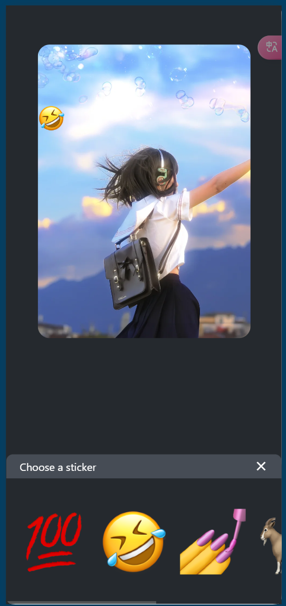

<center>
    <b>实现贴图效果</b>
</center>


## 添加手势

手势是在应用中提供直观用户体验的好方法，RN提供了`React Native Gesture Handler`库，用来处理识别原生平台上的平移、点击、旋转和其他手势。为了在手势状态之间设置动画，我们会用到`react-native-reanimated`

本节将实现两种不同的手势功能：

- 双击可缩放表情符号贴纸的大小
- 平移可以移动表情符号贴纸，以便用户可以将贴纸放置在图片上的任何位置。

### 安装库

```sh
npx expo install react-native-gesture-handler react-native-reanimated
```

为了手势交互可以在应用中顶层生效，我们会使用`<GestureHandlerRootView>`来封装根组件。

```jsx
import { GestureHandlerRootView } from "react-native-gesture-handler"; 

export default function App() {
    return (
        <GestureHandlerRootView style={styles.container}>

            {/* ...rest of the code remains */}


        </GestureHandlerRootView>
    )
}

```

### 使用动画组件

在`EmojiSticker.jsx`文件中导入`Animated`以使用动画组件，包括`<Animated.View>`、`<Animated.Text>`或者`<Animated.ScrollView>`。这里我们会使用`<Animated.Image>`组件应用动画，以使双击手势发挥作用。

```jsx
// 将Image组件替换为<Animated.Image>
export default function EmojiSticker({ imageSize, stickerSource }) {
    return (
        <View style={{ top: -350 }}>
            <Animated.Image
                source={stickerSource}
                resizeMode="contain"
                style={{ width: imageSize, height: imageSize }}
                />
        </View>
    );
}

```


### 添加点击手势

在`EmojiSticker.jsx`中引入钩子。当识别点击手势时，这些钩子将为贴纸的`<Animated.Image>`组件上的样式设置动画：

```jsx
import { Gesture, GestureDetector } from 'react-native-gesture-handler';
import Animated, { useAnimatedStyle, useSharedValue, withSpring } from 'react-native-reanimated';

```

使用`useSharedValue()`钩子创建一个名为`scaleImage`的引用，它将把`imageSize`的值作为它的初始值：

```jsx
const scaleImage = useSharedValue(imageSize);
```


`useSharedValue()`来创建共享值有很多优点。它有助于改变一段数据并允许当前值运行动画。可以使用`.value`属性访问和修改共享值。它将缩放`scaleImage`的初始值，以便当用户双击贴纸时，它会缩放到原始大小的2倍。

为此，我们将创建一个对象并将其命名为`doubleTap`。该对象将使用`Gesture.Tap()`在缩放贴纸图片时为过渡设置动画。而`numberOfTaps`方法确定需要多少次点击。

```jsx
const doubleTap = Gesture.Tap().numberOfTaps(2).onStart(() => {
    if (scaleImage.value !== imageSize * 2) {
        scaleImage.value = scaleImage.value * 2;
    }
});

```

为了使过渡动画化，我们使用基于==弹簧==的动画，由`react-native-reanimated`提供的`withSpring()`功能。

`useAnimatedStyle()`钩子用户创建将应用于贴纸图片的样式对象。当动画发生时，它将使用共享值更新样式。在本例中，我们缩放图片的大小，这是通过操纵`width`和`height`属性来完成的。

```jsx
const imageStyle = useAnimatedStyle(() => {
    return {
        width: withSpring(scaleImage.value),
        height: withSpring(scaleImage.value),
    };
});

```

接下来，用`<GestureDetector>`组件封装在屏幕上显示贴纸的`<Animated.Image>`组件，并修改`Animated.Image`上的`style`属性以传递`imageStyle`

```jsx
export default function EmojiSticker({ imageSize, stickerSource }) {
    // ...rest of the code remains same
    return (
        <View style={{ top: -350 }}>
            <GestureDetector gesture={doubleTap}>
                <Animated.Image
                    source={stickerSource}
                    resizeMode="contain"
                    style=

                    {[imageStyle, { width: imageSize, height: imageSize }]}


                    />
            </GestureDetector>
        </View>
    );
}

```


<center>
    <b>双击后放大</b>
</center>


### 添加平移手势

在`EmojiSticker.jsx`中，将`<View>`组件替换为`<Animated.View>`

```jsx
export default function EmojiSticker({ imageSize, stickerSource }) {
    // ...rest of the code remains same
    return (
        <Animated.View style={{ top: -350 }}>
            <GestureDetector gesture={doubleTap}>

                {/* ...rest of the code remains same */}


            </GestureDetector>
        </Animated.View>
    );
}

```


现在创建两个共享值：`translateX`和`translateY`，用于表示贴纸的位置

```jsx
export default function EmojiSticker({ imageSize, stickerSource }) {
    // 贴纸的初始位置为(0,0)
    const translateX = useSharedValue(0);
    const translateY = useSharedValue(0);
}

```


上一步中，我们为`Gesture.Tap()`方法的点击手势触发了`onStart()`回调。同样，对于平移手势，我们必须指定一个`onChange()`回调，该回调在手势处于活动状态且正在移动时运行。

创建一个`drag`对象来处理平移手势：

```jsx
const drag = Gesture.Pan()
.onChange((event) => {
    // 修改贴纸的位置
    translateX.value += event.changeX;
    translateY.value += event.changeY;
});

```


接下来使用`useAnimatedStyle()`钩子返回`transform`数组，用来更改贴纸的位置：

```jsx
const containerStyle = useAnimatedStyle(() => {
    return {
        transform: [
            {
                translateX: translateX.value,
            },
            {
                translateY: translateY.value,
            },
        ],
    };
});

```


然后将`containerStyle`添加到`<Animated.View>`组件上以应用变换样式，另外更新`<EmojiSticker>`组件，使`<GestureDetecor>`组件成为顶层组件。

```jsx
export default function EmojiSticker({ imageSize, stickerSource }) {
    // rest of the code

    return (
        <GestureDetector gesture={drag}>
            <Animated.View style=

                {[containerStyle, { top: -350 }]}

                >
                <GestureDetector gesture={doubleTap}>
                    <Animated.Image
                        source={stickerSource}
                        resizeMode="contain"
                        style={[imageStyle, { width: imageSize, height: imageSize }]}
                        />
                </GestureDetector>
            </Animated.View>
        </GestureDetector>
    );
}

```


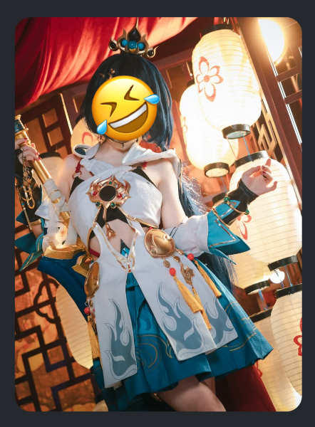

<center>
    <b>实现了放大和拖拽效果</b>
</center>


## 截图

在本章中，我们会学习如何使用第三方库截屏并保存到设备上。

需要用到`react-native-view-shot`（允许截屏）和`expo-media-library`（允许访问设备的媒体库以保存图片）


### 安装库

```sh
npx expo install react-native-view-shot expo-media-library
```


### 提示权限

当创建需要访问潜在敏感信息的应用时，我们必须首先请求用户的许可。

`expo-media-library`提供了一个授予`status`权限的`usePermissions()`钩子，以及一个在未授予权限时请求访问媒体库的`requestPermission()`方法。

最初，当应用第一次加载并且权限状态既不是授予也不是拒绝时，`status`的值为`null`，当请求权限时，用户可以授予权限或拒绝权限。我们可以添加一个条件来检查是否是`null`，如果是，则触发`requestPermission()`方法

在`App.js`中添加下面的代码片段：

```jsx
import * as MediaLibrary from 'expo-media-library';

// ...rest of the code remains same

export default function App() {
    const [status, requestPermission] = MediaLibrary.usePermissions();
    // ...rest of the code remains same

    if (status === null) {
        requestPermission();
    }

    // ...rest of the code remains same
}

```

> 一旦获得许可，`statue`的值将更改为`granted`


### 选择一个库来截图

为了允许用户在应用内截取屏幕截图，我们将使用`react-native-view-shot`，它允许将`<View>`捕获为图片。

我们将其导入到`App.js`中：

```jsx
import { captureRef } from 'react-native-view-shot'
```


### 创建一个ref来保存当前视图

`react-native-view-shot` 库提供了一个名为 `captureRef()` 的方法，该方法可以捕获应用中 `<View>` 的屏幕截图并返回屏幕截图文件的 URI。

要捕获 `<View>`，需要将 `<ImageViewer>` 和 `<EmojiSticker>` 组件封装在 `<View>` 内，然后传递对其的引用。

使用 React 中的 `useRef()` 钩子，让我们在 `<App>` 中创建一个 `imageRef` 变量。

```jsx
import { useState, useRef } from 'react';

export default function App() {
    const imageRef = useRef();

    // ...rest of the code remains same

    return (
        <GestureHandlerRootView style={styles.container}>
            <View style={styles.imageContainer}>
                <View ref={imageRef} collapsable={false}>
                    <ImageViewer placeholderImageSource={PlaceholderImage} selectedImage={selectedImage} />
                    {pickedEmoji && <EmojiSticker imageSize={40} stickerSource={pickedEmoji} />}
                </View>
            </View>

            {/* ...rest of the code remains same */}


        </GestureHandlerRootView>
    );
}

```


>`collapsable` 属性设置为 `false`，因为该 `<View>` 组件用于拍摄背景图片和表情符号贴纸的屏幕截图。应用屏幕的其余内容（例如按钮）不属于屏幕截图的一部分。


### 捕获屏幕截图并保存

现在我们可以通过在 `onSaveImageAsync()` 函数内从 `react-native-view-shot` 调用 `captureRef()` 方法来捕获视图的屏幕截图。`captureRef()` 接受一个可选参数，我们可以在其中传递我们想要捕获屏幕截图的区域的 `width` 和 `height`。

`captureRef()` 方法返回一个 promise，该 promise 通过捕获的屏幕截图的 URI 来实现。我们将此 URI 作为参数传递给 `MediaLibrary.saveToLibraryAsync()`，该 `MediaLibrary.saveToLibraryAsync()` 会将屏幕截图保存到设备的媒体库中。

使用以下代码更新 `onSaveImageAsync()` 函数：

```jsx
export default function App() {
    const onSaveImageAsync = async () => {
        try {
            const localUri = await captureRef(imageRef, {
                height: 440,
                quality: 1,
            });

            await MediaLibrary.saveToLibraryAsync(localUri);
            if (localUri) {
                alert("Saved!");
            }
        } catch (e) {
            console.log(e);
        }
    };
    // ...rest of the code remains same
}

```

> 点击保存按钮，即可实现截图保存。不过`react-native-view-shot`和`expo-media-library`仅限于移动端。


## 处理平台差异

为了使得在Web端也可以实现对应的功能，我们需要导入`dom-to-image`的第三方库，它允许截取任何DOM节点的屏幕截图，并将其转为图片。

### 安装库

```sh
npm install dom-to-image
```


然后将其导入`App.js`:

```jsx
import domtoimage from 'dom-to-image'
```


### 添加Platform

`Platform`可以访问当前运行的平台的信息，我们将其导入`App.js`中

```jsx
import { StyleSheet, View,  Platform  } from 'react-native'
```


在 `<App>` 组件的 `onSaveImageAsync()` 函数中，我们将使用 `Platform.OS` 来检查平台是否为 `'web'`。如果不是 `'web'`，我们将运行之前添加的逻辑来截取并保存屏幕截图。如果是 `'web'`，我们将使用 `domtoimage.toJpeg()` 方法将当前的 `<View>` 转换并捕获为 JPEG 图片。

```jsx
const onSaveImageAsync = async () => {
    if (Platform.OS !== 'web') {
        try {
            const localUri = await captureRef(imageRef, {
                height: 440,
                quality: 1,
            });
            await MediaLibrary.saveToLibraryAsync(localUri);
            if (localUri) {
                alert('Saved!');
            }
        } catch (e) {
            console.log(e);
        }
    } else {
        try {
            const dataUrl = await domtoimage.toJpeg(imageRef.current, {
                quality: 0.95,
                width: 320,
                height: 440,
            });

            let link = document.createElement('a');
            link.download = 'sticker-smash.jpeg';
            link.href = dataUrl;
            link.click();
        } catch (e) {
            console.log(e);
        }
    }
};

```


> 现在就可以在Web端截图了

## 美学

开发任务完成之后，剩下的就是纯粹的美学了。

这一节要配置状态栏、添加启动屏幕并添加应用图标。

### 配置状态栏

`expo-status-bar` 库预安装在使用 `create-expo-app` 创建的每个项目中。该库提供了一个 `<StatusBar>` 组件，允许配置应用的状态栏以更改文本颜色、背景颜色、使其半透明等。

`<StatusBar>` 组件已导入到 App.js 中：

```jsx
import { StatusBar } from 'expo-status-bar'

<StatusBar style="auto" />
```


目前，`style` 值为 `auto`。这意味着状态栏将根据应用的配色方案自动选择文本颜色。但是，我们在教程应用中没有不同的配色方案。只有一种活动配色方案，具有深色背景。要使状态栏亮起，请将 `style` 值更改为 `light`。

```jsx
<StatusBar style="light" />
```


### 启动画面

启动屏幕是在应用内容有机会加载之前可见的屏幕。一旦应用可供使用且内容可供显示，它就会隐藏。

通过在 `app.json`文件中定义 `"splash.image"` 属性的路径来配置启动屏幕。它的当前值为 `"./assets/splash.png"` 路径。创建新的 Expo 项目时，默认情况下已完成此操作。

我们已经在 asset 目录中拥有 splash.png。其外观如下图所示：

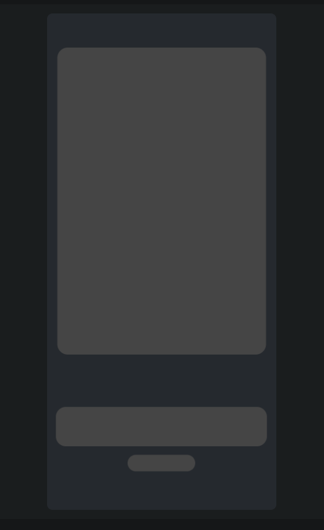


但是实际启动时，安卓设备边上会出现白边：

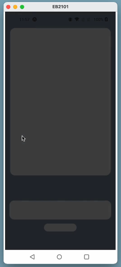

根据设备的解析，它可能不可见。为了解决这个问题，我们需要为启动画面设置 `backgroundColor`。背景颜色应用于未被初始图片覆盖的任何屏幕区域。

### 配置启动画面背景颜色

我们可以在 app.json 文件中配置启动屏幕的背景颜色。打开它并在 `"splash"` 中进行以下更改：

```json
{
    "splash": {
        "image": "./assets/splash.png",
        "resizeMode": "contain",
        "backgroundColor": "#25292e" 
    }
}

```

> 这里设置的背景颜色和启动屏幕图片的背景相匹配


### 应用图标

与启动屏幕图片类似，该图标是通过在 app.json 文件中定义 `"icon"` 属性的路径来配置的。它的当前值为 `"./assets/icon.png"`，因此我们无需更改任何内容。


## 项目打包

这里是关于eas部分的内容，我提前搞一下

安装`expo-dev-client`库：

```sh
npx expo install expo-dev-client
```


安装eas命令接口：

```sh
npm install -g eas-cli
```


登录expo账户（没有的话去[注册](https://expo.dev/signup)）：

```sh
eas login
```


初始化项目，将其链接到eas服务器：

```sh
eas init
```


为EAS构建配置项目：

```sh
eas build:configure
# 该命令执行完之后，就会有一个eas.json的配置文件
```


如果要创建`.apk`文件的话：

- 在`eas.json`中，确保`build.development`配置文件下的`developmentClient`设置为`true`

- 然后运行：
  ```sh
  # android作为平台，development作为构建配置文件
  eas build --platform android --profile development
  ```


如果直接运行：`eas build`的话，得到的是一个`.aab`文件，不能直接安装，需要借助第三方工具：

```sh
# 生成apks
java -jar bundletool-all-1.17.2.jar build-apks --bundle=./app.aab --output=app.apks --ks=./keystore.jks --ks-pass=pass:368937300c65b29d0e6e86a1df7cbdb7 --mode=universal --ks-key-alias=4c859292b2690dbf453e110a4e1cf025 --key-pass=pass:40c194da3841162d4cd4460d5dfe5ba0

# --ks: keystorePath
# --ks-pass: keystorePassword
# --ks-key-alias: keyAlias
# --key-pass: keyPassword


```


> 签名通过`eas credentials`获取

启动开发服务器：

```sh
npx expo start
```


# Demo


## 热榜

我希望可以开发一个能够实时查看各个平台热点的APP

