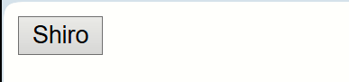
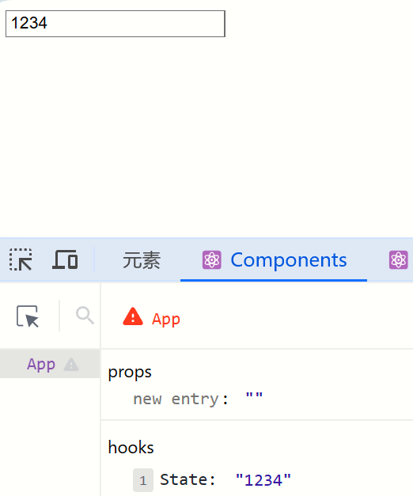

[TOC]


# 概述

## 什么是React

React是Meta公司（facebook）研发的，一个用于构建Web和原生交互界面的`库`

既可以开发Web，又可以开发App


## React的优势

相比于其他前端框架，React具有`丰富的生态`，以及`跨平台`支持


# 入门

## 环境搭建

使用`create-react-app`进行快速创建React的工具，底层由Webpack构建

执行命令：

```sh
npx create-react-app react-demo
# npx：Node.js工具命令，查找并执行后续的包命令
# create-react-app：核心包
# react-demo：项目名称，自定义
```

创建完项目之后，先把不需要的东西都删掉，`src`中仅保留`App.js`和`index.js`

下面是`index.js`：

```js
// index.js是项目的入口，从这里开始运行

// React必要的两个核心包
import React from 'react';
import ReactDOM from 'react-dom/client';

// 导入项目的根组件
import App from './App';

// 把App根组件渲染到 id=root 的dom节点上（该节点在/public/index.html中）
const root = ReactDOM.createRoot(document.getElementById('root'));
root.render(<App />);
```


下面是`App.js`：

```jsx
// App.js是 项目的根组件
// App -> index.js -> public/index.html
function App() {
  return (
    <div className="App">
      Halory
    </div>
  );
}

export default App;
```


[Other ways to create an React Project](https://zh-hans.react.dev/learn/start-a-new-react-project)


## JSX基础

### 什么是JSX

JSX是Javascript和XML的缩写，表示在`js代码中编写HTML模板结构`，它是React中编写UI模板的方式，比如下面：

```jsx
const message = 'this is message'
function App () {
    return (
        <div>
        	<h1>this is title</h1>
                 { message }
        </div>
    )
}
```

优势：

- HTML的声明式模板写法
- JS的可编程能力

JSX本质是`js语法扩展`，浏览器本身不能识别，需要通过`解析工具做解析（babel）`之后才能在浏览器中运行

下面这段代码：

```jsx
<div>
    this is a div
    <span>this is a span</span>
</div>
```

会被`babel`解析为如下：

```js
import { jsx as _jsx, jsxs as _jsxs } from "react/jsx-runtime";
/*#__PURE__*/_jsxs("div", {
    children: ["this is a div", /*#__PURE__*/_jsx("span", {
        children: "this is a span"
    })]
});
```


### 识别js表达式

在jsx中，通过花括号`{}`就可以识别Javascript中的表达式，可以理解为`{}`就是js的代码域

有四种常用用法：

- 使用引号传递字符串
- 使用Javascript变量
- 函数调用和方法调用
- 使用Javascript对象


举例：

```jsx
const count = 100
const getName = () => {
    return 'Halory'
}
function App() {
    return (
        <div className="App">
            {/* 1. 使用引号传递字符串 */}
            {'I am a string'}
            <br/>
            {/* 2. 使用Javascript变量 */}
            {'count: ' + count}
            <br/>
            {/* 3. 函数调用 */}
            {'我是 ' + getName() + ' sensei'}
            <br/>
            {/* 4. 方法调用 */}
            {'Today is ' + new Date().getDate() }
            <br/>
            {/* 5. 使用js对象 */}
            <div style={{color: 'red'}}>I am Red</div>
        </div>
    );
}

export default App;

```

效果图：


### 列表渲染

在JSX中可以使用原生js的`map`方法来遍历渲染列表

```jsx
const list = [
    { id: 1001, name: 'Java'},
    { id: 1002, name: 'Python'},
    { id: 1003, name: 'C++'}
]
function App() {
    return (
        <div className="App">
            {/* 渲染列表 */}
            <ul>
                {list.map(item => <li key={ item.id }>{ item.name }</li>)}
            </ul>
        </div>
    );
}

export default App;

```

效果图：


需要强调的是，使用map进行列表渲染的时，必须给标签的key绑定一个属性，该属性一般就是`id`，id可以为string或者number。该key可以提升react的性能


### 条件渲染

在react中，可以通过逻辑与运算符`&&`和三元运算符`?:`实现基础的条件渲染

```jsx
const isLogin = true
function App() {
    return (
        <div className="App">
            { isLogin && <span>this is a span</span>}
            <br/>
            { isLogin ? <span>welcome</span> : <span>loading</span>}
        </div>
    );
}

export default App;

```

效果：


### 复杂条件渲染

需求：列表中需要根据文章状态适配三种情况，单图、三图和无图三种模式


解决方案：`自定义函数` + `if判断语句`

```jsx
const articleType =1
// 定义函数，根据文章类型返回不同的JSX模板
function getArticleItem() {
    if(articleType === 0){
        return <div>无图模式</div>
    } else if (articleType === 1) {
        return <div>单图模式</div>
    } else {
        return <div>三图模式</div>
    }
}
function App() {
    return (
        <div className="App">
            { getArticleItem() }
        </div>
    );
}

export default App;

```


## 事件

### 绑定事件

语法：`on + 事件名称 = { 事件处理程序 }`，遵循驼峰命名

```jsx

function App() {
  const handleClick = () => {
    console.log('点击事件触发');
  }
  return (
    <div className="App">
      <button onClick={handleClick}>Touch me</button>
    </div>
  );
}

export default App;

```


### 使用事件对象参数

语法：在事件回调函数中设置形参`e`

```jsx
function App() {
  const handleClick = (e) => {
    // 打印事件对象
    console.log('点击事件触发', e);
  }
  return (
    <div className="App">
      <button onClick={handleClick}>Touch me</button>
    </div>
  );
}

export default App;
```


### 传递自定义参数

语法：事件绑定的位置改造成`箭头函数`，在执行处理函数的时候传递形参

```jsx

function App() {
  const handleClick = (name) => {
    console.log('点击事件触发', name);
  }
  return (
    <div className="App">
          { /* 箭头函数:	() => handleClick('Halory')    */}
      <button onClick={() => handleClick('Halory')}>Touch me</button>
    </div>
  );
}

export default App;

```


### 同时传递事件对象和自定义参数

语法：在事件绑定的位置传递事件实参`e`和自定义参数，注意`参数顺序`

```jsx

function App() {
  const handleClick = (name, e) => {
    // 打印事件对象
    console.log('点击事件触发', name, e);
  }
  return (
    <div className="App">
          {/* 传递事件对象 */}
      <button onClick={(e) => handleClick('Halory', e)}>Touch me</button>
    </div>
  );
}

export default App;

```


## useState

### 普通变量

useState是一个React Hook，它允许我们向组件添加一个`状态变量`，从而控制影响组件的渲染结果

状态变量的值一旦发生变化，视图UI也会跟着变化（响应式）

```jsx
const [count, setCount] = useState(10086)
/**
1. useState是一个函数，返回值是一个数组
2. 数组中的 第一个 参数是状态变量；第二个参数是用来修改状态变量的函数
3. useState的参数（10086）将作为count的初始值
*/
```

示例：

```jsx
// useState实现计数器按钮
import { useState } from "react";
function App() {
    // 1. 调用useState添加一个状态变量
    const [count, setCount] = useState(0)

    // 2. 点击事件的回调函数
    const handleClick = () => {
        /**
     * 该方法有两个过程：
     * 1. 用传入的新值修改count
     * 2. 重新使用新的count渲染UI（数据驱动视图的关键）
     */
        setCount(count + 1)
    }
    return (
        <div className="App">
            <button onClick={handleClick}>{count}</button>
        </div>
    );
}

export default App;

```


### 修改对象状态

规则：对于对象类型的状态变量，应该始终传给set方法一个`全新的对象`来进行修改

```jsx
import { useState } from "react";
function App() {
    // 1. 调用useState添加一个状态变量
    const [form, setForm] = useState({
        name: 'Halory',
        age: 18
    })

    // 2. 点击事件的回调函数
    const handleClick = () => {
        /** 
        ...form: 用来传递要修改的对象
        name: 需要修改的属性
        */
        setForm({
            ...form,
            name: 'Shiro'
        })
    }
    return (
        <div className="App">
            <button onClick={handleClick}>{form.name}</button>
        </div>
    );
}

export default App;

```




## 组件

### 基础使用

在React中，一个组件就是一个`首字母大写的函数`，内部存放了组件的逻辑和视图UI，渲染组件只需要`把组件当成标签`使用即可

```jsx
// 定义组件方式一
function Button () {
    console.log('我是业务逻辑');
    return <button>click me</button>
}

// 定义组件方式二
const Button = () => {
    console.log('我是业务逻辑');
    return <button>click me</button>
}

function App() {
    return (
        <div className="App">
            {/** 自闭和 */}
            <Button/>

            {/** 成对标签 */}
            <Button></Button>
        </div>
    );
}

export default App;

```


### 组件样式

React组件基础的样式控制有两种方式：行内样式、class类名控制

行内控制，不推荐：

```jsx
const style = {
    color: 'yellow',
    fontSize: '50px'
}
function App() {
    return (
        <div className="App">
            {/** 直接行内样式控制 */}
            <span style={{color: 'blue', fontSize: '50px'}}>this is btan</span><br/>

            {/** 通过对象传参 */}
            <span style={style}>this is ytan</span><br/>

            {/** 跟Vue不一样，属性名和变量名一样的话，React没有提供简写 */}
            {/* <span style>this is ytan</span> */}
        </div>
    );
}

export default App;

```


通过class类名控制，其中这里的类名必须用`className`属性进行传递：

```jsx
/**
index.css的内容如下: 
.r {
    color: red;
    font-size: 50px;
}
*/

import './index.css'
function App() {
  return (
    <div className="App">
      <span className="r">this is rtan</span>
    </div>
  );
}

export default App;

```


# 基础

## 表单受控绑定

使用React组件的状态`(useState)`控制表单的状态


步骤：

- 准备一个React状态值

```jsx
const [value, setValue] = useState('')
```

- 通过value属性绑定状态，通过`onChange`属性绑定状态同步的函数

```jsx
<input>
    type='text'
    value={value}
    onChange={(e) => setValue(e.target.value)}
</input>
```


示例：

```jsx
// 受控表单绑定
import { useState } from "react";

function App() {
    const [value, setValue] = useState("");
    return (
        <div>
            <input
                value={value}
                onChange={(e) => setValue(e.target.value)}
                type="text"
                ></input>
        </div>
    );
}

export default App;

```





## React中获取DOM

在React组件中国获取/操作DOM，需要使用`useRef`钩子函数，分为三步：

- 使用useRef创建ref对象

```jsx
const inputRef = useRef(null)
```

- 将ref对象跟JSX绑定

```jsx
<input type="text" ref={inputRef}></input>
```

- 在DOM可用时（渲染完毕之后可用），通过`inputRef.current`拿到DOM对象

```jsx
console.log(inputRef.current)
```


代码示例：

```jsx
// 获取DOM
import { useRef } from "react";

function App() {
    const inputRef = useRef(null);
    const showDOM = () => {
        // 查看DOM的属性
        console.dir(inputRef.current);
        
        // 获取属性值
        console.log(inputRef.current.value);
    };
    return (
        <div>
            <input type="text" ref={inputRef} />
            <button onClick={showDOM}>获取DOM</button>
        </div>
    );
}

export default App;

```


## 组件通信


### 父传子

实现步骤：

- 父组件传递数据：在子组件标签上`绑定属性`
- 子组件接收数据：子组件通过`props参数`接收数据

```jsx
/**
 * 父传子
 * 1. 父组件接收数据-在子组件标签身上绑定属性
 * 2. 子组件接收数据-props的参数
 */

function Son(props) {
    // props是一个对象，包含了父组件传递过来的所有数据
    console.log(props);
    // 获取其中名为name的键的值
    return <div>{props.name}</div>;
}
function App() {
    const name = "Jack";
    return (
        <div>
            {/* 绑定属性，这是父组件传给子组件的 */}
            <Son name={name} />
        </div>
    );
}

export default App;

```


### props说明

- props可传递任意的数据，包括数字、字符串、布尔值、数组、对象、函数、JSX
- props是`只读对象`，数据只能由父组件进行修改


### prop children

当我们把内容嵌套在子组件标签中时，父组件会自动在名为`children`的`prop`属性中接收该内容

```jsx
function Son(props) {
    console.log(props);
    // 通过props.children获取子组件的标签内部的东西
    return <div>magic time: {props.children}</div>;
}
function App() {
    const name = "Jack";
    return (
        <div>
            <Son name={name}>
                {/* 在子组件标签内部写点东西 */}
                <span>A span from Son tab inside</span>
            </Son>
        </div>
    );
}

export default App;

```


### 子传父

核心思路：在子组件中调用父组件中的函数并传递参数

```jsx
import { useState } from "react";

function Son({ onGetSonMsg }) {
    // Son组件中的数据
    const sonMsg = "this is a msg from son";
    return (
        <div>
            <button onClick={() => onGetSonMsg(sonMsg)}>sendMsg</button>
        </div>
    );
}
function App() {
    const [msg, setMsg] = useState("");
    const getMsg = (msg) => {
        console.log(msg);
        setMsg(msg);
    };
    return (
        <div>
            {msg}
            <Son onGetSonMsg={getMsg} />
        </div>
    );
}

export default App;

/**
子传父的逻辑复盘:
1. 父组件在子组件上绑定了一个属性(onGetSonMsg)，该属性的值是一个函数(getMsg)。
2. 子组件在创建时可以获取到该属性，并传递参数进去
3. 该函数执行后，就会做出相应的处理(getMsg)
*/
```


### 兄弟组件通信

实现思路：借助`状态提升`机制，通过父组件进行兄弟组件之间的数据传递

- A组件先通过子传父的方式把数据传给父组件App
- App拿到数据后通过父传子的方式再传递给B组件


```jsx
import { useState } from "react";

function A({ onGetAName }) {
    const name = "this is A";
    return (
        <div>
            <button onClick={() => onGetAName(name)}>A send</button>
        </div>
    );
}

function B({ name }) {
    return <div>this is B, and this is from App: {name}</div>;
}

function App() {
    const [name, setName] = useState("");
    const getAName = (name) => {
        console.log(name);
        setName(name);
    };
    return (
        <div>
            this is App
            <A onGetAName={getAName} />
            <B name={name} />
        </div>
    );
}

export default App;

```


效果图：


### 跨层组件通信

使用`context`机制跨层级组件通信：

- 使用`createContext`方法创建一个上下文对象ctx
- 在顶层组件中通过`ctx.Provider`组件提供数据（学过鸿蒙的看到这个Provider是真的眼熟）
- 在底层组件中通过`useContext`钩子函数获取消费数据


```jsx
import { createContext, useContext } from "react";

const MsgContext = createContext();

function A() {
    return (
        <div>
            this is A
            <B />
        </div>
    );
}

function B() {
    const msg = useContext(MsgContext);
    return <div>this is B, and this is from App: {msg}</div>;
}

function App() {
    const msg = "this is app msg";
    return (
        <div>
            <MsgContext.Provider value={msg}>
                this is App
                <A />
            </MsgContext.Provider>
        </div>
    );
}

export default App;

```


效果图：


## useEffect

### 基础使用

useEffect是一个React Hook函数，用于在React组件中创建不是由事件引起而是`由渲染本身引起的操作`，比如发送AJAX请求、更改DOM等。

即组件渲染完毕之后，可以通过useEffect进行一些操作，比如马上向后端发请求。

语法：

```jsx
useEffect(() => {}, [])
// 参数1是一个函数，叫做副作用函数，在函数内部可以放置要执行的操作
// 参数2是一个数组（可选），在数组里放置依赖项，不同依赖项会影响第一个参数函数的执行。当是一个空数组的时候，副作用函数只会在组件渲染完毕之后执行一次
```

现有一需求：在组件渲染完毕之后，立刻从服务端获取频道列表数据并显示到页面中

```sh
# 接口地址
http://geek.itheima.net/v1_0/channels
```

代码：

```jsx
import { useEffect, useState } from "react"

const url = "http://geek.itheima.net/v1_0/channels"

function App() {
    const [list, setList] = useState([])

    useEffect(() => {
        // 额外操作 获取频道列表
        async function getList() {
            const res = await fetch(url)
            const json = await res.json()
            setList(json.data.channels)
        }
        getList()
    })
    return (
        <div>
            <ul>
                {list.map((item) => (
                    <li key={item.id}>{item.name}</li>
                ))}
            </ul>
        </div>
    )
}

export default App
```


效果图：


### 依赖项参数说明

依赖项就是useEffect的第二个参数

- 没有依赖项：组件初始渲染 + `组件更新时执行`
- 空数组依赖：只在初始渲染时执行一次
- 添加特定依赖项：组件初始渲染 + `依赖项变化时执行`

```jsx
import { useEffect, useState } from "react";

function App() {
    const [count, setCount] = useState(0);
    const [b, setB] = useState(0);
    // 没有依赖项时: 初始执行 + 组件更新时执行
    // useEffect(() => {
    //   console.log("执行");
    // });

    // 依赖项为空数组时: 初始执行
    // useEffect(() => {
    //   console.log("执行");
    // }, []);

    // 依赖项为非空数组时: 初始执行 + 数组中的属性变化时执行
    useEffect(() => {
        console.log("执行");
    }, [b]);
    return (
        <div>
            <button onClick={() => setCount(count + 1)}>Click Count!</button>
            <button onClick={() => setB(b + 1)}>Click B!</button>
        </div>
    );
}

export default App;

```


### 清除副作用

在useEffect中编写的`由渲染本身引起的对接组件外部的操作`，社区也经常把它叫做`副作用操作`，比如在useEffect中开启了一个定时器，我们想在组件卸载时把这个定时器再清理掉，这个过程就是清理副作用

语法：

```jsx
useEffect(() => {
    // 实现副作用操作逻辑
    return () => {
        // 清除副作用逻辑
    }
}, [])
```

> 清除副作用的函数`最常见`的执行时期是在`组件卸载时自动执行`

需求：在Son组件渲染时开启一个定时器，卸载时清除这个定时器

```jsx
import { useEffect, useState } from "react"

function Son() {
    // 渲染时开启一个定时器
    useEffect(() => {
        const timer = setInterval(() => {
            console.log("定时器执行中......")
        }, 1000)

        return () => {
            // 清除副作用(组件卸载时)
            clearInterval(timer)
        }
    }, [])
    return <div>this is Son</div>
}

function App() {
    // 通过条件渲染模拟组件卸载
    const [show, setShow] = useState(true)
    return (
        <div>
            {show && <Son />}
            <button onClick={() => setShow(false)}>卸载Son组件</button>
        </div>
    )
}

export default App

```


### 自定义Hook函数

自定义Hook是以`use打头的函数`，通过自定义Hook函数可以用来实现`逻辑的封装和复用`

需求：通过点击`toggle`按钮，来实现`div`的显示和隐藏


封装Hook之前：

```jsx
import { useState } from "react";

// 当前的问题: 布尔切换的逻辑与当前组件耦合在一起，不能复用

function App() {
    const [show, setShow] = useState(true);
    const toggle = () => setShow(!show)
    return (
        <div>
            {show && <div>You can not see me</div>}
            <button onClick={toggle}>click and hide</button>
        </div>
    );
}

export default App;

```


封装Hook之后：

```jsx
import { useState } from "react";

// 自定义Hook，此时只要把返回值解构出来，就可以在任意地方使用
function useToggle() {
    // 可复用代码
    const [show, setShow] = useState(true);
    const toggle = () => setShow(!show);

    return {
        show,
        toggle,
    };
}

function App() {
    const { show, toggle } = useToggle();
    return (
        <div>
            {show && <div>You can not see me</div>}
            <button onClick={toggle}>click and hide</button>
        </div>
    );
}

export default App;

```


封装自定义hook通用思路：

- 声明一个以use打头的函数
- 在函数体内封装可复用的逻辑
- 把组件中用到的状态或者回调return出去（比如上面的show、toggle）
- 在哪个组件中要用到这个逻辑，就执行这个函数，把状态和回调解构出来进行使用


### ReactHooks使用规则

- 只能在组件中或者其他自定义Hook函数中调用
- 只能在组件的顶层调用，不能嵌套在if、for、其他函数中


```jsx
/**
错误示例
*/
import { useState } from "react";

// 不能在组件外的地方使用Hook函数
// useState('')

function App() {
    // Hook函数必须在组件顶层使用
    // if(Math.random() > 0.5){
    //   useState()
    // }
    return <div></div>;
}

export default App;

```


## Redux

Redux是React最常用的`集中状态管理工具`，类似于Pinia、Vuex，`可以独立于框架运行`


为了职责清晰，数据流向明确，Redux把整个数据修改的流程分成了`三个核心概念`：

- state：一个对象，存放着我们管理的数据状态
- action：一个对象，用来描述数据的修改规则
- reducer：一个函数，根据action的描述生成一个新的state


### 快速体验

使用纯Redux实现计数器，不跟React绑定

步骤：

- 定义一个`reducer`函数（根据当前想要做的修改返回一个新的状态）
- 使用`createStore`方法传入reducer函数，生成一个`store实例对象`
- 使用store实例的`subscribe方法`订阅数据的变化（数据一旦变化，可以得到通知）
- 使用store实例的`dispatch`方法提交`action对象`触发数据变化（告诉reducer怎么改数据）
- 使用store实例的`getState`方法获取最新的状态数据更新到视图中


### 环境搭建

在React中使用redux，官方要求安装俩个其他插件：`Redux Toolkit`和`react-redux`

- RTK：官方推荐编写Redux逻辑的方式，是一套工具的集合集，简化书写方式
  - 简化store的配置方式
  - 内置immer，支持可变式状态修改
  - 内置thunk，更好的异步创建
- react-redux：用来链接`Redux`和`React组件`的`中间件`


安装：

```sh
npm i @reduxjs/toolkit react-redux
```


学了redux以后，src目录下就需要创建一个`store`目录，专门用来管理各个组件的数据状态


### 计数器实现

#### 配置store

在`src/store/modules/`下创建一个`counterStore`，用于存放计数器相关状态数据和函数

```js
import { createSlice } from "@reduxjs/toolkit";

const counterStore = createSlice({
    name: "counter",
    // 初始化state
    initialState: {
        count: 0,
    },
    // 修改状态的方法
    reducers: {
        add(state) {
            state.count++;
        },
        sub(state) {
            state.count--;
        },
    },
});

// 解构出来actionCreater函数
const { add, sub } = counterStore.actions;

// 获取reducer
const reducer = counterStore.reducer;

// 以按需导出的方式导出actionCreater
export { add, sub };

// 以默认导出的方式导出reducer
export default reducer;

```


然后在`src/store`下创建一个`index.js`，用于管理各个store

```js
import { configureStore } from "@reduxjs/toolkit";
// 导入子模块reducer
import counterStore from "./modules/counterStore";

const store = configureStore({
    reducer: {
        counter: counterStore,
    },
});

export default store;
```


#### 注入store

react-redux负责把Redux和React链接起来，内置`Provider`组件通过store参数把创建好的store实例注入到应用中，链接正式建立。

注入操作在`src/index.js`中进行

```jsx
import { createRoot } from "react-dom/client";
import App from "./App";
import store from "./store";
import { Provider } from "react-redux";
import React from "react";

const root = createRoot(document.querySelector("#root"));

root.render(
    <React.StrictMode>
        {/* 注入store */}
        <Provider store={store}>
            <App />
        </Provider>
    </React.StrictMode>
);

```


#### 使用store数据

在React组件中使用store中的数据，需要用到一个钩子函数：`useSelector`，它的作用是`把store中的数据映射到组件中`

```jsx
import { useSelector } from "react-redux";

function App() {
    const { count } = useSelector((state) => state.counter);
    return <div className="App">{count}</div>;
}

export default App;

```


#### 修改store数据

React组件中修改store中的数据需要借助另外一个hook函数：`useDispatch`，它的作用是`生成提交action对象的disPatch函数`

```jsx
import { useDispatch, useSelector } from "react-redux";
// 导入actionCreater
import { sub, add } from "./store/modules/counterStore";

function App() {
    const { count } = useSelector((state) => state.counter);
    const dispatch = useDispatch();
    return (
        <div className="App">
            <button onClick={() => dispatch(sub())}>-</button>
            {count}
            <button onClick={() => dispatch(add())}>+</button>
        </div>
    );
}

export default App;

```


### action传参

在reducers的同步修改方法中添加`action对象参数`，在调用`actionCreater`的时候传递参数，参数会被传递到action对象的`payload`属性上

样例：

```jsx
// 定义带参数的action
reducers: {
    addToNum (state, action){
        state.count = action.payload
    }
}

// 调用action时传递参数
<button onClick={() => dispatch(addToNum(20))}>add to 20</button>
```


### 异步状态操作

步骤：

- 创建store，并配置好同步修改状态的方法
- 单独封装一个函数，在函数内部return一个新函数，在新函数中
  - 封装异步请求获取数据
  - 调用同步`actionCreater`传入异步数据生成一个action对象，并使用dispatch提交
- 组件中dispatch的写法保持不变

`channelStore.js`：

```jsx
import { createSlice } from "@reduxjs/toolkit";
import axios from "axios";

const channelStore = createSlice({
    name: "channel",
    initialState: {
        channelList: [],
    },
    reducers: {
        setChannels(state, action) {
            state.channelList = action.payload;
        },
    },
});

const { setChannels } = channelStore.actions;

// 异步请求
const fetchChannelList = () => {
    return async (dispatch) => {
        const res = await axios.get("http://geek.itheima.net/v1_0/channels");
        dispatch(setChannels(res.data.data.channels));
    };
};

export { fetchChannelList };
const reducer = channelStore.reducer;

export default reducer;

```


`/modules/index.js`：

```jsx
import { configureStore } from "@reduxjs/toolkit";
// 导入子模块reducer
import channelReducer from "./modules/channelStore";

const store = configureStore({
    reducer: {
        channel: channelReducer,
    },
});

export default store;

```


`App.js`：

```jsx
import { useDispatch, useSelector } from "react-redux";
// 导入actionCreater
import { fetchChannelList } from "./store/modules/channelStore";
import { useEffect } from "react";

function App() {
    const { channelList } = useSelector((state) => state.channel);
    const dispatch = useDispatch();

    // 使用useEffect触发异步请求
    useEffect(() => {
        dispatch(fetchChannelList());
    }, [dispatch]);
    return (
        <div className="App">
            <ul>
                {channelList.map((item) => (
                    <li key={item.id}>{item.name}</li>
                ))}
            </ul>
        </div>
    );
}

export default App;

```


## ReactRouter

### 概述


采用CRA方式创建项目：

```sh
npx create-react-app react-router-demo
npm i

# 安装最新的ReactRouter包
npm i react-router-dom

npm start
```


```jsx
import ReactDOM from "react-dom/client";
import { createBrowserRouter, RouterProvider } from "react-router-dom";

// 1. 创建router实例对象并配置路由
const router = createBrowserRouter([
    {
        path: "/login",
        element: <div>Login</div>,
    },
    {
        path: "/index",
        element: <div>index</div>,
    },
]);

const root = ReactDOM.createRoot(document.getElementById("root"));
root.render(
    <React.StrictMode>
        {/** 2. 路由绑定 */}
        <RouterProvider router={router}></RouterProvider>
    </React.StrictMode>
);


```


路由效果：


### 配置router

创建`src/page`目录，下面专门放页面


例如`Article/index.js`

```jsx
const Article = () => {
    return <div>I am Article</div>;
};

export default Article;

```


然后创建`src/router/index.js`文件，这里配置所有页面的路由

```jsx
import Login from "../page/Login";
import Article from "../page/Article";
import { createBrowserRouter } from "react-router-dom";

const router = createBrowserRouter([
    {
        path: "/login",
        element: <Login />,
    },
    {
        path: "/article",
        element: <Article />,
    },
]);

export default router;

```


接着去`src/index.js`中注入路由

```jsx
import React from "react";
import ReactDOM from "react-dom/client";
import "./index.css";
import reportWebVitals from "./reportWebVitals";
import { RouterProvider } from "react-router-dom";
import router from "./router";

const root = ReactDOM.createRoot(document.getElementById("root"));
root.render(
    <React.StrictMode>
        <RouterProvider router={router}></RouterProvider>
    </React.StrictMode>
);

reportWebVitals();

```


### 路由导航

路由系统中的多个路由之间需要进行`路由跳转`，并且在跳转的同时有可能需要`传递参数进行通信`

有两种方式：

- 声明式导航：通过`<Link/>`组件描述出要跳转到哪里去，比如后台管理系统的左侧菜单通常使用这种方式

```jsx
import { Link } from "react-router-dom";
const Login = () => {
    return (
        <div>
            I am Login
            <Link to="/article">跳转到文章页</Link>
        </div>
    );
};

export default Login;

/**
to: 用来指定要跳转的路由path，组件会被渲染为浏览器支持的a链接，如果需要传参直接通过字符串拼接的方式拼接参数即可
*/
```


- 编程式导航：通过`useNavigate`钩子得到导航方法，然后通过`调用方法以命令式的形式`进行路由跳转，比如想在登录请求完毕之后跳转就可以选择这种方式，更加灵活

```jsx
import { useNavigate } from "react-router-dom";
const Login = () => {
    const navigate = useNavigate();
    return (
        <div>
            I am Login
            <button onClick={() => navigate("/article")}>去文章页面</button>
        </div>
    );
};

export default Login;

// 通过调用navigate方法传入地址path实现跳转
```


### 路由导航传参

有两种传参方式：

- 查询字符串

```jsx
// 跳转时传参
navigate('/article?id=1001')

// 获取参数值
const [params] = useSearchParams()
let id = params.get('id')
```

完整示例：

```jsx
// 源路由
import { useNavigate } from "react-router-dom";
const Login = () => {
    const navigate = useNavigate();
    return (
        <div>
            I am Login
            <button onClick={() => navigate("/article?id=1001")}>去文章页面</button>
        </div>
    );
};

export default Login;


// 目标路由
import { useSearchParams } from "react-router-dom";

const Article = () => {
    const [params] = useSearchParams();
    const id = params.get("id");
    return <div>I am Article, Hello {id}</div>;
};

export default Article;

```


跳转效果：


- 路径传参：相比于查询字符串，路径传参还需要去router配置中给路径添加一个占位符

```jsx
// 跳转时传参，这里也可以传递多个参数
navigate('/article/1001/halory')

// 获取参数
const params = useParams()
let id = params.id
let name = params.name

// 去router给路径添加占位符
path: "/article/:id/:name"
```


### 嵌套路由

在一级路由中又内嵌了其他路由，这种关系就叫做嵌套路由，嵌套至一级路由内的路由又称为`二级路由`，例如：


实现步骤：

- 使用`children`属性配置路由嵌套关系
- 使用`<Outlet/>`组件配置二级路由渲染位置


配置路由：

```jsx
import { createBrowserRouter } from "react-router-dom";
import Layout from "../page/Layout";
import Board from "../page/Board";
import About from "../page/About";

const router = createBrowserRouter([
    {
        path: "/",
        element: <Layout />,
        // 二级路由
        children: [
            {
                path: "board",
                element: <Board />,
            },
            {
                path: "about",
                element: <About />,
            },
        ],
    }
]);

export default router;

```


显示路由出口：

```jsx
import { Link, Outlet } from "react-router-dom";

const Layout = () => {
    return (
        <div>
            I am Layout
            <Link to="/board">Board</Link>
            <Link to="/about">About</Link>
            {/** 配置二级路由的出口 */}
            <Outlet />
        </div>
    );
};

export default Layout;

```

效果：


### 默认二级路由

当访问一级路由时，默认的二级路由可以得到渲染，比如预约系统一进去就显示课表。

只需要在二级路由的位置去掉`path`，设置`index为true`

```jsx
children: [
    {
        // 将面板设置为默认二级路由
        index: true,
        element: <Board />,
    },
    {
        path: "about",
        element: <About />,
    }
],
```


然后在`Layout`组件中，记得修改下面板的路由导航

```jsx
import { Link, Outlet } from "react-router-dom";

const Layout = () => {
    return (
        <div>
            I am Layout
            {/* /board => /  */}
            <Link to="/">Board</Link>
            <Link to="/about">About</Link>
            {/** 配置二级路由的出口 */}
            <Outlet />
        </div>
    );
};

export default Layout;
```


此时访问根路径的时候，自动就会将面板给展示出来：


### 404路由配置

当浏览器输入url的路径在整个路由配置中都找不到对于的path，为了用户体验，可以使用404兜底组件进行渲染

实现步骤：

- 准备一个`NotFound`组件
- 在路由表数组的末尾，以`*`作为路由path配置路由

```jsx
// NotFound
const NotFound = () => {
    return <div>Not Found</div>
}

export default NotFound


// 路由配置，需要配置到最后一个路由
{
    path: '*',
    element: <NotFound/>
}
```


### 路由模式

有两种路由模式：`history`模式和`hash`模式，分别由`createBrowerRouter`和`createHashRouter`函数负责


# 拓展

## zustand

zustand是一个极简的状态管理工具，可以用于替代redux

```sh
npm i zustand
```


### 示例

下面是一个示例代码，利用zustand实现计数功能：

```jsx
import { create } from 'zustand'

// 创建store
const useStore = create((set) => {
    return {
        // 状态变量
        count: 0,
        
        // 修改状态变量的函数
        inc: () => {
            // 基于原数据进行修改（需要传入state）
            set((state) => ({
                count: state.count + 1
            }))
            
            // 直接修改
            set({ count: 100 })
        }
    }
})


// 将store绑定到组件上
function App () {
    const { count, inc } = useStore()
    return (
    <button onClick={inc}>{ count }</button>
    )
}
```


### 异步支持

可以直接在store里面编写异步函数：

```jsx
import { create } from 'zustand'

// 创建store
const useStore = create((set) => {
    return {
        // 状态变量
        info: {}
        id: {}
        
        // 获取用户信息
        fetchInfo: async () => {
            const res = await fetchInfoApi(id)
            set({
                info: res.data.data
            })
        }
    }
})


```


### 切片模式

我们可以在一个文件里面写多个store，最后将这些store组合导出：

```jsx
import { create } from 'zustand'

// 创建用户切片
const createUserStore = (set) => {
    return {
        ...
    }
}
    
    
// 创建班级切片
const createClassStore = (set) => {
    return {
        ...
    }
}
    

// 组合切片
const useStore = create((...a) => ({
    ...createUserStore(...a),
    ...createClassStore(...a)
}))


// 组件使用
function App () {
    // 解构获取
    const { count, inc } = useStore()
    return (
    <button onClick={inc}>{ count }</button>
    )
}
```


> 实际项目中，肯定会创建一个store文件夹，然后下面很多的xxxStore子文件，然后还有一个index.jsx作为root文件


# 案例

## B站评论

### 渲染评论列表

思路：

- 使用useState维护评论列表的数据
- 使用`map`方法对列表数据进行遍历渲染


### 评论删除

思路：

- 删除显示-条件渲染
- 删除功能：拿到当前项的id，以id为条件对评论列表做filter过滤


### 点击高亮

思路：

- 点击谁就把谁的type（独一无二的标识）记录下来，然后和遍历时的每一项的type做匹配，谁匹配到就设置负责高亮的类名


### 排序功能

思路：

- 把`评论列表状态数据进行不同的排序处理`，当成新值传给set函数重新渲染视图UI

新玩具：`loadsh`库，类似于后端的`hutool`


### classnames优化类名控制

classnames是一个简单的js库，可以非常方便的通过条件动态控制class类名的显示

主要是提高了可读性

使用前：

```jsx
className={`nav-item ${type === item.type && 'active'}`}
```

使用后：

```jsx
className={classNames('nav-item', {active: type === item.type})}
// nav-item为静态类名
// active为动态类名
```


### 发布评论

核心思路：

- 获取评论内容
- 点击发布按钮发布评论


### id处理和时间处理

思路：

- rpid要求一个随机数id，`npm install uuid`
- ctime要求以当前时间为标准，生成固定格式，`npm install dayjs`


### 清空内容并重新聚焦

思路：

- 清空内容：把控制input框的value设置为空串
- 重新聚焦：拿到input的dom元素，调用focus方法


### 优化需求

- 使用请求接口的方式获取评论列表并渲染
  - 使用`json-server`工具模拟接口服务，通过`axios`发送接口请求
  - 使用useEffect调用接口获取数据
  - 安装json-server：`npm install json-server`


- 使用自定义Hook函数封装数据请求的逻辑

```jsx
// 封装请求数据的Hook
function useGetList() {
    const [commentList, setCommentList] = useState([]);

    useEffect(() => {
        // 请求数据
        async function getList() {
            const res = await axios.get("http://localhost:3004/list");
            setCommentList(res.data);
        }
        getList();
    }, []);
    return {
        commentList,
        setCommentList,
    };
}
```


- 把评论中的每一项抽象成一个独立的组件实现渲染

抽象原则：App作为“智能组件”负责数据的获取，Item作为“UI组件”负责数据的渲染


## 美团案例

### 环境准备

- 克隆项目：`git clone http://git.itcast.cn/heimaqianduan/redux-meituan.git`
- 安装所有依赖：`npm i`
- 启动mock服务（内置了json-server）：`npm run serve`
- 启动前端服务：`npm start`


### 分类和菜品列表渲染

核心步骤：

- 启动项目（mock服务、前端服务）
- 使用RTK编写store
- 组件触发action并且渲染数据


## 记账本

### 环境搭建

需要如下库：

- Redux状态管理：`@reduxjs/toolkit`、`react-redux`
- 路由：`react-router-dom`
- 时间处理：`dayjs`
- class类名处理：`classnames`
- 移动端组件库：`antd-mobile`
- 请求插件：`axios`

```sh
npx create-react-app bill

cd bill

npm i @reduxjs/toolkit react-redux react-router-dom dayjs classnames antd-mobile axios
```


### 别名路径配置

- 路径解析配置（webpack），把`@/`解析为`src/`
  - CRA本身把webpack配置包装到了黑盒里无法直接修改，需要借助一个插件`craco`

配置步骤：

```sh
# 1. 安装craco
npm i -D @craco/craco

# 2. 项目根目录下创建配置文件
touch craco.config.js

# 3. 配置文件中添加路径解析配置
const path = require("path");

module.exports = {
  # webpack配置
  webpack: {
    alias: {
      "@": path.resolve(__dirname, "src"),
    },
  },
};


# 4. 包文件中配置启动和打包命令
"scripts": {
    # "start": "react-scripts start",
    "start": "craco start",
    # "build": "react-scripts build",
    "build": "craco build",
    "test": "react-scripts test",
    "eject": "react-scripts eject"
  }
```


- 路径联想配置（vsCode），VsCode在输入`@/`时，自动联想出对于的`src/`下的子级目录

配置步骤如下：

```sh
# 1. 根目录下新增配置文件
touch jsconfig.json

# 2. 添加路径提示配置
{
    "compilerOptions": {
        "baseUrl": "./",
        "paths": {
            "@/*": [
                "src/*"
            ]
        }
    }
}
```


### 数据Mock实现

在前后端分离的开发模式下，前端可以在没有实际后端接口的支持下先进行接口数据的模拟，进行正常的业务功能开发

常见的Mock方式：

- 前端直接写假数据：纯静态，没有服务
- 自研Mock平台：成本太高
- json-server等工具：有服务，成本低

我们采用json-server。

json-server是一个node包，可以在不到30秒内获得零编码的完整的Mock服务

实现步骤：

```sh
# 1. 项目中安装json-server
npm i -D json-server

# 2. 准备一个json文件，里面是假数据
{
	...
}

# 3. 添加启动命令，在package.json的srcipts中
"server": "json-server ./server/data.json --port 8888"

# 4. 访问接口进行测试
npm run server
```


### 整体路由设计

两个一级路由：

- Layout
- New

两个二级路由：

- Layout/mouth
- Layout/year


`@/router/index.js`

```jsx
// 创建路由实例，绑定path、element
import Layout from "@/page/Layout";
import Month from "@/page/Month";
import New from "@/page/New";
import Year from "@/page/Year";
import { createBrowserRouter } from "react-router-dom";

const router = createBrowserRouter([
    {
        path: "/",
        element: <Layout />,
        children: [
            {
                path: "month",
                element: <Month />,
            },
            {
                path: "year",
                element: <Year />,
            },
        ],
    },
    {
        path: "/new",
        element: <New />,
    },
]);

export default router;

```


`/index.js`

```jsx
import React from "react";
import ReactDOM from "react-dom/client";
import "./index.css";
import { RouterProvider } from "react-router-dom";
import router from "./router";

const root = ReactDOM.createRoot(document.getElementById("root"));
// 路由注入
root.render(<RouterProvider router={router} />);

```


`Layout/index.js`，配置二级路由出口

```jsx
import { Outlet } from "react-router-dom";

const Layout = () => {
    return (
        <div>
            I am Layout
            <Outlet />
        </div>
    );
};

export default Layout;

```


### antD-mobile主题定制

定制方案：

- 全局定制
- 局部定制


步骤：

```sh
# 1. 先在src目录下创建一个theme.css文件
touch theme.css

# 2. 在theme.css中定制样式
/* :root:root {
    --adm-color-primary: #a062d4;
} */

.puple {
    --adm-color-primary: #a062d4;
}

# 3. 将theme.css注入到入口文件(@/index.js)
// 导入定制主题
import "./theme.css";
```

下面是测试代码：

```jsx
import { Button } from "antd-mobile";
import { Outlet } from "react-router-dom";

const Layout = () => {
    return (
        <div>
            I am Layout
            <Outlet />
            <Button color="primary">全局测试</Button>
            <div className="puple">
                <Button color="primary">测试局部</Button>
            </div>
        </div>
    );
};

export default Layout;
// 默认的primary为蓝色
```

测试结果：


### Redux管理账目列表


## 可视化

### 环境搭建

```sh
npx create-react-app jike

cd jike

npm i @reduxjs/toolkit react-redux react-router-dom axios 

npm i sass -D

npm install antd --save

npm install @ant-design/icons
```


配置路由：

```sh
npm i react-router-dom

touch /src/router/index.js

# 引入路由组件
import Layout from "@/pages/Layout";
import Login from "@/pages/Login";

# 配置路由
import { createBrowserRouter } from "react-router-dom";

# 配置路由实例
const router = createBrowserRouter([
  {
    path: "/",
    element: <Layout />,
  },
  {
    path: "/login",
    element: <Login />,
  },
]);

export default router;


vim index.js

# 进入项目入口index.js
import React from "react";
import ReactDOM from "react-dom/client";
import { RouterProvider } from "react-router-dom";
import router from "./router";
const root = ReactDOM.createRoot(document.getElementById("root"));
root.render(<RouterProvider router={router}></RouterProvider>);
```


创建路径别名和路径联想提示：

```sh
npm i @craco/craco -D

touch craco.config.js
# 扩展Webpack
const path = require('path')

const resolve = dir => path.resolve(__dirname, dir)
# 别名配置
module.exports = {
    webpack: {
        alias: {
            '@': resolve('src'),
        },
    },
}


touch jsconfig.json
vim jsconfig.json
{
    "compilerOptions": {
        "baseUrl": ".",
        "paths": {
            "@/*": [
                "src/*"
            ]
        }
    }
}
```


### 登录

#### 静态结构

现成的静态结构和样式：

```jsx
import logo from "@/assets/logo.jpg";
import "./index.scss";
const { Card, Form, Input, Button } = require("antd");

const Login = () => {
    return (
        <div className="login">
            <Card className="login-container">
                
                <Form>
                    <Form.Item>
                        <Input size="large" placeholder="请输入用户名" />
                    </Form.Item>
                    <Form.Item>
                        <Input size="large" placeholder="请输入验证码" />
                    </Form.Item>
                    <Form.Item>
                        <Button type="primary" htmlType="submit" size="large" block>
                            登录
                        </Button>
                    </Form.Item>
                </Form>
            </Card>
        </div>
    );
};

export default Login;

```


```scss
.login {
    width: 100%;
    height: 100%;
    position: absolute;
    left: 0;
    top: 0;
    background: center/cover url('~@/assets/login.jpg');

    .login-logo {
        width: 200px;
        height: 60px;
        display: block;
        margin: 0 auto 20px;
    }

    .login-container {
        width: 440px;
        height: 360px;
        position: absolute;
        left: 50%;
        top: 50%;
        transform: translate(-50%, -50%);
        box-shadow: 0 0 50px rgb(0 0 0 / 10%);

    }
    .login-checkbox-label {
        color: #1890ff;
    }
}
```


#### 表单校验

非空校验：

```jsx
// 可以在Form.Item的属性中增加校验规则
<Form.Item
    name="mobile"
    rules={[
        {
            required: true,
            message: "Please input your phone number!",
        },
    ]}
    >
    <Input size="large" placeholder="请输入手机号" />
</Form.Item>
```


正则校验：

```jsx
{
    pattern: /^1[3-9]\d{9}$/,
    message: "Please input phone number with true formation",
},
```


失焦时校验：

```jsx
{/* {失焦时校验} */}
<Form validateTrigger="onBlur">
```


#### 获取表单数据

将一个回调函数绑定在`<Form>`的`onFinish`属性上：

```jsx
// 提交表单时，Form会给出values
const onFinish = (values) => {
    console.log(values);
};


<Form onFinish={onFinish} validateTrigger="onBlur"></Form>

// 表单的属性名，由Form.Item的name属性决定
```


#### 封装request请求模块

封装的原因：

- 几乎所有接口都是一样的接口域名
- 几乎所有的接口都需要设置一样的超时时间
- 几乎所有的接口都需要做Token权限处理


在`utils/request.js`下：

```jsx
// axios 封装处理
import axios from "axios";

// 根域名、超时时间
const request = axios.create({
    baseURL: "http://geek.itheima.net/v1_0",
    timeout: 5000,
});

// 拦截器
// 添加请求拦截器
axios.interceptors.request.use(
    function (config) {
        // 在发送请求之前做些什么
        return config;
    },
    function (error) {
        // 对请求错误做些什么
        return Promise.reject(error);
    }
);

// 添加响应拦截器
axios.interceptors.response.use(
    function (response) {
        // 2xx 范围内的状态码都会触发该函数。
        // 对响应数据做点什么
        return response;
    },
    function (error) {
        // 超出 2xx 范围的状态码都会触发该函数。
        // 对响应错误做点什么
        return Promise.reject(error);
    }
);

export { request };

```


在`utils/index.js`下：

```js
// 统一中转工具模块函数
// import { request } from '@/utils'
import { request } from "./request";

export { request };

```


#### 使用Redux管理Token

- 在Redux中编写获取Token的异步获取和同步修改
- Login组件负责提交action并且把表单数据传递过来


在`store/modules/user.js`下：

```js
// 和用户相关的状态管理
import { createSlice } from "@reduxjs/toolkit";
import { request } from "utils";

const userStore = createSlice({
    name: "user",
    initialState: {
        token: "",
    },
    // 同步修改方法
    reducers: {
        setToken(state, action) {
            state.token = action.payload;
        },
    },
});

// 解构出actionCreater
const { setToken } = userStore.actions;

// 获取reducer函数
const userReducer = userStore.reducer;

// 异步方法
const fetchLogin = (loginForm) => {
    return async (dispatch) => {
        const res = await request.post("/authorizations", loginForm);
        dispatch(setToken(res.data.token));
    };
};

export { setToken, fetchLogin };

export default userReducer;

```


在`store/index.js`下：

```jsx
// 组合redux子模块 + 导出store实例
import { configureStore } from "@reduxjs/toolkit";
import userReducer from "./modules/user";

export default configureStore({
    reducer: {
        user: userReducer,
    },
});

```


在`@/index.js`下：

```jsx
import React from "react";
import ReactDOM from "react-dom/client";
import { RouterProvider } from "react-router-dom";
import router from "./router";

// 注入store
import { Provider } from "react-redux";
import store from "store";
const root = ReactDOM.createRoot(document.getElementById("root"));
root.render(
    <Provider store={store}>
        <RouterProvider router={router}></RouterProvider>
    </Provider>
);

```


在`Login/index.js`下，处理登录逻辑：

```jsx
const dispatch = useDispatch();
const navigate = useNavigate();
const onFinish = async (values) => {
    console.log(values);
    // 触发action，这里使用await，是要确保登录成功再跳转，只有dispatch才可以提交action
    await dispatch(fetchLogin(values));
    // 跳转到首页
    navigate("/");
    // 提示用户登录成功
    message.success("登录成功");
};
```


#### Token持久化

Redux是基于浏览器内存的存储方式，刷新时状态恢复为初始值。

实现持久化：

- 获取并存Token：Redux + LocalStorage
- 初始化Token：`LocalStorage ? LocalStore : 空字符串`

去`store/modlues/user.js`下进行修改：

```jsx
const userStore = createSlice({
    name: "user",
    initialState: {
        // 每次页面刷新的时候，先从本地取，如果本地都没有的话，那么token初始化为空
        token: localStorage.getItem("token") || "",
    },
    // 同步修改方法
    reducers: {
        setToken(state, action) {
            state.token = action.payload;
            // LocalStorage也存一份
            localStorage.setItem("token", action.payload);
        },
    },
});
```


#### 封装Token方法

将token的存取删三个方法用`token.js`封装起来，放在`utils`目录下：

```jsx
// 封装和token相关的方法 存 取 删
const TOKEN = "token";

const setToken = (value) => {
    localStorage.setItem(TOKEN, value);
};

const getToken = () => {
    return localStorage.getItem(TOKEN);
};

const rmToken = () => {
    localStorage.removeItem(TOKEN);
};

export { getToken, setToken, rmToken };

```


修改`store/modules/user.js`：

```jsx
// 使用utils/token.js的方法
const userStore = createSlice({
    name: "user",
    initialState: {
        // 每次页面刷新的时候，先从本地取，如果本地都没有的话，那么token初始化为空
        token: getToken() || "",
    },
    // 同步修改方法
    reducers: {
        setToken(state, action) {
            state.token = action.payload;
            // LocalStorage也存一份
            _setToken(action.payload);
        },
    },
});
```


#### axios拦截器注入token

token作为用户的一个标识数据，后端很多接口都会以它作为接口权限判断的依据；请求拦截器注入token后，所有用到axios实例的接口请求都自动携带了token

在`utils/request.js`修改：

```jsx
axios.interceptors.request.use(
    function (config) {
        // 在发送请求之前做些什么
        // 1. 获取token数据
        // 2. 按照后端的格式要求做token拼接
        const token = getToken();
        if (token) {
            // 如果成功获取到token，则放入请求头
            config.headers.Authorization = `Bearer ${token}`;
        }
        return config;
    },
    function (error) {
        // 对请求错误做些什么
        return Promise.reject(error);
    }
);
```


#### 路由权限控制

没有有效的Token，登录不做跳转。

技术方案：


封装高阶组件，在`components/AuthRoute.js`下：

```jsx
// 封装高阶组件
// 核心逻辑：有Token跳转，无Token拦截到登录界面

import { getToken } from "@/utils";
import { Navigate } from "react-router-dom";

export default function AuthRoute({ children }) {
    const token = getToken();
    if (token) {
        return <>{children}</>;
    } else {
        // 强制重定向到/login
        return <Navigate to={"/login"} replace />;
    }
}

```


配置路由，在`router/index.js`下：

```jsx
{
    path: "/",
    element: (
      <AuthRoute>
        <Layout />
      </AuthRoute>
    ),
  },
```


### Layout

#### 静态结构

引入`normalize.css`，用于去除默认样式

```sh
npm install normalize.css

# 安装ant的图标包
npm i @ant-design/icons
```


基础架子（`/Layout/index.js`）：

```jsx
import { Layout, Menu, Popconfirm } from 'antd'
import {
    HomeOutlined,
    DiffOutlined,
    EditOutlined,
    LogoutOutlined,
} from '@ant-design/icons'
import './index.scss'

const { Header, Sider } = Layout

const items = [
    {
        label: '首页',
        key: '1',
        icon: <HomeOutlined />,
    },
    {
        label: '文章管理',
        key: '2',
        icon: <DiffOutlined />,
    },
    {
        label: '创建文章',
        key: '3',
        icon: <EditOutlined />,
    },
]

const GeekLayout = () => {
    return (
        <Layout>
            <Header className='header'>
                <div className='logo' />
                <div className='user-info'>
                    <span className='user-name'>Halory</span>
                    <span className='user-logout'>
                        <Popconfirm
                            title='是否确认退出？'
                            okText='退出'
                            cancelText='取消'
                            >
                            <LogoutOutlined />
                            退出
                        </Popconfirm>
                    </span>
                </div>
            </Header>
            <Layout>
                <Sider
                    width={200}
                    className='site-layout-background'
                    >
                    <Menu
                        mode='inline'
                        theme='dark'
                        defaultSelectedKeys={['1']}
                        items={items}
                        style={{ height: '100%', borderRight: 0 }}
                        ></Menu>
                </Sider>
                <Layout
                    className='layout-content'
                    style={{ padding: 20 }}
                    >
                    内容
                </Layout>
            </Layout>
        </Layout>
    )
}

export default GeekLayout

```


架子的样式（`Layout/index.scss`）：

```scss
.ant-layout {
    height: 100%;
}

.header {
    padding: 0;
}

.logo {
    width: 200px;
    height: 80px;
    background: url('~@/assets/logo.png') no-repeat center / 120px auto;
}

.layout-content {
    overflow-y: auto;
}

.user-info {
    position: absolute;
    right: 0;
    top: 0;
    padding-right: 20px;
    color: #fff;

    .user-name {
        margin-right: 20px;
    }

    .user-logout {
        display: inline-block;
        cursor: pointer;
    }
}

.ant-layout-header {
    padding: 0 !important;
}
```


全局样式，使内容撑满屏幕（`/src/index.scss`）：

```scss
html,body {
    margin: 0;
    height: 100%;
}

#root {
    height: 100%;
}
```


#### 配置二级路由

路由结构图如下：


我们需要再：

- 准备三个二级路由组件：`<Home>`、`<Article>`、`<Publish>`
- 在router中通过children配置项进行配置

```jsx
 {
    path: '/',
    element: (
      <AuthRoute>
        <Layout />
      </AuthRoute>
    ),
    children: [
      {
        // 设置为默认二级路由
        index: true,
        // path: 'home',
        element: <Home />,
      },
      {
        path: 'article',
        element: <Article />,
      },
      {
        path: 'publish',
        element: <Publish />,
      },
    ],
  }
```


- Layout组件中配置二级路由出口：将`内容`替换为`<Outlet>`


#### 路由跳转

点击左侧菜单可以跳转到对应的路由：


思路：

- 左侧菜单要和路由形成`一一对应的关系`
- 点击时要拿到`路由路径`调用`路由方法跳转`

步骤：

- 菜单参数Item中key属性换成路由的路径地址

```jsx
const items = [
    {
        label: '首页',
        key: '/',
        icon: <HomeOutlined />,
    },
    {
        label: '文章管理',
        key: '/article',
        icon: <DiffOutlined />,
    },
    {
        label: '创建文章',
        key: '/publish',
        icon: <EditOutlined />,
    },
]
```


- 点击菜单时通过key获取路由地址跳转

```jsx
// 点击处理函数，这里的参数Menu被点击之后就会传过来
const onMenuClick = router => {
    const path = router.key
    navigate(path)
}

// 给menu绑定点击事件
<Menu
    mode='inline'
    theme='dark'
    defaultSelectedKeys={['1']}
    onClick={onMenuClick}
    items={items}
    style={{ height: '100%', borderRight: 0 }}
    >
</Menu>
```


#### 高亮菜单

根据当前的路由高亮菜单

思路：

- 获取当前url上的路径（`useLocation()`）

```jsx
// react自带的钩子函数，用于获取路径信息
const location = useLocation()

// 获取到的路径名
const selectedKey = location.pathname
```

- 找到菜单组件负责高亮的属性，绑定当前的路由路径

```jsx
// 将selectedKeys的属性值跟selectedKey变量进行绑定
<Menu
    mode='inline'
    theme='dark'
    selectedKeys={selectedKey}
    onClick={onMenuClick}
    items={items}
    style={{ height: '100%', borderRight: 0 }}
    >
</Menu>
```

> 之所以可以进行高亮，是因为我们已经给`<Menu>`组件传入了`items`，其中的每一项都带有`key`，而`selectedKeys`可以和当前的`key`进行比较，如果相同的话则高亮显示。


#### 存储个人信息

将个人信息交给redux管理

```jsx
// 在user.js的reducers中增加: 
setUserInfo(state, action) {
    state.userInfo = action.payload
}

// 创建异步方法
// 获取个人用户信息
const fetchUserInfo = () => {
    return async dispatch => {
        const res = request.get('/user/profile')
        dispatch(setUserInfo(res.data))
    }
}


// 在Layout中调用
const dispatch = useDispatch()
useEffect(() => {
    dispatch(fetchUserInfo())
}, [dispatch])

// 获取用户名
const name = useSelector(state => state.user.userInfo.name)

// 替换原本写死的用户名
<span className='user-name'>{name}</span>
```


#### 退出登录

用户点击退出登录时，需要再给一个警告框。

确定要退出后，就需要将redux的token、userInfo，还有本地的信息都清除掉，并且要强制跳转到登录界面：

```jsx
// 在user.js中的reducers添加处理函数:
clearUserInfo(state) {
    state.token = ''
    state.userInfo = {}
    rmToken()
}

// 在Layout中创建函数
// 退出登录
const onConfirm = () => {
    dispatch(clearUserInfo())
    navigate('/login')
}

// 跟组件绑定
<Popconfirm
    title='是否确认退出？'
    okText='退出'
    cancelText='取消'
    onConfirm={onConfirm}
    >
    <LogoutOutlined />
    退出
</Popconfirm>
```


#### 处理Token失效

如果前端从后端收到401的响应结果，则说明token已经失效

失效的话，就需要清除原来的token，并且跳转到登录页：

```jsx
// 导入router
import router from '@/router'

// 在响应拦截器中处理
axios.interceptors.response.use(
    function (response) {
        // 2xx 范围内的状态码都会触发该函数。
        // 对响应数据做点什么
        return response
    },
    function (error) {
        // 超出 2xx 范围的状态码都会触发该函数。
        // 对响应错误做点什么
        if (error.response.status === 401) {
            rmToken()
            router.navigate('/login')
            // 重新加载页面
            window.location.reload()
        }

        return Promise.reject(error)
    }
)
```


### Echarts

#### 基础

安装Echarts：

```sh
npm i echarts
```

基础柱状图的使用：

```jsx
import * as echarts from 'echarts'
import { useEffect, useRef } from 'react'

const Home = () => {
    const charRef = useRef(null)
    // 为保证dom可以，使用useEffect进行渲染
    useEffect(() => {
        // 获取渲染图表的dom节点
        // const chartDom = document.getElementById('main')  原生

        // 使用react获取dom
        const chartDom = charRef.current

        // 图表初始化，生成图表实例对象
        const myChart = echarts.init(chartDom)
        // 准备图表参数
        const option = {
            xAxis: {
                type: 'category',
                data: ['Kotlin', 'Java', 'Python'],
            },
            yAxis: {
                type: 'value',
            },
            series: [
                {
                    data: [120, 200, 150],
                    type: 'bar',
                },
            ],
        }

        // 使用图表参数，完成图表渲染
        option && myChart.setOption(option)
    })
    return (
        <div>
            <div
                ref={charRef}
                style={{ width: '500px', height: '400px' }}
                ></div>
        </div>
    )
}

export default Home

```


#### 组件封装

组件封装的思想：

- 保持功能代码不变，抽象成组件
- 替换可变的部分，变成prop参数


在`component/BarChart.js`中：

```jsx
// 抽象出组件

import * as echarts from 'echarts'
import { useEffect, useRef } from 'react'

// 柱状图，设置prop参数
const BarChart = ({ title, x, y }) => {
    const charRef = useRef(null)
    // 为保证dom可以，使用useEffect进行渲染
    useEffect(() => {
        // 获取渲染图表的dom节点
        // const chartDom = document.getElementById('main')  原生

        // 使用react获取dom
        const chartDom = charRef.current

        // 图表初始化，生成图表实例对象
        const myChart = echarts.init(chartDom)
        // 准备图表参数
        const option = {
            title: {
                text: title,
            },
            xAxis: {
                type: 'category',
                data: x,
            },
            yAxis: {
                type: 'value',
            },
            series: [
                {
                    data: y,
                    type: 'bar',
                },
            ],
        }

        // 使用图表参数，完成图表渲染
        option && myChart.setOption(option)
    })
    return (
        <div>
            <div
                ref={charRef}
                style={{ width: '500px', height: '400px' }}
                ></div>
        </div>
    )
}

export default BarChart

```


调用组件：

```jsx
import BarChart from './components/BarChart'

const Home = () => {
    return (
        <div>
            <BarChart
                title={'我就会这个了'}
                x={['Python', 'Java', 'Kotlin']}
                y={[100, 200, 150]}
                />
            <BarChart
                title={'你又不会这个'}
                x={['Python', 'Java', 'Kotlin']}
                y={[100, 200, 150]}
                />
        </div>
    )
}

export default Home

```


效果图：


#### API封装

将api请求统一封装到一个文件夹`api`中

比如之前写的user相关API，就可以封装在`api/user.jsx`下：

```jsx
import { request } from "utils";
// 用户相关的所有请求


// 登录请求
export function loginAPI(formData) {
    return request({
        url: '/authorizations',
        method: 'POST',
        data: formData
    })
}


// 获取用户信息
export function getProfileAPI() {
    return request({
        url: '/user/profile',
        method: 'GET'
    })
}
```

然后在`store/modules/user.js`下修改异步函数：

```jsx
import { loginAPI, getProfileAPI } from 'api/user'


// 登录请求
const fetchLogin = loginForm => {
    return async dispatch => {
        const res = await loginAPI(loginForm)
        console.log(res)

        dispatch(setToken(res.data.data.token))
    }
}

// 获取个人用户信息
const fetchUserInfo = () => {
    return async dispatch => {
        const res = getProfileAPI()
        dispatch(setUserInfo(res.data))
    }
}
```


### 文章发布

#### 创建基础结构

需要用到以下组件：

- 面包屑导航组件：Breadcrumb
- 表单组件：Form
- 输入框组件：Input
- 下拉框组件：Select-Option
- 按钮组件：Button


修改文件`Publish/index.js`：

```jsx
import { Card, Breadcrumb, Form, Button, Input, Space, Select } from 'antd'
import { Link } from 'react-router-dom'
import './index.scss'

const { Option } = Select

const Publish = () => {
    return (
        <div className='publish'>
            <Card
                title={
                    <Breadcrumb
                        items={[
                            { title: <Link to={'/'}>首页</Link> },
                            { title: '发布文章' },
                        ]}
                        />
                }
                >
                <Form
                    labelCol={{ span: 4 }}
                    wrapperCol={{ span: 16 }}
                    initialValues={{ type: 1 }}
                    >
                    <Form.Item
                        label='标题'
                        name='title'
                        rules={[{ required: true, message: '请输入文章标题' }]}
                        >
                        <Input
                            placeholder='请输入文章标题'
                            style={{ width: 400 }}
                            />
                    </Form.Item>
                    <Form.Item
                        label='频道'
                        name='channel_id'
                        rules={[{ required: true, message: '请选择文章频道' }]}
                        >
                        <Select
                            placeholder='请选择文章频道'
                            style={{ width: 400 }}
                            >
                            <Option value={0}>推荐</Option>
                        </Select>
                    </Form.Item>
                    <Form.Item
                        label='内容'
                        name='content'
                        rules={[{ required: true, message: '请输入文章内容' }]}
                        ></Form.Item>

                    <Form.Item wrapperCol={{ offset: 4 }}>
                        <Space>
                            <Button
                                size='large'
                                type='primary'
                                htmlType='submit'
                                >
                                发布文章
                            </Button>
                        </Space>
                    </Form.Item>
                </Form>
            </Card>
        </div>
    )
}

export default Publish

```

样式：

```scss
.publish {
    position: relative;
}

.ant-upload-list {
    .ant-upload-list-picture-card-container,
    .ant-upload-select {
        width: 146px;
        height: 146px;
    }
}

.publish-quill {
    .ql-editor {
        min-height: 300px;
    }
}

```


效果：


#### 准备富文本编辑器

步骤：

- 安装`reac-quill`，命令为：`npm install react-quill --save`
- 导入编辑器组件和配套样式文件
- 渲染编辑器组件
- 调整编辑器组件样式


```jsx
// 导入组件和配套的样式
import ReactQuill from 'react-quill'
import 'react-quill/dist/quill.snow.css'


// 在合适的位置使用组件
{/* 富文本编辑器 */}
<ReactQuill
    className='publish-quill'
    theme='snow'
    placeholder='写点东西吧'
    />
// theme: 内置的主题
// className: 我们自己取的类名
```


踩坑：有些时候用npm装包会报错，如果出现了下面的错误提示，那么增加些参数就可以了：


可以将npm命令修改为：

```sh
npm i xxx --force
# 或者
npm i xxx --legacy-peer-deps
```


#### 频道数据获取渲染

步骤：

- 根据接口文档在APIS模块中封装接口函数

```jsx
// api/article.jsx
// 封装文章相关的接口函数
import { request } from "utils";


/**
 * 获取频道列表
 * @returns 
 */
export function getChannelAPI() {
    return request({
        url: '/channels',
        method: 'GET'
    })
}
```


- 使用`useState`维护数据

```jsx
// /pages/Publish/index.jsx

const [channelList, setChannelList] = useState([])

// 好久没用了，利用useState解构出数据及其修改的函数
```


- 在`useEffect`中调用接口获取数据并存入state

```jsx
// /pages/Publish/index.jsx
useEffect(() => {
    // 创建函数
    const getChannelList = async () => {
        const res = await getChannelAPI()
        console.log(res)
        setChannelList(res.data.data.channels)
    }
    // 执行函数
    getChannelList()
}, [])

// 空数组代表仅执行一次
```


- 绑定数据到下拉框组件

```jsx
// /pages/Publish/index.jsx

// 使用map遍历渲染组件
{channelList.map(item => (
    <Option
        key={item.id}
        value={item.id}
        >
        {item.name}
    </Option>
))}

// value: 跟id进行绑定，将会选中时会将value值收集起来传给后端
```

效果图：


#### 收集表单数据提交表单

步骤：

- 使用Form组件收集表单数据

```jsx
// 给Form表单绑定提交时的回调函数: onFinish
<Form
    labelCol={{ span: 4 }}
    wrapperCol={{ span: 16 }}
    initialValues={{ type: 1 }}
    onFinish={onFinish}
    >
```


- 按照接口文档封装接口函数

```jsx
/**
 * 新增文章
 * @param {*} data 
 * @returns 
 */
export function createArticlelAPI(data) {
    return request({
        url: '/mp/articles?draft=false',
        method: 'POST',
        data: data
    })
}
```


- 按照接口文档处理表单数据

```jsx
// pages/Publish/index.js

// 提交表单
const onFinish = values => {
    // 从收集的表单中解构数据
    const { title, content, channel_id } = values
    // 数据处理
    const articleData = {
        title: title,
        content: content,
        cover: {
            type: 0,
            images: [],
        },
        channel_id: channel_id,
    }
    // 调用接口提交
    createArticlelAPI(articleData)
}
```


- 提交接口并验证是否成功


#### 上传文章封面

步骤：

- 准备样式结构：

```jsx
// 放到@/pages/Publish/index.jsx中合适的位置

<Form.Item label='封面'>
    <Form.Item name='type'>
        <Radio.Group>
            <Radio value={1}>单图</Radio>
            <Radio value={3}>三图</Radio>
            <Radio value={0}>无图</Radio>
        </Radio.Group>
    </Form.Item>
    {/* 
            listType: 决定选择文件框的外观样式 
            showUploadList: 控制显示上传列表
            */}
    <Upload
        listType='picture-card'
        showUploadList
        >
        <div style={{ marginTop: 8 }}>
            <PlusOutlined />
        </div>
    </Upload>
</Form.Item>
```


- 绑定action和回调函数

```jsx

const [imgList, setImgList] = useState([])
const onChange = value => {
    setImgList(value.fileList)
}

/* 
listType: 决定选择文件框的外观样式 
showUploadList: 控制显示上传列表
action: 指定图片上传的接口
*/

<Upload
    listType='picture-card'
    showUploadList
    action={'http://geek.itheima.net/v1_0/upload'}
    name='image'
    onChange={onChange}
    >
    
    
```


#### 实现切换封面类型

只有选择单图或者三图模式才会显示出上传组件

步骤：

- 获取选中的模式

```jsx
// 切换封面类型
const [imageType, setImageType] = useState(0)
const onTypeChange = e => {
    setImageType(e.value)
}

```


- 进行逻辑判断渲染组件：

```jsx
{imageType > 0 && (
    <Upload
        listType='picture-card'
        showUploadList
        action={'http://geek.itheima.net/v1_0/upload'}
        name='image'
        onChange={onChange}
        >
        <div style={{ marginTop: 8 }}>
            <PlusOutlined />
        </div>
    </Upload>
)}
```


#### 控制图片的上传数量

步骤：

- 找到限制上传数量的组件属性

- 使用imageType进行绑定控制

```jsx
// maxCount可以控制图片上传的数量

<Upload
    listType='picture-card'
    showUploadList
    action={'http://geek.itheima.net/v1_0/upload'}
    name='image'
    onChange={onChange}
    maxCount={imageType}
    >

```


### 文章列表

#### hooks

有一些业务逻辑是可以重复使用的，这类代码就可以专门放在一个`hooks`文件夹下：

```jsx
// @/hooks/useChannel.jsx

import { useState, useEffect } from "react"
import { getChannelAPI } from "api/article"

function useChannel() {
    const [channelList, setChannelList] = useState([])

    // 获取列表数据
    useEffect(() => {
        const getChannelList = async () => {
            const res = await getChannelAPI()
            console.log(res)
            setChannelList(res.data.data.channels)
        }
        getChannelList()
    }, [])

    return {
        channelList
    }
}

export {useChannel}
```


获取数据：

```jsx
import { useChannel } from 'hooks/useChannel'
const channelList = useChannel()
```


#### GET传参

```jsx
export function getArticlesAPI(params) {
    return request({
        url: '/mp/articles',
        method: 'get',
        params
    })
}
```


#### 分页展示

步骤：

- 实现分页展示（页数 = 总数 / 每页条数）
- 点击分页拿到当前点击的页数
- 使用页数作为请求参数重新获取文章列表渲染

使用antd的`Table`组件


#### 数据回显

需要使用到`useSearchParams()`的hook

```jsx
// navigate跳转回来后，该hook会获取到参数
const [searchParams] = useSearchParams()
const id = searchParams.get('id')
```

然后在antd中的`Form`组件中提供了一个`useForm()`，可以用于获取实例，并进行渲染

```jsx
// 获取实例
const [form] = Form.useForm()
// 发送请求并获取响应
const res = getAPI(id)
// 将结果回填
form.setFieldsValue(res.data)
```


#### 图片回显

图片一般不能直接回显

通过设置antd的`Upload`组件中的`fileList`属性，就实现图片回显了

```
const data = ['http://1.jpg', 'http://2.jpg']

<Upload fileList={data}>
```


### 项目打包

#### 基础打包

打包命令：

```sh
npm run build
```

> 打包指的是在项目中的源代码和资源文件进行处理，生成可在生产环境中运行的静态文件的过程


本地预览：

```sh
# 安装本地服务包
npm i -g serve

serve -s ./build

# 访问
http://localhost:3000/
```

> 本地预览指在本地通过静态服务器模拟生产服务器运行项目的过程


#### 配置路由懒加载

路由懒加载是指路由的JS资源只有在被访问时才会动态获取，目的是为了`优化项目首次打开的时间`


配置过程如下：

- 把路由修改为由React提供的`lazy`函数进行动态导入
- 使用React内置的Suspense组件包裹路由中element选项对应的组件

```jsx
// 路由配置
import Layout from '@/pages/Layout'
import Login from '@/pages/Login'

// 配置路由
import { createBrowserRouter } from 'react-router-dom'
import AuthRoute from '@/components/AuthRoute'
// import Home from 'pages/Home'
// import Article from 'pages/Article'
// import Publish from 'pages/Publish/inded'

import { lazy, Suspense } from 'react'

const Home = lazy(() => import('pages/Home'))
const Article = lazy(() => import('pages/Article'))
const Publish = lazy(() => import('pages/Publish'))

// 配置路由实例
const router = createBrowserRouter([
    {
        path: '/',
        element: (
            <AuthRoute>
                <Layout />
            </AuthRoute>
        ),
        children: [
            {
                index: true,
                // path: 'home',
                element: (
                    <Suspense fallback={'加载中'}>
                        <Home />
                    </Suspense>
                ),
            },
            {
                path: 'article',
                element: (
                    <Suspense fallback={'加载中'}>
                        <Article />
                    </Suspense>
                ),
            },
            {
                path: 'publish',
                element: (
                    <Suspense fallback={'加载中'}>
                        <Publish />
                    </Suspense>
                ),
            },
        ],
    },
    {
        path: '/login',
        element: <Login />,
    },
])

export default router

```


#### 包体积分析

通过可视化的方式，直观地体现项目中各种文件打包之后的体积大小，方便做优化

```sh
# 安装插件
npm i source-map-explorer
```

配置命令：

```js
/*
analyze: 自定义命令
build/static/js/*.js: 需要分析的文件
*/
{
    "Srcipts": [
        "analyze": "source-map-explorer build/static/js/*.js"
    ]
}
```

执行命令：

```sh
npm run analyze
```


#### CDN

CDN是一种内容分发网络服务，当用户请求网站内容时，由`离用户最近的服务器`将`缓存`的资源内容传递给用户

一般体积较大的`非业务js文件`可以放到CDN服务器上，比如react、react-dom：

- 体积较大，需要利用CDN文件在浏览器的缓存特性，加快加载时间
- 非业务js代码，不需要经常做变动，CDN不用频繁更新缓存

步骤：

- 把需要做CDN缓存的文件排除在打包之外
- 以CDN的方式重新引入资源

修改`craco.config.js`文件：

```jsx
// 扩展webpack的配置

const path = require('path')
// 引入辅助函数
const { whenProd, getPlugin, pluginByName } = require('@craco/craco')

module.exports = {
    // webpack 配置
    webpack: {
        // 配置别名
        alias: {
            // 约定：使用 @ 表示 src 文件所在路径
            '@': path.resolve(__dirname, 'src')
        },
        // 配置CDN
        configure: (webpackConfig) => {
            let cdn = {
                js: []
            }
            whenProd(() => {
                // key: 不参与打包的包(由dependencies依赖项中的key决定)
                // value: cdn文件中 挂载于全局的变量名称 为了替换之前在开发环境下
                webpackConfig.externals = {
                    react: 'React',
                    'react-dom': 'ReactDOM'
                }
                // 配置现成的cdn资源地址
                // 实际开发的时候 用公司自己花钱买的cdn服务器
                cdn = {
                    js: [
                        'https://cdnjs.cloudflare.com/ajax/libs/react/18.1.0/umd/react.production.min.js',
                        'https://cdnjs.cloudflare.com/ajax/libs/react-dom/18.1.0/umd/react-dom.production.min.js',
                    ]
                }
            })
            // 通过 htmlWebpackPlugin插件 在public/index.html注入cdn资源url
            const { isFound, match } = getPlugin(
                webpackConfig,
                pluginByName('HtmlWebpackPlugin')
            )

            if (isFound) {
                // 找到了HtmlWebpackPlugin的插件
                match.userOptions.cdn = cdn
            }
            return webpackConfig
        }
    },
}
```

配置完CDN之后，还需要动态插入url

在`public/index.html`中修改：

```html
<!DOCTYPE html>
<html lang="en">

<head>
  <meta charset="utf-8" />
  <link rel="icon" href="%PUBLIC_URL%/favicon.ico" />
  <meta name="viewport" content="width=device-width, initial-scale=1" />
  <meta name="theme-color" content="#000000" />
  <meta name="description" content="Web site created using create-react-app" />
  <link rel="apple-touch-icon" href="%PUBLIC_URL%/logo192.png" />
  <!--
      manifest.json provides metadata used when your web app is installed on a
      user's mobile device or desktop. See https://developers.google.com/web/fundamentals/web-app-manifest/
    -->
  <link rel="manifest" href="%PUBLIC_URL%/manifest.json" />
  <!--
      Notice the use of %PUBLIC_URL% in the tags above.
      It will be replaced with the URL of the `public` folder during the build.
      Only files inside the `public` folder can be referenced from the HTML.

      Unlike "/favicon.ico" or "favicon.ico", "%PUBLIC_URL%/favicon.ico" will
      work correctly both with client-side routing and a non-root public URL.
      Learn how to configure a non-root public URL by running `npm run build`.
    -->
  <title>React App</title>
</head>


<body>
  <noscript>You need to enable JavaScript to run this app.</noscript>
  <div id="root"></div>
  <!-- 动态插入cdn资源url -->
  <% htmlWebpackPlugin.options.cdn.js.forEach(cdnURL=> { %>
    <script src="<%= cdnURL %>"></script>
    <% }) %>
</body>

</html>
```


# 问题

## 跨域问题

```js
// 在src目录下创建setupProxy.js文件
const { createProxyMiddleware } = require('http-proxy-middleware')
module.exports = function (app) {
    app.use(
        '/api',
        createProxyMiddleware({
            target: 'http://xx.xx.xx.xx:4399/api', //代理的地址
            changeOrigin: true,
            pathRewrite: {
                '^/api': '', // 将请求路径中的 "/api" 替换为 ""
            },
        })
    )
}

```


## 携带token

封装axios的时候，在创建的时候添加headers

```js
// 根域名、超时时间
const request = axios.create({
    baseURL: '/api',
    timeout: 5000,
    headers: {
        Authorization: getToken() || '',
    },
})
```


# Hooks

本节内容是对于React常用的hooks，以及自定义Hook的介绍。

## useState

`useState`是一个状态管理的`hook`，用于实现修改状态变量值的同时更新视图。最简单的示例就是利用其做一个计数器。

```jsx
import { useState } from 'react'

export default function UserStateDemo() {
    const [count, setCount] = useState(0)
    const handleAdd = () => {
        setCount(count + 1)
        console.log(count)
    }
    return (
        <div>
            <p>{count}</p>
            <button onClick={handleAdd}>Add Count</button>
        </div>
    )
}
```


从这个计数器功能中，我们可以发现，`count`并不是在`setCount()`函数执行完之后就发生变化的，而是在整个触发的函数`handleAdd()`执行完毕之后才会更新。证据就是：每次打印的`count`值始终比视图的值小`1`：


这种直接用新的值修改状态变量是我之前经常使用的方法，因为我并不知道（也许是忘记了）`setXxx()`函数的第一个参数可以传递回调，该回调的第一个参数即`oldValue`：

```jsx
const handleAdd = () => {
    // prev是Count修改之前的值
    setCount(prev => 2 * (prev + 1))
    console.log(count)
}
```


## useEffect

`useEffect`是一个副作用函数，是页面组件渲染完成后首先执行的函数，它可以判断出某些状态变量是否发生了变化，如果变化了，则重新执行函数中的内容。

```jsx
import { useEffect, useState } from 'react'
export const UseEffectDemo = () => {
    const [data, setData] = useState([])
    const [showHalory, setShowHalory] = useState(false)
    useEffect(() => {
        fetch('https://jsonplaceholder.typicode.com/posts')
            .then(rep => rep.json())
            .then(json => setData(json))
    }, [])

    useEffect(() => {
        console.log('Halory')
    })
    return (
        <div>
            <button onClick={() => setShowHalory(prev => !prev)}> toggle </button>
            <h1> Posts </h1>
            <ul>
                {data.map((obj, idx) => (
                    <li key={idx}>{obj.title}</li>
                ))}
            </ul>
        </div>
    )
}
```

`useEffect()`如果不给第二个参数，那么页面中的任意一个状态变量发生变化，则都会再次执行一遍回调函数，比如当前例子中的`console.log('Halory')`；如果第二个参数传递的是一个空数组，那么该副作用函数只会在组件渲染后执行唯一的一次。


如果`useEffect()`的第二个参数传递的是一个非空数组，那么当且仅当数组中的变量（依赖项）发生变化时，副作用函数才会重新执行：

```jsx
useEffect(() => {
    console.log('Halory')
}, [showHalory])
```


## useContext

`useContext()`主要用来进行状态传递，它是React自带的一个`store`，和`Redux`、`zustand`属于同一类。现在我们聊聊在使用第三方的`store`之前，React应该如何进行状态传递。

```jsx
import { createContext, useContext, useState } from 'react'
// 1. 创建上下文
const GlobalStateContext = createContext(null)

export const UseContextDemo = () => {
    const [isToggle, setIsToggle] = useState(false)
    return (
        // 2. 利用上下文的Provider将组件包裹，并且通过value属性向内传递变量和函数
        <GlobalStateContext.Provider value={{ isToggle, setIsToggle }}>
            <div>
                <h1>Parent Component</h1>
                <ChildToggle />
                <ChildDisplay />
            </div>
        </GlobalStateContext.Provider>
    )
}

const ChildToggle = () => {
    // 3. 使用useContext从指定的上下文中解构出变量或函数
    const { setIsToggle } = useContext(GlobalStateContext)
    return (
        <div>
            <button onClick={() => setIsToggle(prev => !prev)}>Toggle State</button>
        </div>
    )
}

const ChildDisplay = () => {
     // 3. 使用useContext从指定的上下文中解构出变量或函数
    const { isToggle } = useContext(GlobalStateContext)
    return (
        <div>
            <p>Current State: {isToggle ? 'On' : 'Off'}</p>
        </div>
    )
}
```


`useContext()`的思路与第三方状态变量仓库是一样的：

1. 创建一个仓库
2. 给组件提供一个可以使用仓库内状态变量或修改状态变量方法的环境
3. 组件从仓库中获取（解构）需要的状态变量和修改状态变量的方法。使用。


## useReducer

`useReducer()`也是一个状态管理工具，和`useState()`相比，`useReducer()`可以管理更多的变量，并且可以进行更加复杂的修改操作。当页面中需要管理的状态比较多时，`useReducer()`不失为一种比较好的解决方案。

```jsx
import { useReducer } from 'react'
// 3. 定义reducer函数，第一个参数为状态变量，第二个参数为dispatch函数中传入的对象
// 该函数用来更新state的值
const reducer = (state, action) => {
    switch (action.type) {
        case 'plus':
            return { count: state.count + 1 }
        case 'minus':
            return { count: state.count - 1 }
        case 'double':
            return { count: state.count * 2 }
        default:
            console.log('No Action')
    }
}

export const UseReducerDemo = () => {
    // 1. 创建状态变量和状态处理函数（state，dispatch）
    // 2. 指明回调函数（reducer），并将state初始化（{ count: 0 }）
    const [state, dispatch] = useReducer(reducer, { count: 0 })
    return (
        <div>
            <p>Count: {state.count}</p>
            <button onClick={() => dispatch({ type: 'plus' })}>+</button>
            <button onClick={() => dispatch({ type: 'minus' })}>-</button>
            <button onClick={() => dispatch({ type: 'double' })}>*</button>
        </div>
    )
}
```


第一次使用`Redux`的时候，我记得经常用`useReducer()`来管理状态变量，不过当时用得很懵。还是`zustand`好用些。


## useRef

`useRef()`我之前是一直用来跟`<input>`标签进行绑定，然后获取其属性值的。但是它其实还有另外一个用处，就是可以**记录视图更新之前，状态变量的值**。

```jsx
import { useEffect, useRef, useState } from 'react'

export const UseRefDemo = () => {
    const [count, setCount] = useState(0)
    const prevCount = useRef(0)

    useEffect(() => {
        prevCount.current = count
    }, [count])

    return (
        <div>
            <p>Current Count: {count}</p>
            <p>Previous Count: {prevCount.current}</p>
            <button onClick={() => setCount(prev => (prev + 1) * 2)}>
                Add Count
            </button>
        </div>
    )
}

```


`useRef()`之所以可以做到保留上一次状态变量的值，是因为视图不会由于`ref`的改变而改变，而`ref`值的改变也不会影响其余的组件。


