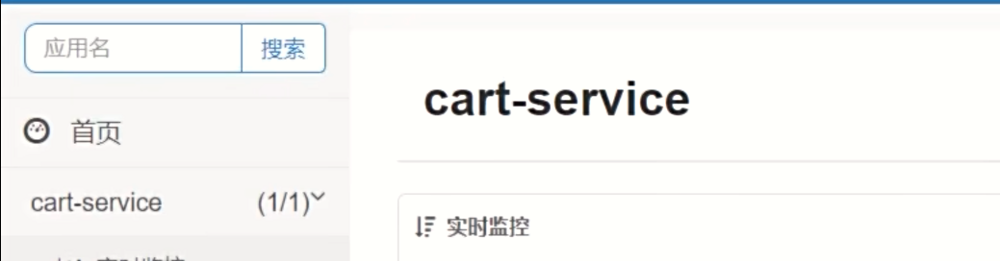

# 微服务基础

## 准备

### 导入黑马商城

#### 安装MySQL

```bash
docker run -d \
--name mysql \
-p 3306:3306 \
-e TZ=Asia/Shanghai \
-e MYSQL_ROOT_PASSWORD=200414 \
-v /root/mysql/data:/var/lib/mysql \
-v /root/mysql/conf:/etc/mysql/conf.d \
-v /root/mysql/init:/docker-entrypoint-initdb.d \
--network hm-net \
mysql
```

[nginx路径](D:\program\code_file\java\project\hmall-nginx)


## 认识微服务

### 单体架构

单体架构：将业务的所有功能集中在一个项目中开发，打包成jar包部署

缺点:

- 团队协作成本高
- 系统发布效率低
- 系统可用性差

### 微服务架构

微服务架构: 将单体架构中的功能模块拆分成多个独立项目


### SpringCloud

SpringCloud是一个`微服务框架`，集成了各种微服务功能组件，并基于SpringBoot实现了这些组件的自动装配，从而提供了良好的开箱即用体验


### 微服务拆分

主要是五大模块: 用户模块、商品模块、购物车模块、订单模块和支付模块

`服务拆分原则`:

- 什么时候拆分:
  - 创业型项目: 先采用单体架构，快速开发，快速试错。随着规模扩大，逐渐拆分
  - 确定的大型项目: 资金充足，目标明确，可以直接选择微服务架构，避免后续拆分的麻烦


- 怎么拆分:

  - 高内聚: 每个微服务的职责要尽量单一，包含的业务相互关联度高、完整度高

  - 低耦合: 每个微服务的功能要相对独立，尽量减少对其他微服务的依赖


- 拆分方式: 
  - `纵向拆分`: 按照业务模块来拆分
  - `横向拆分`: 抽取公共服务，提高复用性


- 工程结构:
  - 独立的Project，即每一个服务都是一个单独的项目
  - Maven聚合，一个父工程，多个子工程。


## 远程调用

服务拆分之后，不同服务之间的数据是隔离的，但是有些服务需要用到另外一个服务的数据，这该如何获取呢？`我们可以通过发送请求来实现`，之前都是前端在发送请求，然后拿到数据。我们后端也可以发送请求给后端，然后获取到数据。


### RestTemplate

这是Spring提供的HTTP请求发送的工具

`注册`: 

```java
@Bean
public RestTemplate restTemplate() {
    return new RestTemplate();
}
```

`发起远程调用`:

```java
    private void handleCartItems(List<CartVO> vos) {
        // 1.获取商品id
        Set<Long> itemIds = vos.stream().map(CartVO::getItemId).collect(Collectors.toSet());
        // 2.查询商品

        // 利用RestTemplate发送HTTP请求，得到响应体
        ResponseEntity<List<ItemDTO>> response = restTemplate.exchange(
                "http://localhost:8081/items?ids={ids}",	// 请求路径
                HttpMethod.GET,		// 请求方法
                null,			// 请求体，可以为空
                new ParameterizedTypeReference<List<ItemDTO>>() {},	// 返回值类型
                Map.of("ids", CollUtils.join(itemIds, ","))	// 请求参数
        );

        // 解析响应
        if(!response.getStatusCode().is2xxSuccessful()){
            // 响应失败，直接结束
            return;
        }
        List<ItemDTO> items = response.getBody();
        if (CollUtils.isEmpty(items)) {
            return;
        }
        // 3.转为 id 到 item的map
        Map<Long, ItemDTO> itemMap = items.stream().collect(Collectors.toMap(ItemDTO::getId, Function.identity()));
        // 4.写入vo
        for (CartVO v : vos) {
            ItemDTO item = itemMap.get(v.getItemId());
            if (item == null) {
                continue;
            }
            v.setNewPrice(item.getPrice());
            v.setStatus(item.getStatus());
            v.setStock(item.getStock());
        }
    }
```


## 服务治理

`远程调用的问题: 路径都写死了`。

如果哪天某台服务器挂了，没有启动，你又不知道是哪台挂了，调试找bug都不好找。

我们可以在远程调用和微服务之间加一层，用来管理这些服务器，并给服务提供可用的服务器路径。如果哪台服务器宕机了，就把这台服务器从提供的服务器路径中剔除。

这就是注册中心。

### 注册中心原理


总结: 

- 服务治理中的三个角色分别是什么？
  - 服务提供者: 暴露接口，供其他服务调用
  - 服务消费者: 调用其他服务启动的接口
  - 注册中心: 记录并监控微服务各实例状态，推送服务变更信息
- 消费者如何知道提供者的地址？
  - 服务提供者会在启动时注册自己信息到注册中心，消费者可以从注册中心订阅和拉去服务信息
- 消费者如何得知服务状态变更？
  - 服务提供者通过心跳机制向注册中心报告自己的健康状态，当心跳异常时注册中心会将异常服务剔除，并通知订阅了该服务的消费者
- 当提供者有多个实例时，消费者该选择哪一个？
  - 消费者可以通过负载均衡算法，从多个实例中选择一个


### Nacos注册中心

开源的注册中心很多，国内比较常见的有: 

- Eureka: Netflix的，目前被集成在了SpringCloud中
- Nacos: Alibaba的，目前被集成在了SpringCloudAlibaba中
- Consul: HashiCorp的，目前被集成在了SpringCloud中

安装`Nacos`

```sh
docker run -d \
--name nacos \
--env-file ./nacos/custom.env \
-p 8848:8848 \
-p 9848:9848 \
-p 9849:9849 \
--restart=always \
nacos/nacos-server:latest
```

其中`custom.env`的内容如下:

```sh
PREFER_HOST_MODE=hostname
MODE=standalone
SPRING_DATASOURCE_PLATFORM=mysql
MYSQL_SERVICE_HOST=42.194.138.186
MYSQL_SERVICE_DB_NAME=nacos
MYSQL_SERVICE_PORT=3306
MYSQL_SERVICE_USER=root
MYSQL_SERVICE_PASSWORD=200414
MYSQL_SERVICE_DB_PARAM=characterEncoding=utf8&connectTimeout=1000&socketTimeout=3000&autoReconnect=true&useSSL=false&allowPublicKeyRetrieval=true&serverTimezone=Asia/Shanghai
```


访问nacos:`xxx.xxx.xxx.xxx:8848/nacos`


### 服务注册

引入依赖:

```xml
        <dependency>
            <groupId>com.alibaba.cloud</groupId>
            <artifactId>spring-cloud-starter-alibaba-nacos-discovery</artifactId>
        </dependency>
```

配置:

```yaml
spring:
  application:
    name: item-service    # 微服务名称
  cloud:
    nacos:
      server-addr: xxx.xxx.xxx.xxx:8848
```

然后启动item-service和cart-service两个微服务，Nacos就会自动给他们注册


一旦有服务宕机的话，nacos就会检测到，然后将它从服务列表中剔除。

### 服务发现

主要是利用`DiscoveryClient`类来获取服务

```java
private final DiscoveryClient discoveryClient;

private void handlerCartItems(List<CartVO> vos) {
      // 2.1 根据服务名称获取服务的实例列表
        List<ServiceInstance> instances = discoveryClient.getInstances("item-service");
        // 2.2. 手写负载均衡
        ServiceInstance instance = instances.get(RandomUtil.randomInt(instances.size()));

        // 2.3 利用RestTemplate发送HTTP请求，得到响应体
        URI uri = instance.getUri();
}
```


见代码:

```java
 private void handleCartItems(List<CartVO> vos) {
        // todo
        // 1.获取商品id
        Set<Long> itemIds = vos.stream().map(CartVO::getItemId).collect(Collectors.toSet());
        // 2.查询商品
        // 2.1 根据服务名称获取服务的实例列表
        List<ServiceInstance> instances = discoveryClient.getInstances("item-service");
        if(CollUtils.isEmpty(instances)){
            return;
        }

        // 2.2. 手写负载均衡
        ServiceInstance instance = instances.get(RandomUtil.randomInt(instances.size()));

        // 2.3 利用RestTemplate发送HTTP请求，得到响应体
        ResponseEntity<List<ItemDTO>> response = restTemplate.exchange(
                instance.getUri() + "/items?ids={ids}",
                HttpMethod.GET,
                null,
                new ParameterizedTypeReference<List<ItemDTO>>() {
                },
                Map.of("ids", CollUtils.join(itemIds, ","))
        );

        // 解析响应
        if(!response.getStatusCode().is2xxSuccessful()){
            // 响应失败，直接结束
            return;
        }
        List<ItemDTO> items = response.getBody();
        if (CollUtils.isEmpty(items)) {
            return;
        }
        // 3.转为 id 到 item的map
        Map<Long, ItemDTO> itemMap = items.stream().collect(Collectors.toMap(ItemDTO::getId, Function.identity()));
        // 4.写入vo
        for (CartVO v : vos) {
            ItemDTO item = itemMap.get(v.getItemId());
            if (item == null) {
                continue;
            }
            v.setNewPrice(item.getPrice());
            v.setStatus(item.getStatus());
            v.setStock(item.getStock());
        }
    }
```

代码改造之后，也是可以正常进行的，如果开启了多个item-service实例的话，会在这几个实例中随机选择一个发送请求。


## OpenFeign

OpenFeign是一个`声明式`客户端，是SpringCloud在Eureka公司开源的Feign基础上改造而来的

其作用是`基于SpringMVC的常见注解`，帮我们优雅的实现http请求的发送。


### 快速入门

OpenFeign已经被SpringCloud自动装配，实现起来非常简单

- 引入依赖，包括OpenFeign和负载均衡组件`SpringCloudLoadBalancer`（老版本的SpringCloud使用的负载均衡器是Ribbon）

```xml
        <dependency>
            <groupId>org.springframework.cloud</groupId>
            <artifactId>spring-cloud-starter-openfeign</artifactId>
        </dependency>
        <dependency>
            <groupId>org.springframework.cloud</groupId>
            <artifactId>spring-cloud-starter-loadbalancer</artifactId>
        </dependency>
```

- 通过`@EnableFeignClients注解`，启动OpenFeign功能。

```java
@EnableFeignClients
@SpringBootApplication
public class CartApplication {...}
```

- 编写FeignClient

```java
@FeignClient("item-service")
public interface ItemClient {
    @GetMapping("/items")
    List<ItemDTO> queryItemByIds(@RequestParam("ids") Collection<Long> ids);
}
```

- 使用FeignClient

```java
List<ItemDTO> items = itemClient.queryItemByIds(itemIds);
```

> 对比下直接使用Nacos的代码，这个OpenFeign也太好用了吧。


### 连接池

OpenFeign对Http请求做了优雅的伪装，不过其底层发起的Http请求，依赖于其他的框架。这些框架可以自己选择，包括以下三种:

- HttpURLConnection: 默认实现，不支持连接池
- Apache HttpClient: 支持连接池
- OkHttp: 支持连接池

以`OkHttp`为例，使用连接池功能对OpenFeign进行优化:

- 引入依赖

```xml
        <dependency>
            <groupId>io.github.openfeign</groupId>
            <artifactId>feign-okhttp</artifactId>
        </dependency>
```

- 开启连接池功能

```yaml
feign:
  okhttp:
    enabled: true
```


要看效果的话，得进行源码跟踪，关注`delegate`这个变量。


### 最佳实践

我们在cart-service模块中创建了`ItemClient`接口，并且提供了查询商品的方法。但是对于`查询商品`，在其他的微服务其实也会用到，比如`订单模块`、`支付模块`，如果在每一个微服务中都要创建一个`ItemClient`接口，并且提供相同的方法的话，代码的重复性就比较高了。这一点需要优化。

目前企业中主推两种方案: 

`方案一`: 每一个微服务模块中，再拆分几个子模块，专门提供对应的功能，比如接口模块、数据模块、业务模块等。其他微服务想用的话，直接通过pom文件引入这些模块（module）就可以了。不过问题是，如果微服务本身模块就比较多，再拆的话项目结构就很复杂了。所以`方案一比较适用于采用单独一个project作为一个微服务的架构`。


`方案二`: 单独新建一个模块`service-api`，将所有通用的接口、数据、配置等放在一起，然后被其他模块引用。这个方案的弊端在于耦合度太高，因为你修改一个client的话，可能很多个微服务的业务都会受到影响（因为这些微服务都使用了同一个client）。所以`方案二比较适合聚合结构`


这边使用了聚合结构进行了拆分，需要注意两点:

- 需要导入的是坐标而不是模块

```xml
        <dependency>
            <groupId>com.heima</groupId>
            <artifactId>hm-api</artifactId>
            <version>1.0.0</version>
        </dependency>
```

- client在其他包里面，需要在启动类中指明包的位置

```java
// 指明包的位置
@EnableFeignClients(basePackages = "com.hmall.api.client")
@MapperScan("com.hmall.cart.mapper")
@SpringBootApplication
public class CartApplication {...}
```


### 日志输出

OpenFeign只会在`FeignClient所在包(com.hmall.api.client)`的日志级别为`DEBUG`时，才会输出日志。而且其日志级别有4级:

- None: 不记录任何日志信息，默认值
- BASIC: 仅记录请求的方法，URL以及响应状态码和执行时间
- HEADERS: 在BASIC的基础上，额外记录了请求和响应的头信息
- FULL: 记录所有请求和响应的明细，包括头信息、请求体、元数据

要开启OpenFeign的日志，就需要声明一个`Bean`，在其中定义日志级别

```java
public class FeignConfig {
    @Bean
    public Logger.Level feignLoggerLevel() {
        return Logger.Level.FULL;
    }
}

```


并且在`@FeignClient`注解中声明。如果想要`全局配置`的话，则需要在`@EnableFeignClients`注解中声明

```java
@EnableFeignClients(basePackages = "com.hmall.api.client", defaultConfiguration = FeignConfig.class)
```

## 网关


### 概念

网关: 就是网络的关口，负责请求的`路由`、`转发`、`身份校验`。

为什么需要网关呢？是这样的，由于我们把一个项目拆分成了多个模块，而且每一个模块启动后的端口或者ip都不一样，那么`前端怎么知道要访问哪个服务器`呢？另外，用户想要正常使用每个服务的话，身份校验是必不可少的，但是每一个服务都是独立的，难道要给每个服务都存一份密钥吗？可是这样的话就`很容易出现密钥泄露的情况`。

使用了网关之后，这些问题就都可以得到解决。前端发来的每个请求都需要经过网关，网关会对用户的`身份进行校验`，校验没有通过是访问不到服务的。身份校验通过以后，网关会对请求进行判断，判断出它是属于哪个微服务的，然后`转发给对应的微服务`进行处理。

网关使用之前也是要注册到Nacos中的，这样的话网关就可以拉去到所有微服务的ip地址和端口号，这就是为什么网关可以进行路由转发。

有了网关的路由转发，`前端只需要知道网关的ip跟端口`就可以了，微服务的地址根本用不着前端管，特别方便。


现在SpringCloud中网关的实现包括两种:

- `SpringCloud-Gateway`
  - Spring官方出品
  - 基于WebFlux响应式编程
  - 无需调优即可获得优异性能
- Netfilx Zuul
  - Netflix出品
  - 基于Servlet的阻塞式编程
  - 需要调优才能获得与SpringCloudGateway类似的性能


### 配置网关路由规则

我们是要把网关注册到Nacos去的，所有要创建一个模块，比如就叫`gateway`吧，然后在该微服务下面导入相关的依赖，如下:

```xml
<dependencies>
    <dependency>
        <groupId>com.heima</groupId>
        <artifactId>hm-common</artifactId>
        <version>1.0.0</version>
    </dependency>

    <!-- 网关 -->
    <dependency>
        <groupId>org.springframework.cloud</groupId>
        <artifactId>spring-cloud-starter-gateway</artifactId>
    </dependency>

    <!-- 注册中心 -->
    <dependency>
        <groupId>com.alibaba.cloud</groupId>
        <artifactId>spring-cloud-starter-alibaba-nacos-discovery</artifactId>
    </dependency>

    <!-- 负载均衡器 -->
    <dependency>
        <groupId>org.springframework.cloud</groupId>
        <artifactId>spring-cloud-starter-loadbalancer</artifactId>
    </dependency>
</dependencies>
<build>
    <finalName>${project.artifactId}</finalName>
    <plugins>
        <plugin>
            <groupId>org.springframework.boot</groupId>
            <artifactId>spring-boot-maven-plugin</artifactId>
        </plugin>
    </plugins>
</build>
```

然后就是编写启动类，编写yaml文件:

```yaml
server:
  port: 8080
spring:
  application:
  	# 微服务名称
    name: gateway
  cloud:
  	# 注册到nacos
    nacos:
      server-addr: 42.194.138.186:8848
    # 配置网关
    gateway:
      routes:
        # id为路由的唯一标识，可以自定义
        - id: item-service
          # uri就是目标的微服务，lb代表负载均衡
          uri: lb://item-service
          # 路由断言，判断请求是否符合规则，符合则路由到目标服务
          predicates:
            - Path=/items/**
        - id: user-service
          uri: lb://user-service
          # 其中某个微服务可能有多个Controller，那么在路由断言这边就可以设置多个匹配规则
          predicates:
            - Path=/users/**, /addresses/**
            
```


### 路由属性

`网关路由`对应的Java类型是`RouteDefinition`，其中常见的属性有：

- id：路由唯一标识
- uri：路由目标地址
- `predicates`：路由断言，判断请求是否符合当前路由。
- `filters`：路由过滤器，对请求或响应做特殊处理。

全部的属性可以见官方文档: [SpringCloudGateway-doc](https://docs.spring.io/spring-cloud-gateway/docs/4.0.10-SNAPSHOT/reference/html/#gateway-request-predicates-factories)


### 路由过滤器

网关提供了几十种路由过滤器，每种过滤器都有独特的作用。

比如说有一个过滤器叫做`StripPrefix`，它的作用是`去除请求路径中的n段前缀`，举个例子，如果StripPrefix=1的话，则`/a/b`转发时只保留`/b`，这个在前后端分离的项目中是比较有用的（虽然都用nginx）。在微服务中，后端的请求路径是不会跟上`/api`了，如果前端发送了`/api/xx`的话，那么就可以给网关配置该过滤器，使得前端的请求可以正确转发给对应的服务，从而得到响应信息。

这里演示一个`添加请求头`的一个过滤器，基本配置不变，只是增加了一个filters

```yaml
spring:
  cloud:
    gateway:
      routes:
        - id: item-service
          uri: lb://item-service
          predicates:
            - Path=/items/**
          filters:
            - AddRequestHeader=truth, i am halory
```


这边在`item-service`中做一个小修改，添加了`@RequestHeader`注解，用于获取请求头的信息:

```java
    @ApiOperation("分页查询商品")
    @GetMapping("/page")
    public PageDTO<ItemDTO> queryItemByPage(PageQuery query, @RequestHeader(value = "truth", required = false) String truth) {
        System.out.println("truth = " + truth);
        // 1.分页查询
        Page<Item> result = itemService.page(query.toMpPage("update_time", false));
        // 2.封装并返回
        return PageDTO.of(result, ItemDTO.class);
    }
```

重启运行之后，访问`localhost:8080/items/page`，可以成功访问到数据，也成功获取到了请求头的内容:


还有一种配置项，叫做`default-filters`，使用了该配置项的话，可以统一给所有的路由配置过滤器，跟`routes`是同一级的。

```yaml
      routes:
        - id: item-service
          uri: lb://item-service
          predicates:
            - Path=/items/**
      default-filters:
        - AddRequestHeader=truth, i am halory
```


全部的路由过滤器可以见官方文档: [过滤器](https://docs.spring.io/spring-cloud-gateway/docs/4.0.10-SNAPSHOT/reference/html/#gatewayfilter-factories)


### 网关请求处理流程

请求经过网关之后，会依次经过`路由映射器`、`请求处理器`、`过滤器`和`Netty路由过滤器`

- 路由过滤器: 根据请求找到匹配的路由，将路由存入上下文，然后把请求交给请求处理器。
- 请求处理器: 将配置中的过滤器放在一个集合里面，形成`过滤器链`，然后依次执行过滤器
- 过滤器: 过滤器有两部分逻辑，一个是`pre`，这是请求路由到微服务`之前`的逻辑；一个是`post`，这是请求路由到微服务`之后`的逻辑。所有的`pre`逻辑都会按照过滤器链`顺序执行`，通过所有的过滤器后，`请求才会被路由到微服务`，否则会被拦截。`微服务返回结果后`，再根据`过滤器链倒序执行post逻辑`。
- Netty路由过滤器: 负责将请求`转发到微服务`，并将微服务的返回`结果存入上下文`


### 网关登录校验

#### 思路

登录校验一定要在请求转发之前，所以校验得在过滤器的`pre`逻辑中实现

校验之后，需要将用户的id保存在请求头中，这是为了方便后续微服务之间调用请求时进行校验。


#### 自定义过滤器

网关过滤器有两种，分别是:

- `GatewayFilter`: 路由过滤器。作用于指定的路由。默认不生效，要配置到路由后生效
- `GlobalFilter`: 全局过滤器，作用范围是所有路由。声明后自动生效

该两种过滤器的==过滤方法签名完全一致==

这里以`GlobalFilter`进行演示，因为实现起来要简单一点。

要使用GlobalFilter的方法，就要实现它的接口。此外，我们必须保证自定义的过滤器要在Netty路由过滤器之前执行，所以还得实现一下`Ordered`，来设置过滤器的优先级。order越小，优先级越高。

```java
@Component
public class MyGlobalFilter implements GlobalFilter, Ordered {
    @Override
    public Mono<Void> filter(ServerWebExchange exchange, GatewayFilterChain chain) {
        /*
        模拟登录校验逻辑
        */
        
        // 获取请求
        ServerHttpRequest request = exchange.getRequest();
        // 逻辑处理
        HttpHeaders headers = request.getHeaders();
        System.out.println("headers = " + headers);
        // 放行过滤器链中当前的过滤器，并进行过滤器链中下一个过滤器的逻辑。上下文也要传过去。
        return chain.filter(exchange);
    }

    @Override
    // 设置自定义过滤器的优先级，只要比int的最大值小，优先级就比NettyRoutingFilter的高了
    public int getOrder() {
        return 0;
    }
}
```


再对`filter`方法中的参数解释一下:

- `ServerWebExchange exchange`: 请求上下文，`包含整个过滤器链内的共享数据`，例如request、response等
- `GatewayFilterChain chain`: 过滤器链。当前的过滤器执行完之后，要调用过滤器链中的下一个过滤器


#### 实现登录校验

```java
@Component
@RequiredArgsConstructor
public class AuthGlobalFilter implements GlobalFilter, Ordered {

    private final AuthProperties authProperties;
    private final JwtTool jwtTool;
    private final AntPathMatcher antPathMatcher = new AntPathMatcher();

    @Override
    public Mono<Void> filter(ServerWebExchange exchange, GatewayFilterChain chain) {
        // 1. 获取请求
        ServerHttpRequest request = exchange.getRequest();

        // 2. 判断是否需要做拦截
        if(isExclude(request.getPath().toString())){
            return chain.filter(exchange);
        }

        // 3. 获取token
        String token = null;
        List<String> headers = request.getHeaders().get("authorization");
        if(headers != null && !headers.isEmpty()){
            token = headers.get(0);
        }

        // 4. 校验并解析token
        Long userId = null;
        try {
            userId = jwtTool.parseToken(token);
        } catch (UnauthorizedException e) {
            // 拦截，设置响应状态码
            ServerHttpResponse response = exchange.getResponse();
            response.setStatusCode(HttpStatus.UNAUTHORIZED);
            // 使用setComplete()，用于终止过滤器链
            return response.setComplete();
        }

        // 5. 传递用户信息
        System.out.println("userId = " + userId);

        // 6. 放行
        return chain.filter(exchange);
    }

    private boolean isExclude(String path) {
        for (String pathPattern : authProperties.getExcludePaths()) {
           if(antPathMatcher.match(pathPattern, path)){
               return true;
           }
        }
        return false;
    }

    @Override
    public int getOrder() {
        return 0;
    }
}

```


关于代码，有两个地方要提一下:

- `AuthProperties authProperties`

这个是我们自己配置的一个类，它将属性绑定到了配置文件中(`hm.auth`开头)的，有两个配置属性:

`includePaths`和`excludePaths`，分别表示需要拦截的请求和不需要拦截的请求

```java
@Data
@Component
@ConfigurationProperties(prefix = "hm.auth")
public class AuthProperties {
    private List<String> includePaths;
    private List<String> excludePaths;
}
```

只要在`application.yaml`文件中配置了对应的属性，那么我们就可以直接获取到属性值，并且拿来用。比如这里配置了`excludePaths`属性，值为: `/search/**`等

```yaml
hm:
  auth:
    excludePaths:
      - /search/**
      - /users/login
      - /items/**
      - /hi
```

在代码中，我们就可以调用`get()`方法获取到不需要拦截的路径，然后做一个`是否需要拦截`的判断。

```java
    private boolean isExclude(String path) {
        for (String pathPattern : authProperties.getExcludePaths()) {
           if(antPathMatcher.match(pathPattern, path)){
               return true;
           }
        }
        return false;
    }
```

- `AntPathMatcher antPathMatcher`

我们在`excludePaths`中配置的不是某一个路径，而是一个路径规则(比如`/search/**`)，叫做`antPath`。这种规则的话不好直接解析，但是Spring给我们提供了antPath的工具类，就是`AntPathMatcher `。

其中的`match`方法就可以用于实际路径和antPath之间进行匹配

```java
// 第一个参数是匹配的规则，第二个参数是实际的请求路径
antPathMatcher.match(pathPattern, path);
```


#### 网关传递登录信息

网关拿到用户的token以后，肯定是要给微服务的，我们可以通过之前经常用到的`ThreadLocal`来保存用户信息。


需求: 修改gateway模块中的登录校验拦截器，在校验成功后保存用户到下游请求的请求头中。

```java
// 5. 传递用户信息
String userInfo = userId.toString();
ServerWebExchange swe = exchange.mutate()
    // 这边是在给请求上下文的请求头添加信息，以后微服务就可以通过获取请求头中的user-info就可以拿到用户id了
    .request(builder -> builder.header("user-info", userInfo))
    .build();

// 6. 放行，要把新的请求上下文传递下去
return chain.filter(swe);
```

如果每一次发来请求，都需要手动解析请求头获取用户id的话，那也太麻烦了。不如直接创建一个拦截器，每次拦截的时候都将用户的id保存到线程变量`ThreadLocal`中，这样的话我们就直接通过线程变量来获取用户信息了。

线程变量工具类的代码如下:

```java
package com.hmall.common.utils;

public class UserContext {
    private static final ThreadLocal<Long> tl = new ThreadLocal<>();

    /**
     * 保存当前登录用户信息到ThreadLocal
     * @param userId 用户id
     */
    public static void setUser(Long userId) {
        tl.set(userId);
    }

    /**
     * 获取当前登录用户信息
     * @return 用户id
     */
    public static Long getUser() {
        return tl.get();
    }

    /**
     * 移除当前登录用户信息
     */
    public static void removeUser(){
        tl.remove();
    }
}

```


接着再考虑一个问题，并不是只有一个微服务需要用到这个线程变量，而是所有。因此如果是在每个微服务中创建拦截器的话，那么我们就要创建很多个了，又增加了代码的重复性，这不太好。

仔细想想，我们的每个微服务中都引用了`hm-common`模块，如果在`hm-common`模块中创建拦截器和线程变量的话，其实在每个微服务中都是可以使用它的线程变量的，这样我们只需要在一个微服务中创建拦截器和线程变量，就可以满足所有微服务的需求了。

拦截器的代码如下:

```java
public class UserInfoInterceptor implements HandlerInterceptor {
    @Override
    public boolean preHandle(HttpServletRequest request, HttpServletResponse response, Object handler) throws Exception {
        // 1. 获取登录用户信息
        String userInfo = request.getHeader("user-info");
        // 2. 判断是否获取了用户，如果有则存入ThreadLocal
        if(StrUtil.isNotBlank(userInfo)) {
            UserContext.setUser(Long.valueOf(userInfo));
        }
        return true;
    }

    @Override
    public void afterCompletion(HttpServletRequest request, HttpServletResponse response, Object handler, Exception ex) throws Exception {
        // 清理用户
        UserContext.removeUser();
    }
}

```

此时我们已经把登录时的拦截器写好了，想要生效的话，就得把这个拦截器注册到SpringMVC中，这就得创建一个SpringMVC的配置类，毕竟跟请求相关的东西离不开`SpringMVC`。

```java
@Configuration
public class MvcConfig implements WebMvcConfigurer {
    @Override
    public void addInterceptors(InterceptorRegistry registry) {
        // 注册拦截器
        registry.addInterceptor(new UserInfoInterceptor());
    }
}
```

然后就是关于生效的问题，因为这个`MvcConfig.java`是在`hm-common`下面的一个配置类，所以可以被`hm-common`正常使用，但是此时其他微服务是不能使用的，为什么呢？因为`不同的微服务包名不同`啊，其他微服务的SpringBoot`扫描不到`这个配置类，无法自动装配，自然也就无法使用了。因此，如果想要在其他微服务中，也使得`MvcConfig.java`完成自动装配的话，就需要我们自己给他们开启自动装配，这个需要在`hm-common`的`resources/META-INF`下面的`spring.factories`进行配置:

```properties
org.springframework.boot.autoconfigure.EnableAutoConfiguration=\
  com.hmall.common.config.MyBatisConfig,\
  com.hmall.common.config.JsonConfig,\
  com.hmall.common.config.MvcConfig
```

此时在其他微服务中，这些配置就会完成自动装配了。不过这时开启网关服务的话，是会报错的，因为我们并没有在`gateway`服务中引入`SpringMVC`的自动装配类（`spring-boot-starter-web`），而`WebMvcConfigurer`是属于SpingMVC的，要直接使用就必须装配`SpringMVC`。并且我们不希望这个`MvcConfig`在网关中生效，因为在网关中这个装配没有意义。想想之前学SpringBoot的时候，我们是可以根据条件来实现自动装配的，比如`@ConditionalOnClass`，只有某个类存在的时候，才会自动装配。那么SpringMVC的核心类是哪个?就是`DispatcherServlet.class`，所以只要这个类存在，我们就要加载它，不存在的话就不会被装配了。因此可以在`MvcConfig`配置类上增加`@ConditionalOnClass(DispatcherServlet.class)`，来排除给`gateway`装配`MvcConfig`。结果如下:

```java
@Configuration
@ConditionalOnClass(DispatcherServlet.class)
public class MvcConfig implements WebMvcConfigurer {
    @Override
    public void addInterceptors(InterceptorRegistry registry) {
        registry.addInterceptor(new UserInfoInterceptor());
    }
}
```


#### OpenFeign传递用户

如果是从前端发来的请求，过滤器是可以在请求头上做手脚的，拦截器也可以将用户的信息保存在线程变量中。那如果是微服务之间的请求响应呢？我们知道微服务之间的请求响应是通过`OpenFeign`来实现的，但是`OpenFeign好像不会经过我们自定义的过滤器和拦截器`，那么被调用的微服务在线程变量中自然也就没有用户信息了，导致`无法正常执行业务`

所以我们需要对`OpenFeign`也写一个拦截器，用来存储用户的信息，传递给被调用的微服务。

这个拦截器就写在OpenFeign的配置文件中，之前我们写在了`hm-api`模块下面:

```java
public class FeignConfig {
    @Bean
    public RequestInterceptor userInfoRequestInterceptor() {
        return new RequestInterceptor() {
            @Override
            public void apply(RequestTemplate template) {
                Long userId = UserContext.getUser();
                if(userId != null) {
                    template.header("user-info", userId.toString());
                }
            }
        };
    }
}
```

这样的话，使用OpenFeign调用服务的使用，就会经过拦截器，把用户信息存储到线程变量中，让被调用的微服务也可以使用了。

额外提醒一点，必须在启动类上声明`OpenFeign`配置文件的位置:

```java
// 声明用到OpenFeignClient的地方，以及OpenFeign配置的位置
@EnableFeignClients(basePackages = "com.hmall.api.client", defaultConfiguration = FeignConfig.class)
@MapperScan("com.hmall.trade.mapper")
@SpringBootApplication
public class TradeApplication {
    public static void main(String[] args) {
        SpringApplication.run(TradeApplication.class, args);
    }
}
```

## 配置管理

我们创建了很多个微服务模块，但是他们有很多配置其实是重复的，比如jdbc、mp等。如果数据库的端口突然换了，或者需要在每个配置文件中增加新的配置项，那么我们就需要一个个去修改配置文件，这类情况比较常见，遇到了也挺麻烦的。

所以`nacos`还提供了一个配置管理的功能，就是用来解决上面的问题的:


### 配置共享

**首先，我们得先在nacos创建配置**: 


`shared-jdbc.yaml`

```yaml
spring:
  datasource:
    url: jdbc:mysql://${hm.db.host:42.194.138.186}:${hm.db.port:3306}/${hm.db.database}?useUnicode=true&characterEncoding=UTF-8&autoReconnect=true&serverTimezone=Asia/Shanghai
    driver-class-name: com.mysql.cj.jdbc.Driver
    username: ${hm.db.un:root}
    password: ${hm.db.pw:200414}
mybatis-plus:
  configuration:
    default-enum-type-handler: com.baomidou.mybatisplus.core.handlers.MybatisEnumTypeHandler
  global-config:
    db-config:
      update-strategy: not_null
      id-type: auto
```

`shared-log.yaml`

```yaml
logging:
  level:
    com.hmall: debug
  pattern:
    dateformat: HH:mm:ss:SSS
  file:
    path: "logs/${spring.application.name}"
```

`shared-swg.yaml`

```yaml
knife4j:
  enable: true
  openapi:
    title: ${hm.swagger.title}
    description: ${hm.swagger.desc}
    email: zhanghuyi@itcast.cn
    concat: 虎哥
    url: https://www.itcast.cn
    version: v1.0.0
    group:
      default:
        group-name: default
        api-rule: package
        api-rule-resources:
          - ${hm.swagger.package}
```


解释一下`${hm.db.port:3306}`，项目启动的时候需要加载配置文件，这个`${}`其实是一个占位符，如果配置文件中有`hm.db.port`的变量的话，那么优先读取该变量的值，否则`默认为3306`


**接着，我们就需要拉去共享配置**，这里讲一下SpringCloud使用nacos配置的时期，项目启动的时候，SpringCloud会先去`拉去nacos配置`，然后进行`SpringCloud上下文的初始化`，接着SpringCloud会去加载`application.yaml`配置文件，最后完成`SpringBoot上下文的初始化`

这就有一个问题了，我的nacos的地址是写在`application.yaml`文件里面的，那么它在拉去nacos配置的时候，是不知道地址的，不知道地址的话就不会拉去我们在nacos中创建的配置文件的。


为了解决这个问题，SpringCloud提供了`bootstrap.yml`配置文件（叫做`引导配置文件`），它会在服务启动之后，先去加载`bootstrap.yml`的配置，然后再去拉去nacos配置等流程。


接下来我们就需要导入两个依赖（每个微服务都要导入），分别用于`引导配置文件`和`拉取nacos的配置文件`

```xml
<!-- nacos配置管理 -->
<dependency>
    <groupId>com.alibaba.cloud</groupId>
    <artifactId>spring-cloud-starter-alibaba-nacos-config</artifactId>
</dependency>
<!-- 读取bootstrap配置文件 -->
<dependency>
    <groupId>org.springframework.cloud</groupId>
    <artifactId>spring-cloud-starter-bootstrap</artifactId>
</dependency>
```

然后去创建一个`bootstrap.yaml`文件:

```yaml
server:
  port: 8082
spring:
  application:
    name: cart-service    # 微服务名称
  cloud:
    nacos:
      server-addr: 42.194.138.186:8848
      # 配置管理
      config:
        # 配置文件后缀 
        file-extension: yaml
        # 共享配置
        shared-configs:
        	# 配置的id
          - data-id: shared-jdbc.yaml
          - data-id: shared-log.yaml
          - data-id: shared-swg.yaml
```

重写`application.yaml`文件:

```yaml
server:
  port: 8082
feign:
  okhttp:
    enabled: true
hm:
  db:
    database: hm-cart
    swagger:
      title: "黑马商城购物车服务接口"
      package: com.hmall.cart.controller
```

接着启动服务，可以在控制台中`看见加载bootstrap.yaml`的信息


### 配置热更新

就是通过一些注解来使用配置文件中的值，这样的话配置文件变了的话，使用这些值的变量的属性值也会变化，实现了`无需重启服务，也可以更新配置`

两种方式:

`方式一`:

```java
@ConfigurationProperties(prefix = "hm.cart")
public class CartProperties {
    private int maxItems;
}
```

方式二:

```java
@RefreshScope
public class CartProperties {
    @Value("${hm.cart.maxItems}")
    private int maxItems;
}
```


### 动态路由

==有点多，懒得听了==。


# 微服务中级

## 微服务保护


### 雪崩问题

- 什么是雪崩问题？
  - 微服务调用链路中的某个服务故障，引起整个链路中的所有微服务都不可用，这就是雪崩。
- 雪崩问题产生的原因是什么？
  - 微服务相互调用，服务提供者出现故障或阻塞
  - 服务调用者没有做好异常处理，导致自身故障
  - 调用链中的所有服务级联失败，导致整个集群故障
- 解决思路有哪些？
  - 尽量避免服务出现故障或阻塞
    - 保证代码的健壮性
    - 保证网络畅通
    - 能应对较高的并发请求
  - 服务调用者做好远程调用异常的后备方案，避免故障扩散


### 解决方案

#### 请求限流

`请求限流`: `限制`访问微服务的请求的`并发量`，避免服务因流量激增出现故障


但是，光保护服务也是没有用的，万一服务并不是因为并发量过高，而是`因为其他的原因出现故障`呢？对于消费者而言，我们也应该采取相应的保护措施。

#### 线程隔离

`线程隔离`: 也叫做舱壁模式，模拟船舱隔板的防水原理。通过限定每个业务能使用的线程数量而将故障业务隔离，避免故障扩散。

下面是船舱的示意图，如果某一天船撞上冰山了，导致前面的船舱破裂，开始渗水。如果没有在船舱之间放一个个隔板的话，那么最后船舱内部一定会渗满水，导致沉船。有了隔板就会阻止水的扩张，大大降低了沉船的概率:


用在微服务中，也是这个道理，不过此时的一块挡板，就是一个业务可以使用的线程数量。比如服务A的业务1只提供了10个线程，业务2只提供了4个线程。当服务C出故障的时候，业务2可能会有多个请求发过来，但是卡住了，相当于业务2的隔板破裂了。不过没关系，因为项目只给业务2分配了4个线程，即使业务2卡住了，也`不会影响到项目大体的正常运行`，不会导致沉船，这就是线程隔离:


但是这里还有一个问题，每次业务2远程调用服务C的服务时，都会卡住，业务2的4个线程都会卡住。那么在业务2的第一个线程时，明明知道服务C不能调用，为什么2、3、4线程还要继续调用服务C呢？就应该拒绝调用服务C啊。所以我们针对这种情况，也要采取措施。


#### 服务熔断

`服务熔断`: 由`断路器`统计请求的异常比例或慢调用比例，如果`超出阀值`则会`熔断该业务`，则拦截该接口的请求。熔断期间，所有请求快速失败，全都走`fallback`逻辑。

比如当断路器发现业务2调用服务C的时长超过1000ms，那么就会熔断这个业务，即拦截请求。此时就会直接走`fallback`，比如可以给一些提示信息。


### 服务保护技术

这里提供两种: `Sentinel`和`Hystrix`

其中`Sentinel`是alibaba的，`Hystrix`是Netflix的


### Sentinel

#### 快速入门

Sentinel是alibaba开源的一款微服务`流量控制`组件。

首先去官网下载`Sentinel-dashboard`的jar包，方便查看流量数据: [Sentinel](https://github.com/alibaba/Sentinel/releases)

然后在本地运行:

```sh
java -Dserver.port=8090 -Dcsp.sentinel.dashboard.server=localhost:8090 -Dproject.name=sentinel-dashboard -jar sentinel-dashboard.jar
```

然后访问: `localhost:8090`，用户名和密码默认都是`sentinel`


接着就是去整合微服务，比如可以在`cart-service`中整合`sentinel`

```xml
<dependency>
    <groupId>com.alibaba.cloud</groupId>
    <artifactId>spring-cloud-starter-alibaba-sentinel</artifactId>
</dependency>
```

然后在yaml文件中做一些配置，用来将`cart-service`跟`sentinel-dashboard`进行连接

```yaml
spring:
  cloud:
    sentinel:
      transport:
        dashboard: localhost:8090 # sentinel控制台地址
```

当我们多次访问购物车业务的时候，此时`cart-service`就有了流量，`sentinel-dashboard`就有了数据



另外有一个`簇点链路`的概念: 就是单机调用链路。是一次请求进入服务后经过的每一个被Sentinel监控的资源链。默认Sentinel会监控SpringMVC的每一个Endpoint（http接口）。限流、熔断等都是针对簇点链路中的资源设置的。而资源名默认就是接口的请求路径:


这里面提供了几个按钮: `流控`、`熔断`等，这是用于配置相关规则用的。

不过看到这里的资源名称中的`/carts`，应该知道这是一个请求路径。那么他是否对请求方法有限制呢？因为有很多的服务方法的请求路径是一样的，只是请求方式不一样。`sentinel-dashboard`默认是根据请求路径来的，不限制请求方法，但是我们访问我们的业务是根据`请求路径+ 请求方法`的，对于不同的业务我们会做不同的流量控制或者服务熔断等措施。因此我们需要修改一下他的默认值，这个相关属性为`http-method-specify`: 

```yaml
spring:
  cloud:
    sentinel:
      transport:
        dashboard: localhost:8090
      # 开启请求方式前缀
      http-method-specify: true
```

此时`sentinel-dashboard`就会对不同的请求方法的资源路径分别进行监控了:


#### 请求限流

找到你想要设置`请求限流`的资源路径，然后点击后面的`+流控`按钮，接着填写规则，新增就行了:


- `QPS`: 每秒钟的请求数量

然后可以利用`jmeter`进行测试，比如模拟每秒钟发送1000次请求。那些访问失败的应该会得到`429`的状态码，并且得到的响应信息为: `Blocked By Sentinel(flow limiting)`

再来观察一下`GET/carts`的流控数据:


#### 线程隔离

同样是点击`+流控`，不过这次选择的是`并发线程数`


#### fallback

首先要将FeignClient作为`Sentinel`的簇点资源:

```yaml
feign:
  sentinel:
    enabled: true
```

然后配置FeignClient的Fallback，有两种配置方式:

- FallbackClass，无法对远程调用的异常做处理
- `FallbackFactory`，可以对远程调用的异常做处理

我们这里采用后者，接着对某个`FeignClient`进行fallback的逻辑编写:

```java
@Slf4j
public class ItemClientFallbackFactory implements FallbackFactory<ItemClient> {
    @Override
    public ItemClient create(Throwable cause) {
        return new ItemClient() {
            @Override
            public List<ItemDTO> queryItemByIds(Collection<Long> ids) {
                log.error("查询商品失败!", cause);
                return CollUtils.emptyList();
            }

            @Override
            public void deductStock(List<OrderDetailDTO> items) {
                log.error("扣减商品库存失败!", cause);
                // 有些服务失败了不知道怎么处理的话，直接抛出异常或者空
                throw new RuntimeException();
            }
        };
    }
}

```


然后将这个`ItemClientFallbackFactory`注册为一个bean

```java
@Bean
public ItemClientFallbackFactory itemClientFallbackFactory() {
    return new ItemClientFallbackFactory();
}
```

然后在`ItemClient`接口中使用`ItemClientFallbackFactory`。

通过配置`@FeignClient`的`fallbackFactory`属性值

```java
@FeignClient(value = "item-service", fallbackFactory = ItemClientFallbackFactory.class)
public interface ItemClient {
    @GetMapping("/items")
    List<ItemDTO> queryItemByIds(@RequestParam("ids") Collection<Long> ids);

    @PutMapping("/items/stock/deduct")
    public void deductStock(@RequestBody List<OrderDetailDTO> items);
}
```


#### 服务熔断

熔断降级是解决雪崩问题的重要手段。思路是由`断路器`统计服务调用的异常比例、慢请求比例，如果`超出阈值`则会熔断该服务。即拦截访问该服务的一切请求；而当服务恢复时，断路器会放行访问该服务的请求。


大致流程: 最初断路器是处于`closed`的状态，就是关闭的，可以正常远程调用服务。一旦断路器检测到一些异常的情况，并且异常比例或者慢请求比例达到了`失败阈值`，此时断路器就会处于`open`状态，以后所有的请求都会快速失败。我们需要设定一个`熔断时间`，毕竟不可能一直处于`熔断状态`，过了这个熔断时间，就会尝试放行一次请求，此时的断路器处于`half-open`状态，如果依然是失败的话，那么就接着变成`open`状态，再等待一个熔断时间，再尝试放行。如果这次尝试放行的请求成功的话，那么就断路器就处于了`closed`状态，即关闭了断路器。


直接在控制台配置熔断规则就行了。


## 分布式事务


### 初始Seata

`Seata`是蚂蚁和阿里巴巴开源的分布式事务解决方案。

[Seata官网](http://seata.io)


下面是一个常见的下单服务，在订单服务中下单成功了、购物车也清理成功了，但是最后库存服务失败了。这时又因为这三个服务的数据属于不同的数据库，无法满足ACID的特性，`难以做到多个事务的回滚`


因此要解决分布式事务，就要求`各个子事务之间必须能感知到彼此的事务状态`，才能保证状态一致。这里就需要一个`事务的协调者`，只有各个子事务都正常，那么整个事务才能够提交，否则一律回滚。


### Seata架构

Seata事务管理中有三个重要的角色: 

- `TC（TransactionCoordinator）－事务协调者`: 维护全局和分支事务的状态，协调全局事务提交或回滚。
- `TM（Transaction Manager）－事务管理器`: 定义全局事务的范围、开始全局事务、提交或回滚全局事务。
- `RM（Resource Manager）-资源管理器`: 管理分支事务，与TC交谈以注册分支事务和报告分支事务的状态


### 部署TC服务

```sh
docker run --name seata \
-p 8099:8099 \
-p 7099:7099 \
-e SEATA_IP=42.194.138.186 \
-v ./seata:/seata-server/resources \
--privileged=true \
--network hm-net \
-d \
seataio/seata-server:1.5.2
```


[文档](https://b11et3un53m.feishu.cn/wiki/QfVrw3sZvihmnPkmALYcUHIDnff)


# 微服务中间件

## ES

[文档](b11et3un53m.feishu.cn/wiki/LDLew5xnDiDv7Qk2uPwcoeNpngf)

### 概述

elasticsearch结合kibana、Logstash、Beats，是一整套技术栈，被叫做ELK。被广泛应用在日志数据分析、实时监控等领域。


安装ES:

```sh
docker run -d \
  --name es \
  -e "ES_JAVA_OPTS=-Xms512m -Xmx512m" \
  -e "discovery.type=single-node" \
  -v es-data:/usr/share/elasticsearch/data \
  -v es-plugins:/usr/share/elasticsearch/plugins \
  --privileged \
  --network hm-net \
  -p 9200:9200 \
  -p 9300:9300 \
  elasticsearch:7.12.1
```


