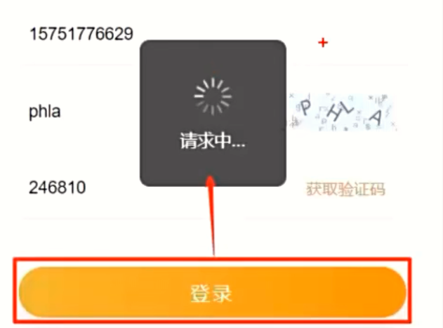
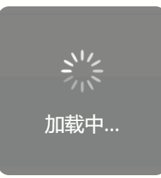
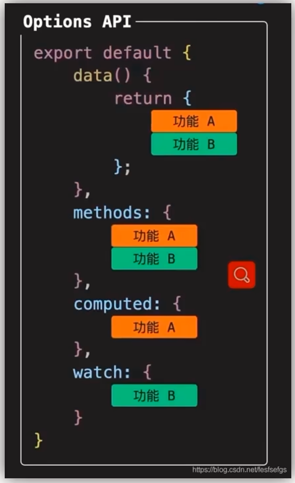
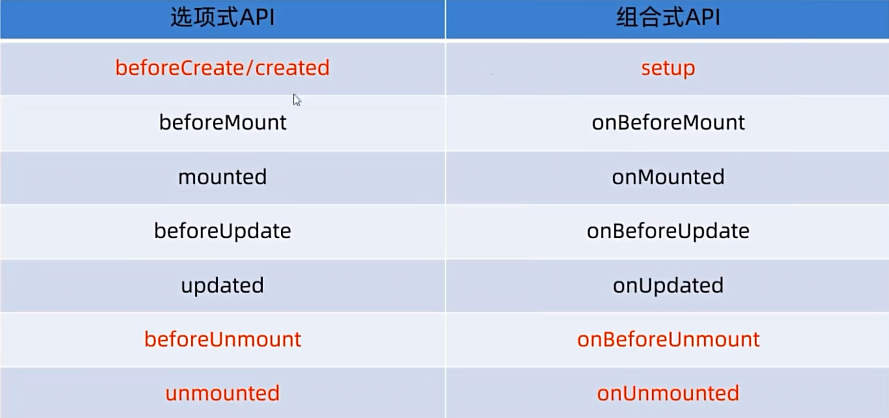
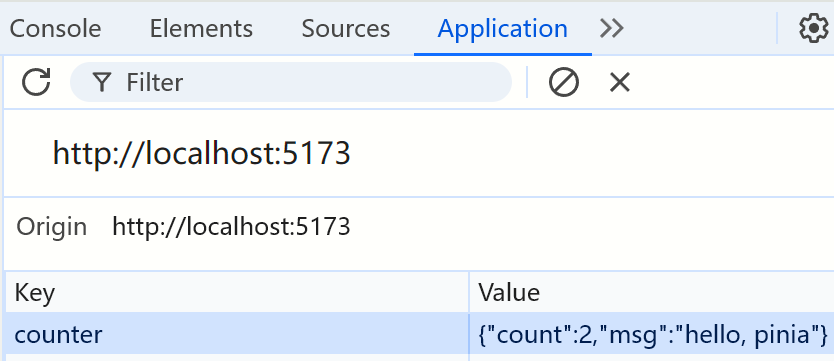
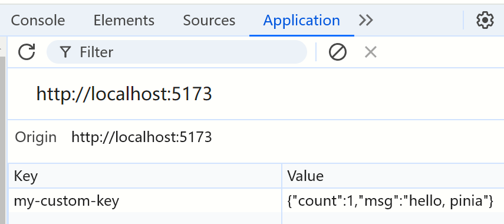
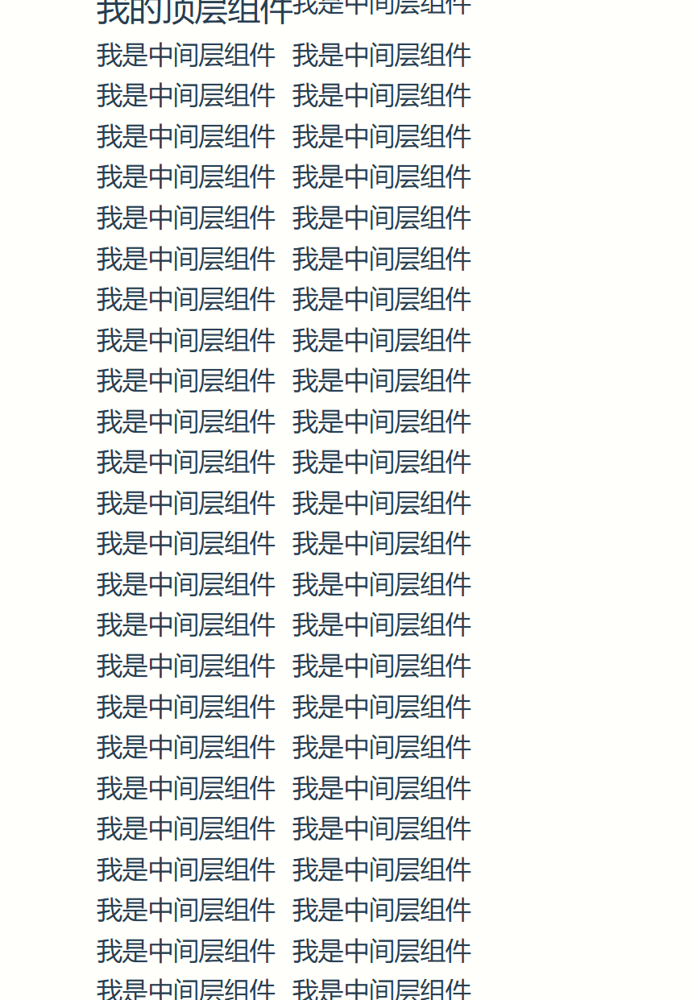

# 入门

## 快速上手

### 什么是Vue

Vue是一种构建用户界面的渐进式框架

### 创建Vue实例

- 构建用户界面
- 创建Vue实例，初始化渲染
- 核心四步：
	- 准备容器
	- 引包
	- 创建Vue实例
	- 指定配置项，用于渲染数据
		- el：指定挂载点
		- data：提供数据

```html
<!DOCTYPE html>
<html lang="en">
<head>
    <meta charset="UTF-8">
    <title>Title</title>
</head>
<body>

<div id="app">
    <!--将来在这里编写一些用于渲染的逻辑代码-->

    <h1>{{msg}}</h1>

</div>

<!--引入Vue2的包，引入之后，就有了Vue的构造函数-->
<script src="./vue.js"></script>

<script>
    const app = new Vue({
        // 通过el，指定Vue所管理的盒子
        el: '#app',
        data: {
            msg: '永劫无间'
        }
    })
</script>
</body>
</html>
```


### 插值表达式

插值表达式是Vue的一种模板语法

既然是表达式，那么只能传入可以被求值的代码，比如下面这些

```javascript
<div>{{title}}<div>
<div>{{nickname.toUpperCase}}<div>
<div>{{age >= 18 ? '成年' : '未成年'}}<div>
<div>{{obj.name}}<div>
```

注意：
- 使用的数据必须存在（data）
- 支持的是表达式，而非语句，不能把if也带上
- 不能在标签属性中使用{{}}插值


### 响应式特性

响应式特性，即数据一旦变化，视图立即更新

大概流程：用户修改了数据，而Vue会监听到数据修改，于是自动更新视图（使用DOM，这就是为什么需要创建Vue的管理容器了），重新渲染了页面


### Vue指令

Vue指令，就是带有形如`v-xxx`的==特殊标签属性==

- v-html = "表达式"  => 动态设置元素innerHTML

- v-show = "表达式" => 控制元素的css样式中的display来控制显示隐藏；表达式为true显示，false隐藏
	- 使用场景：需要频繁切换显示和隐藏

- v-if = "表达式" => 根据判断条件来创建和移除元素）；表达式为true则创建，false移除
	- 使用场景：要么显示，要么隐藏，不会来回切换。比如广告

- v-else和v-else-if需要配合v-if一起使用，用于条件判断，辅助渲染

- v-on：用于注册事件
	- v-on:事件名 = "内联语句"
	- v-on:事件名 = "methods中的函数名"
	- ==有一种更简单的写法：`@事件`，比如：`v-on:click`可以写成`@click`==

- v-bind：动态的设置html的标签属性，比如src、url等
	- 语法：v-bind:属性名="表达式"
	- 简写：`:属性名="表达式"`，比如`v-bind:src=""`可以写成`:src=""`

- v-for：基于数据循环，多次渲染整个元素
	- 语法：v-for="(item, index) in 数组"
	- item：每一项
	- index：下标

关于v-for中的key，这个key是元素的唯一标识，可以方便Vue去给列表项进行排序
注意点：
- key的值只能是字符串或者数字类型
- key的值必须具有唯一性
- 推荐使用id作为key，不推荐使用index作为key


- v-model
	- 作用：给==表单元素==使用，双向数据绑定。可以快速获取或设置表单元素内容
		- 数据变化 => 视图自动更新
		- 视图变化 => 数据自动更新
	- 语法：v-model = "变量"


### 指令补充

#### 指令修饰符

通过`"."`指明一些指令后缀，不同后缀封装了不同的处理操作，简化了代码

- 按键修饰符
	- `@keyup.enter`：键盘回车监听
	- `@keyup.enter="add"`：点击回车之后就会执行add函数
- v-model修饰符
	- `v-model.trim`：去除首尾空格
		- 比如：`<input type="text" name="username" v-model.trim="username"></input>`，就会自动把用户名输入框进行去除空格的操作
	- `v-model.number`：将数据类型转为数字类型（如果可以转的话）
- 事件修饰符
	- `@事件名.stop`：阻止冒泡
	- `@事件名.prevent`：阻止默认行为
	- 比如：`<a @click.prevent href="xxx"></a>`，就会阻止超链接的默认行为，即跳转


#### v-bind对于样式控制的增强


**操作class**

语法：`:class="对象/数组"`

- 对象：键为类名、值为布尔值。如果值为true，代表有这个类
	- `<div class="box" :class="{类名1: 布尔值, 类名2: 布尔值}"></div>`
	- 适用场景：一个类来回切换
- 数组：数组中的所有类都会添加到盒子上，本质上就是一个class列表
	- `<div class="box" :class="[类名1, 类名2]"></div>`
	- 适用场景：添加或删除某些类


**操作style**

语法：`:style="样式对象"`

代码示例：`<div class="box", :style="{css属性名1: css属性值, css属性名2: css属性值}"></div>`


#### v-model应用于其他表单元素

- 输入框`input:text`：value
- 文本域`textarea`：value
- 复选框`input:checkbox`：checked
- 单选框`input:radio`：checked
- 下拉菜单`select`：value

### 计算属性

概念：给予现有的数据，计算出来的新属性

语法：
- 声明在`computed`配置项中，一个计算属性对应一个函数
- 适用起来和普通属性一样适用`{{ 计算属性名 }}`

```html

  <div id="app">
    <h3>小黑的礼物清单</h3>
    <table>
      <tr>
        <th>名字</th>
        <th>数量</th>
      </tr>
      <tr v-for="(item, index) in list" :key="item.id">
        <td>{{ item.name }}</td>
        <td>{{ item.num }}个</td>
      </tr>
    </table>

    <!-- 目标：统计求和，求得礼物总数 -->
    <p>礼物总数：{{ totalCount }} 个</p>
  </div>
  <script src="https://cdn.jsdelivr.net/npm/vue@2/dist/vue.js"></script>
  <script>
    const app = new Vue({
      el: '#app',
      data: {
        // 现有的数据
        list: [
          { id: 1, name: '篮球', num: 1 },
          { id: 2, name: '玩具', num: 2 },
          { id: 3, name: '铅笔', num: 5 },
        ]
      },
      computed: {
        totalCount () {
          // 基于现有的数据，编写求值逻辑
          // 计算属性函数内部，可以直接通过 this 访问到 app 实例
          // console.log(this.list)

          // 需求：对 this.list 数组里面的 num 进行求和 → reduce
          let total = this.list.reduce((sum, item) => sum + item.num, 0)
          return total
        }
      }
    })
  </script>
```


>[!note] computed计算属性和methods方法的区别
>computed计算属性具有缓存特性。即使在多个地方使用了computed的函数，该函数只会执行一次，然后将执行结果放入缓存中，那些使用了computed函数的地方就会到缓存中找数据
>而methods就不行了，调用几次它就会执行几次，而且这几次计算出的结果都是同一个值，显然在性能上就比不过computed计算属性了


但是案例中使用的只是计算属性的简写，它只能读取访问，并不能修改。

如果要修改的话，就必须写计算属性的完整写法

==简写==：

```javascript
computed: {
	计算属性名() {
		逻辑代码(计算逻辑)
		return 结果
	}
}
```

==完整写法==：

```javascript
computed: {
	计算属性名: {
		get() {
			代码逻辑(计算逻辑)
			return 结果
		},
		set() {
			代码逻辑(修改逻辑)
		}
	}
}
```


示例：

```html

  <div id="app">
    姓：<input type="text" v-model="firstName"> +
    名：<input type="text" v-model="lastName"> =
    <span>{{ fullName }}</span><br><br>
    
    <button @click="changeName">改名卡</button>
  </div>
  <script src="https://cdn.jsdelivr.net/npm/vue@2/dist/vue.js"></script>
  <script>
    const app = new Vue({
      el: '#app',
      data: {
        firstName: '刘',
        lastName: '备',
      },
      methods: {
        changeName () {
          this.fullName = '黄忠'
        }
      },
      computed: {
        // 简写 → 获取，没有配置设置的逻辑
        // fullName () {
        //   return this.firstName + this.lastName
        // }

        // 完整写法 → 获取 + 设置
        fullName: {
          // (1) 当fullName计算属性，被获取求值时，执行get（有缓存，优先读缓存）
          //     会将返回值作为，求值的结果
          get () {
            return this.firstName + this.lastName
          },
          // (2) 当fullName计算属性，被修改赋值时，执行set
          //     修改的值，传递给set方法的形参
          set (value) {
            // console.log(value.slice(0, 1))          
            // console.log(value.slice(1))         
            this.firstName = value.slice(0, 1)
            this.lastName = value.slice(1)
          }
        }
      }
    })
  </script>
```


## 监听器

### 简单写法

```javascript
watch: {
	数据属性名 (newValue, oldValue) {
		一些业务逻辑 或 异步操作
	},
	'对象.属性名' (newValue, oldValue) {
		一些业务逻辑 或 异步操作
	}
}
```


### 完整写法

添加额外配置项：
- `deep: true`：对复杂类型深度监视
- `immediate: true`：初始化立刻执行一次handler方法

```javascript
watch: {
	数据属性名: {
		deep: true,       // 深度监视（针对复杂类型）
		immediate: true,  // 是否立刻执行一次handler
		handler (newValue) {
			操作
		}
	}

}
```


# 组件化开发

## 生命周期

### 四个阶段

Vue的生命周期有四个阶段：创建、挂载、更新、销毁

- 创建：`new Vue()`
- 创建阶段：准备响应式数据
- 挂载阶段：渲染模板
- 更新阶段：数据修改，更新视图
- 销毁阶段：销毁实例
- 销毁：关闭网页

从生命周期，我们也可以得出下面结论：
1. 发送初始化的渲染请求，应该在创建阶段之后
2. 操作DOM，应该在挂载阶段之后


### 钩子函数（生命周期函数）

Vue生命周期过程中，会自动运行一些函数，被称为生命周期钩子。

==让开发者可以在特定阶段运行自己的代码==


## 脚手架Vue-CLI

Vue CLI是Vue官方提供的一个全局命令工具

可以帮助我们快速创建一个开发Vue项目的标准化基础架子。【集成了webpack配置】

类似于用IDEA快速生成SpringBoot项目

### 使用步骤

1. 全局安装（一次）：`yarn global add @vue/cli` 或者 `npm i @vue/cli -g`
2. 查看Vue版本：vue --version
3. 创建项目架子：`vue create project-name`，项目名不能用中文
4. 启动项目：`yarn serve` 或 `npm run serve` 或 `pnpm run serve`

>[!note] 提示
>启动项目之所以使用`serve`命令，是因为`package.json`里面的scripts规定的就是serve启动项目。但是可以修改package.json文件来修改启动命令。比如修改为dev，那么启动命令也就变成了`npm run serve`


### 目录解释

无需解释

### main.js核心代码

1. 导入Vue：`import Vue from 'vue'`
2. 导入App.vue：`import App from './App.vue'`
3. 实例化Vue，将App.vue渲染到index.html容器中：`new Vue({render: h => h(App)}).$mount('#app')`


## 组件化

将页面拆分成多个组件，便于维护和复用

比如`App.vue`是一个根组件，它包含了`头部组件`、`导航组件`、`主体组件`和`足部组件`，然后每个组件里面又包含了其他组件，比如主体组件中可能包含了：`商品组件、购物组件等`


### App.vue文件

主要由三部分组成：结构、行为、样式

- template：结构（有且只能有一个根元素）
- script：JS逻辑
- style：样式（可支持less，需要装包）

如果需要让组件支持less：
- style标签中的`lang`属性赋值为`less`
- 装包：`yarn add less less-loader`


### 注册组件和使用

两种方式：
- 局部注册：只能在注册的组件内使用
	- 创建`.vue`文件（三个组成部分）
	- 在使用的组件内导入并注册
- 全局注册：所有组件内都能使用
	- 创建`.vue`文件（三个组成部分）
	- `main.js`中进行全局注册

组件应该放在==**components**==目录下

>App.vue中的配置
```javascript
import 组件对象 from '.vue文件路径'
import HmHeader from './components/HmHeader'

export default {
	// 局部注册
	components: {
		'组件名': 组件对象,
		HmHeader: HmHeader
	}
}
```


>main.js中的配置

```javascript
// 导入需要全局注册的组件
import HmButton from './components/HmButton'

// 调用 Vue.component 进行全局注册
// Vue.component('组件名', 组件对象)
Vue.component('HmButton', HmButton)
```

**使用组件**：当成html标签使用，`<组件名></组件名>`

>[!note] 注意
>组件名规范：大驼峰命名法，如：HmHeader


### 三大组件的注意点

#### 组件样式冲突

默认情况下，写在组件中的样式会全局生效，因此很容易造成多个组件之间的样式冲突

- 全局样式：默认组件中的样式会作用到全局
- ==局部样式==：可以给组件加上`scoped`属性，可以让样式之作用于当前组件

比如只想给`HmHeader`组件添加指定属性的话，就可以在`HmHeader.vue`的`style`标签中添加`scoped`属性

```html
<style scoped>
</style>
```

scoped的原理：

- 给当前组件模板的所有元素都添加一个自定义属性：`data-v-hash值`，比如`data-v-2hcoawfq2`
- css选择器后面，被自动处理，会添加上属性选择器
  - `div[data-v-2hcoawfq2]`


#### data函数

一个组件的`data`选项必须是一个函数，确保每个组件实例维护独立的一份数据对象

每次创建新的组件实例，都会新执行一次data函数，得到一个新对象


### 组件通信

组件关系有两种：父子关系和非父子关系

解决方案也不同：

- 父子关系：`props`和`$emit`
- 非父子关系：`provide&inject`或`eventbus`
- 通用方案：`vuex`

#### 父传子

使用`props`将父组件的数据传递给子组件


#### 子传父

子组件利用`$emit`通知父组件，进行修改更新


#### props校验

作用：为组件的prop指定验证要求，不符合要求的控制台就会有错误提示

语法：

- `类型校验`
- 非空校验
- 默认值
- 自定义校验


比如类型校验，只要width属性不是数字型，那么就会报错：

```javascript

export default {
    
    props: {
        // 校验的属性名: 类型
        width: Number,
        // 上面是简写，下面是完整写法
        money: {
            // 类型校验
            type: Number,
            // 非空校验，为true的话，表示父组件必须传递这个属性给子组件
            required: true,
            // 如果父组件不传的话，子组件可以设定默认值
            default: 默认值,
            // 自定义逻辑校验
            validator(value) {
                // 对value进行处理
                return '是否通过校验'
            }
        }
    }
}
```


#### 单向数据流

父组件的prop更新，会单向向下流动，影响到子组件。

另外，子组件不能直接修改父组件的属性，必须利用`$emit`，给父组件发送一个函数，让父组件去修改。


#### 非父子通信

以后再学


#### v-model在组件中的使用

子组件中：props通过`value`接收，事件触发`input`

父组件中：`v-model`给组件直接绑数据（v-model = `:value + @input`）


> `$event`可以拿到形参


#### .sync

可以实现父子组件之间的数据绑定，而且会更灵活简单点

场景：封装弹框类的基础组件，visible属性 true显示、false隐藏

本质：就是`:属性名`和`@update:属性名`和写


## 获取DOM

### ref和$refs

之前的`document.querySelector('.box')`查找的是整个页面的元素，范围太宽

而`ref`和`$refs`查找的是当前组件的元素

获取DOM使用步骤：

- 给目标标签添加`ref`属性

  `<div ref="chartRef">我是容器</div>`

- 通过`this.$refs.xxx`获取目标标签

  `mounted() {console.log(this.$refs.chartRef)}`


获取组件实例步骤：

- 给目标组件添加`ref`属性

  `<BaseForm ref="baseForm"></BaseForm>`

- 获取目标组件，获取到组件后，就可以使用组件方法了

  `this.$refs.baseForm.组件方法()`


### 异步更新

Vue是异步更新DOM的

使用`$nextTick`，就会等DOM更新后，才会触发执行此方法里的函数体

比如我想要获取焦点：

```javascript
this.$nextTick(() => {
    // inp是一个ref属性值，它写在了一个input标签中。focus函数用于获取输入框的焦点
    this.$refs.inp.focus()
})
```


## 自定义指令

### 注册

自定义指令：自己定义的指令，可以封装一些DOM操作，扩展额外功能

- 全局注册(`main.js`)

  ```javascript
  Vue.directive('focus', {
    // inserted会在指令所在的元素 被插入到页面时触发
    inserted(el) {
      el.focus()
    }
  })
  
  /*
  使用：
  <input v-focus ref="inp"></input>
  */
  ```

  

- 局部注册(`App.vue`)

  ```javscript
    directives: {
      focus: {
        inserted(el) {
          el.focus()
        }
      }
    }
  ```


### 指令赋值

语法：在绑定指令时，可以通过“等号”的形式为指令绑定`具体的参数值`：

`<div v-color="color">我是内容</div>`


通过`binding.value`可以拿到指令值，指令值修改会触发`update`函数

```javascript
  directives: {
    color: {
      // 页面展示时更新
      inserted(el, binding) {
        el.style.backgroundColor = binding.value
      },
      // 指令的值修改时更新
      update(el, binding) {
        el.style.backgroundColor = binding.value
      }
    }
  }

/*
<div v-color="color" class="co"></div>

<style>
.co {
  width: 200px;
  height: 200px;
}
</style>

*/
```


### 封装v-loading指令

思路：

- 准备类名loading，通过伪元素提供遮罩层
- 添加或移除类名，实现loading蒙层的添加移除
- 利用指令语法，封装v-loading通用指令
  - `inserted`钩子中，`binding.value`判断指令的值，设置默认状态
  - `update`钩子中，`binding.value`判断指令的值，更新类名状态


```vue
<template>
  <div class="main">
    <div class="box" v-loading="isLoading">
      <ul>
        <li v-for="item in list" :key="item.id" class="news">
          <div class="left">
            <div class="title">{{ item.title }}</div>
            <div class="info">
              <span>{{ item.source }}</span>
              <span>{{ item.time }}</span>
            </div>
          </div>

          <div class="right">
            
          </div>
        </li>
      </ul>
    </div>
    <div class="box2" v-loading="isLoading2"></div>
  </div>
</template>

<script>
// 安装axios =>  yarn add axios
import axios from 'axios'

// 接口地址：http://hmajax.itheima.net/api/news
// 请求方式：get
export default {
  data () {
    return {
      list: [],
      isLoading: true,
      isLoading2: true
    }
  },
  async created () {
    // 1. 发送请求获取数据
    const res = await axios.get('http://hmajax.itheima.net/api/news')

    setTimeout(() => {
      // 2. 更新到 list 中，用于页面渲染 v-for
      this.list = res.data.data
      this.isLoading = false
    }, 2000)
  },
  directives: {
    loading: {
      inserted (el, binding) {
        binding.value ? el.classList.add('loading') : el.classList.remove('loading')
      },
      update (el, binding) {
        binding.value ? el.classList.add('loading') : el.classList.remove('loading')
      }
    }
  }
}
</script>

<style>
.loading:before {
  content: '';
  position: absolute;
  left: 0;
  top: 0;
  width: 100%;
  height: 100%;
  background: #fff url('./loading.gif') no-repeat center;
}

.box2 {
  width: 400px;
  height: 400px;
  border: 2px solid #000;
  position: relative;
}


.box {
  width: 800px;
  min-height: 500px;
  border: 3px solid orange;
  border-radius: 5px;
  position: relative;
}
.news {
  display: flex;
  height: 120px;
  width: 600px;
  margin: 0 auto;
  padding: 20px 0;
  cursor: pointer;
}
.news .left {
  flex: 1;
  display: flex;
  flex-direction: column;
  justify-content: space-between;
  padding-right: 10px;
}
.news .left .title {
  font-size: 20px;
}
.news .left .info {
  color: #999999;
}
.news .left .info span {
  margin-right: 20px;
}
.news .right {
  width: 160px;
  height: 120px;
}
.news .right img {
  width: 100%;
  height: 100%;
  object-fit: cover;
}
</style>
```


## 插槽

插槽用于自定义组件的内容。


### 默认插槽

基本语法：

- 组件内需要定制的结构部分，改用`<slot></slot>`占位，其中可以在`<slot>`里面添加文字，作为默认值
- 使用组件时，`<MyDialog></MyDialog>`标签内部，传入结构替换`slot`


**MyDialog组件**：

```vue
<template>
  <div class="dialog">
    <div class="dialog-header">
      <h3>友情提示</h3>
      <span class="close">✖️</span>
    </div>

    <div class="dialog-content">
      <!-- 1. 在需要定制的位置，使用slot占位 -->
      <slot>我是默认值，可以被替换</slot>
    </div>
    <div class="dialog-footer">
      <button>取消</button>
      <button>确认</button>
    </div>
  </div>
</template>
```


**App.vue**

```vue
<template>
  <div>
    <!-- 2. 在使用组件时，组件标签内填入内容 -->
    <MyDialog>
      <div>你确认要删除么</div>
    </MyDialog>

    <MyDialog>
      <p>你确认要退出么</p>
    </MyDialog>
  </div>
</template>
```


<div>
    <center>
    
        <br>
        效果图
    </center>
</div>


### 具名插槽

可以实现多处的定制

所谓具名，就是给每个插槽起名字。具名插槽只支持定制分发。

步骤：

- 给插槽起名字
- 调用组件时，给指定的插槽添加内容(`v-slot:插槽名`)，也可以简写为`#插槽名`


**插槽**

```vue
<template>
  <div class="dialog">
    <div class="dialog-header">
      <!-- 一旦插槽起了名字，就是具名插槽，只支持定向分发 -->
      <slot name="head"></slot>
    </div>

    <div class="dialog-content">
      <slot name="content"></slot>
    </div>
    <div class="dialog-footer">
      <slot name="footer"></slot>
    </div>
  </div>
</template>
```


**App.vue**

```html
<template>
  <div>
    <MyDialog>
      <!-- 需要通过template标签包裹需要分发的结构，包成一个整体 -->
      <template v-slot:head>
        <div>我是大标题</div>
      </template>
      
      <template v-slot:content>
        <div>我是内容</div>
      </template>

         <!-- 可以简写为： #插槽名 -->
      <template #footer>
        <button>取消</button>
        <button>确认</button>
      </template>
    </MyDialog>
  </div>
</template>
```


### 作用域插槽

使用步骤：

- 给slot标签，`以添加属性的方式`传值

  `<slot :id="item.id" msg="测试文本"></slot>`

- 所有添加的属性，都会被收集到一个对象中

  `{id: 3, msg: "测试文本"}`

- 在template中，通过`#插槽名="obj"`接收，默认插槽名为`default`

  ```vue
  <MyTable :list="list">
  	<template #defalut="obj">
      	<button @click="del(obj.id)">
              删除
          </button>
      </template>
  </MyTable>
  ```


**组件vue**

```vue
<template>
  <table class="my-table">
    <thead>
      <tr>
        <th>序号</th>
        <th>姓名</th>
        <th>年纪</th>
        <th>操作</th>
      </tr>
    </thead>
    <tbody>
      <tr v-for="(item, index) in data" :key="item.id">
        <td>{{ index + 1 }}</td>
        <td>{{ item.name }}</td>
        <td>{{ item.age }}</td>
        <td>
          <!-- 1. 给slot标签，添加属性的方式传值 -->
          <slot :row="item" msg="测试文本"></slot>

          <!-- 2. 将所有的属性，添加到一个对象中 -->
          <!-- 
             {
               row: { id: 2, name: '孙大明', age: 19 },
               msg: '测试文本'
             }
           -->
        </td>
      </tr>
    </tbody>
  </table>
</template>
```


**App.vue**

```
<template>
  <div>
    <MyTable :data="list">
      <!-- 3. 通过template #插槽名="变量名" 接收 -->
      <template #default="obj">
        <button @click="del(obj.row.id)">
          删除
        </button>
      </template>
    </MyTable>
    
    <MyTable :data="list2">
      <template #default="{ row }">
        <button @click="show(row)">查看</button>
      </template>
    </MyTable>
  </div>
</template>

<script>
import MyTable from './components/MyTable.vue'
export default {
  data () {
    return {
      list: [
        { id: 1, name: '张小花', age: 18 },
        { id: 2, name: '孙大明', age: 19 },
        { id: 3, name: '刘德忠', age: 17 },
      ],
      list2: [
        { id: 1, name: '赵小云', age: 18 },
        { id: 2, name: '刘蓓蓓', age: 19 },
        { id: 3, name: '姜肖泰', age: 17 },
      ]
    }
  },
  methods: {
    del (id) {
      this.list = this.list.filter(item => item.id !== id)
    },
    show (row) {
      // console.log(row);
      alert(`姓名：${row.name}; 年纪：${row.age}`)
    }
  },
  components: {
    MyTable
  }
}
</script>

```


# 路由

## 基本概念

### 单页面应用程序


- 单页面应用程序：只有一个HTML页面，比如网易云音乐的web网站
  - 适合开发：系统类网站、内部网站、文档类网站、移动端站点
- 多页面应用程序：多个HTML页面，比如京东
  - 公司官网、电商类网站


### 路由

生活中的路由：设备和ip的映射关系

Vue中的路由：`路径`和`组件`映射关系


## VueRouter

`VueRouter`是官方的一个路由插件，是一个第三方包

他的作用：`修改`地址栏路径时，`切换显示`匹配的`组件`


注册步骤：

- 下载

  `pnpm i vue-router@3.6.5`

- 引入

  `import VueRouter from "vue-router"`

- 注册

  `Vue.use(VueRouter)`

- 创建路由对象

  `const router = new VueRouter()`

- 注入

  ```js
  new Vue({
    render: h => h(App),
      // 其中这里的router是简写，完整写法是：router:router，前面是属性，后面是实例
    router
  }).$mount('#app')
  ```


**核心步骤**

- 创建需要的组件（放在views目录中），配置路由规则
- 配置导航，配置路由出口（路径匹配的组件显示的位置）


`在main.js中配置路由规则`

```js
import Vue from 'vue'
import App from './App.vue'
import VueRouter from "vue-router"
import Find from './views/Find'
import My from './views/My'
import Friend from './views/Friend'

Vue.config.productionTip = false
// 插件初始化
Vue.use(VueRouter)

const router = new VueRouter({
    // 配置路由规则
    routes: [
        {path: '/find', component: Find},
        {path: '/my', component: My},
        {path: '/friend', component: Friend},
    ]
})

new Vue({
    render: h => h(App),
    router
}).$mount('#app')
```

`在App.vue中配置导航`

```vue
<template>
  <div>
    <div class="footer_wrap">
      <a href="#/find">发现音乐</a>
      <a href="#/my">我的音乐</a>
      <a href="#/friend">朋友</a>
    </div>
    <div class="top">
      <!-- 路由出口 → 匹配的组件所展示的位置 -->
      <router-view></router-view>
    </div>
  </div>
</template>

<script>
export default {};
</script>

<style>
body {
  margin: 0;
  padding: 0;
}
.footer_wrap {
  position: relative;
  left: 0;
  top: 0;
  display: flex;
  width: 100%;
  text-align: center;
  background-color: #333;
  color: #ccc;
}
.footer_wrap a {
  flex: 1;
  text-decoration: none;
  padding: 20px 0;
  line-height: 20px;
  background-color: #333;
  color: #ccc;
  border: 1px solid black;
}
.footer_wrap a:hover {
  background-color: #555;
}
</style>
```


## 路由模块封装

把路由规则全写在`main.js`文件中很不合适，所以应该创建一个`router`文件夹，在该文件夹中编写路由规则


```js
// @指代src目录
import VueRouter from "vue-router"
import Find from '@/views/Find.vue'
import My from '@/views/My'
import Friend from '@/views/Friend'
import Vue from "vue";

Vue.config.productionTip = false
// 插件初始化
Vue.use(VueRouter)

// 创建路由对象
const router = new VueRouter({
    // 配置路由规则
    routes: [
        {path: '/find', component: Find},
        {path: '/my', component: My},
        {path: '/friend', component: Friend},
    ]
})
// 导出路由对象
export default router
```


## 声明式导航

### 导航链接

vue-router提供了一个全局组件`router-link`（取代a标签）

特点：

- 能跳转，配置`to`属性指定路径（必须）。最终被浏览器解析为`a`标签，但是`to`属性不用写`#`
- 能高亮，会`自动给选中的标签提供类名`(`router-link-active`和`router-link-exact-active`)，可以直接用这个类名设置高亮样式，如果切换路由的话会自动去除该类名


```vue
<template>
  <div>
    <div class="footer_wrap">
      <router-link to="/find">发现音乐</router-link>
      <router-link to="/my">我的音乐</router-link>
      <router-link to="/friend">朋友</router-link>
    </div>
    <div class="top">
     
      <router-view></router-view>
    </div>
  </div>
</template>


<style>
.footer_wrap a.router-link-active {
  background-color: yellow;
}
</style>

```


### 两个类名

- router-link-active

  - 模糊匹配：如果`to=/find`，那么在`/find/*`下都能生效
  - `用得多`

- router-link-exact-active

  - 精确匹配：如果`to=/find`，那么只能在`/find`下生效
  - 用得少

  

### 定制类名

router-link-active和router-link-exact-active太长，想要定制一个短一点的话：

```js
const router = new VueRouter({
    // 配置路由规则
    routes: [...],
             // 定制router-link-active
    linkActiveClass: 'active',
             // 定制router-link-exact-active
    linkExactActiveClass: 'exact-active'
})
```


### 跳转传参

- 查询参数传参（比较适合`多个参数`）

  - 语法格式：`to="/path?参数名=值"`
  - 对应页面组件接收参数：`this.$route.query.参数名`

- 动态路由传参（`传单个参数`比较方便）

  - 配置动态路由

    ```js
    const router = new VueRouter({
        // 配置动态路由
        routes: [
            {
                // /find/*都可以被匹配到
                path: '/find/:words',
                component: Find
            }
    })
    ```

  - 配置导航链接：`to="/path/参数值"`

  - 对应页面组件接收参数：`this.$route.params.参数名`

> 其中`this.$router.params.参数名`中的`参数名`要跟路由配置中的`path: '/find/:words'`一致，比如这里是`words`，那么参数名就应该是`this.$router.params.words`


### 动态路由参数可选

动态路由规则如果写成：`path: '/find/:words'`的话，表示必须要传递参数。

如果存在不传递参数的情况的话，可以改为`path: '/find/:words?'`，这个问号是一个`可选符`


## 特殊路由

### 重定向

网页打开时，默认时根路径，可能匹配不到组件，页面就会出现空白

此时需要将根路径访问`重定向`至指定页面

语法：`path: '匹配路径', redirect: '重定向路径'`

比如：

```js
const router = new VueRouter({
    // 配置路由重定向
    routes: [
        {
            // 访问根路径/的话，就重定向到/home
            path: '/',
            redirect: '/home'
        }
})
```


### 404

当路径找不到匹配时，给个提示页面，表示资源没找到

`位置：配在路由的最后`，因为当所有路径都没有匹配上时，才会匹配到`404路由`

语法：`path: '*', 解决策略`

```js
const router = new VueRouter({
    // 配置路由规则
    routes: [
        {path: '/find/:words', component: Find},
        {path: '/my', component: My},
        {path: '/friend', component: Friend},
        // 这里的NotFind是404时需要显示的页面
        {path: '*', component: NotFound}
    ]
})
```


## 路由模式

这个带`#`号的路由，见的非常少，看着很不自然。

其实这个是属于`hash路由`，也是Vue默认的一种路由模式

常见的路由模式其实是`history路由`，即没有`#`号的

直接在router对象修改即可：

```js
const router = new VueRouter({
    // 配置路由规则
    routes,
    mode: 'history'
})
```


## 编程式导航

编程式导航，通过`js`进行跳转

分为：`path路径跳转`和`name命名路由跳转`

### path路径跳转

两种写法：

- 简写：`this.$router.push('路径')`

- 完整写法（需要传参的时候用）：

  ```js
  this.$router.push({
      // path: '/home'
      path: '路径'
  })
  ```


### name路由跳转

name路由跳转适合`path路径比较长`的场景

```js
// 配置路由名
const router = new VueRouter({
    routes: [
        {name: 'se', path: '/search/adad/f3fgq/fqfq', component: Find},
        ]
})


this.$router.push({
    // name: '路由名'
    name: 'se'
    
})
```


### 路由传参

path路径跳转传参和name命名路由跳转传参对于`query传参`和`动态路由传参`都支持

#### path

查询路径传参

```js
this.$router.push('/路径?参数名1=参数值&参数名2=参数值')

this.$router.push({
    path: '/路径',
    query: {
        参数名1: '参数值1'，
        参数名2: '参数值2'
    }
})

// 对应页面接收参数
this.$route.query.参数名
```


动态路由传参

```js
this.$router.push('/路径/参数值')

this.$router.push({
    path: '/路径/参数值'
})

// 对应页面接收参数
this.$route.params.参数名
```


#### name

查询参数传参

```js
this.$router.push({
    name: '路由名',
    query: {
        参数名1: '参数值1'，
        参数名2: '参数值2'
    }
})

// 对应页面接收参数
this.$route.query.参数名
```

动态路由传参

```js
this.$router.push({
    name: '路由名',
    params: {
        参数名: '参数值'
    }
})

// 对应页面接收参数
this.$route.params.参数名
```


## 组件缓存

`keep-alive`是Vue的内置组件，当它包裹动态组件时，会缓存不活动的组件实例

keep-alive是一个抽象组件：它自身不会渲染成一个DOM元素，也不会出现在父组件链中

优点：

- 在组件切换过程中，把切换出去的组件保留在内存中，防止重复渲染DOM
- 减少加载时间及性能消耗，提高用户体验性


keep-alive的三个属性：

- include：组件名数组，只有匹配的组件会被缓存
- exclude：组件名数组，任何匹配的组件都不会被缓存
- max：最多可以缓存多少组件实例


keep-alive的使用会触发两个声明周期

- activated：当组件`被激活（使用）`的时候触发->进入页面触发
- deactivated：当组件`不被使用`的时候触发 -> 离开页面触发


# vuex

## 概念

vuex是一个vue的`状态管理工具`，可以帮助我们`管理通用数据`，即`多个组件共享的数据`

使用场景：

- 某个状态在很多个组件来使用（个人信息）
- 多个组件共同维护一份数据（购物车）


优势：

- 共同维护一份数据，数据集中化管理
- 响应式变化
- 操作简洁

> 解决了我之前的顾虑：父子组件的数据传来传去的好麻烦，直接把数据放在仓库里管理不就行了。


## 创建一个空仓库

- 安装vuex插件：`pnpm i vuex@3`

- 新建vuex模块文件：`创建一个store/index.js`专门放vuex

- 创建仓库：

  ```js
  // Vuex
  import Vue from "vue"
  import Vuex from "vuex"
  
  // 插件安装
  Vue.use(Vuex)
  // 创建仓库
  const store = new Vuex.Store({})
  // 导出给main.js用
  export default store
  ```

- 挂载到`main.js`

```js
import Vue from 'vue'
import App from './App.vue'
import store from "@/store";
new Vue({
    render: h => h(App),
    store
}).$mount('#app')

```


## state


### 提供数据

`State`提供唯一的公共数据源，所有共享的数据都要统一放到Store中的State中存储。

`在state对象中可以添加我们要共享的数据`

```js
const store = new Vuex.Store({
    state: {
        count: 101
    }
})
```


### 使用数据

#### 通过store直接访问

获取store：

- `this.$store`
- `import 导入 store`

使用store：

- 模块中：`{{$store.state.count}}`
- 组件模块中：`this.$store.state.count`
- JS模块中：`store.state.count`


==延申==

我们可以将state中的数据定义在组件内的计算属性中，这样就可以不用写长长的`$store.state`了，直接使用`count`就能访问到store的数据。但是如果每个组件都要使用的话，就得对每个属性都写一个这个函数，并且在每个组件都要写一遍，特别麻烦，因此引入了`mapState`辅助函数

```js
{{count}}

computed: {
    count() {
        return this.$store.state.count
    }
}
```


#### 通过辅助函数（简化）

`mapState`是辅助函数，帮助我们把store中的数据`自动`映射到组件的组件属性中

分为三步（每个组件都要做一遍）：

- 导入mapState：`import {mapState} from 'vuex'`
- 数组方式引入state：`mapState(['count', 'title', ...])`。此时的mapState是一个对象。
- 展开运算符映射：`computed: {...mapState['count', 'title', ...]}`


## mutations

vuex默认是不遵循单向数据流，因为默认`strict: false`

如果开启了严格模式，那么就`组件不能直接修改仓库中的数据`了。对于开发而言，最好将严格模式开启，上线之后就可以关了。

```js
const store = new Vuex.Store({
    // 开启严格模式
    strict: true,
    state: {
        count: 101
    }
})
```


### 修改state


开启了严格模式之后，state的数据就只能通过`mutations`对象进行修改了

- 定义mutations对象，对象中存放修改state的方法

```js
const store = new Vuex.Store({
    state: {
        count: 0
    },
    // 定义mutations
    mutations: {
        // 第一个参数是当前store的state属性
        addCount(state) {
            state.count += 1
        }
    }
})
```

- 组件中提交调用mutations

```js
// commit的参数需要跟mutations定义的方法名一致
this.$store.commit('addCount')
```


### 传参

刚才在mutations定义的方法是没有携带额外参数的，如果我们想要传递一个参数进mutations的方法中，其实只要`在方法定义时再加一个参数位`就行了

- 提供mutations函数（带参数）

```js
 // 定义mutations
    mutations: {
        // 第一个参数是当前store的state属性，第二个参数是携带的
        addCount(state, n) {
            state.count += n
        }
    }
```

- 页面中提交调用mutation

```js
// 10就是传递的参数
this.$store.commit('addCount', 10)
```

如果想要`传递多个参数`的话，那么就`必须封装成一个对象`了。

```js
 // 定义mutations
    mutations: {
        // 第一个参数是当前store的state属性，第二个参数是携带的
        addCount(state, obj) {
            state.count += obj.count
            state.count *= obj.multi
        }
    }


this.$store.commit('addCount', {
    count: 10,
    multi: 20
})
```


## mapMutations

mapMutations跟mapState很像，它是把`mutations中的方法`提取出来，映射到`组件methods`中

```js
// 定义
mutations: {
    subCount (state, n) {
        state.count -= n
    },
}

// 映射
import {mapMutations} from 'vuex'
methods: {
    ...mapMutations(['subCount'])
}
// 等价于
methods: {
    subCount (n) {
        this.$store.commit('subCount', n)
    }
}

// 在组件中使用
this.subCount(10)
```


## actions

actions用于处理`异步操作`

`mutations必须是同步的（便于监测数据变化，记录调试）`


- mutations准备方法

```js
mutations: {
    changeCount (state, newCount) {
        state.count = newCount
    }
}
```


- 提供action方法

```js
actions: {
    setAsyncCount (context, num) {
        setTimeout(() => {
            context.commit('changeCount', num)
        }, 1000)
    }
}
```


- 在页面中通过`dispatch`调用

```js
this.$store.dispatch('setAsyncCount', 200)
```


## mapActions

mapActions是把位于`actions中的方法`提取了出来，映射到`组件的methods`中，跟mapMutations映射的地方一样

```js
// 定义actions
actions: {
    setAsyncCount (context, num) {
        setTimeout(() => {
            context.commit('changeCount', num)
        }, 1000)
    }
}

// 映射
import {mapActions} from 'vuex'
methods: {
    ...mapActions(['setAsyncCount'])
}
// 等价于
methods: {
    setAsyncCount (n) {
        this.$store.dispatch('setAsyncCount', n)
    }
}

// 在组件中使用
this.setAsyncCount(666)
```


## getters

getter其实就是`用户基于state中的数据而定义的一个方法集`，主要是图个方便。

比如，state中定义了list，一个1-10的数组，组件中需要显示所有大于5的数据

```js
state: {
    list: [1, 2, 3, 4, 5, 6, 7, 8, 9, 10]
}
```

此时我们就可以使用getters

```js
getters: {
    filterList (state) {
        return state.list.filter(item => item > 5)
    }
}
```

定义后需要`访问getters`

- 通过`store`访问getters

`{{$store.getters.fliterList}}`

- 通过辅助函数`mapGetters`映射

```js
// 映射
computed: {
    ...mapGetters(['filterList'])
}

// 调用
{{filterList}}
```


> 注意，getters中：方法的第一个形参是state，而且方法必须有返回值


## module

### 创建模块

由于state中的数据可能很多，如果属性全写在index.js中的话，后期不好维护。所以才会有这种模块的用法。

模块存放在`/store/modules`下，比如可以创建一个`user.js`模块

```js
const state = {
    userInfo: {
        name: '胡桃',
        age: 18
    }
}

const mutations = {}
const actions = {}
const getters = {}

export default {
    state,
    mutations,
    actions,
    getters
}
```

然后将user模块导入到`index.js`中

```js
import user from './modules/user'

const store = new Vuex.Store({
    modules: {
        user,
    }
})
```

不过模块最终依然是会挂载到`state`下面的，所以我们可以通过前面讲过的方法来使用模块


### 访问state

- 直接使用模块名访问（也是`当作一个对象使用`了）

```js
$store.state.user.userInfo
```


- 通过mapState映射（因为模块最终其实变成了state的一个属性，只不过是object类型的）

```js
/*
默认根级别的映射
*/
// 映射
computed: {
    ...mapState(['user'])
}
// 使用
{{user.userInfo}}


/*
子模块的映射，这样的话可以直接使用模块的属性，不需要再通过.引用了
*/
// 映射
computed: {
    ...mapState('user', ['userInfo'])
}
// 使用
{{userInfo}}
```

> 需要注意的一点：使用子模块映射的话，模块导出时需要`开启命名空间`，如下图


### 访问getters

根访问state类似

- 直接通过模块名访问：`$store.getters['模块名/xxx']`。这里的xxx是getters的一个函数
- 通过mapGetters映射
  - 默认根级别的映射：`mapGetters(['xxx'])`
  - 子模块的映射：`mapGetters(['模块名', 'xxx'])`。需要开启命名空间

### 访问mutation

默认模块中的mutation和actions会被挂载到全局，`需要开启命名空间`，才会被挂载到子模块

但是方法类似

- 直接通过store调用：`$store.commit('模块名/xxx', 额外参数)`
- 通过mapMutation映射
  - 默认根级别的映射：`mapMutations(['xxx'])`
  - 子模块的映射：`mapMutations('模块名', ['xxx'])`。需要开启命名空间


### 访问actions

默认模块中的mutation和actions会被挂载到全局，`需要开启命名空间`，才会被挂载到子模块

但是方法类似

- 直接通过store调用：`$store.dispatch('模块名/xxx', 额外参数)`
- 通过mapMutation映射
  - 默认根级别的映射：`mapActions(['xxx'])`
  - 子模块的映射：`mapActions('模块名', ['xxx'])`。需要开启命名空间


# 基于Vue2的电商项目

## 准备工作

### 项目文件

- 创建Vue2项目
- 删除多余的文件
- 修改路由配置和App.vue
- 新增两个目录：`api`和`utils`
  - api接口模块：发送ajax请求的接口模块
  - utils模块：自己封装的一些工具方法模块


### vant组件库

[vant2](https://youzan.github.io/vant/v2/#/zh-CN/quickstart)

`vant-ui`是第三方Vue组件库，不过是适配`移动端`的

其他组件库：

- PC端：
  - element-ui，vue2
  - element-plus，vue3

安装：`npm i vant@latest-v2 -S`


### vw适配

基于`postcss`插件，实现项目vw适配，它会自动将px换算成vw


### 路由设计配置

#### 定义路由规则

但凡是单个页面，独立展示的，都是一级路由。导航下面的首页、分类、购物车和我的，需要配置二级路由

```js
const router = new VueRouter({
  routes: [
    {
      path: '/',
      component: Layout,
      children: [
        {
          path: '/home',
          component: Home
        },
        {
          path: '/cart',
          component: Cart
        },
        {
          path: '/user',
          component: User
        },
        {
          path: 'category',
          component: Category
        }
      ]
    },
    {
      path: '/login',
      component: Login
    },
    {
      path: '/search',
      component: Search
    },
    {
      path: '/myorder',
      component: Myorder
    },
    {
      path: '/pay',
      component: Pay
    },
    {
      path: '/prodetail/:id',
      component: Prodetail
    },
    {
      path: '/searchlist',
      component: SearchList
    }
  ]
})
```


#### 配置导航连接和路由出口

在`layout.vue`中配

```vue
  <div>
	<!--配置路由出口-->
    <router-view></router-view>
    <van-tabbar route active-color="#ee0a24" inactive-color="#000">
      <van-tabbar-item to="/home" icon="wap-home-o">首页</van-tabbar-item>
      <van-tabbar-item to="/category" icon="apps-o">分类</van-tabbar-item>
      <van-tabbar-item to="cart" icon="shopping-cart-o">购物车</van-tabbar-item>
      <van-tabbar-item to="/user" icon="user-o">我的</van-tabbar-item>
    </van-tabbar>
  </div>
```

配置了路由出口，页面才会展示对应页面的信息


#### 重定向设置

当用户访问根路径的时候，将其重定向到首页

```js
routes: [
    {
      path: '/',
      component: Layout,
      redirect: '/home',
      children: ...
    }
]
```


### request模块

[配置CV](https://www.axios-http.cn/docs/interceptors)

将axios的配置放在`/utils/request.js`下，比如配置拦截器、基地址、请求头

```js
// 封装axios请求
import axios from 'axios'

/*
创建 axios 实例，将来对创建出来的实例，进行自定义配置
好处：不会污染原始的 axios 实例
 */
const instance = axios.create({
  baseURL: 'http://smart-shop.itheima.net/index.php?s=/api',
  timeout: 5000,
  headers: { platform: 'h5' }
})

// 添加请求拦截器
instance.interceptors.request.use(function (config) {
  // 在发送请求之前做些什么
  return config
}, function (error) {
  // 对请求错误做些什么
  return Promise.reject(error)
})

// 添加响应拦截器
instance.interceptors.response.use(function (response) {
  // 2xx 范围内的状态码都会触发该函数。
  // 对响应数据做点什么
  return response.data
}, function (error) {
  // 超出 2xx 范围的状态码都会触发该函数。
  // 对响应错误做点什么
  return Promise.reject(error)
})

// 导出配置好的实例
export default instance

```


### 接口文档

[接口文档地址](https://apifox.com/apidoc/shared-12ab6b18-adc2-444c-ad11-0e60f5693f66/doc-2221080 )


[基地址](http://cba.itlike.com/public/index.php?s=/api/ )


### api模块

将每个组件的请求都放在`/api`目录下，比如跟登录相关的请求，就可以放在`/api/login.js`下

```js
// 此处存放登录相关的所有api接口
import request from '@/utils/request'

/*
获取图片验证码
 */
// export用于导出
export const getPicCode = () => {
  // return用于将返回响应内容
  return request.get('/captcha/image')
}
```


## 登录页面设计

### 登录页静态布局

准备：

- 新建`style/common.less`，重置默认样式
- `main.js`导入`common.less`
- 图片素材拷贝到`assets`目录


登录页静态布局编写：

- `头部组件`
- 通用样式覆盖
- 其他静态结构编写


### 轻提示toast组件

[toast](https://youzan.github.io/vant/v2/#/zh-CN/toast)


注册安装：

```js
import {Toast} from 'vant'
Vue.use(Toast)
```


使用方式：

- 导入调用（组件内或非组件中均可）

```js
import {Toast} from 'vant'
Toast('提示内容')
```


- 通过this直接调用（必须组件内）

```js
// 本质上是将Toast方法，注册到了Vue的原型上。Vue.prototype.$toast=xxx
this.$toast('提示内容')
```


除了普通文字提示，toast还可以实现加载的效果。详见官方文档。


### 短信验证倒计时


### 短信登录


### 登录权证信息存储


### storage存储模块-vuex持久化处理

```js
// 约定一个通用的键名
const INFO_KEY = 'hm_shopping_info'

// 获取个人信息
export const getInfo = () => {
  const defalutInfo = {
    token: '',
    userId: ''
  }
  const result = localStorage.getItem(INFO_KEY)
  return result ? JSON.parse(result) : defalutInfo
}

// 设置个人信息
export const setInfo = (obj) => {
  localStorage.setItem(INFO_KEY, JSON.stringify(obj))
}

// 移除个人信息
export const removeInfo = () => {
  localStorage.removeItem(INFO_KEY)
}

```


使用：

```js
import { getInfo, setInfo } from '@/utils/storage'

export default {
  namespaced: true,
  state () {
    return {
      userInfo: getInfo()
    }
  },
  mutations: {
    // 所有mutations的第一个参数，都是state
    setUserInfo (state, obj) {
      state.userInfo = obj
      setInfo(obj)
    }
  },
  actions: {},
  getters: {}
}

```


### 添加请求loading效果

有时候因为网络原因，一次请求的结果可能需要一段时间才能回来，此时需要给用户添加`loading提示`

==好处==：

- `节流处理`：防止用户在一次请求还没回来之前，多次进行点击，发送无效请求
- 友好提示：告知用户，目前是在加载中，请耐心等待，用户体验会更好




实操步骤：

- `请求拦截器`中，每次请求，打开`loading`
- `响应拦截器`中，每次响应，关闭`loading`


有两种loading选择：

第一种：

```js
  Toast.loading({
    message: '加载中...',
    forbidClick: true
  })
```


第二种：

```js
Toast.loading({
  message: '加载中...',
  forbidClick: true,
  loadingType: 'spinner',
});
```





清除loading效果：

```js
Toast.clear()
```


> Toast默认是单例模式，后面的Toast调用了，会将前一个的Toast效果覆盖。即只能同时存在一个Toast


## 首页

### 静态结构准备


### 页面调用


### 动态渲染


## 搜索

### 历史记录管理

需求：

1. 搜索历史基本渲染
2. 点击搜索（添加历史）
   - 点击 搜索按钮 或 底下历史记录，都能进行搜索
   - 若之前`没有`相同搜索关键字，则直接`追加到最前面`
   - 若之前`已有`相同搜索关键字，将该`原有关键字移除，再追加`
3. 清空历史：添加清空图标，可以清空历史记录
4. 持久化：搜索历史需要持久化，刷新历史不会丢


### 搜索列表


## 响应拦截器统一处理

相当于后端的全局异常处理器

```js
// 封装axios请求
import axios from 'axios'
import { Toast } from 'vant'

/*
创建 axios 实例，将来对创建出来的实例，进行自定义配置
好处：不会污染原始的 axios 实例
 */
const instance = axios.create({
  baseURL: 'http://smart-shop.itheima.net/index.php?s=/api',
  timeout: 5000,
  headers: { platform: 'h5' }
})

// 添加请求拦截器
instance.interceptors.request.use(function (config) {
  // 在发送请求之前做些什么
  return config
}, function (error) {
  // 对请求错误做些什么
  return Promise.reject(error)
})

// 添加响应拦截器
instance.interceptors.response.use(function (response) {
  // 2xx 范围内的状态码都会触发该函数。
  // 对响应数据做点什么
  const res = response.data
  if (res.status !== 200) {
    // 给出提示
    Toast(res.message)
    // 抛出一个错误的promise
    return Promise.reject(res.message)
  }
  return res
}, function (error) {
  // 超出 2xx 范围的状态码都会触发该函数。
  // 对响应错误做点什么
  return Promise.reject(error)
})

// 导出配置好的实例
export default instance

```


## 全局前置守卫

即Java中的请求拦截器。如果遇到需要登录后才能发送的请求，而且当前的用户没有登录的话，就会把他拦截，并转到登录页面。


## 上线

### 打包

命令：`pnpm run build`

结果：在项目的根目录会自动创建一个文件夹`dist`

配置：默认情况下，需要放在服务器根目录打开，如果希望双击运行，需要将publicPath配成相对路径

```js
const { defineConfig } = require('@vue/cli-service')
module.exports = defineConfig({
    // 配置相对路径，这样的话每个文件链接都会使用./
  publicPath: './',
  transpileDependencies: true
})
```

### 打包优化

配置路由懒加载，实现打包优化

说明：当打包构建应用时，JavaScript包会变得非常大，影响页面加载。如果我们能把不同路由对应的组件分割成不同的代码块，然后当路由被访问的时候才加载对应组件（`按需加载组件页面`），这样就更高效了。


步骤：

- 异步组件改造

```js
import Vue from 'vue'
import VueRouter from 'vue-router'

import Home from '@/views/layout/home.vue'

import Layout from '@/views/layout/index.vue'
import Cart from '@/views/layout/cart.vue'
import User from '@/views/layout/user.vue'
import Category from '@/views/layout/category.vue'
import store from '@/store'
Vue.use(VueRouter)

// 异步组件
const Login = () => import('@/views/login/index.vue')
const Myorder = () => import('@/views/myorder/index.vue')
const Pay = () => import('@/views/pay/index.vue')
const Prodetail = () => import('@/views/prodetail/index.vue')
const Search = () => import('@/views/search/index.vue')
const SearchList = () => import('@/views/search/list.vue')
```


# Vue3

## 前言


### Vue3的优势

- 更容易维护
  - 组合式API
  - 更好的TS支持
- 更快的速度
  - 重写diff算法
  - 模板编译优化
  - 更高效的组件初始化
- 更小的体积
  - 良好的TreeShaking
  - 按需引入
- 更优的数据响应式
  - Proxy


### 组合式API

Vue2是选项式API（`Options API`），而Vue3是组合式API（`Composition API`）

为什么说是选项式API，因为Vue2中的一些方法都在一个个选项里面，比如数据在`data`中，方法在

`methods`中



而组合式API不同。

感受一下两者的区别，比如实现`点击按钮，count++`

vue2：

```js
export default {
    data () {
        return {
            count: 0
        }
    },
    methods: {
        addCount () {
            this.count++
        }
    }
}
```


vue3：

```js
import { ref } from 'vue'
const count = ref(0)
const addCount = () => count.value++
```


- 代码量变少了
- 分散式维护转为集中式维护，更易封装复用


### create-vue

之前我们是用`Vue-CLI`创建Vue2的，现在使用`create-vue`来创建项目

区别：

- vue-cli使用的是`vue-cli`构建工具
- create-vue使用的是`vite`构建工具

- vite构建速度比webpack快


`前提环境条件`

已经安装了16.0或更高版本的Node.js，`node -v`


创建一个Vue应用

`pnpm create vue@latest`，该指令将会安装并执行`create-vue`


## 项目文件和目录

1. vite.config.js：项目的配置文件，基于`vite`的配置
2. package.json：项目包文件，`核心依赖项变成了Vue3.x和vite`
3. main.js：入口文件，`createApp函数创建应用实例`
4. app.vue：根组件`SFC单文件组件 script-template-style`
   - 变化一：脚本script和template顺序调整
   - 变化二：模板template`不再要求唯一根元素`
   - 变化三：脚本script添加`setup`标识支持组合式API
   - 变化四：组件导入就可以用，不需要注册
5. index.html：单页入口，`提供id为app的挂载点`


## 组合式API

### setup

#### 特点

- 执行时期比`beaforeCreate()`还早
- setup函数中，获取不到`this`，是undefined
- 数据和函数需要在setup最后return，才能在模板中应用


#### 写代码

```vue
<script>
export default {
  setup () {
    const msg = 'this is a Vue.js App'
    const logMsg = () => {
      console.log(msg)
    }
    return {
      msg,
      logMsg
    }
  }
}
</script>

<template>
<!-- 使用数据和方法 -->
  {{msg}}
  <button @click="logMsg">
    log message
  </button>
</template>
```


#### 语法糖

在script标签中声明`setup`，就可以不用写setup函数，然后再return数据了。

甚至连`export default`都不用写了

```js
<script setup>
const msg = 'this is a Vue.js App'
const logMsg = () => {
  console.log(msg)
}
</script>

<template>
  <!-- 使用数据和方法 -->
  {{ msg }}
  <button @click="logMsg">
    log message
  </button>
</template>
```


### reactive()

作用：接收`对象类型数据的参数传入`，并返回一个`响应式的对象`

核心步骤：

- 从vue包中`导入reactive函数`
- 在`<script setup>`中`执行reactive函数`并传入`类型为对象`的初始值，并使用变量接收返回值

```vue
<script setup>
import { reactive } from "vue"
const state = reactive({
  count: 100
})
const setCount = () => {
  state.count++
}
</script>

<template>
  <div>
    <div>{{ state.count }}</div>
    <button @click="setCount">+1</button>
  </div>
</template>

```


### ref()

作用：接收`简单类型或者对象类型的数据`，传入并返回一个`响应式的对象`

核心步骤：

- 从vue包中`导入ref函数`
- 在`<script setup>`中执行`ref()`函数并传入初始值，使用`变量接收`ref函数的返回值


```js
<script setup>
import { ref } from "vue"
const count = ref(0)
const setCount = () => {
  count.value++
}
</script>

<template>
  <div>
    <div>{{ count }}</div>
    <button @click="setCount">+1</button>
  </div>
</template>
```


`本质`：ref是在原有传入的数据基础上，外层包了一层对象，包成了复杂数据，包成了复杂类型之后，然后再`借助reactive`实现了响应式

注意点：

- 脚本（`script`）中访问数据，需要通过`.value`访问，比如`count.value`
- 在模板（`template`）中访问数据，不需要加`.value`，它会自动帮我们扒了一层

> 推荐使用`ref`而不是reactive


### computed()

计算属性基本思想和Vue2的完全一致，组合式API下的计算属性`只是修改了写法`

核心步骤：

- 导入conputed()函数
- 执行函数，在回调参数中`return`基于响应式数据做计算的值，用变量接收

```vue
<script setup>
import {computed, ref} from "vue";
// 声明数据
const list = ref([1, 2, 3, 4, 5, 6])

// 基于list派生一个计算属性，从list中过滤出 > 2的数据
const computedList = computed(() => {
  return list.value.filter(item => item > 2)
})
console.log(computedList.value)
</script>

<template>
 <div>
 </div>
</template>
```


### watch()

#### 基本用法

watch可以侦听单个或多个数据，数据发生变化则执行回调函数

```vue
<script setup>
import {ref, watch} from "vue"

const count = ref(0)
const nickname = ref('张三')
const changeCount = () => {
  count.value++
}
const changeNickname = () => {
  nickname.value = '胡桃'
}
/*
1. 监听单个数据的变化
watch(ref对象, (newValue, oldValue) => { ... }
 */
// watch(count, (newValue, oldValue) => {
//   console.log(newValue, oldValue)
// })

/*
2. 监视多个数据的变化
watch([ref对象1, ref对象2], (newVal, oldVal) => { ... }
 */
watch([count, nickname], (newVal, oldVal) => {
  console.log(newVal, oldVal)
})
</script>

<template>
  <div>{{ count }}</div>
  <button @click="changeCount">改数字</button>
  <div>{{ nickname }}</div>
  <button @click="changeNickname">改昵称</button>
</template>
```


#### immediate

`immediate`用于在侦听器创建时立即触发回调，响应式数据变化之后继续执行回调

写在watch函数的第三个参数的位置

```vue
<script setup>
import {ref, watch} from "vue"
const count = ref(0)
watch(count, (newVal, oldVal) => {
    // 1 undefined
  console.log(newVal, oldVal)
}, {
    // 创建时马上调用一次
  immediate: true
})
</script>

<template>
  <div></div>
</template>
```


#### deep

`deep`用于开启深度监视。

watch默认开启的是浅度监视：对于监视简答数据类型没有问题，但是监视不到复杂类型中的简单数据类型。比如可以监视到一个`count`变量，但是监视不到`userInfo: {count: 0}`中的count，对于这种情况就需要开启深度监视了。

```vue
<script setup>
import {ref, watch} from "vue"
const info = ref({
  count: 0,
  name: '胡桃'
})
const setInfo = () => {
  info.value.count++
}
watch(info, (newVal, oldVal) => {
  console.log(newVal, oldVal)
}, {
  deep: true
})
</script>

<template>
  <div>{{ info }}</div>
  <button @click="setInfo">改信息</button>
</template>

```


#### 精确监听

如果只希望监听某一个特定属性，就可以使用精确监听。

```js
/*
5. 精确监听
 */
watch(() => info.value.count, (newVal, oldVal) => {
  console.log(newVal, oldVal)
})
// 此时只有修改了info.value.count才会触发回调函数
```

### 生命周期函数




```vue
<script setup>
import { onMounted } from "vue";
/*
beforeCreate 和 created 的相关代码一律放在setup()函数中
 */

onMounted(() => {
  console.log('mounted生命周期函数-- 逻辑1')
})
// 钩子函数写成了函数调用的方式，可以被多次执行，并不会冲突，而是按照顺序依次执行
onMounted(() => {
  console.log('mounted生命周期函数-- 逻辑2')
})

</script>

<template>
<div>
  
</div>
</template>
```


### 父子通信

#### 父传子

基本思想：

- 父组件中给子组件绑定属性
- 子组件内部通过props选项接收

`父组件`：

```vue
<script setup>
import { ref } from "vue";
import SonCom from "@/components/SonCom.vue"

const money = ref(100)
const setMoney = () => {
  money.value += 10
}
</script>

<template>
<div>
我是父组件 {{ money }}
  <button @click="setMoney">挣钱</button>
<!-- 给子组件，添加属性动态传值 -->
  <son-com :money="money"></son-com>
</div>
</template>
```


`子组件`:

```vue
<script setup>
    // 编译器宏，用于将父组件的数据解析为props属性
defineProps({
  money: Number
})
</script>

<template>
  <div>
    我是子组件 - {{ money }}
  </div>
</template>
<style scoped>
div {
  width: 200px;
  height: 200px;
  border: 1px solid #000;
}
</style>
```


#### 子传父

基本思想：

- 父组件中给子组件标签通过`@绑定事件`
- 子组件内部通过`emit方法触发事件`


`父组件`：

```vue
<script setup>
import { ref } from "vue";
import SonCom from "@/components/SonCom.vue"

const money = ref(100)
const setMoney = () => {
  money.value += 10
}

const changeFn = (newMoney) => {
  money.value = newMoney
}
</script>

<template>
<div>
我是父组件 {{ money }}
  <button @click="setMoney">挣钱</button>
<!-- 给子组件，添加属性动态传值 -->
  <son-com :money="money" @changeMoney="changeFn"></son-com>
</div>
</template>

```


`子组件`：

```vue
<script setup>
defineProps({
  money: Number
})
    // 利用编译器宏，生成emit方法
const emits = defineEmits(['changeMoney'])

const buy = () => {
  emits('changeMoney', 5)
}
</script>

<template>
  <div>
    我是子组件 - {{ money }}
    <button @click="buy">花钱</button>
  </div>
</template>

<style scoped>
div {
  width: 200px;
  height: 200px;
  border: 1px solid #000;
}
</style>
```


### 模板引用

通过`ref标识`获取真实的`dom元素`或者`组件实例对象`

使用：

- 调用`ref`函数生成一个`ref`对象
- 通过`ref`标识绑定ref对象到标签


默认情况下在`<srcipt setup>`语法糖下组件内部的属性和方法是不开放给父组件访问的。

可以通过`defineExpose`编译宏`指定哪些属性和方法允许访问`


`App.vue`

```vue
<script setup>
import RefTest from "@/components/RefTest.vue";
import {onMounted, ref} from "vue";
//
const inp = ref(null)

onMounted(() => {
  // console.log(inp.value)
  // inp.value.focus()
})
const clickFn = () => {
  inp.value.focus()
}
const testRef = ref(null)
const getCom = () => {
  console.log(testRef.value.count)
  testRef.value.sayHi()
}
</script>

<template>
<div>
<input ref="inp" type="text">
  <button @click="clickFn">点击让输入框聚焦</button>
</div>
  <RefTest ref="testRef"></RefTest>
  <button @click="getCom">获取组件</button>
</template>
```


`RefTest.vue`

```vue
<script setup>
const count = 999
const sayHi = () => {
  console.log('hello')
}
defineExpose({
  count,
  sayHi
})
</script>

<template>
<div>
我是子组件
</div>
</template>

<style scoped>

</style>

```


### provide和inject

作用：顶层组件向`任意的`底层组件`传递数据和方法`，实现`跨层组件通信`


- 顶层组件通过`provide`函数提供数据
- 底层组件通过`inject`函数获取数据

```js
// 顶层组件
provide('key', 顶层组件中的数据)


// 底层组件
const message = inject('key')
```


顶层组件：

```vue
<script setup>
import CenterCom from "@/components/CenterCom.vue"
import {provide, ref} from "vue";

// 跨层传递普通数据
provide('theme-color', 'pink')

// 跨层传递响应式数据
const count = ref(100)
provide('count', count)
setTimeout(() => {
  count.value = 500
}, 2000)

// 跨层传递函数 => 给子孙后代传递可以修改数据的函数
provide('changeCount', (newCount) => {
  count.value = newCount
})
</script>

<template>
<div>
  <h2>我的顶层组件</h2>
</div>
  <center-com></center-com>
</template>

```


中间组件：

```vue
<script setup>
import BottomCom from "@/components/BottomCom.vue";
</script>

<template>
<div><h3>
  我是中间层组件
</h3></div>
  <bottom-com></bottom-com>
</template>

<style scoped>

</style>

```


底层组件：

```vue
<script setup>
import { inject } from "vue";
const themeColor = inject('theme-color')
const count = inject('count')
const changeCount = inject('changeCount')
const clickFn = () => {
  changeCount(1000)
}
</script>

<template>
<div>
  <h4>
    我是底层组件-{{ themeColor }}-{{ count }}
    <button @click="clickFn">点击加到1000</button>
  </h4>
</div>
</template>

<style scoped>

</style>

```


## 新特性

### defineOptions【Vue3.3】

该宏主要是用来自定义`Options API`的选项。

背景：自从Vue3使用了`<script setup>`之后，我们就不会再写跟setup平级的属性了，比如`name`，这就会导致一个问题，什么问题呢？你必须给`.vue`起一个有多个单词的名字，不然就会报错。或者你就需要写两个`<script>`了。这样就很奇怪。

```vue
<script setup>

</script>

<script>
	name: 'LoginIndex'
</script>
```


鉴于此，才引入了`defineOptions宏`。可以使用它来定义任意的选项（props、emits、expose、slots除外，因为他们已经有自己的宏了）

```js
<script setup>
defineOptions({
  name: 'LoginIndex',
  inheritAttrs: false
})
</script>
```


### defineModel【Vue3.3】


# Pinia

## 什么是Pinia

Pinia是Vue的最新的`状态管理工具`，是Vuex的替代品

优势：

- 提供了更加简单的API（去掉了mutation）
- 提供符合，组合式风格的API（和Vue3新语法统一）
- 去掉了modules的概念，每一个store都是一个独立的模块
- 配合TS更加友好，提供可靠的类型推断


## 将Pinia添加到项目中

创建空的Vue3项目：`pnpm create vue@latest`

安装pinia：`pnpm i pinia`

配置到项目中：

```js
import { createApp } from 'vue'
import { createPinia } from 'pinia'
import App from './App.vue'

// 创建pinia实例
const pinia = createPinia()
// 创建根实例
const app = createApp(App)

app.use(pinia)
app.mount('#app')

```


## pinia基本语法

创建一个仓库，取名为`counter.js`，专门用于处理计算

```JS
import { defineStore } from 'pinia';
import {computed, ref} from "vue";

// 定义store
// defineStore(仓库的唯一标识, () => { ... }
export const useCounterStore = defineStore('counter', () => {
    // 声明数据 state count
    const count = ref(0)
    // 声明操作数据的方法 action
    const addCount = () => count.value++
    const subCount = () => count.value--

    // 声明基于数据派生的计算属性 getters
    const double = computed(() => count.value * 2)

    // 声明数据 state msg
    const msg = ref('hello, pinia')

    return {
        count,
        msg,
        addCount,
        subCount,
        double
    }
})

```


使用仓库：

```vue
<script setup>
// 导入counter.js仓库
import { useCounterStore } from "@/store/counter.js"
// 将仓库用变量接收
const counterStore = useCounterStore()
</script>

<template>
  <div>
      <!-- 使用仓库的变量、函数 -->
	<h2>我是根组件 - {{ counterStore.count }} - {{ counterStore.msg }} - {{ counterStore.double }}
    </h2>
      <button @click="counterStore.addCount()">
          +
      </button>
      <button @click="counterStore.subCount()">
          -
      </button>
  </div>
</template>


```


## action异步操作

```js
import { defineStore } from "pinia"
import { ref } from "vue"
import  axios  from 'axios'

export const useChannelStore = defineStore('channel', () => {
    const channelList = ref([])
    const getList = async () => {
        const { data: { data }} = await axios.get('https://geek.itheima.net')
        channelList.value = data.channels
        console.log(data.channels)
    }
    
    return {
        channelList,
        getList
    }
})

```


## storeToRefs

该方法用于解构`store`的属性。

如果不使用这个方法直接解构的话，属性会丢失响应式。

函数可以直接解构，对于函数而言不存在什么响应式。

```js
<script setup>
import { useCounterStore } from "@/store/counter.js"
import { storeToRefs } from "pinia";

const counterStore = useCounterStore()
// 属性解构需要使用 storeToRefs
const { count, msg } = storeToRefs(counterStore)
// 函数直接解构就行了
const { addCount } = useCounterStore()
</script>

<template>
  <div>
<h2>我是根组件 - {{ count }} - {{ msg }} - {{ counterStore.double }}</h2>
    <button @click="addCount">父组件+</button>
  </div>
</template>
```


## 持久化


```js
import { defineStore } from 'pinia';
import {computed, ref} from "vue";

// 定义store
// defineStore(仓库的唯一标识, () => { ... }
export const useCounterStore = defineStore('counter', () => {
   ...
    return {...}
}, {
    // 开启当前模块持久化，默认是使用仓库唯一标识作为key
    // persist: true

    // 自定义key
    persist: {
        key: 'my-custom-key',
            // 指定需要持久化的数据，默认持久化当前模块的所有数据
        paths: ['count']
    }
})

```


<div>
    <center>
        
        <br>
        默认使用仓库名作为key
    </center>
</div>


<div>
    <center>
    
        <br>
        自定义key
    </center>
</div>


# 疑惑

## 如果在子组件内引入自己会怎么样？

```vue
<script setup>
import BottomCom from "@/components/BottomCom.vue";
</script>

<template>
<div><h3>
  我是中间层组件
</h3></div>
  <bottom-com></bottom-com>
</template>

<style scoped>

</style>

```




# Vue3大事件管理系统

[在线演示](https://fe-bigevent-web.itheima.net/login) 

[接口文档](https://apifox.com/apidoc/shared-26c67aee-0233-4d23-aab7-08448fdf95ff/api-93850835) 

[基地址](http://big-event-vue-api-t.itheima.net)


## 开发准备

创建项目

### ESlint配置代码规范

配置文件：`.eslintrc.cjs`

```js
/* eslint-env node */
require('@rushstack/eslint-patch/modern-module-resolution')

module.exports = {
  root: true,
  'extends': [
    'plugin:vue/vue3-essential',
    'eslint:recommended',
    '@vue/eslint-config-prettier/skip-formatting'
  ],
  parserOptions: {
    ecmaVersion: 'latest'
  },
  rules: {
    'prettier/prettier': [
        'warn',
      {
        // 单引号
        singleQuote: true,
        // 不加对象|数组最后的都好
        trailingComma: 'none',
        // 无分号
        semi: false,
        // 换行符号不限制
        endOfLine: 'auto',
        // 每行宽度至多 80 字符
        printWidth: 80,
      }
    ],
    'vue/multi-word-component-names': [
        'warn',
      {
        // vue组件名称多单词组成（忽略index.vue）
        ignores: ['index']
      }
    ],
    // 关闭 props 解构的校验
    'vue/no-setup-props-destructure': ['off'],
    // 添加未定义变量错误提示
    'no-undef': 'error'
  }
}

```


### 提交前做代码检查

- 初始化git仓库，执行`git init`即可
- 初始化husky工具配置，执行`pnpm dlx husky-init && pnpm install`
- 修改`.husky/pre-commit`文件

