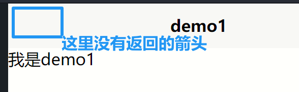

# 组件篇

由于移动端和PC端不同，为此uniapp提供了一些类似h5但是更适合移动端的组件（其实就是标签）


## 容器组件

### view

view标签类似div，但是又比div强大点。

除了用于布局view还具有如下属性:

- hover-class: 用于设置按下去的样式
- hover-stop-propagation: 阻止冒泡。比如只想要让子标签具有某个样式，不想让父标签受到影响
- hover-start-time: 按住多久才进入点击的状态
- hover-stay-time: 松开后多久才恢复成未点击的状态


```vue
<template>
	<!-- 
	hover-class: 用于设置点击后的样式 
	hover-stay-time: 松手后经过多久恢复成未点击状态
	hover-start-time: 按下后多久进入被点击状态
	hover-stop-propagation: 阻止事件冒泡（可以体会一下有这个和没这个的区别）
	-->
	<view class="box" 
	hover-class="boxHover" 
	hover-stay-time="0"
	hover-start-time="40"
	>
	<view class="inner"
	hover-class="innerHover"
	hover-stop-propagation
	>
		
	</view>
	</view>
</template>

<script setup>
</script>

<style lang="scss">
.box {
	width: 200px;
	height: 200px;
	background: #ccc;
}
.boxHover {
	background-color: orange;
	// 点击之后，宽度边长
	width: 200%;
}
.inner {
	width: 150px;
	height: 150px;
	background-color: blue;
}
.innerHover {
	background-color: yellow;
}
</style>

```


### scroll-view

使用scroll-view可以支持纵向和横向的滑动:

纵向滑动:

```vue
<template>
	<view>
		
	</view>
	<view>----</view>
	<!-- 
	 scroll-y: 开启纵向滚动（不开启的话，超出盒子的部分就看不到了）
	 -->
	<scroll-view scroll-y="true" class="scrollView">
		<view>我是内容</view>
		<view>我是内容</view>
		<view>我是内容</view>
		<view>我是内容</view>
		<view>我是内容</view>
		<view>我是内容</view>
		<view>我是内容</view>
		<view>我是内容</view>
		<view>我是内容</view>
		<view>我是内容</view>
		<view>我是内容</view>
		<view>我是内容</view>
		<view>我是内容</view>
	</scroll-view>
</template>

<script setup>
</script>

<style lang="scss">
.scrollView {
	width: 80%;
	height: 220px;
	border: 1px solid red;
}
</style>

```


效果如下，出现了纵向的滚动条:


横向滚动:

```vue
<template>
	<view>
		
	</view>
	<view>----</view>
	<!-- 
	 scroll-x: 开启横向滚动（不开启的话，超出盒子的部分就看不到了）
	 -->
	<scroll-view scroll-x class="scrollView">
		<view class='box'>我是内容</view>
		<view class='box'>我是内容</view>
		<view class='box'>我是内容</view>
		<view class='box'>我是内容</view>
	</scroll-view>
</template>

<script setup>
</script>

<style lang="scss">
.scrollView {
	width: 80%;
	height: 220px;
	border: 1px solid red;
	// 取消自动换行
	white-space: nowrap;
	
	.box {
		width: 100px;
		height: 100px;
		background-color: green;
		// 显示为行内块元素，不独占一行
		display: inline-block;
		margin: 5px;
	}
}
</style>

```


效果如下:


### swiper

滑块视图容器，一般用于左右滑动或者上下滑动，比如banner轮播图

```vue
<template>
	<view>
		<!-- 
		 indicator-dots: 用于添加指示点
		 indicator-color: 设置指示点的颜色
		 indicator-active-color: 选中时指示点的颜色
		 circular: 开启衔接滑动（即轮播图成环了）
		 autoplay: 开启自动播放（默认时间间隔为5s）
		 interval: 修改自动播放的时间间隔
		 vertical: 将滑动方向设置为纵向
		 -->
		<swiper 
		indicator-dots 
		indicator-color="#007aff"
		indicator-active-color="rgba(100,100,100,0.3)"
		circular
		autoplay
		interval="2000"
		>
			<swiper-item>1</swiper-item>
			<swiper-item>2</swiper-item>
			<swiper-item>3</swiper-item>
			<swiper-item>4</swiper-item>
		</swiper>
	</view>
</template>

<script setup>
</script>

<style lang="scss">
swiper {
	width: 100vw;
	height: 200px;
	border: 1px solid green;
	swiper-item {
		width: 100%;
		height: 100%;
		background-color: pink;
	}
	swiper-item:nth-child(2n) {
		background-color: orange;
	}
}
</style>

```


效果如下:


## 内容组件

### text

在移动端，只有被`<text>`标签包括的文字才`有可能`被选中（复制）。

想要文字可以被选中的话，需要在`<text>`标签中加上`selectable`属性:

```vue
<text selectable>我是可选的</text>
<text>我是不可选的</text>
```

如果想要显示连续的空格的话，需要加上`space`属性，space属性有三个值:

- ensp: 中文字符空格一半大小
- emsp: 中文字符空格大小
- nbsp: 根据字体设置的空格大小

```vue
<text selectable space="emsp">你 的 心 有 一 道 墙</text>
```


## 媒体组件

### image

uniapp中，如果不给图像设置宽高的话，默认为320px宽，240px高

`<image>`组件跟一般的``标签差不多，只是多了些属性。

比如`mode`: 图片裁剪、缩放的模式，常见的值如下:

- scaleToFill: 不保持纵横比缩放图片，使图片的宽高完全拉伸至填满image元素
- aspectFit: 保持纵横比缩放图片，使图片的长边能完全显示出来
- aspectFill: 保持横纵比，使图片的短边能完全显示出来
- widthFix: 宽度不变，高度自动变化
- heightFix: 高度不变，宽度自动变化


## 路由组件

使用`<navigator>`组件

```vue
<navigator url="/pages/demo1/demo1">去demo1</navigator>
<navigator url="/pages/demo2/demo2">去demo2</navigator>
```

点击之后就可以跳转到对应的页面了:


此外，该组件还有一个`open-type`属性，用来设置跳转方式。

比如open-type有一个属性值`reLaunch`，它会在跳转之前先关闭所有的页面，主要体现在跳转之后没有可以返回上个页面的箭头:



还有一个比较重要的属性`target`，它可以实现`不同小程序间的跳转`


还有，`navigator`如果想要跳到tabbar的话，就需要将`open-type`设置为`reLaunch`

## 表单组件


### input和button

```vue
<template>
<view>
	<!-- 
	 type: 设置按钮的颜色，warn为红色， primary为蓝色
	 plain: 镂空效果
	 disabled: 禁用
	 loading: 按钮前面加上加载的效果，但是依然可以点击
	 -->
	<button type='warn' plain loading>按钮</button>
	<view>--------</view>
	
	
	<!-- 
	placeholder: 设置输入框的默认内容，用户输入内容后，默认内容会自动清空 
	placeholder-style: 设置placeholder样式
	type: 设置输入类型（在手机上跟输入法有关），有text、number、idcard、digit等
		text: 文本输入键盘
		number: 数字输入键盘
		digit: 带小数点的数字输入键盘
		tel: 电话输入键盘
	maxlength: 字符最大长度
	confirm-type: 设置手机键盘右下角按钮的文字，仅type=text时有效
	
	 -->
	<input 
	type="tel" 
	placeholder="请输入搜索内容" 
	placeholder-style="color: orange" 
	maxlength="10"
	confirm-type="search"
	/>
</view>
</template>

<script setup>
</script>

<style lang="scss">

</style>

```


# 配置篇

## 尺寸单位

- px: 屏幕像素
- rpx: 响应式px，一种根据屏幕宽度自适应的动态单位。
- rem
- vh: 视窗高度，1vh等于视窗高度的1%
- vw: 视窗宽度，1vw等于视窗宽度的1%


## 样式导入

在`<style>`标签下进行样式导入

```vue
<style>
	@import '../../common/css/common.css';
</style>
```


## uni.scss

`uni.scss`中提供了许多全局的样式变量，既有官方提供的，也可以自己自定义变量:

```scss
// 自定义
$custom-color-1: red;
```

可以直接变量来给属性赋值

```vue
<style lang="scss" scoped>
    @import '../../common/css/common.css';

    view {
        color: $custom-color-1;
    }
</style>
```

另外，在scss中每句话结尾都要带分号`:`，不然会报错。


## pages.json

这里有三个地方介绍一下:

- pages: 用于设置页面路由及窗口表现
- globalstyle: 默认窗口样式（全局样式）
- tabBar: 导航栏，必须配置两个以上才会显示


```json
{
	"pages": [ 
		{
            // 页面路径
			"path": "pages/index/index",
            // 页面样式，会覆盖掉全局样式
			"style": {
				"navigationBarTitleText": "uni-app"
			}
		},
		{
			"path" : "pages/my/my",
			"style" : 
			{
				"navigationBarTitleText" : "我的"
			}
		}
	],
	"globalStyle": {
        // 导航栏标题颜色，仅支持 black/white
		"navigationBarTextStyle": "black",
        // 导航栏标题文字内容 
		"navigationBarTitleText": "uni-app",
        // 导航栏背景颜色
		"navigationBarBackgroundColor": "#00aaff",
        // 导航栏背景颜色
		"backgroundColor": "#00aaff",
        // 开启下拉刷新
        "enablePullDownRefresh": true,
        // 页面上拉触底事件触发时距页面底部的距离（比如壁纸网站页面滚动到一定距离就会加载新的图片，这里的距离就是这个）
        "onReachBottomDistance": 50,
        // 开启自定义全局样式。设置为custom之后，系统默认的全局样式都失效
        "navigationStyle": "custom"
	},
	"tabBar": {
        // tab 上的文字选中时的颜色
		"selectedColor": "#00aaff",
        // tab 的列表
		"list": [
			{
                // 页面路径
				"pagePath": "pages/index/index",
                // tab 上按钮文字
				"text": "首页",
                // 图片路径
				"iconPath": "static/tabs/home.png",
                // 被选中时的图片路径
				"selectedIconPath": "static/tabs/home-selected.png"
			},
			{
				"pagePath": "pages/my/my",
				"text": "我的",
				"iconPath": "static/tabs/my.png",
				"selectedIconPath": "static/tabs/my-selected.png"
			}
		]
	}
}

```


## easycom

组件自动引入: 只要组件在`components/组件名称/组件名称.vue`中，就可以自动引入组件


## vite.config.js


安装插件: `pnpm install unplugin-auto-import`

然后创建`vite.config.js`文件，编写如下配置:

```js
import { defineConfig } from 'vite'
import uni from '@dcloudio/vite-plugin-uni'
import AutoImport from 'unplugin-auto-import/vite'

export default defineConfig({
	plugins: [
		uni(),
		// 自动导入配置
		AutoImport({
			imports: [
				// 预设，此时项目就会自动导入vue、uniapp模块。比如ref就是vue模块中的，用了这个配置，就再也不需要手动导入了。
				'vue',
				'uni-app'
			]
		})
	]
})
```


# 模块篇

## 界面API

### 交互反馈

`uni.showToast`: 显示消息提示框

`uni.hideToast`: 隐藏提示框

```js
uni.showToast({
    // 提示框的内容。在icon不为none的情况下，微信小程序中最多只能显示7个汉字
    title: '操作成功',
    icon: 'success',
    // icon: 'none'
    
    // 自定义icon图片
    image: 'https://....',
    // 防止触摸穿透（即显示消息提示框的时候，不可以点击提示框后面的链接、按钮等）
    mask: true,
    // 设置消息框的显示时间
    duration: 3000,
    // position: 设置消息提示框的位置
    
    // 接口调用成功的回调函数
    success: toSuccess()
})

uni.hideToast()
```


`uni.showLoading`: 显示加载提示框

`uni.hideLoading`: 隐藏加载提示框

```js
uni.showLoading({
    title: '加载中......',
    mask: true,
    duration: 2000,
    // 出错时关闭加载框
    fail: err => {
        uni.hideLoading()
    }
})
```


`uni.showModal`: 显示弹窗

```js
const rm = () => {
    uni.showModal({
        title: '你真的要删除吗？',
        // content: '删除后就真的删除了哦',
        // 是否显示取消按钮
        // showCancel: false
        // 自定义取消按钮的文本
        cancelText: '算了吧',
        // 自定义取消文字的颜色
        cancelColor: '#999',
        // 自定义确定按钮文本
        confirmText: '是的呢',
        // 自定义确定文本的颜色
        confirmColor: 'red',
        // 是否显示输入框，默认为content的内容。没有content的话，则为placeholderText的内容
        editable: true,
        placeholderText: '请输入验证码',
        // 如果使用了editable的话，用户输入内容可以在res.content属性中获取到
        success: res => {
            console.log(res);
            if(res.confirm)
                uni.showToast({
                    title: '删除成功',
                    icon: 'success'
                })
            else 
                uni.showToast({
                    title: '删除失败',
                    icon: 'error'
                })
        }


    })
}
```


`uni.showActionSheet()`: 从底部向上弹出操作菜单

```js
const arr = [
    '幼儿园',
    '小学',
    '初中',
    '高中',
    '大学'
]
const select = () => {
    uni.showActionSheet({
        itemList: arr,
        // 设置选项的文字颜色
        itemColor: '#007aff',
        success: res => {
            console.log(res);
            // 获取选项的索引值，找到对应内容
            console.log(arr[res.tapIndex]);
        }
    })
}
```


### 设置导航条

`uni.setNavigationBarTitle()`: 动态设置导航条标题

```js
uni.setNavigationBarTitle({
    // 一般可以请求发送成功之后，对页面的标题进行修改
    title: '动态标题'
})
}, 2000)
```


`uni.showNavigationBarLoading()`: 在页面标题前面增加一个加载效果
`uni.hideNavigationBarLoading()`: 隐藏页面标题前面的加载效果

```js
// 在页面标题前面增加一个加载效果
uni.showNavigationBarLoading()
// uni.hideNavigationBarLoading()
```


`uni.hideHomeButton()`: 隐藏主页按钮


### 设置tabBar

一般在启动的时候设置，`App.vue`的`onLaunch`


`uni.setTabBarBadge()`: 给导航右上角添加内容

`uni.showTabBarRedDot()`: 给导航右上角添加红点

`uni.removeTabBarBadge()`: 移除导航右上角的内容

``

```js
onLaunch: function() {
    console.log('App Launch')

    uni.setTabBarBadge({
        index: 1,
        text: '23'
    })

    uni.showTabBarRedDot({
        index: 2
    })
}

// 一键已读
const read = () => {
    uni.removeTabBarBadge({
        index: 1
    })
}

const read = () => {
    uni.hideTabBarRedDot({
        index: 2
    })
}
```


### 下拉刷新

`uni.stopPullDownRefresh()`: 停止下拉刷新。原因是默认的下拉时间太长了。

```js
const stop = () => {
    uni.stopPullDownRefresh()
}
```


## 页面和路由API

`uni.navigateTo()`: 跳转到指定路由，不支持跳转到导航

`uni.reLaunch()`: 支持跳转到导航

`uni.navigateBack()`: 返回上一页

```js
const goClassify = () => {
    uni.reLaunch({
        url: '/pages/classify/classify'
    })
}

const goDemo = () => {
    uni.navigateTo({
        url: '/pages/demo/demo'
    })
}

const goBack = () => {
    uni.navigateBack()
}
```


> 路由跳转可以使用`<navigator>`组件，可以直接使用API


## 数据缓存

`uni.setStorageSync(key, value)`: 键值对存入本地缓存

`uni.getStorageSync(key)`: 从本地缓存由键取值

`uni.removeStorageSync(key)`: 根据键删除缓存

`uni.clearStorageSync()`: 清除所有缓存

```js
uni.setStorageSync('uni_key', 'hello')
uni.setStorageSync('arr', [1, 2, 3])

const arr = uni.getStorageSync('arr')
console.log(arr);
uni.removeStorageSync('uni_key')
const uni_key = uni.getStorageSync('uni_key')
console.log(uni_key);
```


## 网络API

`uni.request()`: 发送请求

无参数版: 

```js
/*
会发生回调地狱，不推荐
const post = () => {
    uni.request({
        url: 'https://jsonplaceholder.typicode.com/posts',
        success: res => {
            console.log(res.data);
        }
    })
}
*/

/*
const post = () => {
    uni.request({
        url: 'https://jsonplaceholder.typicode.com/posts'
    }).then(res => {
        console.log(res.data);
    })
}
*/

const request = async () => {
    let res = await uni.request({
        url: 'https://jsonplaceholder.typicode.com/posts'
    })
    console.log(res.data);
} 
request()
```


携带参数版:

```js
const post = async () => {
    uni.showLoading({
        title: '加载中...'
    })
    let res = await uni.request({
        url: 'https://jsonplaceholder.typicode.com/posts',
        // 查询字符串和请求体都用data
        data: {
            id: 4,
            cid: 1
        },
        // 设置超时
        timeout: 10000,
        method: 'GET',
        header: {
            token: 'adada'
        },
        success: res => {
            console.log(res);
        },
        fail: err => {
            console.log(err);
        },
        // 无论成功失败，都会执行complete
        complete: () => {
            uni.hideLoading()
        }
    })
    console.log(res.data);
}
post()
```


# 案例篇

## banner轮播图

```vue
<script setup>
	import {
		ref
	} from 'vue'

	const pictures = ref([{
			id: '1',
			url: 'https://haowallpaper.com/link/common/file/previewFileImg/69d9906ff9bf88dbc02184ecb8504fc5'
		},
		{
			id: '2',
			url: 'https://haowallpaper.com/link/common/file/previewFileImg/4578bbefd51487ca729dd4e3078192a8'
		},
		{
			id: '3',
			url: 'https://haowallpaper.com/link/common/file/previewFileImg/15189043253972288'
		},
		{
			id: '4',
			url: 'https://haowallpaper.com/link/common/file/previewFileImg/1a62cba138a786b8257ce08a760abc61'
		}
	])

	// 预览图片
	const onPreviewImage = (url) => {
		uni.previewImage({
			urls: this.pictures.map(v => v.url),
			current: url
		})
	}
</script>
<template>
	<swiper class="banner" indicator-dots circular :autoplay="false">
		<swiper-item v-for="item in pictures" :key="item.id">
			<image @tap="onPreviewImage(item.url)" :src="item.url"></image>
		</swiper-item>
	</swiper>

</template>


<style>
	.banner,
	.banner image {
		width: 750rpx;
		height: 750rpx;
	}
</style>
```


小bug，图片预览失败。


## 简单的图片小程序

### 图片组件概要

```html
<image lazy-load :src="item.url" mode="widthFix" @click="onPreview(index)"></image>
```

- lazy-load: 开启懒加载。开启了之后，图片就不会一次性就加载出来，而是按需加载。
  - 比如说每一次加载都会默认加载10张图片，而有些人刚进去就退出来了，可能只访问了几张图片。那么开启懒加载之后，页面只会显示出部分（10张里面的前几张）的图片，不会一次性加载完成，这对性能起到了优化。


### 图片预览

```js
// 图片预览，点击图片后可以对图片进行一系列操作
const onPreview = (index) => {
    let urls = pets.value.map(item => item.url)
    uni.previewImage({
        current: index,
        // urls: urls => urls 形参名和实参名一致，可以简写
        urls
    })
}
```


### 完整请求

```js
const pets = ref([])
// 发送请求
const network = () => {
    // 显示加载提示框
    // uni.showLoading()
    uni.showNavigationBarLoading()
    
    // 发送请求
    uni.request({
        url: 'https://tea.qingnian8.com/tools/petShow',
        data: {
            size: 10
        },
        Headers: {
            'access-key': 149252
        }
        // 不同响应码的处理
    }).then(res => {
        if(res.data.errCode === 0){
            pets.value = res.data.data
        }else if(res.data.errCode === 400){
            // 显示错误信息
            uni.showToast({
                title: res.data.errMsg,
                icon: 'none'
            })
        }
        // 异常捕获
    }).catch(err => {
        uni.showToast({
            title: '请求有误, 请重新刷新',
            icon: 'none'
        })
        // 不论有没有异常都要处理
    }).finally(() => {
        // uni.hideLoading()
        uni.hideNavigationBarLoading()
    })
}
```


### 加载更多和下拉刷新

```js
import { onReachBottom, onPullDownRefresh } from '@dcloudio/uni-app'

// 加载更多
onReachBottom(() => {
    // 快滑动到底部的时候，自动加载新的图片
    network()
})


// 下拉刷新(需要在pages.json将指定的页面开启下拉刷新)
onPullDownRefresh(() => {
    // 清空数组对象
    pets.value = []
    network()
    // 请求成功后，关闭下拉刷新这个动作(放在network的finally中)
})
```


### 返回顶部和手动刷新

`uni.startPullDownRefresh()`: 开始下拉刷新。效果与手动下拉刷新一致

```vue
<template>
<view class="float">
    <view class="item" @click="onRefresh">刷新</view>
    <view class="item" @click="onBackTop">顶部</view>
    </view>
</template>

<script>
    // 点击刷新
    const onRefresh = () => {
        uni.startPullDownRefresh()
    }

    // 返回顶部
    const onBackTop = () => {
        uni.pageScrollTo({
            // 返回顶部
            scrollTop: 0,
            // 返回耗时
            duration: 100
        })
    }
</script>

<style lang="scss" scoped>
    .float {
        position: fixed;
        right: 30rpx;
        bottom: 0rpx;
        padding-bottom: env(safe-area-inset-bottom);

        .item {
            width: 90rpx;
            height: 90rpx;
            background-color: rgba(255, 255, 255, 0.9);
            border-radius: 50%;
            margin-bottom: 20rpx;
            display: flex;
            align-items: center;
            justify-content: center;
            border: 1px solid #eee;
        }
    }
</style>

```


### 使用uni-ui

这里修改三个地方: 点击刷新、返回首页和加载动画

[uni-ui图标](https://uniapp.dcloud.net.cn/component/uniui/uni-icons.html)

```vue
<view class="float">
    <view class="item" @click="onRefresh">
        <uni-icons type="refreshempty" size="26" color="#888"></uni-icons>
    </view>
    <view class="item" @click="onBackTop">
        <uni-icons type="arrow-up" size="26" color="#888"></uni-icons>
    </view>
</view>
```

点击刷新和返回首页使用图标而不是文字，效果如下:


加载动画:

```vue
<view class="loadMore">
    <uni-load-more status="loading"></uni-load-more>
</view>
```


### 分段器

引入分段器是想实现下面这种效果，点击不同的按钮，就会给请求传入不同的参数值，从而获取到指定类型的数据:


```vue
<view class="menu">
    <uni-segmented-control :current="current" :values="values" @clickItem="onClickItem" styleType="button"
                           activeColor="#00AAFF"></uni-segmented-control>
</view>

<script setup>
    const current = ref(0)

    const classify = [
        {
            key: 'all',
            value: '全部'
        },
        {
            key: 'dog',
            value: '狗'
        },
        {
            key: 'cat',
            value: '猫'
        }
    ]

    const values = computed(() => classify.map(item => item.value))

    // 分段器: 点击菜单
    const onClickItem = (e) => {
        current.value = e.currentIndex
        pets.value = []
        network()
    }
</script>
```

