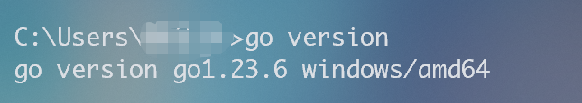
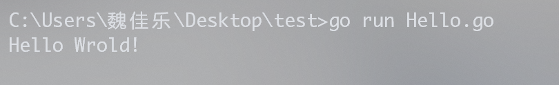
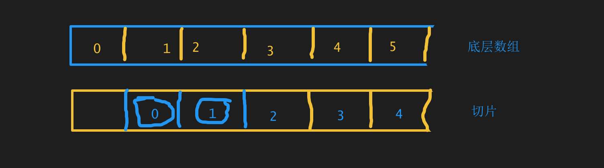
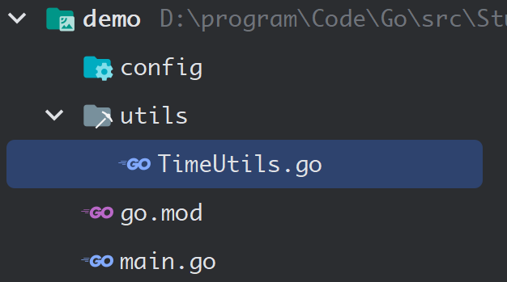
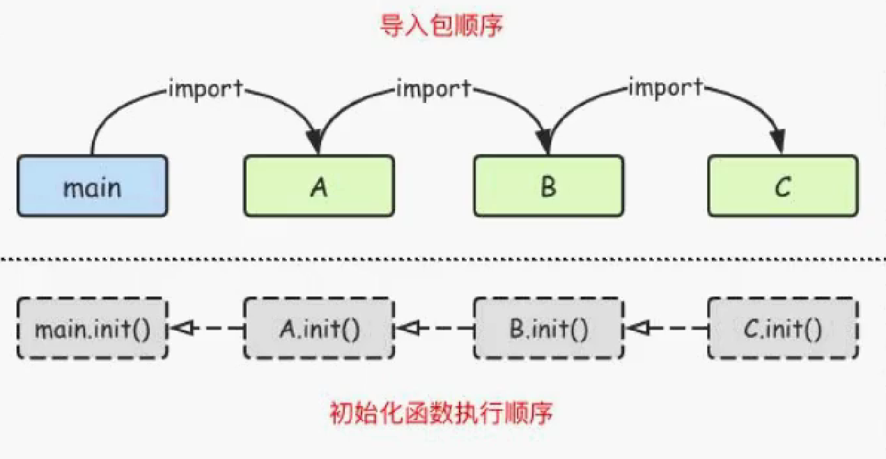

[TOC]


# 准备篇

## 概述


## 环境

### 编译环境

去[Go的官网](https://golang.google.cn/dl/)下载Go的编译工具包。


跟着引导程序一路安装即可，执行`go version`检查是否成功安装：



接着，我们需要在配置两个环境变量`GOROOT`和`GOPATH`

> GOROOT：指明Go的工作目录，配置成Go安装时候的主目录
>
> GOPATH：指明Go一些依赖下载的地址、项目目录、代码目录。此外，在该目录下需要创建三个子目录：`src`、`pkg`和`bin`

配置完成后，执行`go env`检查这两个环境变量的配置是否正确（可能`GOPATH`会有问题，需要手动在用户变量中进行修改）


### 编译工具

我们使用`GoLand`开发Go程序。

安装完GoLand，先写一个入门程序：

```go
package main

// 导入一个系统包fmt，用来输出
import "fmt"

func main() {
    fmt.Println("Hello Wrold!")
}
```


> 所有可执行文件都必须在`package main`里面，并且可执行的程序一定有一个`func main()`

执行`go run hello.go`




## 注释

Go中的注释和Java一样：

```go
// 单行注释

/*
多行注释
*/
```


## Go命令

```sh
# 1. go build: 将Go文件编译成.exe文件
go build main.go

# 2. go clean: 清除编译文件
# -i: 清除可执行文件
# -n: 把需要执行的清除命令打印出来
go clean -i -n

# 3. go fmt: 格式化文件（Goland似乎是通过该命令完成格式化的）
go fmt main.go

```


# 语法篇

## 变量

### 变量的声明

在Go中，声明一个变量的顺序为：变量名、数据类型和赋值

```go
// var 是声明变量的关键字
var name string = "Halory"

// var 可以一次性声明多个变量
var (
    // string的默认值为空串
    name string = "Halory"
    // int的默认值为0
    age  int    = 20
)

// 使用 := 进行变量的声明和初始化（自动推导）
func main() {
    name := "Halory"
    age := 18

    // %T可以输出变量的类型
    fmt.Printf("%T, %T\n", name, age)
    fmt.Printf("name: %s, age: %d\n", name, age)
    // %p可以打印出变量的地址，&称为取地址符
	fmt.Printf("name addr: %p, age addr: %p", &name, &age)

}
/*
string, int
name: Halory, age: 18
name addr: 0xc00010e2a0, age addr: 0xc00010c098
*/
```


> 在Go中，变量如果声明之后**没有被使用**是会报错的。通过`:=`声明的变量本身包含了一个创建的过程，因此无法在声明变量后再通过`:=`给已经声明的变量赋值。

```go
var name string = ""
// 错误
name := "Halory"
```


### 变量交换

Go语言中实现`swap`操作非常简单，和Python一样：

```go
var a int = 100
var b int = 200

a, b = b, a
```


### 匿名变量

当一个函数返回值比较多时，而我们又不会全部使用到，就可以使用匿名变量（`_`），`_`本身就是一个空白标识符。

```go
package main

import "fmt"

func test()(int, int)  {
    return 100, 200
}

func main() {
    a, _ := test()
    fmt.Println(a)

}

```


### 作用域

声明在顶层的变量称为全局变量，声明在函数体内部的变量称为局部变量。

在Go中，局部变量可以和全局变量**同名**，但是在使用时遵循就近原则（局部变量优先于全局变量）

```go
package main
import "fmt"
// 全局
var name = "Hello"

func main() {
    // 局部
    var name = "Halory"
    fmt.Println(name) // Halory
}
```


### 常量

常用使用`const`来定义，也可以同时定义多个常量

```go
const PI, name = 3.14, "Halory"
```

在Go里面，有一个特殊的常量`iota`，可以认为时一个**可以被编译器修改的常量**，是Go的常量计数器。

在**一组常量**中，第一个`iota`等于0，每次增加新的一行常量，`iota`就会自增。如果在**一组常量**中，某行常量没有初始值，则默认**和上一行一致**。

```go
package main
import "fmt"
func main() {
	const (
		a = iota			// iota 0
		b					// iota 1
		c					// iota 2
        d = "Halory"		// Halory (iota 3)
        e					// Halory (iota 4)
		f = iota			// iota 5
	)
	fmt.Println(a, b, c, d, e, f)
    // 0 1 2 Halory Halory 5
}

```


## 基本数据类型

### 布尔型

布尔型（bool）只有`true`和`false`两个值，默认为`false`

```go
func main() {
	var flag bool
	fmt.Println(flag)
    // false
}
```


### 数值型

整型int和浮点型float32、float64，Go语言支持整型和浮点型数字，并且支持复数，其中位的运算采用补码。

```go
func main() {
	var age = 18
	fmt.Printf("%T, %d\n", age, age) // int, 18
    
    // byte是uint8的别名，范围是0~255
	var b byte = 255
	fmt.Printf("%T, %d\n", b, b) // uint8, 255

	// 浮点数，打印时默认保留6位小数 3.190000
	var pi = 3.19
	// 打印时只保留1位小数，并且会四舍五入
	fmt.Printf("%T, %.1f", pi, pi) // float64, 3.2
}
```


### 字符型

字符型分为字符和字符串，对于字符，在Go语言中是使用`int32`存储的，其对应编码表（ASCII、Unicode）；对于字符串，其类型为`string`。

```go
func main() {
    str := "Halory"
    fmt.Printf("%T, %s\n", str, str) // string, Halory

    v1 := 'A'
    v2 := "A"
    v3 := '中'
    fmt.Printf("%T, %d\n", v1, v1) // int32, 65
    fmt.Printf("%T, %s\n", v2, v2) // string, A
    fmt.Printf("%T, %d\n", v3, v3) // int32, 20013
}
```


### 数据类型转换

在Go语言中，不存在隐式类型转换，因此**所有类型转换都必须显式声明**。

```go
func main() {
	a := 3
	b := 5.0
	c := float64(a)
	d := int(b)

	fmt.Printf("%T\n", a)
	fmt.Printf("%T\n", b)
	fmt.Printf("%T\n", c)
	fmt.Printf("%T\n", d)
}
```


> 注：在Go语言中，**布尔型和数值型无法相互转换**。


## 运算符

```go
// 算数运算符: + - * / % ++ --
// 比较运算符: < > <= >= == !=
// 逻辑运算符: && || !
// 位运算符: & | ^ &^ << >>
// 赋值运算符: = += -= *= /= %= <<= >>= &= ^= |=
```

## 扩展：输入输出

```go
func main() {
    var a int
    var b float64
    fmt.Println("请输入两个数a、b:")
    fmt.Scanln(&a, &b)
    fmt.Printf("a = %d, b = %.2f", a, b)
}
```


## 流程控制

### if

在Go语言中，`if`语句中的条件判断无需加括号`()`

```go
func main() {
    var score int
    fmt.Println("请输入score的值：")
    fmt.Scanln(&score)
    if score > 90 {
        fmt.Println("有机会保研")
    } else if score > 80 {
        fmt.Println("有机会拿奖学金")
    } else {
        fmt.Println("有机会上分")
    }
}
```


### switch

在Go语言中，`switch`的每一个分支最后都默认自带`break`语句。

```go
func main() {
    var choose int
    fmt.Println("请输入choose的值：")
    fmt.Scanln(&choose)
    switch choose {
        case 1:
        fmt.Println("当老板")
        case 2:
        fmt.Println("当首相")
        case 3:
        fmt.Println("当教授")
        default:
        fmt.Println("当码农")
    }
}
```

此外，Go语言还提供了一个关键字`fallthrough`，它可以穿透case，不管下一个条件满不满足都会执行。

```go
func main() {
	a := false
	switch a {
	case false:
		fmt.Println("Case 条件为 false")
		fallthrough
	case true:
		// 手动阻止fallthrough
		if !a {
			break
		}
		fmt.Println("Case 条件为 true")

	}
}
```


### for

Go语言中的`普通for`循环有三种写法：

```go
func main() {
    // 1. 标准写法
    for i := 1; i < 10; i++ {
        fmt.Println(i)
    }

    // 2. 条件起始值移出
    j := 1
    for j < 10 {
        fmt.Println(j)
        j++
    }

    // 3. 终止条件移出
    k := 1
    for {
        // 如果没有条件判断则会无限循环
        if k > 10 {
            break
        }
        fmt.Println(k)
        k++
    }
}
```


### 字符串切片

在Go中，字符串是字符的集合，可以遍历字符串来获取每一个字符。这里我们可以使用`for`循环和`for range`循环进行遍历。

```go
func main() {
    str := "Halory"

    // 1. 使用普通for
    for i := 0; i < len(str); i++ {
        // 字符输出
        fmt.Printf("%c ", str[i])
    }
    
    fmt.Println()
    
    // 2. 使用for range
    for i, v := range str {
        // 索引i，元素v
        fmt.Printf("str[%d] = %c\n", i, v)
    }
}
/*
H a l o r y 
str[0] = H
str[1] = a
str[2] = l
str[3] = o
str[4] = r
str[5] = y
*/
```


## 函数

### 定义

在Go语言中定义函数的语法如下：

```go
func name(p1, p2, ...) (returnType) {
    // code
    return res
}
```

下面是比较典型的几个函数声明：

```go
// 相同参数类型，一个返回值
func add(a, b int) int {
    return a + b
}

// 不同参数类型，没有返回值
func justPrint(a int, b string)  {
    fmt.Println(a, b)
}

// 相同参数类型，两个返回值
func swap(a, b int) (int, int) {
    return b, a
}
```


### 可变参数

一个函数的参数列表中最多只能有一个可变参数，且可变参数必须放在参数列表的最后。

```go
func main() {
	sums(1, 2, 3, 4, 5, 6)
}

func sums(nums ...int) {
    // 输出的是一个切片：[1 2 3 4 5 6]
	fmt.Println(nums)
}
```


### 参数传递

参数传递分为：

- 值传递：传递的是数据的副本，修改数据时，对原始数据没有影响。比如基本数据类型、数组、结构体
- 引用传递：传递的数据的地址，修改数据时会影响原始数据。比如切片、集合、map

> 注：切片和数组有区别，切片可以扩容，而数组长度固定。

```go
func main() {
    // 定义一个数组: [元素个数]元素类型{元素1, 元素2, ...}
    arr := [4]int{1, 2, 3, 4}
    fmt.Println(arr)
    updateArr(arr)
    fmt.Println(arr) // [1 2 3 4]

    // 定义一个切片: []元素类型{元素1, 元素2, ...}
    sli := []int{1, 2, 3, 4}
    fmt.Println(sli)
    updateSlice(sli)
    fmt.Println(sli) // [100 2 3 4]
}

// 值传递
func updateArr(arr [4]int) {
    arr[0] = 100
}

// 引用传递
func updateSlice(sli []int) {
    sli[0] = 100
}
```


### defer

在Go语言中，可以使用`defer`关键字来延迟某个函数的执行。如果一个函数中存在多个延迟执行的语句，那么则采用后进先出的模式执行。

> 注：1. 当你在进行一些打开资源的操作时，遇到错误需要提前返回，在返回前你需要关闭相应的资源，不然很容易造成资源泄露等问题。2. `defer`只是延迟语句的执行，但是参数依然是按照语句的顺序传递进去的。

```go
func main() {
    f("1")
    // 这里的"第一条延迟的语句"在执行f("2")之前就已经传递进去了
    defer f("第一条延迟的语句")
    f("2")
    defer f("第二条被延迟的语句")
    f("3")
    defer f("第三条被延迟的语句")

}

func f(a string) {
    fmt.Println(a)
}
/*
1
2
3
第三条被延迟的语句
第二条被延迟的语句
第一条延迟的语句
*/
```


### panic和recover

由于Go语言中没有异常捕获机制，如果程序遇到了错误，则可以使用`panic`和`recover`来进行处理。

```go
func main() {
	fn1()
	fn2()
	fmt.Println("结束")
}

func fn1() {
	fmt.Println("fn1")
}

func fn2() {
	defer func() {
        // recover可以捕获异常信息，但是必须得使用defer，不然无法捕获异常。
		err := recover()
		if err != nil {
			fmt.Println(err)
		}
	}()
    // panic可以用于抛出异常
	panic("抛出一个异常")
}
/*
fn1
抛出一个异常
结束
*/
```


再来一个经典的除零错误：

```go
func main() {
    fun(1, 0)
    fmt.Println("程序结束")
}

func fun(a, b int) {
    defer func() {
        err := recover()
        if err != nil {
            fmt.Println("捕获到错误: ", err)
        }
    }()
    fmt.Println(a / b)
}
/*
捕获到错误:  runtime error: integer divide by zero
程序结束
*/
```


### 匿名函数

> 注：学习匿名函数之前，要清楚**函数本身也是一个数据类型**，并且**可以被变量接收**。

匿名函数就是没有函数名的函数，它可以被变量接收、可以被调用，也可以被执行。

```go
func main() {
	// 1. 创建一个无参无返回值的匿名函数，并调用（自己调用自己）
	func() {
		fmt.Println("1. 我是匿名函数")
	}()

	// 2. 用变量接收一个无参无返回值匿名函数，并调用
	f1 := func() {
		fmt.Println("2. 我是匿名函数")
	}
	f1()

	// 3. 有参数无返回值的匿名函数（自己调用自己）
	func(a, b int) {
		fmt.Println(a + b)
	}(1, 2)

	// 4. 有参数无返回值的匿名函数，被变量接收
	add := func(a, b int) {
		fmt.Println(a + b)
	}
	add(1, 3)

	// 5. 有参数有返回值的匿名函数，变量接收返回值
	res := func(a, b int) int {
		return a + b
	}(1, 4)
	fmt.Println(res)

}

```


### 回调函数

如果**函数A**可以作为另外一个**函数B**的参数，那么函数B就叫做**高阶函数**，而函数A就叫做**回调函数**。

```go
func main() {
    op := func(a, b int, fun func(int, int) int) {
       fmt.Println(fun(a, b))
    }
    // op存储的就是一个高阶函数，而add就是回调函数
    op(1, 2, add) // 3

}

func add(a, b int) int {
    return a + b
}
```


### 闭包

一个外层函数中，有内层函数，该内层函数中，会操作外层函数的局部变量，并且该外层函数的返回值就是这个内层函数。这个内层函数和外层函数的局部变量，统称为**闭包结构**。

局部变量的生命周期就会发生改变，正常的局部变量会随着函数的调用而创建，随着函数的结束而销毁。但是闭包结构中的外层函数的局部变量并不会随着外层函数的结束而销毁，因为内层函数还在继续使用。

```go
func main() {
    // 拿到increment函数的返回值 => 一个无参，返回值为int的函数
    r1 := increment()
    // 执行函数
    fmt.Println(r1()) // 1
    fmt.Println(r1()) // 2
    fmt.Println(r1()) // 3

    // 用另外一个变量接收increment的返回值
    r2 := increment()
    // 执行函数
    fmt.Println(r2()) // 1
    fmt.Println(r1()) // 4
    fmt.Println(r2()) // 2

}

// 自增
func increment() func() int {
    // 局部变量i
    i := 0
    // 定义一个匿名函数，给变量自增并返回（内层函数）
    fun := func() int {
        i++
        return i
    }
    return fun
}
```


> 猜测：当函数`incremnet`的返回值被`r1`接收时，该返回值（即内层函数）中的局部变量`i`的生命周期就和`r1`**绑定**在了一起，只有`r1`被销毁了之后，局部变量`i`才会被销毁。就好像肚子里的蛔虫。


## 其他数据类型

### 数组

在Go中，数组的长度也是类型的一部分，即数组创建时必须指定元素个数（也意味着数组类型不可扩容）

```go
func main() {
    // 手动指明元素个数
    arr1 := [3]int{1, 2, 3}
    // 自动推断元素个数
    arr2 := [...]int{1, 2, 3}
    
    fmt.Printf("arr1: %T\n", arr1)
    // arr1: [3]int
    fmt.Printf("arr2: %T", arr2)
    // arr2: [3]int

}

	// 数组的其他创建方式，指定索引赋值，并且自动推断元素个数
	arr3 := [...]int{0: 1, 6: 1}
	fmt.Printf("arr1: %T\n", arr3) // arr1: [7]int
	fmt.Println(arr3) // [1 0 0 0 0 0 1]
```


下面创建一个二维数组：

```go
func main() {
	// 只有第一层可以使用自动推断元素个数
	arr := [...][2]string{
		{"胡桃", "往生堂第七十七代堂主"},
		{"钟离", "岩王帝君"},
	}
	fmt.Println(arr)
    // [[胡桃 往生堂第七十七代堂主] [钟离 岩王帝君]]
    fmt.Println(arr[0][0])
    // 胡桃
}
```


### 切片

切片和数组类似，只不过切片可以扩容，并且切片是一个**引用类型**

> 提一嘴：引用类型的默认值是`nil`

#### 手动创建切片

```go
func main() {
	// 手动创建切片
	a := []int{1, 2, 3, 4, 5}
	fmt.Printf("%T-%v\n", a, a)
    // []int-[1 2 3 4 5]

	// 基于数组定义切片
	b := [5]int{2, 4, 6, 8, 10}
	a = b[:] // 获取数组里面所有的值
	fmt.Printf("%T-%v\n", a, a)
    // []int-[2 4 6 8 10]
}
```


> 注：在Go中，数组和切片都可以进行切片操作，但是不能指定步数，也不能倒序取数（甚至使用切片时不能出现负数）

#### 长度和容量

下面介绍一下切片的长度和容量，这是两个不同的东西。

- 长度：切片中元素的个数
- 容量：从切片的第一个元素开始数，到其底层数组元素末尾的个数

```go
func main() {
    s := []int{2, 3, 5, 7, 11, 13}
    fmt.Printf("长度%d 容量%d\n", len(s), cap(s))
    // 长度6 容量6

    a := s[2:]
    fmt.Printf("长度%d 容量%d\n", len(a), cap(a))
    // 长度4 容量4

    b := s[1:3]
    fmt.Printf("长度%d 容量%d\n", len(b), cap(b))
    // 长度2 容量5

    c := s[:3]
    fmt.Printf("长度%d 容量%d\n", len(c), cap(c))
    // 长度3 容量6
}
```


> 切片的本质就是是对底层数组的封装，它包含了三个信息：底层数组的指针、切片的长度（len）和切片的容量（cap）。

以`b := s[1:3]`为例，创建出来的切片`b`，其首指针（切片的第一个元素）指向的是数组中第二个元素的地址，而切片的长度为`3 - 1 = 2`，由于底层的数组`s`的长度为`6`，所以切片`b`总共可以容纳`1~5`即`5`个元素，所以该切片的长度为`5`




#### make

下面通过`make`函数来初始化切片：

```go
func main() {
	sli := make([]int, 4, 8)
	fmt.Printf("类型: %T\n值: %v\n长度: %d\n容量: %d", sli, sli, len(sli), cap(sli))
    /*
类型: []int
值: [0 0 0 0]
长度: 4
容量: 8
    */
}
```


既然切片可以扩容，那么它应该如何扩容？切片并不能通过索引下标进行扩容，而是需要借助`append()`函数来实现对底层元素的扩容。

```go
func main() {
	var sli []int
    // 1. 切片扩容
	sli = append(sli, 1, 2, 3, 4, 5)
	fmt.Println(sli)
    // [1 2 3 4 5]
	fmt.Printf("容量: %d", cap(sli))
    // 容量: 6
    
    // 2. 合并切片
    sli01 := []int{1, 2, 3}
	sli02 := []int{4, 5, 6}
	sli := append(sli01, sli02...)
	fmt.Println(sli)
    // [1 2 3 4 5 6]
    
    // 3. 切片的扩容策略
	var sli []int
	for i := 1; i < 10; i++ {
		sli = append(sli, i)
		fmt.Printf("%v-长度: %d 容量: %d\n", sli, len(sli), cap(sli))
	}
    /*
    [1]-长度: 1 容量: 1
	[1 2]-长度: 2 容量: 2
	[1 2 3]-长度: 3 容量: 4
	[1 2 3 4]-长度: 4 容量: 4
	[1 2 3 4 5]-长度: 5 容量: 8
	[1 2 3 4 5 6]-长度: 6 容量: 8
	[1 2 3 4 5 6 7]-长度: 7 容量: 8
	[1 2 3 4 5 6 7 8]-长度: 8 容量: 8
	[1 2 3 4 5 6 7 8 9]-长度: 9 容量: 16
    */
}
```


> 实际上，切片的扩容策略并不是表面看上去的两倍两倍地增加的，还有其他的情况，这个等有兴趣的时候再研究。

#### 其他操作

切片的其他操作：

```go
import (
	"fmt"
	"sort"
)
func main() {
	// 1. 拷贝切片（深拷贝）
	sli01 := []int{1, 9, 6, 4, 7}
	sli := make([]int, 5)
	copy(sli, sli01)
	fmt.Println(sli)
    // [1 9 6 4 7]
	sli01[0] = 5
	fmt.Println(sli)
    // [1 9 6 4 7]


	// 2. 删除切片第二个元素
	sli = append(sli[:1], sli[2:]...)
	fmt.Println(sli)
    // [1 6 4 7]
    
    // 3. 升序排序
	sort.Ints(sli)
	fmt.Println(sli)
	// [1 4 6 7]
	
	// 4. 降序排序
	sort.Sort(sort.Reverse(sort.IntSlice(sli)))
	fmt.Println(sli)
	// [7 6 4 1]
}
```


### map

map是一种键值型的数据结构

#### 创建map

```go
func main() {
    // 1. 使用make创建map
    var u1 = make(map[string]string)
    u1["username"] = "Halory"
    u1["age"] = "20"
    fmt.Println(u1)

    // 2. 创建时填充元素
    var u2 = map[string]string{
        "username": "Halory",
        "age":      "20",
    }
    fmt.Println(u2)
}
// map[age:20 username:Halory]
```


#### 遍历map

```go
func main() {
    var u = map[string]string{
        "username": "Halory",
        "age":      "20",
    }

    // 遍历map
    for k, v := range u {
        fmt.Printf("key: %v, value: %v\n", k, v)
    }
}
/*
key: username, value: Halory
key: age, value: 20
 */
```


#### crud

```go
func main() {
	var u = map[string]string{
		"username": "Halory",
		"age":      "20",
		"sex":      "男",
	}

	// 增
	u["money"] = "20k"
	fmt.Println(u)
	// map[age:20 money:20k sex:男 username:Halory]

	// 改
	u["money"] = "30k"
	fmt.Println(u)
	// map[age:20 money:30k sex:男 username:Halory]

	// 查
	v, ok := u["money"]
	fmt.Println(v, ok) // 如果没找到，则分别返回nil、false
	// 30k true

	// 删
	delete(u, "money")
	fmt.Println(u)
	// map[age:20 sex:男 username:Halory]

}
```


#### map的切片

```go
func main() {
	var users = make([]map[string]string, 2)
	users[0] = map[string]string{
		"name": "Halory",
		"age":  "20",
		"sex":  "男",
	}
	fmt.Println(users)
    // [map[age:20 name:Halory sex:男] map[]]
}
```


#### 切片类型的map元素

```go
func main() {
    user := map[string][]string{
        "hobby": {"Go", "Kotlin", "React", "SpringBoot"},
    }
    fmt.Println(user)
}
```


#### 使用map实现单词统计

```go
package main

import (
	"fmt"
	"strings"
)

func main() {
	str := "How do you do"
	words := strings.Split(str, " ")
	m := make(map[string]int)
	for _, v := range words {
		m[v]++
	}
	fmt.Println(m)
    // map[How:1 do:2 you:1]
}
```


## 常用包和函数

### time

日期获取、输出、转换类常用方法：

```go
func main() {
    // 1. 获取当前日期
    now := time.Now()
    fmt.Println(now) // 2025-02-07 18:18:19.0227307 +0800 CST m=+0.000000001

    // 2. 格式化输出日期
    // 2.1 手动格式化
    fmt.Printf("%d-%02d-%02d %02d:%02d:%02d\n", now.Year(),
               now.Month(), now.Day(), now.Hour(), now.Minute(), now.Second()) // 2025-02-07 18:20:22

    // 2.2 使用Format进行格式化
    // 但是注意是Go语言中格式化时间模板不是常见的Y-m-d H:M:S
    // 而是Go的诞生时间2006年1月2号15点04分（03表示12小时制，15表示24小时制）
    fmt.Println(now.Format("2006-01-02 03:04:05")) // 2025-02-07 06:24:41
    fmt.Println(now.Format("2006/01/02 03:04:05")) // 2025/02/07 06:24:41
    fmt.Println(now.Format("2006-01-02 15:04:05")) // 2025-02-07 18:26:18
    fmt.Println(now.Format("2006/01/02 15:04:05")) // 2025/02/07 18:26:18

    // 3. 获取时间戳
    unixTime := now.Unix()
    unixNanoTime := now.UnixNano()
    fmt.Println("毫秒时间戳: ", unixTime)     // 1738924231
    fmt.Println("纳秒时间戳: ", unixNanoTime) // 1738924231028707300

    // 4. 时间戳转为日期字符串
    obj := time.Unix(unixTime, 0)
    fmt.Println("时间戳转为日期字符串: ", obj.Format("2006-01-02 15:04:05")) // 2025-02-07 18:34:31

    // 5. 日期字符串转为时间戳
    timeObj, _ := time.ParseInLocation("2006-01-02 15:04:05", "2025-01-01 00:00:00", time.Local)
    fmt.Println("日期字符串转为时间戳: ", timeObj.Unix()) // 1735660800

    // 6. 使用时间单位常量
    fmt.Println("一小时: ", time.Hour) // 1h0m0s
}
```


日期操作函数：

```go
package main

import (
    "fmt"
    "time"
)

func main() {
    // 1. 获取当前日期
    now := time.Now()
    fmt.Println(now) // 2025-02-07 18:41:35.1079296 +0800 CST m=+0.000000001

    // 1. 增加一小时
    fmt.Println(now.Add(time.Hour)) // 2025-02-07 19:41:35.1079296 +0800 CST m=+3600.000000001

    // 2. 求两个日期差值
    openDate, _ := time.Parse("2006-01-02", "2025-02-17")
    fmt.Println(now.Sub(openDate))

    // 3. 定时器（每秒钟执行），5秒后结束
    ticker := time.NewTicker(time.Second)
    n := 5
    for t := range ticker.C {
        n--
        fmt.Println(t)
        if n == 0 {
            ticker.Stop() // 终止该定时器执行
            break
        }
    }

    // 4. 使用进程休眠实现定时器
    for {
        time.Sleep(time.Second)
        fmt.Println(now)
    }

}

```


## 指针

指针变量是一个变量，是变量就会在内存中有一个地址，它存储的是其他变量的地址。

```go
import "fmt"

func main() {
    // 创建一个变量
    a := 1
    fmt.Printf("a变量的地址为: %p\n", &a)
    // a变量的地址为: 0xc00000a0e8

    // 创建一个指针变量
    p := &a
    fmt.Printf("p的地址为: %p, p的值为: %v, p的类型为: %T\n", &p, p, p)
    // p的地址为: 0xc00006e0d8, p的值为: 0xc00000a0e8, p的类型为: *int

    // 通过访问变量的内存修改变量的值
    *p = 2

    // 打印当前变量的值
    fmt.Println(a)
    // 2
}
```


在Go中分配内存有两种方式：`make`和`new`，区别如下：

- `make`只用于给`slice`、`map`和`channel`进行初始化，返回的还是这三个**引用类型本身**
- `new`用于类型的内存分配，并且内存对应的值为类型零值，返回的是指向类型的**指针**


## 结构体

Go中没有**类**的概念，有的只是**结构体**。和其他面向对象语言中的类相比，Golang中的结构体具有更高的扩展性和灵活性。

### type

将结构体之前，先介绍一下**自定义类型**和**类型别名**，两者均用`type`声明。

自定义类型是创建了一个没有的类型，而类型别名只是给已有的类型起了一个名字（比如`byte`）

```go
package main
import "fmt"
// 自定义类型
type myInt int
// 类型别名
type intAlias = int
func main() {
	var a myInt = 10
	var b intAlias = 10
	fmt.Printf("a的类型为: %T\n", a) // a的类型为: main.myInt
	fmt.Printf("b的类型为: %T\n", b) // b的类型为: int
}

```


### 结构体的定义

结构体除了使用到`type`关键字，还需要用到`struct`。

```go
// 直接举例
type User struct {
	name string
	age int
	sex string
}
```


> 注：结构体名称首字母大小表示公有（User），小写则表示私有（user）。结构体属性同理。


### 实例化结构体

最简单的一种方法就是通过`var`来创建一个对象：

```go
func main() {
	var user User
	user.name = "Halory"
	user.age = 20
	user.sex = "男"
	fmt.Printf("值: %v 类型: %T\n", user, user)
    // 值: {Halory 20 男} 类型: main.User
	fmt.Printf("详细值: %#v 类型: %T\n", user, user)
    // 详细值: main.User{name:"Halory", age:20, sex:"男"} 类型: main.User
}
```

第二种方式，我们可以使用`new()`来创建对象：

```go
func main() {
	var user = new(User)
	user.name = "Halory"
	user.age = 20
	user.sex = "男"
	fmt.Printf("值: %v 类型: %T\n", user, user)
    // 值: &{Halory 20 男} 类型: *main.User
	fmt.Printf("详细值: %#v 类型: %T\n", user, user)
    // 详细值: &main.User{name:"Halory", age:20, sex:"男"} 类型: *main.User
}
```

从打印的结果中可以看到，通过`new()`创建的对象本质上是一个结构体指针。

> 注：在Golang中支持对**结构体指针**直接使用`.`来访问结构体的成员。而`user.name = "Halory"`在底层其实是`(*user).name = "Halory"`

第三种方式，我们可以直接通过取地址符`&`来获取结构体的地址，然后实例化结构体对象。效果等同于`new()`：

```go
var user = &User{}
```

下面是创建对象的同时，实例化对象：

方式一：

```go
func main() {
    // 此时给每个属性赋值时，后面都要跟上逗号。
	user := User{
		name: "Halory",
		age:  20,
		sex:  "男",
	}
	fmt.Printf("值: %v 类型: %T\n", user, user)
    // 值: {Halory 20 男} 类型: main.User
	fmt.Printf("详细值: %#v 类型: %T\n", user, user)
    // 详细值: main.User{name:"Halory", age:20, sex:"男"} 类型: main.User
}
```

方式二：

```go
func main() {
	user := &User{
		name: "Halory",
		age:  20,
		sex:  "男",
	}
	fmt.Printf("值: %v 类型: %T\n", user, user)
    // 值: &{Halory 20 男} 类型: *main.User
	fmt.Printf("详细值: %#v 类型: %T\n", user, user)
    // 详细值: &main.User{name:"Halory", age:20, sex:"男"} 类型: *main.User
}
```

对于赋值顺序和属性定义顺序一致的情况，还可以省略属性名：

```go
user := User{
    "Halory",
    20,
    "男",
}
```

> 注：结构体是**值类型**，不是引用类型。

### 结构体方法

Golang中虽然没有类的概念，但是可以给类型（结构体，自定义类型）定义方法。所谓方法，就是定义了**接收者**的函数。接收者的概念类似于其他语言中的`this`或者`self`。

方法的定义格式如下：

```go
func (接收者变量 接收者类型) 方法名(参数列表)(返回参数) {
    函数体
}
```

例如下面定义了一个`PrintInfo`的接收者函数：

```go
import "fmt"

type User struct {
    name string
    age  int
    sex  string
}

func (u User) PrintInfo() {
    fmt.Printf("name: %v age: %v", u.name, u.age)
}

func main() {
    user := User{
        "Halory",
        20,
        "男",
    }
    user.PrintInfo()
    // name: Halory age: 20
}
```

如果要修改结构体信息的话，那么接收者必须是**结构体指针**。因为结构体是值类型，调用函数并不能修改当前的结构体实例的值，所以必须传入指针才行。

```go
func (u *User) SetUserInfo(name string, age int) {
    u.name = name
    u.age = age
}

func main() {
    user := User{
        "Halory",
        20,
        "男",
    }
    user.SetUserInfo("Jack", 16)
    // name: Jack age: 16
    user.PrintInfo()
}
```


### 结构体匿名字段

结构体允许其成员字段在声明时**没有字段名而只有类型**，这种没有名字的字段就称为匿名字段。匿名字段**默认使用类型名作为字段名**，由于结构体要求字段名称必须唯一，所以匿名字段的类型不能相同。

```go
package main

type Person struct {
	string
	int
}
func main() {
	p := Person{
		"Halory",
		20,
	}
	fmt.Printf("name: %v age: %v", p.string, p.int)
    // name: Halory age: 20
}

```

### 复杂结构体类型

结构体的字段可以是基本数据类型、切片、map和结构体。

对于基本数据类型，由于有默认值，所以可以在创建结构体实例时直接给对应的属性赋值，但是引用类型如切片和map，在赋值之前必须先给这类属性分配内存，然后才可以赋值：

```go
package main
import "fmt"
type User struct {
    name  string
    age   int
    hobby []string
    level map[string]int
}
func main() {
    user := User{
        name: "Halory",
        age:  20,
    }
    user.hobby = make([]string, 2)
    user.hobby[0] = "Golang"
    user.hobby[1] = "Music"
    user.level = make(map[string]int)
    user.level["Java"] = 80
    user.level["React"] = 80
    fmt.Printf("%#v", user)
    // main.User{name:"Halory", age:20, hobby:[]string{"Golang", "Music"}, level:map[string]int{"Java":80, "React":80}}
}
```


结构体中的属性也可以为结构体类型，这样的使用场景也非常多，比如在大学里面，每一个老师除了个人的基本信息`User`之外，还有所在的部门信息`Dept`，对此我们可以借助结构体嵌套来实现：

```go
package main
import "fmt"
type User struct {
    Username string
    Age      int
    // 由于结构体支持匿名字段，因此我们可以省略不写Dept的字段名
    Dept
}
type Dept struct {
    DeptName string
    Location string
}

func main() {
    user := User{
        Username: "Halory",
        Age:      20,
        Dept: Dept{
            DeptName: "网络安全教研室",
            Location: "计算机学院",
        },
    }
    fmt.Printf("%#v", user)
    // main.User{Username:"Halory", Age:20, Dept:main.Dept{DeptName:"网络安全教研室", Location:"计算机学院"}}

}
```

如果结构体和嵌套结构体的字段都不一致，那么对于类型为结构体的字段，我们就可以无需经过`.结构体.属性`来给字段赋值：

```go

func main() {
	user := User{
		Username: "Halory",
		Age:      20,
	}
    // 如果User字段里面没有Location，那么GO就会去嵌套的结构体的属性中找
	user.DeptName = "网络安全教研室"
	user.Location = "计算机学院"
	fmt.Printf("%#v", user)
    // main.User{Username:"Halory", Age:20, Dept:main.Dept{DeptName:"网络安全教研室", Location:"计算机学院"}}

}
```


### 继承

结构体的继承是通过结构体嵌套实现的，其思路和上面例子中的`user.DeptName`类似。比如说有两个结构体`Animal`和`Dog`，其中`Dog`中有一个字段类型为`Aniaml`。现在给`Animal`创建了一个接收者方法`run()`，再创建一个`Dog`实例对象`dog`，此时我们调用`dog`对象的方法会发现出现了`run()`这个函数，其思路就是：**先从当前结构体中寻找属性、方法，如果当前结构体中没有，则从嵌套结构体中寻找：

```go
package main
import "fmt"
type Animal struct {
	name string
}
func (animal Animal) run() {
	fmt.Printf("%v is running", animal.name)
}
type Dog struct {
	age int
	Animal
}
func main() {
	var dog Dog
	dog.name = "旺财"
	dog.run()
    // 旺财 is running
}
```

由于结构体还可以嵌套结构体指针，因此我们可以这样写：

```go
type Dog struct {
	age int
	*Animal
}

func main() {
	var dog Dog
	dog.Animal = &Animal{
		name: "旺财",
	}
	dog.run()
    // 旺财 is running
}
```


### 序列化

Go语言中的结构体可以被序列化为json格式，通过`encoding/json`中的`Marshal()`得到字节流，然后强转为字符串。

> 注：私有属性不能被json包访问

```go
import (
    "encoding/json"
    "fmt"
)

type User struct {
    Name string
    Age  int
    id   string
}

func main() {
    user := User{
        "Halory",
        20,
        "s1001",
    }

    // 获取json序列
    jsonByte, _ := json.Marshal(user)
    // 转为json字符串
    jsonStr := string(jsonByte)
    fmt.Println(jsonStr)
    // {"Name":"Halory","Age":20}
}
```


同样地，json字符串也可以反序列化为结构体对象，借助于`Unmarshal()`：

```go
import (
    "encoding/json"
    "fmt"
)

type User struct {
    Name string
    Age  int
    id   string
}

func main() {
    str := `{"Name":"Halory","Age":20}`
    var user User
    // 将json字符串转为byte切片，并将反序列化的值修改user
    err := json.Unmarshal([]byte(str), &user)
    // 如果正常执行，那么err的值为nil
    if err != nil {
        fmt.Println(err)
    }
    fmt.Printf("%#v", user)
    // main.User{Name:"Halory", Age:20, id:""}
}
```


### 结构体标签

结构体的属性只有首字母大写才可以和json相互转换，而实际开发中，我们的属性基本都是首字母小写的，对此就有了**结构体标签**，它可以指定属性序列化时的字段名，写法如下：

```go
type User struct {
    Name string `json:"name"`
    Age  int `json:"age"`
    Id   string `json:"id"`
}
```

此时序列化的结果为：

```go
func main() {
	user := User{
		"Halory",
		20,
		"s1001",
	}

	// 获取json序列
	jsonByte, _ := json.Marshal(user)
	// 转为json字符串
	jsonStr := string(jsonByte)
	fmt.Println(jsonStr)
    // {"name":"Halory","age":20,"id":"s1001"}
}
```


# 高级篇

## 包管理

### 创建项目

在实际开发中，我们是以项目为整体进行开发的，其中就会涉及到包管理，主要是自定义包和第三方包。那么我们如何创建一个Go的项目呢？切换到一个空目录下，然后使用`go mod`命令：

```sh
cd /program/Code/Go/Study/a
go mod init demo
```

此时就会生成一个`go.mod`文件，里面记录了模块的名称以及Go的版本

```go
module demo

go 1.23.6
```

此时我们就可以进行模块化开发了：



> 注：同一个包不能出现名称相同的方法，并且在定义属性和方法时注意私有和公有。


### 导入包

Go支持单行导入和批量导入包（前面都见过），并且支持给导入的包取别名：

```go
// 取名为T
import T "time"

func main() {
	T.Sleep(T.Second)
}
```

如果只是希望导入包，而不使用包内部的数据时，可以使用**匿名导入包**，通过`_`实现，格式如下：

```go
import _ "time"
```

> 注：这是因为Go文件如果有导入但未使用的包会报错，匿名导入就可以避免报错了。


### init

在可执行文件中，可以定义一个`init`函数，该函数的执行优先级高于`main`函数，并且属于**系统调用**，无需我们自己手动调用。

```go
func init() {
    fmt.Println("我是init")
}

func main() {
    fmt.Println("我是main")
}
/*
我是init
我是main
*/
```


下面是多个包导入时，初始化函数的执行顺序。





> 注：项目中只能有一个可执行文件，但是每一个文件都可以有`init`函数。


### 第三方包

Go的第三方包可以去[此处](https://pkg.go.dev/)中查找。

本节以`decimal`包为例，该包可以解决`float`精度丢失问题，地址为：

```sh
github.com/shopspring/decimal
```

可以选择下载这个包：

```go
go get github.com/shopspring/decimal
```

也先在项目中导入这个包，然后使用`go mod tidy`来自动下载未安装的包和移出未使用的包。

不过大概率会遇到一个问题：

```
 github.com/shopspring/decimal: module github.com/shopspring/decimal: Get "https://proxy.golang.org/github.com/shopspring/decimal/@v/list": dial tcp 142.250.204.49:443: connectex: A connection attempt failed because the connected party did not properly respond after a period of time, or established connection failed because connected host has failed to respond.
```

此时就需要修改一下Go的代理地址：

```sh
# 查看代理地址
go env GOPROXY

# 修改代理地址，这里使用七牛云
go env -w GO111MODULE=on && go env -w GOPROXY=https://goproxy.cn,direct
```

然后就可以正常下载并使用了：

```go
import (
    "fmt"
    "github.com/shopspring/decimal"
)

func main() {
    price, err := decimal.NewFromString("136.02")
    if err != nil {
        panic(err)
    }
    fmt.Println(price)
    // 136.02
}
```


## 接口

### 定义

Golang中，接口是一种抽象**数据类型**，只提供方法规范，不提供实现。要实现一个接口的话必须实现其全部的方法。

下面可以定义一个`usb`接口：

```go
// Usber 定义一个接口
type Usber interface {
    // 接口名(参数列表)返回类型列表
    start(string) string
    stop(string)
}
```


### 实现

如果接口里面有方法的话，必须要通过**结构体**或者通过**自定义类型**实现这个接口，且**必须实现接口中的所有方法**。

例如下面的`Phone`结构体要实现`Usber`接口：

```go
package main

import (
	"fmt"
)

// Usber 定义一个接口
type Usber interface {
	// 接口名(参数列表)返回类型列表
	start()
	stop()
}

type Phone struct {
	Name string
}

func (p Phone) start() {
	fmt.Println(p.Name, "启动")
}

func (p Phone) stop() {
	fmt.Println(p.Name, "关机")
}

func main() {
	p := Phone{
		Name: "华为手机",
	}

	// 创建接口类型的对象，Golang中接口是一种数据类型
	var usb Usber
	// Phone实例实现了Usb接口
	usb = p
	usb.start()
    // 华为手机 启动
}
```


以后在开发中可能还会遇到这样一种情况，这里有一个`Computer`的结构体，它的有一个名为`work`的接收者函数，并且它的参数`usb Usber`是一个接口类型。

```go
type Computer struct {
}
func (c Computer) work(usb Usber)  {
    usb.start()
    usb.stop()
}
```

此时我们直接将一个`Phone`的实例作为参数传递给`work()`函数，发现其可以正常执行。这是因为`Phone`已经实现了`Usber`的所有接口，那么传入到`work()`函数时，就有`var usb Usber = p`这个过程，因此`c.work(p)`可以正常执行。

```go
func main() {
    p := Phone{
        Name: "华为手机",
    }
    c := Computer{}
    c.work(p)
    /*
	华为手机 启动
	华为手机 关机
	 */
}
```


### 空接口

没有任何规范的接口称为**空接口**，言外之意就是所有的结构体都可以实现空接口，那么如果一个方法的参数类型是一个空接口类型，那么就意味着所有的数据类型实例都可以作为参数传入该方法。所以**空接口可以直接表示任意的数据类型**，在其他语言中有一个类似的存在：**泛型**。

```go
// 参数为空接口的函数
func show(T interface{}) {
	fmt.Printf("%v, %T\n", T, T)
}

func main() {
	show(20)
    // 20, int
	show("Halory")
    // Halory, string
}
```

这个空接口就厉害了，之前使用的`map`和`slice`的值类型如果也可以设置为`interface{}`的话，岂不是意味着`map`和`slice`中可以存放任意数据类型的数据了。确实可以。

```go
func main() {
    var m = make(map[string]interface{})
    m["name"] = "Halory"
    m["age"] = 20
    m["sex"] = true
    fmt.Println(m)
    // map[age:20 name:Halory sex:true]
    sli := []interface{}{"Halory", 20, true}
    fmt.Println(sli)
    // [Halory 20 true]
}
```


### 类型断言

空接口可以表示任意的数据类型，那么一个空接口实现对象，它的实际数据类型是什么呢？我们可以使用**类型断言**来进行判断：

```go
func main() {
	var i interface{}
	i = 20
    // 类型断言，返回value和result
	_, ok := i.(string)
	if ok {
		fmt.Println("它是字符串")
	} else {
		fmt.Println("它不是字符串")
	}
}
// 它不是字符串
```

结合`switch`语句，还可以使用`type`关键字来辅助判断：

```go
func TypePrint(i interface{}) {
	switch i.(type) {
	case int:
		fmt.Println("int")
	case string:
		fmt.Println("string")
	default:
		fmt.Println("反正不是int和string")
	}
}

func main() {
	TypePrint(1) // int
	TypePrint("1") // string
	TypePrint(1.0) // 反正不是int和string
}
```

类型断言再结合我们的接口（非空）使用，就会出现另外一种代码写法：

```go
func (c Computer) work(usb Usber) {
    // 如果传入的是手机类型，那么就执行start()；否则stop()
    if _, ok := usb.(Phone); ok {
        usb.start()
    } else {
        usb.stop()
    }
}
```

---

这里说明一下空接口和类型断言的细节，之前我们尝试将`map`的值定义为空接口类型，如果有一个类型是切片类型的话，我们实际上是**不能直接使用索引来获取该切片的元素**的：

```go
func main() {
    m := make(map[string]interface{})
    m["name"] = "Halory"
    m["hobby"] = []string{"Java", "Kotlin"}

    fmt.Println(m["hobby"]) // [Java Kotlin]
    fmt.Println(m["hobby"][0]) // (map index expression of type interface{})
}
```

结构体也是类似，如果把结构体当作一个值存储在`map`里面，同样是无法取出结构体属性的：

```go
package main
import "fmt"
type User struct {
	Name  string
	Hobby []string
}
func main() {
	m := make(map[string]interface{})
	user := User{
		Name: "Halory",
	}
	hobby := []string{"Java", "Kotlin"}
	user.Hobby = hobby
	m["user"] = user
	fmt.Println(m["user"]) // {Halory [Java Kotlin]}
	fmt.Println(m["user"].Name) // type interface{} has no field or method Name
}

```

要解决上述问题的话，则需要用到断言：

```go
// 切片使用断言
func main() {
    m := make(map[string]interface{})
    m["name"] = "Halory"
    m["hobby"] = []string{"Java", "Kotlin"}

    hobby, _ := m["hobby"].([]string)
    fmt.Println(hobby[0]) // Java
}

// 结构体使用断言
func main() {
    m := make(map[string]interface{})
    user := User{
        Name: "Halory",
    }
    hobby := []string{"Java", "Kotlin"}
    user.Hobby = hobby
    m["user"] = user
    u, _ := m["user"].(User)
    fmt.Println(u.Name) // Halory
}
```


### 接口详解

我们之前实现的接口都是**值接收者**，如：

```go
func (p Phone) start() {
    fmt.Println(p.Name, "启动")
}
```

对于值接收者，实例化后的结构体**值类型**和**指针类型**都可以赋值给接口变量：

```go
func main() {
    p1 := Phone{
        Name: "华为手机",
    }

    p2 := &Phone{
        Name: "小米手机",
    }

    var usb1 Usber
    var usb2 Usber
    // 结构体值类型实现接口
    usb1 = p1
    usb1.start() // 华为手机 启动

    // 结构体指针类型实现接口
    usb2 = p2
    usb2.start() // 小米手机 启动
}
```

但是如果是**指针接收者**呢？如：

```go
func (p *Phone) start() {
    fmt.Println(p.Name, "启动")
}
```

对于这种情况，值类型的结构体将无法实现接口，只有结构体指针类型才可以：

```go
// 结构体值类型实现接口
usb1 = p1
usb1.start() 
// Phone does not implement Usber (method start has pointer receiver)

// 结构体指针类型实现接口
usb2 = p2
usb2.start() 
// 小米手机 启动
```

---

作为补充，这里再举一个有参接口的例子：

```go
package main
import "fmt"
type Info interface {
	SetName(string)
	GetName() string
}
type Man struct {
	Name string
}
func (m Man) GetName() string {
	return m.Name
}
func (m *Man) SetName(name string) {
	m.Name = name
}

func main() {
	man := &Man{
		Name: "Halory",
	}

	var info Info
	info = man
	fmt.Println(info.GetName()) // Halory
	info.SetName("Jack")
	fmt.Println(info.GetName()) // Jack
}

```


### 结构体实现多接口

结构体实现多个接口十分简单，只需要把结构体对象多赋值给几个接口变量即可：

```go
package main
import "fmt"
type GetInfo interface {
    GetName() string
}
type SetInfo interface {
    SetName(string)
}
type Man struct {
    Name string
}
func (m Man) GetName() string {
    return m.Name
}
func (m *Man) SetName(name string) {
    m.Name = name
}

func main() {
    man := &Man{
        Name: "Halory",
    }

    // Man结构体实现多个接口（SetInfo和GetInfo）
    var setInfo SetInfo = man
    var info GetInfo = man
    info = man
    setInfo.SetName("Jack")
    fmt.Println(info.GetName()) // Jack
}
```


### 接口嵌套

这个接口嵌套就是把多个接口放在一个接口中，那么结构体实现了这一个接口就相当于实现了里面的其他接口。比如上例中的两个接口`GetInfo`和`SetInfo`，我就可以将它们都放在`Info`中：

```go
type GetInfo interface {
    GetName() string
}

type SetInfo interface {
    SetName(string)
}

type Info interface {
    GetInfo
    SetInfo
}
```

此时`Man`结构体已经实现`GetInfo`和`SetInfo`接口中的方法，于是可以直接实现`Info`这一个接口：

```go
func main() {
    man := &Man{
        Name: "Halory",
    }

    var info Info = man
    info = man
    info.SetName("Jack")
    fmt.Println(info.GetName()) // Jack
}
```


## 并发和并行

先回顾一下与该节相关的概念：

- 进程：程序在操作系统中的一次执行过程，是系统进行资源分配和调度的基本单位。
- 线程：进程的一个执行实例，是程序执行的最小单元，它是比进程更小的能独立运行的基本单位。

> 一个进程可以创建多个线程，同一个进程中的多个线程可以并发执行，一个程序要运行的话至少有一个进程。

- 并发：多个线程同时竞争一个资源，每一个时间段只有一个线程在执行。
- 并行：多个线程可以同时执行。
- 主线程：可以理解为`main()`函数所在的线程，一个主线程可以有多个协程，协程可以实现并发或者并行。
- 协程：可以理解为用户级线程，对内核透明，是完全由用户自己的程序进行调度的。


### 简单的并行

在GO中，可以使用`go 函数名()`来开启一个协程：

```go
func test() {
    for i := 0; i < 4; i++ {
        fmt.Printf("test - %v\n", i)
        time.Sleep(time.Millisecond * 100)
    }
}

func main() {
    go test()
    for i := 0; i < 4; i++ {
        fmt.Printf("main - %v\n", i)
        time.Sleep(time.Millisecond * 20)
    }
}
/*
main - 0
test - 0
main - 1
main - 2
main - 3
*/
```

从结果可以看出，当主线程执行结束时，即使协程的任务没有执行完毕，也会一起结束，这一点肯定是我们不希望的，要解决这个问题，就要用到`sync.WaitGroup`来**实现主线程等待协程执行完毕**。

```go
var wg sync.WaitGroup

func test() {
    for i := 0; i < 4; i++ {
        fmt.Printf("test - %v\n", i)
    }
    // 协程计数器 -1
    wg.Done()
}

func main() {
    // 协程计数器 +1
    wg.Add(1)
    // 开启一个协程
    go test()
    for i := 0; i < 4; i++ {
        fmt.Printf("main - %v\n", i)
    }
    // 等待协程执行完毕
    wg.Wait()
}
/*
main - 0
test - 0
test - 1
test - 2
test - 3
main - 1
main - 2
main - 3
*/
```

### 设置CPU数量

Go运行时的调度器使用`GOMAXPROCS`参数来确定需要使用多少个OS线程来同时执行Go代码。默认值是机器上的CPU核心数。Go1.5版本之后，默认使用全部的CPU逻辑核心数。

可以通过`runtime.GOMAXPROCS()`函数设置当前程序并发时占用的CPU数量。

```go
func main() {
    cpuNum := runtime.NumCPU()
    fmt.Printf("当前计算机上的CPU个数为 %v 个", cpuNum)
    // 当前计算机上的CPU个数为 16 个

    // 设置使用的CPU个数
    runtime.GOMAXPROCS(cpuNum - 1)
}
```


### 开启多个协程

下面通过一个统计素数的例子来演示多协程的情况：

```go
package main

import (
    "fmt"
    "sync"
    "time"
)

var wg sync.WaitGroup

func test(n int) {
    for i := (n-1)*100000 + 1; i < n*100000; i++ {
        if i > 1 {
            var flag = true
            for j := 2; j < i; j++ {
                if i%j == 0 {
                    flag = false
                    break
                }
            }
            if flag {
                // 是素数
            }
        }
    }
    wg.Done()
}

func main() {
    start := time.Now().Unix()
    for k := 1; k <= 4; k++ {
        wg.Add(1)
        go test(k)
    }
    wg.Wait()
    end := time.Now().Unix()
    fmt.Printf("执行时间为: %v", end-start)
    // 4

}
```

> 如果使用单线程的话，那么执行时间大概为：10


### channel

管道是Go在语言级别上提供的线程间的通讯方式，我们可以使用`channel`在多个`goroutine`之间传递消息。管道是一种特殊的**数据类型**，遵循**先进先出**规则。每一个管道都是一个具体类型的管道，也就是说**声明管道**的时候需要为其**指定元素类型**。管道是一种**引用数据类型**。

> Golang的并发模型是**CSP**，提倡**通过通信共享内存**而不是通过共享内存而实现通信。

#### 基本用法

```go
package main

import "fmt"

func main() {
    // 1. 创建一个管道（容量为3）
    ch := make(chan int, 3)

    // 2. 给管道添加数据
    ch <- 1
    ch <- 2
    ch <- 3

    // 3. 从管道取出数据
    <-ch
    a := <-ch
    fmt.Println(a) // 2

    // 4. 打印管道的信息
    fmt.Printf("管道的值: %v, 管道容量: %v, 管道长度: %v, 管道类型: %T\n", ch, cap(ch), len(ch), ch)
    // 管道的值: 0xc000018480, 管道容量: 3, 管道长度: 1, 管道类型: chan int

    // 5. 管道阻塞（满时添加和空时取值都会阻塞）
    <-ch
    <-ch
    // all goroutines are asleep - deadlock!

}

```


#### 遍历管道

可以使用`for range`和`for`来遍历管道，但是`for range`需要在**遍历之前关闭管道**，否则会发生死锁阻塞。

```go
// 使用for range
func main() {
    ch := make(chan int, 5)
    for i := 0; i < 5; i++ {
        ch <- i
    }
    close(ch)
    // 不关闭会发生死锁
    for v := range ch {
        fmt.Printf("%v ", v)
    }
    // 0 1 2 3 4
}

// 使用for
func main() {
    ch := make(chan int, 5)
    for i := 0; i < 5; i++ {
        ch <- i
    }
    // 不关闭也不会发生死锁
    for i := 0; i < 5; i++ {
        fmt.Printf("%v ", <-ch)
    }
    // // 0 1 2 3 4

}

```


#### 协程和channel

下面来利用协程和channel完成一个并发读写的案例：

```go
package main

import (
    "fmt"
    "sync"
    "time"
)

var wg sync.WaitGroup

func write(ch chan int) {
    for i := 1; i <= 4; i++ {
        ch <- i
        fmt.Printf("【写入】%v\n", i)
        time.Sleep(time.Millisecond * 100)
    }
    close(ch)
    wg.Done()
}

func read(ch chan int) {
    for v := range ch {
        fmt.Printf("【读取】%v\n", v)
        time.Sleep(time.Millisecond * 10)
    }
    wg.Done()
}

func main() {
    ch := make(chan int, 10)
    wg.Add(1)
    go write(ch)
    wg.Add(1)
    go read(ch)
    wg.Wait()

}
/*
【读取】1
【写入】1
【写入】2
【读取】2
【写入】3
【读取】3
【写入】4
【读取】4
*/

```


从打印的结果可以看出，即使将数据写入管道的速度很慢，但是读取管道数据的时候依然先会等待管道写入数据，然后再读取数据，说明**管道是安全的**。

> 注：写入完数据之后，管道要记得关闭，否则使用`for range`读取数据会发生死锁。


#### channel版打印素数

借助于管道的安全机制，我们可以很轻松地实现多协程素数统计，之前我们是手动来分配每一个协程的工作量的，但是有了channel之后，每一个协程尽管从管道里面取出数据进行处理即可，无需我们手动来分配任务。

```go
package main

import (
    "fmt"
    "sync"
)

var wg sync.WaitGroup

func putNum(ch chan int) {
    for i := 2; i < 3000; i++ {
        ch <- i
    }
    close(ch)
    wg.Done()
}

func putPrime(intChan chan int, primeChan chan int, exitChan chan bool) {
    for num := range intChan {
        var flag = true
        for i := 2; i < num; i++ {
            if num%i == 0 {
                flag = false
                break
            }
        }
        if flag {
            primeChan <- num
        }
    }
    wg.Done()
    // 线程执行完毕，则将true放入exitChan中
    exitChan <- true
}

func printPrime(primeChan chan int) {
    for v := range primeChan {
        fmt.Println(v)
    }
    wg.Done()
}

func main() {
    // 创建三个管道
    routineCount := 16
    intChan := make(chan int, 100)
    primeChan := make(chan int, 100)
    exitChan := make(chan bool, routineCount)

    // 存放数字的协程
    wg.Add(1)
    go putNum(intChan)

    // 统计素数的协程
    for i := 0; i < routineCount; i++ {
        wg.Add(1)
        go putPrime(intChan, primeChan, exitChan)
    }

    // 打印素数的协程
    wg.Add(1)
    go printPrime(primeChan)

    // 判断exitChan是否存满值
    wg.Add(1)
    go func() {
        for i := 0; i < routineCount; i++ {
            <-exitChan
        }
        // 当没有进程的时候再关闭primeChan
        close(primeChan)
        wg.Done()
    }()

    wg.Wait()

}

```


#### 单向管道

我们可以把一个管道定义为**只读**或者**只写**的管道：

```go
var onlyReadChannel  <- chan int
var onlyWriteChannel chan <- int
```

> 注：从只读管道里面写入数据和从只写管道里面读取数据都会报错。

下面我们使用一个例子来演示一下单向管道：

```go
var wg sync.WaitGroup

func write(ch chan<- int) {
    for i := 1; i <= 4; i++ {
        ch <- i
        fmt.Printf("【写入】%v\n", i)
        time.Sleep(time.Millisecond * 100)
    }
    close(ch)
    wg.Done()
}

func read(ch <-chan int) {
    for v := range ch {
        fmt.Printf("【读取】%v\n", v)
        time.Sleep(time.Millisecond * 10)
    }
    wg.Done()
}

func main() {
    ch := make(chan int, 10)
    wg.Add(1)
    go write(ch)
    wg.Add(1)
    go read(ch)
    wg.Wait()

}
```


### 多路复用

使用`select`语句可以实现在一个线程中同时从多个管道获取数据：

```go
package main

import (
    "fmt"
)

func main() {
    // 数值管道
    intChan := make(chan int, 5)
    for i := 0; i < 5; i++ {
        intChan <- i
    }

    // 字符传管道
    strChan := make(chan string, 5)
    for i := 0; i < 5; i++ {
        strChan <- fmt.Sprintf("%d", i)
    }

    // 从多个管道获取数据
    for {
        select {
            case v := <-intChan:
            fmt.Printf("intChan: %v\n", v)
            case v := <-strChan:
            fmt.Printf("strChan: %v\n", v)
            default:
            fmt.Printf("获取完毕")
            // 退出循环
            return
        }
    }

}
/*
strChan: 0
strChan: 1
strChan: 2
intChan: 0
strChan: 3
intChan: 1
intChan: 2
strChan: 4
intChan: 3
intChan: 4
获取完毕
*/

```

> 注：在多路复用中，管道可以不用关闭


### 互斥锁

当程序中的协程比较多的时候，就很有可能遇到几个协程同时访问临界资源的情况，从而导致程序出现并发的错误：`fatal error: concurrent map writes`。对于传统的共享资源的访问控制而言，采用**互斥锁**便可以解决该类问题：

```go
package main

import (
    "fmt"
    "sync"
    "time"
)

var mutex sync.Mutex
var m = make(map[int]int)
var wg sync.WaitGroup

func test(num int) {
    // 加锁，每次只允许一个协程进入下面的代码区
    mutex.Lock()
    var sum = 1
    for i := 1; i <= num; i++ {
        sum *= i
    }
    m[num] = sum
    fmt.Printf("key: %v, value: %v\n", num, sum)
    time.Sleep(time.Millisecond * 50)
    // 解锁
    mutex.Unlock()
    wg.Done()

}
func main() {
    // 开启40个协程
    for r := 0; r < 40; r++ {
        wg.Add(1)
        go test(r)
    }
    wg.Wait()
}
```


### 读写互斥锁

但是实际使用上，对于读操作，我们是**允许多个线程同时读**的；对于写操作，就必须互斥。故此，有了**读写互斥锁**。

```go
package main

import (
    "fmt"
    "sync"
    "time"
)

var mutex sync.RWMutex
var m = make(map[int]int)
var wg sync.WaitGroup

func read() {
    // 读锁
    mutex.RLock()
    fmt.Println("---读操作")
    time.Sleep(time.Second)
    mutex.RUnlock()
    wg.Done()
}

func write() {
    mutex.Lock()
    fmt.Println("写操作---")
    time.Sleep(time.Second)
    mutex.Unlock()
    wg.Done()
}

func main() {
    for i := 0; i < 10; i++ {
        wg.Add(1)
        go read()
    }
    for i := 0; i < 3; i++ {
        wg.Add(1)
        go write()
    }
    wg.Wait()
}
/*
---读操作
---读操作
写操作---
---读操作
---读操作
---读操作
---读操作
---读操作
---读操作
---读操作
---读操作
写操作---
写操作---
*/
```


# 拓展篇

## 有意思的第三方包

### TTS

```go
package main
import tts "github.com/zhaopuyang/golang-tts"

func main() {
    tts.SpeakText("Halory")
}
```

安装完该包之后，在它的`base`目录下有一个`tts.dll`文件，将其拷贝到`main.go`所在的目录下，然后执行上面的代码，否则会找不到文件。

效果：电脑直接播放了语音（没有音频文件产生）

如果`if`语句中使用该模块：

```go
package main

import (
    "fmt"
    golang_tts "github.com/zhaopuyang/golang-tts"
) 

func main() {
    golang_tts.SpeakText("请输入你的姓名")
    fmt.Println("请输入你的姓名: ")
    var name string
    _, err := fmt.Scanf("%s", &name)
    if err != nil {
        return
    }
    golang_tts.SpeakText("你好, " + name)

}

```

