# H5

## 新增标签

### 新增语义化标签

```html
<header></header>
<footer></footer>
<nav></nav>
<article></article>
<section></section>
<aside></aside>
```


### 新增状态标签

meter

```html
<!DOCTYPE html>
<html lang="en">

<head>
    <meta charset="UTF-8">
    <title>Document</title>
</head>

<body>
    <span>手机电量:</span>
    <meter max="100" min="0" value="12" low="20" high="40" optimum="70"></meter>
    <!-- 
危险状态: min ~ low
警告状态: low ~ high
正常状态: high ~ max
-->
</body>

</html>
```


```html
<!DOCTYPE html>
<html lang="en">
<head>
    <meta charset="UTF-8">
    <title>Document</title>
</head>
<body>
    <span>进度:</span>
    <progress max="100" value="20"></progress>
</body>
</html>
```


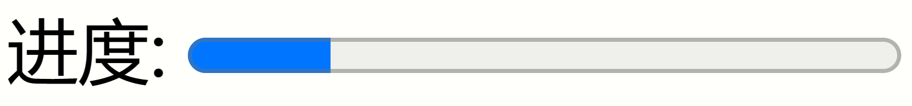


## 表单控件新增属性


`placeholder`: 表单新增属性，替换value

```html
<!DOCTYPE html>
<html lang="en">

<head>
    <meta charset="UTF-8">
    <title>Document</title>
</head>

<body>
    <span>账号:</span>
    <input type="text" value="请输入">
    <br>
    <span>账号:</span>
    <input type="text" placeholder="请输入">
</body>

</html>
```

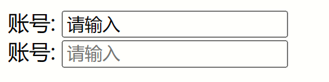

`required`: 将表单的元素设置为必填项

`autofocus`: 输入框自动对焦

`pattern`: 制定正则规则，用来判断输入的内容是否符合要求

```html
<!DOCTYPE html>
<html lang="en">
<head>
    <meta charset="UTF-8">
    <title>Document</title>
</head>
<body>
    <form>
        <span>账号:</span>
        <input type="text" placeholder="输入内容只能为数字" pattern="\d*">
        <button>提交</button>
    </form>
</body>
</html>
```

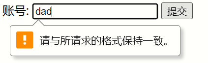


## input新增type属性

> 其中，如果在form表单中增加 novalidate 属性，那么下面的校验就都失效了。

`phone`: 用来判断手机号

`email`: 用来判断邮箱号

`url`: 用来判断url

number: 用来判断数值

search: 

tel: 校验手机号

range: 用来表示范围，可以拖动

```html
<input type="range">
```


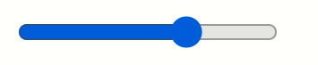

`color`: 用来选择颜色

```html
<input type="color">
```


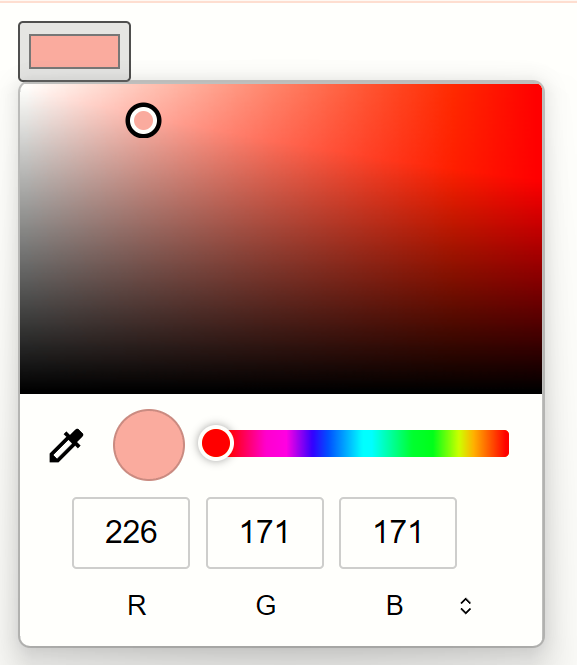

`date`: 选择日期

```html
<input type="date">
<input type="month">
<input type="week">
...
```

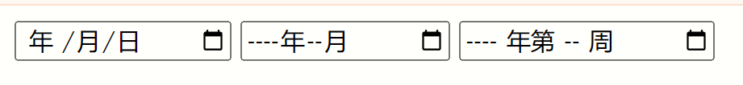

`time`: 选择时间

```html
<input type="time">
```

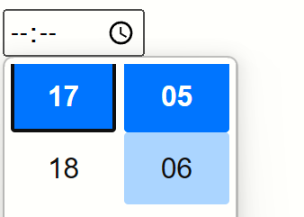


`datetime-local`: 选择日期+时间

```html
<input type="datetime-local">
```

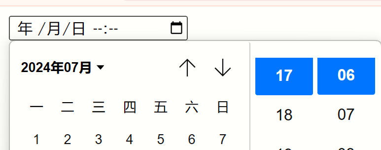


## 新增媒体标签


### 视频标签

```html
<video src="" controls muted autoplay loop poster="" preload="auto"></video>
```

- src: 视频地址
- controls: 显示视频控件(比如播放/暂停)
- muted: 视频静音
- autoplay: 自动播放（开启静音后失效）
- loop: 循环播放
- poster: 视频封面url
- preload: 视频预加载（开启自动播放后失效）


### 音频标签

```html
<audio src="" controls autoplay muted loop preload="auto"></audio>
```

- src: 音频地址
- controls: 显示视频控件(比如播放/暂停)
- muted: 视频静音
- autoplay: 自动播放（开启静音后失效）
- loop: 循环播放
- poster: 视频封面url
- preload: 视频预加载（开启自动播放后失效）


# CSS3

## 新增单位和属性

### 新增单位

- vw: 视口宽度的百分比，比如`width: 50vw`，则表示宽度为视口宽度的50%
- vh: 视口高度的百分比
- vmax: 宽度比高度大的话，则取视口宽度的百分比；反之取高度
- vmin: 宽度比高度小的话，则取视口宽度的百分比；反之取高度


### 新增背景属性

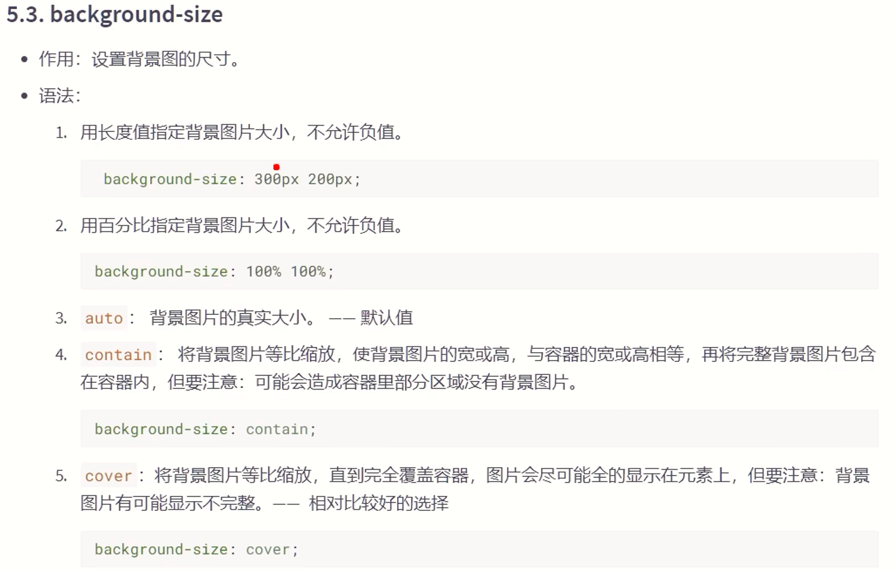

`background-size: cover` 


### 新增边框属性

`border-raduis`: 用于设置圆角


## 新增盒子属性

### box-sizing

`box-sizing: border-box`

使用该样式，可以使得盒子的宽高固定(即width和height为盒子的总大小)，不受到padding和border的影响，代价是压缩内容区。该属性的默认值为: content-box，默认width和height为内容区的总大小。

```css
.box {
    width: 200px;
    height: 200px;
    padding: 5px;
    border: 5px solid black;
    /* 使用该属性后，盒子的内容区变成了 180 * 180 */
    box-sizing: border-box;
}
```


### box-shadow

`box-shadow`: ? ? ? ? ? ?

该样式用来设置盒子的阴影

六个值依次为: `水平位置`、`垂直位置`、`模糊程度`、外延值、`阴影颜色`和内阴影

```css
    .box {
        width: 400px;
        height: 400px;
        margin: 0 auto;
        margin-top: 100px;
        background-color: orange;
        box-shadow: 20px 20px 10px blanchedalmond;

    }
```


### opacity

opacity用于设置元素的不透明度，范围为0~1。1为完全不透明，0为完全透明。


## 过渡


## 渐变

### 线性渐变

`linear-gradient`，默认是从上到下渐变

> 基本的HTML结构

```html
<!DOCTYPE html>
<html lang="en">
<head>
    <meta charset="UTF-8">
    <title>Document</title>
</head>
<style>
    .box {
        width: 300px;
        height: 200px;
        border: 1px solid black;
        float: left;
        margin-left: 50px;
    }
</style>
<body>
    <div class="box box1">1</div>
    <div class="box box2">2</div>
    <div class="box box3">3</div>
    <div class="box box4">4</div>
    <div class="box box5">你好啊</div>
</body>
</html>
```


`第一个盒子`的样式:

```css
    .box1 {
        background-image: linear-gradient(red, yellow, green);
    }
```


`第二个盒子`的样式:

```css
    .box2 {
        /* 第一个参数是指明了渐变的方向，向右。依次是红、黄、绿  */
        background-image: linear-gradient(to right, red, yellow, green);
    }
```

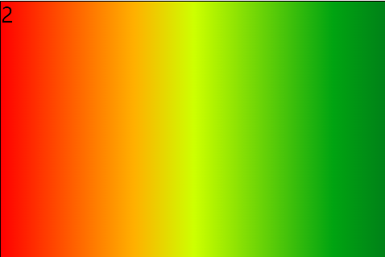

相关的指明渐变方向的关键词，还有`top`、`left`、`bottom`，他们可以组合在一起使用，比如要表示右上角的话，则可以用`to right top`或者`to top right`

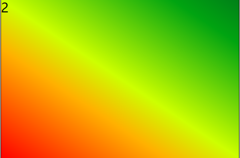

`第三个盒子`的样式:

```css
    .box3 {
        /* 20deg指的是20度，是相对于水平方向，然后逆时针旋转20度得到的 */
        background-image: linear-gradient(20deg, red, yellow, green);
    }
```

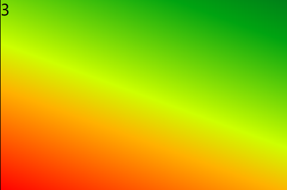

`第四个盒子`的样式:

```css
    .box4 {
        /* 
        因为默认是从上到下渐变的，所以依次是红、黄、绿
        red 50px的意思是，渐变到50px位置的时候，一定是红色，由于红色之前没有其他颜色，所以0-50px为纯红
        yellow 100px的意思是100px的位置一定是黄色，所以50-100px为纯红渐变到黄色
        green 150px 也是如此
        */
        background-image: linear-gradient(red 50px, yellow 100px, green 150px);
    }
```

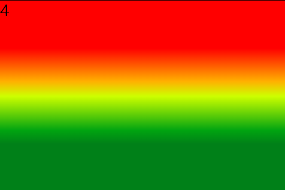

第五个盒子玩花一点:

```css
    .box5 {
        background-image: linear-gradient(20deg, red 50px, yellow 100px, green 150px);
        font-size: 80px;
        text-align: center;
        line-height: 200px;
        font-weight: bold;
        color: transparent;
        -webkit-background-clip: text;
    }
```

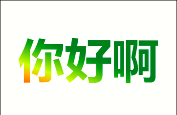


### 径向渐变

`radial-gradient`

> 准备基本的HTML结构

```html
<!DOCTYPE html>
<html lang="en">
<head>
    <meta charset="UTF-8">
    <title>Document</title>
</head>

<style>
    .box {
        width: 300px;
        height: 200px;
        border: 1px solid black;
        float: left;
        margin-left: 50px;
    }
</style>

<body>
    <div class="box box1">1</div>
    <div class="box box2">2</div>
    <div class="box box3">3</div>
    <div class="box box4">4</div>
    <div class="box box5">5</div>
    <div class="box box6">6</div>
</body>

</html>
```


`第一个盒子`的样式:

```css
    .box1 {
        /* 默认是从中间麝散开来，之所以是椭圆，是因为盒子不是正方形，如果改成300 * 300，就成圆形了 */
        background-image: radial-gradient(red, yellow, green);
    }
```

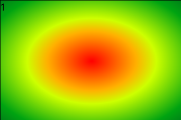


`第二个盒子`的样式:

```css
    .box2 {
        /* at xx xx用于指定圆心的位置。比如left top就是指定圆心在左上角 */
        background-image: radial-gradient(at left top, red, yellow, green);
    }
```

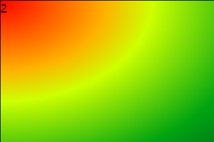

`第三个盒子`的样式:

```css
    .box3 {
        /* 这里采用了具体的像素值 来指定圆心的位置。起始点为盒子的所左上方 */
        background-image: radial-gradient(at 100px 50px, red, yellow, green);
    }
```

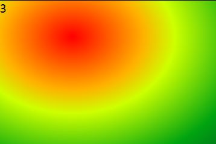

`第四个盒子`的样式:

```css
    .box4 {
        /* 之前因为盒子不均匀，所以是椭圆。这里使用了 circle关键字，强行转变成圆了 */
        background-image: radial-gradient(circle, red, yellow, green);
    }
```

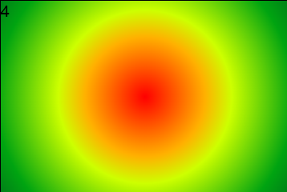

`第五个盒子`的样式:

```css
    .box5 {
        /* 通过像素来手动调整圆的大小 */
        background-image: radial-gradient(200px 200px, red, yellow, green);
    }
```


`第六个盒子`的样式:

```css
    .box6 {
        /* 径向渐变也调整每个颜色渐变的区域 */
        background-image: radial-gradient(red 50px, yellow 100px, green 150px);
    }
```

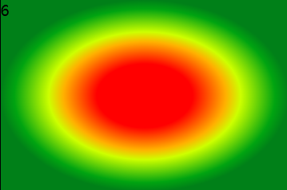


### 重复渐变

分为重复线性渐变和重复径向渐变两种:

`repeating-linear-gradient`

`repeating-radial-gradient`


重复渐变就是`循环渐变`，比如在线性渐变的第四个盒子，它在0-50px为纯红色，150px之后为纯绿色，重复渐变就是`不允许出现纯色`，所以这里的150px之后，就应该渐变到红色，而在0px的位置，应该由绿色渐变到红色，最终就是这样的效果

```css
    .box4 {
        background-image: repeating-linear-gradient(red 50px, yellow 100px, green 150px);
    }
```

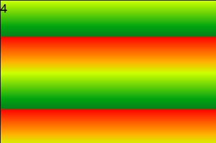

径向渐变类似。


## 2D变换

### 位移

> 基本的HTML结构准备

```html
<!DOCTYPE html>
<html lang="en">

<head>
    <meta charset="UTF-8">
    <meta name="viewport" content="width=device-width, initial-scale=1.0">
    <title>Document</title>
    <style>
        .outer {
            width: 200px;
            height: 200px;
            border: 2px solid black;
            margin: 0 auto;
            margin-top: 100px;
        }

        .inner {
            width: 200px;
            height: 200px;
            background-color: deepskyblue;
        }
    </style>
</head>

<body>
    <div class="outer">
        <div class="inner">雷猴</div>
    </div>
</body>

</html>
```

水平移动（使用像素）:

```css
        .inner {
            /* 
            水平右移50px
            transform: translateX(50px);
            一动不动
            transform: translateX(0px); 
            */
            /* 水平左移50px */
            transform: translateX(-50px);
        }
```

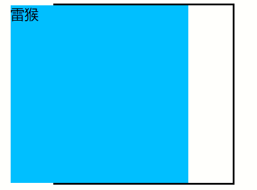


水平移动（百分比）:

```css
        .inner {
            /* transform: translateX(50%);
            transform: translateX(0%); */
            transform: translateX(-50%);
            /* 使用百分比之后，是相对于自己的大小的50%，即移动自己宽度的一半 0 */
        }
```

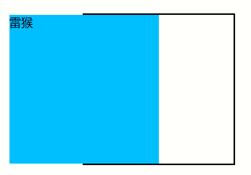


上下移动（像素）:

```css
        .inner {
            /* 
            下移50px
            transform: translateY(50px);
            transform: translateY(0px); 
            */
            /* 上移50px */
            transform: translateY(-50px);
        }
```

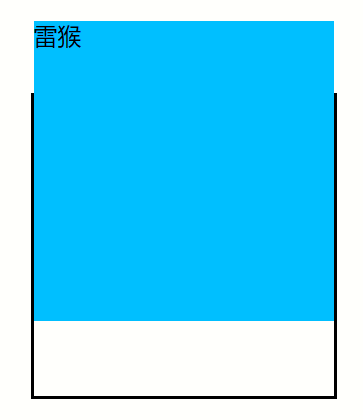


上下左右同时移动:

```css
        .inner {
            /* 两种办法都可以 */
            /* transform: translateX(50px) translateY(50px); */
            transform: translate(50px, 50px);
        }
```

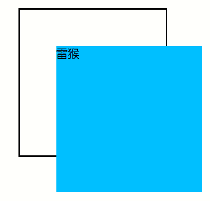

### 缩放

- scale(): 整体缩放
  - scale(0.5): 整体缩小50%
  - scale(2): 整体放大200%
  - scale(-2): 在整体放大200%的基础上，水平翻转，再竖直翻转
- scaleX(): 水平方向缩放
- scaleY(): 竖直方向缩放

借助缩放，可以实现`文字内容小于12px`


### 旋转

- rotateZ()

```css
/* 顺时针旋转30度 */
transform: rotateZ(30deg);
```

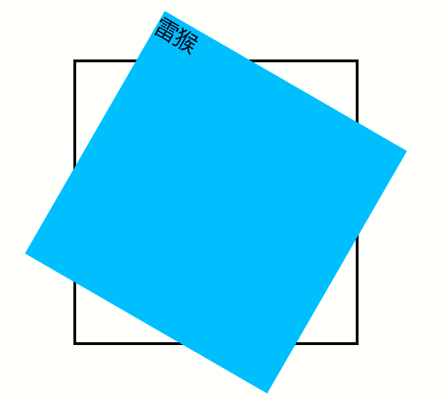

### 扭曲

用得不多，也没什么用，建议使用浏览器检查的功能来调整参数，这样扭曲的过程会清楚一点。给角度值。

- skew()
- skewX()
- skewY()


### 多重变换

就是把多个变换放在`transform`属性中

`transform: rotate(30deg) translate(100px, 100px) `

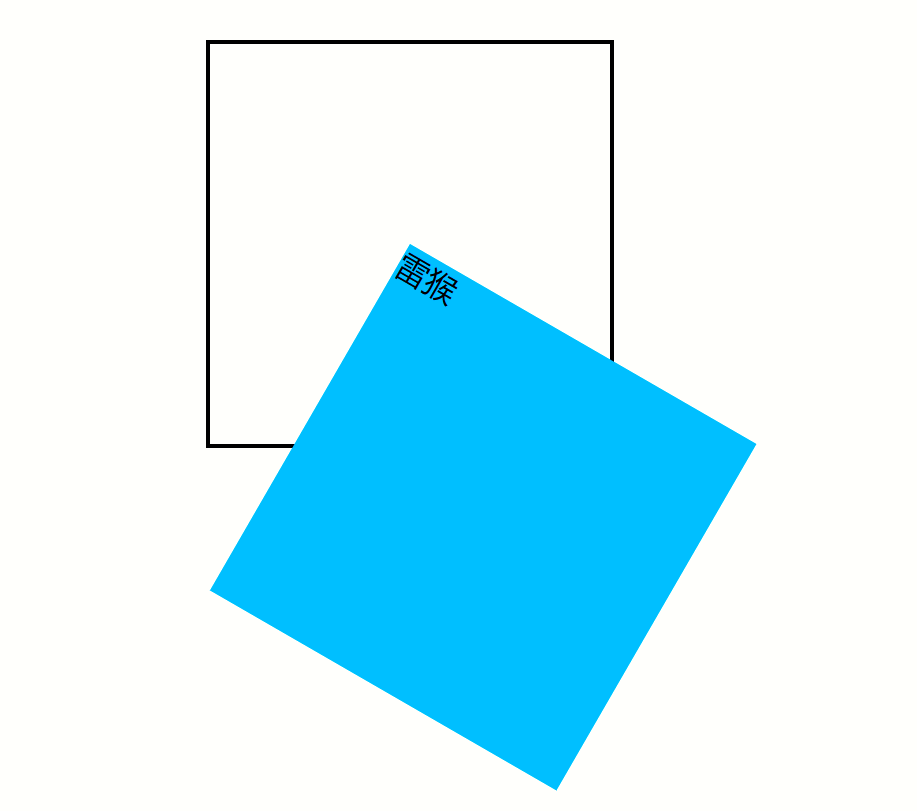

但是多重变换的时候，建议最后再旋转。

### 变换原点

之前的旋转、缩放的点默认是盒子的中心，但是我们是可以改变的

`transform-origin: top right; `

`transform-origin: 50px 50px;`

`transform-origin: 25% 25%;`


## 动画

> 准备基本的HTML结构

```html
<!DOCTYPE html>
<html lang="en">
<head>
    <meta charset="UTF-8">
    <meta name="viewport" content="width=device-width, initial-scale=1.0">
    <title>Document</title>
    <style>
        .outer {
            width: 500px;
            height: 100px;
            border: 1px solid black;
        }
        .inner {
            width: 100px;
            height: 100px;
            background-color: deepskyblue;
        }
    </style>
</head>
<body>
    <div class="outer">
        <div class="inner"></div>
    </div>
</body>
</html>
```

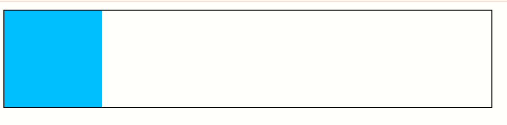

添加动画(`animation`):

```css
        .inner {
            /* 动画的名称，自定义 */
            animation-name: toTheRight;
            animation-duration: 3s;
        }

		/* 自定义动画（定义自愈关键帧） */
        @keyframes toTheRight {
            /* 第一帧 */
            from {}

            /* 最后一帧 */
            to {
                transform: translate(400px);
            }
        }
```

