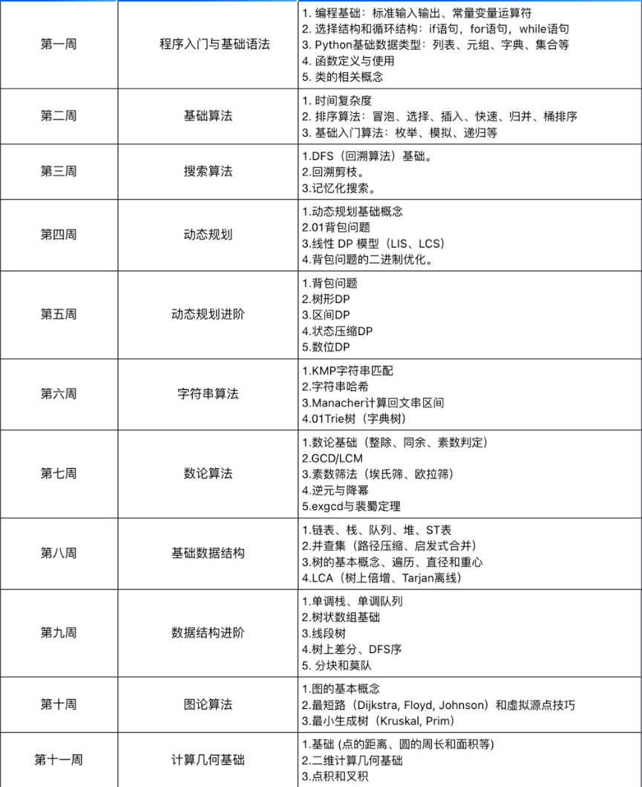
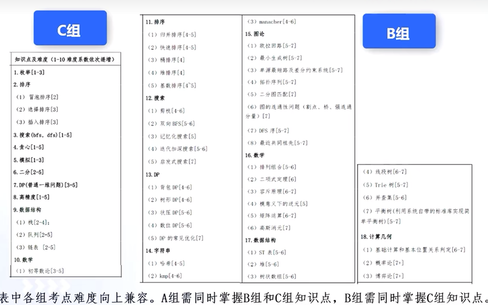

# 知识点概述

送分题应该拿下：

1. 模拟（至少刷题100道）
2. 排序
3. 贪心
4. 二分
5. 搜索（DFS、BFS）
6. 动态规划
7. 前缀和与差分
8. 并查集
9. 简单数论（排列组合、质因子分解、二项式定理等）

难题：

1. 图论（最小生成树、图的连通性问题、欧拉回路、DFS序、网络流等）
2. 数论（生成函数、莫比乌斯反演等）
3. 高级字符串（拓展kmp、AC自动机、后缀自动机等）



[速成](https://labuladong.online/algo/intro/quick-learning-plan/)




# python基础

## 常用API


# 排序

## 选择排序

选择排序是最简单的、也是最暴力的一个排序方法：先遍历一遍数组，找到数组中的最小值，然后把它和数组的第一个元素进行交换；接着再遍历数组，找到第二小的元素，和数组的第二个元素交换位置，以此类推。

```py
# loop=0: 1 4 2 9 6
# loop=1: 1 2 4 9 6
# loop=2: 1 2 4 9 6
```


代码实现如下：

```py
def sort(nums: List[int]) -> None:
    n = len(nums)
    # sortedIndex 是一个分割线
    # 索引 < sortedIndex 的元素都是已排序的
    # 索引 >= sortedIndex 的元素都是未排序的
    # 初始化为 0，表示整个数组都是未排序的
    sortedIndex = 0
    while sortedIndex < n:
        # 找到未排序部分 [sortedIndex, n) 中的最小值
        minIndex = sortedIndex
        for i in range(sortedIndex + 1, n):
            if nums[i] < nums[minIndex]:
                minIndex = i
        # 交换最小值和 sortedIndex 处的元素
        nums[sortedIndex], nums[minIndex] = nums[minIndex], nums[sortedIndex]

        # sortedIndex 后移一位
        sortedIndex += 1
```


> 这个代码的时间复杂度为$O(n^2)$。该算法是原地排序，因为只用到了几个变量，空间复杂度为$O(1)$。性能还是太低了。


## 冒泡排序

从数组的底部开始向上冒泡，把最小的数给送上去。或者反着来，从顶部开始，把最大的数压下去

```py
def sort(nums):
    for i in range(len(nums)):
        for j in range(i, len(nums)):
            if nums[i] > nums[j]:
                nums[i], nums[j] = nums[j], nums[i]
return nums
              
        
```

我们可以额外增加一个判断，如果数组在循环结束之前已经排好序了，那么我们就可以直接结束循环。

```py
def sort(nums):
    for i in range(len(nums)):
        swapped = False
        for j in range(i, len(nums)):
            if nums[i] > nums[j]:
                swapped = True
                nums[i], nums[j] = nums[j], nums[i]
         # 如果某一轮循环没有交换元素，则说明已经排好序了，直接跳出循环
		if not swapped:
            return nums
return nums
```


## 插入排序

插入排序的思路：第n轮循环时，第n个元素依次比较前面n-1个元素的大小，如果遇到第n个元素恰比第m个元素大，则n后面的元素往后挪一位，将第n个元素插入到第m+1的位置

```py
def insert_sort(nums):
    idx = 0
    for i in range(len(nums)):
        for j in range(i - 1, 0, -1):
            if nums[j - 1] < nums[j]:
                break
            else:
                nums[j - 1], nums[j] = nums[j], nums[j - 1]
        print(f'loop {i}: {nums}')
                
# lst = [3, 1, 4, 1, 5, 9, 2, 6]
'''
loop 0: [3, 1, 4, 1, 5, 9, 2, 6]
loop 1: [3, 1, 4, 1, 5, 9, 2, 6]
loop 2: [1, 3, 4, 1, 5, 9, 2, 6]
loop 3: [1, 3, 4, 1, 5, 9, 2, 6]
loop 4: [1, 1, 3, 4, 5, 9, 2, 6]
loop 5: [1, 1, 3, 4, 5, 9, 2, 6]
loop 6: [1, 1, 3, 4, 5, 9, 2, 6]
loop 7: [1, 1, 2, 3, 4, 5, 9, 6]
'''
```


> 我觉得可以将插入排序看成是局部冒泡


## 归并排序


## 希尔排序


## 快速排序

```py
import random

class Solution:
    # 随机哨兵划分：从 nums[low: high + 1] 中随机挑选一个基准数，并进行移位排序
    def randomPartition(self, nums: [int], low: int, high: int) -> int:
        # 随机挑选一个基准数
        i = random.randint(low, high)
        # 将基准数与最低位互换
        nums[i], nums[low] = nums[low], nums[i]
        # 以最低位为基准数，然后将数组中比基准数大的元素移动到基准数右侧，比他小的元素移动到基准数左侧。最后将基准数放到正确位置上
        return self.partition(nums, low, high)
    
    # 哨兵划分：以第 1 位元素 nums[low] 为基准数，然后将比基准数小的元素移动到基准数左侧，将比基准数大的元素移动到基准数右侧，最后将基准数放到正确位置上
    def partition(self, nums: [int], low: int, high: int) -> int:
        # 以第 1 位元素为基准数
        pivot = nums[low]
        
        i, j = low, high
        while i < j:
            # 从右向左找到第 1 个小于基准数的元素
            while i < j and nums[j] >= pivot:
                j -= 1
            # 从左向右找到第 1 个大于基准数的元素
            while i < j and nums[i] <= pivot:
                i += 1
            # 交换元素
            nums[i], nums[j] = nums[j], nums[i]
        
        # 将基准节点放到正确位置上
        nums[i], nums[low] = nums[low], nums[i]
        # 返回基准数的索引
        return i

    def quickSort(self, nums: [int], low: int, high: int) -> [int]:
        if low < high:
            # 按照基准数的位置，将数组划分为左右两个子数组
            pivot_i = self.randomPartition(nums, low, high)
            # 对左右两个子数组分别进行递归快速排序
            self.quickSort(nums, low, pivot_i - 1)
            self.quickSort(nums, pivot_i + 1, high)

        return nums

    def sortArray(self, nums: [int]) -> [int]:
        return self.quickSort(nums, 0, len(nums) - 1)

```


## 桶排序


## 堆排序


## 基数排序

基本思想：将整数按位数切割成不同的数字，然后从低位开始，依次到高位，逐行进行排序，从而达到排序的目的

```py
class Solution:
    def radixSort(self, nums: [int]) -> [int]:
        # 桶的大小为所有元素的最大位数
        size = len(str(max(nums)))
        
        # 从最低位（个位）开始，逐位遍历每一位
        for i in range(size):
            # 定义长度为 10 的桶数组 buckets，每个桶分别代表 0 ~ 9 中的 1 个数字。
            buckets = [[] for _ in range(10)]
            # 遍历数组元素，按照每个元素当前位上的数字，将元素放入对应数字的桶中。
            for num in nums:
                buckets[num // (10 ** i) % 10].append(num)
            # 清空原始数组
            nums.clear()
            # 按照桶的顺序依次取出对应元素，重新加入到原始数组中。
            for bucket in buckets:
                for num in bucket:
                    nums.append(num)
                    
        # 完成排序，返回结果数组
        return nums
    
    def sortArray(self, nums: [int]) -> [int]:
        return self.radixSort(nums)

```


# 数据结构

## 数组

动态数组的底层依然是静态数组，只是它将增删改的代码封装成了一个函数，我们使用的时候感受不到而已。作为速成，我们会用就行了。

```py
# 创建动态数组
# 不用显式指定数组大小，它会根据实际存储的元素数量自动扩缩容
arr = []

for i in range(10):
    # 在末尾追加元素，时间复杂度 O(1)
    arr.append(i)

    # 在中间插入元素，时间复杂度 O(N)
    # 在索引 2 的位置插入元素 666
    arr.insert(2, 666)

    # 在头部插入元素，时间复杂度 O(N)
    arr.insert(0, -1)

    # 删除末尾元素，时间复杂度 O(1)
    arr.pop()

    # 删除中间元素，时间复杂度 O(N)
    # 删除索引 2 的元素
    arr.pop(2)

    # 根据索引查询元素，时间复杂度 O(1)
    a = arr[0]

    # 根据索引修改元素，时间复杂度 O(1)
    arr[0] = 100

    # 根据元素值查找索引，时间复杂度 O(N)
    index = arr.index(666)
```


