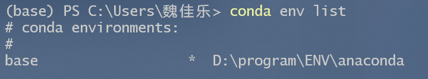

# 版本配置

```sh
# 查看conda版本
conda --version

# 查看conda的配置环境
conda config --show

#设置清华镜像
conda config --add channels https://mirrors.tuna.tsinghua.edu.cn/anaconda/pkgs/free/
conda config --add channels https://mirrors.tuna.tsinghua.edu.cn/anaconda/pkgs/main/
conda config --add channels https://mirrors.tuna.tsinghua.edu.cn/anaconda/cloud/conda-forge/
conda config --add channels https://mirrors.tuna.tsinghua.edu.cn/anaconda/cloud/bioconda/

# 设置bioconda
conda config --add channels bioconda
conda config --add channels conda-forge

# 设置搜索时显示通道地址
conda config --set show_channel_urls yes

# 更新conda
conda update Anaconda

# 查询帮助命令
conda create --help
```


# 环境

```sh
# 创建环境，创建一个名字为halory的虚拟环境，python版本为3.xx，并且创建的同时安装numpy和matplotlib
conda create -n halory python=3.xx numpy matplotlib

# 更新python版本
conda install python=3.xx

# 查看虚拟环境，下面带*的为当前环境
conda env list
conda info -e
conda info --envs
```



```sh
# 激活虚拟环境
conda activate halory

# 退出虚拟环境(deactivate的缺省值是当前环境，activate的缺省值是base环境)
conda deactivate
conda activate

# 删除虚拟环境和该环境下的所有包
conda remove --name halory --all

# 删除虚拟环境下的指定包
conda remove --name halory pkg1 pkg2

# 导出环境
conda env export --name halory > halory.yml

# 恢复环境
conda env create -f halory.yml
```


# 包

```sh
# 查看当前环境中安装了哪些包
conda list

# 查询是否安装了某个包，支持通配符
conda list numpy
conda list nump*

# 安装包和更新包
conda install pkg
conda install numpy=0.20.3
conda update numpy

# 从指定channel安装包
conda install pkg -c conda_forge

# 卸载包，这样依赖于这个包的其他包也会被卸载
conda uninstall pkg

# 只删除当前包，不删除依赖于当前包的其他包
conda uninstall pkg --force

# 清理conda缓存(删除没有用的包)
conda clean -p
```


