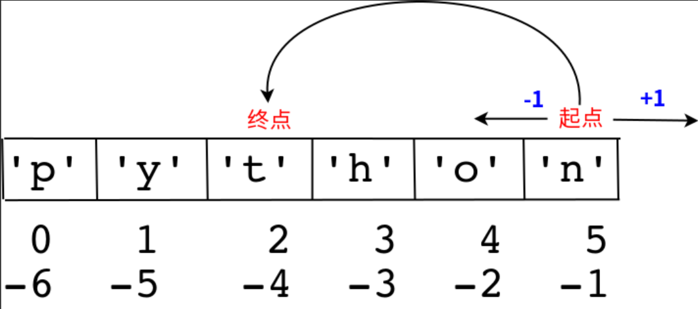
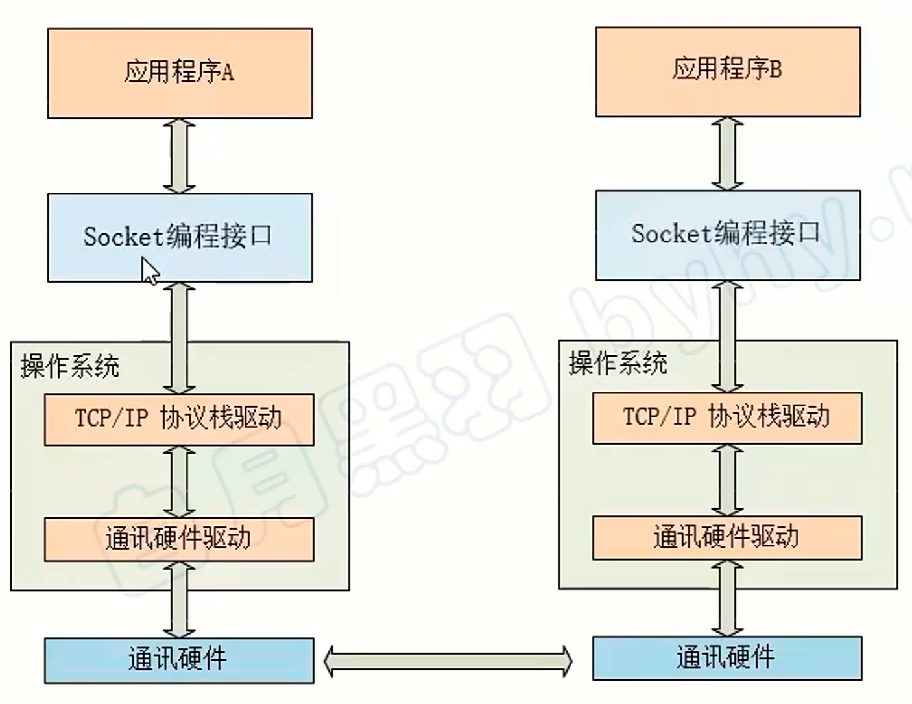

# Python基础

## 切片

语法：

```python
序列[开始位置下标:结束位置下标:步长]
# 不包含结束位置下标对应的数据，正负整数均可
```

常见操作：

```python
nums = '012345678'
# 正数
# 从0开始选取，到第5位
print(nums[:5])			# 01234
# 从2开始选取，直到最后
print(nums[2:])			# 2345678
# 从最初到最后，选中所有
print(nums[:])			# 012345678

# 负数
# 倒叙选取所有
print(nums[::-1])		# 876543210
# 从倒数第4位，取到倒数第1位（不包含）
print(nums[-4:-1])		# 567
# 下标的起始方向跟步长方向冲突，无法选取
print(nums[-4:-1:-1])	#
# 从倒数第1位，取到倒数第4位（不包含），倒序取
print(nums[-1:-4:-1])	# 876
```




<center>
    <b>切片模型</b>
</center>


## format

```py
```


## 字符串

### 字符串常见方法

#### 查找

```python
f = 'You are my Hikari'

# 1. 找到子串则返回子串下标，无则返回-1
find(*子串, 开始位置下标, 结束位置下标)
f.find('Hikari')
# 11

# 2. 找到子串则返回子串下标，无则报错
index(*子串, 开始位置下标, 结束位置下标)
f.index('Hikari')
# 11

# 3. 返回子串出现的次数
count(*子串, 开始位置下标, 结束位置下标)
f.count('r')
# 2

# 用法跟find()、index()一致，只是查找方向为右侧开始。结果也上面的一致
rfind()
rindex()
```


#### 修改

```python
f = 'You are my Hikari'

# 1. 替换
replace(*旧子串, *新子串, 替换次数)
f.replace('r', 'R', 1)
# 'You aRe my Hikari'

# 2. 分割
split(分割字符, 分割次数)
f.split('r', 1)
# ['You a', 'e my Hikari']

# 3. 拼接
join(多个字符串序列)
''.join(f.split('r'))
# 'You ae my Hikai'

# 4. 首字符大写
capitalize()
'u and me'.capitalize()
# 'U and me'

# 5. 首字母大写
title()
'so acc don\'t let me be'.title()
# "So Acc Don'T Let Me Be"

# 6. 全部大写
upper()
'so acc don\'t let me be'.upper()
# "SO ACC DON'T LET ME BE"

# 7. 全部小写
lower()
'SELECT * DEPT WHERE DEPT_ID = 1'.lower()
# 'select * dept where dept_id = 1'
```


#### 删除

```python
# 删除字符串左侧空白
lstrip()
'    Oh, no'.lstrip()
# 'Oh, no'

# 删除字符串右侧空白
rstrip()
'Oh, no   '.rstrip()
# 'Oh, no'

# 删除字符串两侧空白
strip()
'   Oh, no   '.strip()
# 'Oh,no'
```


#### 对齐

```python
# 1. 左对齐，右填充
ljust(长度, 填充字符)
'007'.ljust(10, '#')
# '007#######'

# 2. 右对齐，左填充
rjust(长度, 填充字符)
'007'.rjust(10, '#')
# '#######007'

# 3. 居中对齐，左右填充
center(长度, 填充字符)
'007'.center(10, '#')
# '###007####'
```


#### 判断

```python
# 1. 判断是否以子串开头
startswith(*子串, 开始位置下标, 结束位置下标)
'Hikari wa'.startswith('Hika')
# True

# 2. 判断是否以子串结尾
endswith(*子串, 开始位置下标, 结束位置下标)
'Hikari wa'.endswith('a')
# True

# 判断是否全是字母
isalpha()
'ABC DEF'.isalpha()
# False

# 判断是否全是数字
isdigit()
'123456'.isdigit()
# True

# 全是字母或数字的组合 
isalnum()
'LoveU2Much'.isalnum()
# True

# 判断为空格
isspace()
'   '.isspace()
# True
```


## 列表


### 列表常见方法

#### 查找

```python
index(*数据, 开始位置下标, 结束位置下标)

# 指定数据出现的次数
count(*数据)

len()
```


#### 判断是否存在

```python
# 判断x是否在list1
x in list1

# 判断x是否不在list1
x not in list1
```


#### 追加数据

```python
# 一整个地添加
append(数据)

# 拆开后单个单个地添加
extend(数据)

# 指定位置插入数据
insert(下标位置, 数据)

# 对比
list1 = list()
list1.append('胡桃')
list1.extend('HuTao')
list1.insert(1, '胡堂主')
print(list1)
# ['胡桃', '胡堂主', 'H', 'u', 'T', 'a', 'o']
```


#### 删除数据

```python
# 删除指定下标的数据，或者删除整个列表
del

# 可指定下标。默认删除最后一个数据，并返回该数据
pop()

# 删除指定数据
remove()

# 清空列表
clear()

# test
list1 = ['胡桃', '钟离', '七七', '凝光', '行秋']
del list1[1]
print(list1)				# ['胡桃', '七七', '凝光', '行秋']
list1.pop()
print(list1)				# ['胡桃', '七七', '凝光']
list1.remove('七七')
print(list1)				# ['胡桃', '凝光']
list1.clear()
print(list1)				# []
```


#### 排序

```python
lst = [1, 4, 80, 45, 23, 67]

# 1. 逆序
lst.reverse()
lst
# [67, 23, 45, 80, 4, 1]

# 默认为升序
lst.sort()
lst
# [1, 4, 23, 45, 67, 80]

# 降序
lst.sort(reverse=True)
lst
# [80, 67, 45, 23, 4, 1]

```


#### 复制

```python
# 深拷贝
copy()

l1 = lst.copy()
l1
# [80, 67, 45, 23, 4, 1]

del l1[0]
l1
# [67, 45, 23, 4, 1]

lst
# [80, 67, 45, 23, 4, 1]
```


## 元组

元组数据不能修改

元组二要素：==数据==和==逗号==

```python
s = (1, 2)
```


### 常见操作

#### 查找

```python
下标查找

index()

count()

len()
```


#### 修改

```python
如果元组里面有列表元组的话，那么是可以修改这个列表的
```


## 字典

创建语法：

```python
dict1 = {
    "name": "胡桃",
    "age": 19
}

dict1 = {}

dict1 = dict()
```


### 增/修改

```python
# 如果dict1中存在这个key，则修改这个key的value。否则添加新的键值对
dict1[key]=value
```


### 删除

```python
# 删除键值对，指定键值对不存在则会报错
del dict1[age]

# 清空字典
clear()
```


### 查找

```python
# key值查找，存在则返回，否则报错
print(dict1['name'])

# 没有这key的话，返回默认值。如果没有指定默认值，则返回None
get(*key, 默认值)

# 获取所有的key
keys()

# 获取所有的value
values()

# 将所有键值对转换为元组列表：[(key1, value1), ...]
items()
```


### 遍历

```python
dict1 = {
    "name": "胡桃",
    "age": 19
}

# 遍历key
for key in dict1.keys():
    print(key)

# 遍历value
for value in dict1.values():
    print(value)

# 遍历元素
for item in dict1.items():
    print(item)

# 遍历键值对
for key, value in dict1.items():
    print(f"{key}={value}")
"""
name
age
胡桃
19
('name', '胡桃')
('age', 19)
name=胡桃
age=19
"""
```


## 集合

创建集合：

```python
# 创建初始集合
s1 = {10, 20}
s1 = {'abcd'}

# 创建空集合
s1 = set()
```

==集合会去重==

### 增加数据

```python
# 添加数据
add()

# 增加序列，一般是列表
update()

# 测试
s1 = {10, 20}
s1.update([20, 100, 200])
print(s1)
# {100, 10, 20, 200}
```


### 删除数据

```python
# 删除指定数据，不存在则报错
remove()

# 删除指定数据，不存在也不会报错
discard()

# 随机删除某个元素，并返回该元素???
pop()
```


### 判断数据

```python
s in set1

s not in set1
```


## 推导式

### 列表推导式

需求：生成一个0-10的列表

```python
# 普通循环
list1 = list()
for i in range(10):
    list1.append(i)
print(list1)

# 列表推导式
# for左边的i为返回值，右边的i为遍历的变量
list1 = [i for i in range(10)]
print(list1)
# [0, 1, 2, 3, 4, 5, 6, 7, 8, 9]
```


### 带if的列表推导式

需求：创建一个0-10的偶数列表

```python
# 方法一：range()步长实现
list1 = [i for i in range(0, 10, 2)]
print(list1)

# 方法二：if实现
list1 = [i for i in range(10) if i % 2 == 0]
print(list1)
```


### 多个for循环实现列表推导式

需求：创建列表如下：

> \[(1, 0), (1, 1), (1, 2), (2, 0), (2, 1), (2, 2)\]

```python
# 数据一： 1和2
# 数据二： 0 1 2
list1 = list()
for i in range(1, 3):
    for j in range(3):
        list1.append((i, j))
print(list1)

# 列表推导式
list1 = [(i, j) for i in range(1, 3) for j in range(3)]
print(list1)
```


### 字典推导式

字典推导式的作用：快速合并列表为字典或提取字典中目标数据

```python
# 利用推导式创建一个字典
dict1 = {f"{i}的平方为": i**2 for i in range(1, 5)}
print(dict1)
# {'1的平方为': 1, '2的平方为': 4, '3的平方为': 9, '4的平方为': 16}

# 合并列表
list1 = ['name', 'age']
list2 = ['HuTao', 19]
dict1 = {list1[i]: list2[i] for i in range(len(list1))}
print(dict1)
# {'name': 'HuTao', 'age': 19}


# 提取字典中的目标数据
"""
需求：提取电脑数量大于等于200的字典数据
"""
counts = {'MBP': 268, 'HP': 125, 'DELL': 201, 'Lenovo': 199, 'acer': 99}
one = {key: value for key, value in counts.items() if value >= 200}
print(one)
# {'MBP': 268, 'DELL': 201}
```


### 集合推导式

需求：创建一个集合，数据为下方列表的2次方

> list1 = \[1, 1, 2\]

```python
list1 = [1, 1, 2]
set1 = { i ** 2 for i in list1}
print(set1)
# {1, 4}
```


## 函数

Python中，函数必须==先定义==，==后使用==

### 概念梳理

```python
# 关键字参数，调用函数时指定参数
print(end=' ')

# 位置参数，即函数传参时根据按照参数位置来。
def f1(a, b)
f1(1, 2)

# 缺省参数，即默认参数。所有位置参数必须出现在缺省参数前
def f2(a, b=10)

# 不定长参数，即可变参数。有两种：包裹位置和包裹关键字传递，两者都是组包的过程
# 包裹位置参数传递，返回一个元组
def user_info(*args):
    print(args)
user_info('Tom', 18, ...)

# 包裹关键字传递，返回一个字典
def user_info(**kwargs):
    print(kwargs)
user_info(name='Tom', age=18, id=110)
"""
{'name': 'Tom', 'age': 18, 'id': 110}
"""

# 拆包
# 拆元组
def f1():
    return 1, 2
num1, num2 = f1()
print(num1, num2)
# 1 2

# 拆字典
dict1 = {'name': 'HuTao', 'age': 19}
# 得到key
name, age = dict1
print(name, age)
print(dict1[name], dict1[age])
"""
name age
HuTao 19
"""


# 交换变量
a, b = 1, 2
print(a, b)
a, b = b, a
print(a, b)
"""
1 2
2 1
"""
```


### 函数的说明文档

```python
# help函数可以用来查看函数的说明文档
help(len)
"""
Help on built-in function len in module builtins:

len(obj, /)
    Return the number of items in a container.
"""
```

语法：

```python
# 在函数体内部的第一行写三引号的注释
def f1(a, b):
    """
    用来测试的
    :param a: 参数1
    :param b: 参数2
    :return: 返回值
    """
    return a + b

help(f1)
"""
Help on function f1 in module __main__:

f1(a, b)
    用来测试的
    :param a: 参数1
    :param b: 参数2
    :return: 返回值
"""
```

![[说明文档.png]]

### 修改全局变量

```python
a = 100
def test_a():
    print(a)

def test_b():
    # 用global关键字声明a是全局变量
    global a
    # 然后对全局变量进行修改
    a = 200
    print(a)
test_a()
test_b()

```


### 多个返回值

```python
# 默认为元组类型
def f1():
    return 1, 2


def f2():
    a = 3
    name = 'HuTao'
    age = 19
    return a, name, age


print(f1())
print(f2())
"""
(1, 2)
(3, 'HuTao', 19)
"""
```


### 引用

#### 不可变类型和可变类型

```python
# 通过id()判断两个变量是否为同一个值得引用

# 不可变类型
a = 1
b = a
print(id(a))				# 2350101391664
print(id(b))				# 2350101391664
a = 2
# 说明int为不可变类型
print(b)					# 1

# 可变类型
a_list = [1, 2, 3, 4]
b_list = a_list
print(id(a_list))			# 2543485222464
print(id(b_list))			# 2543485222464

a_list[0] = -1
# 说明列表为可变类型
print(b_list[0])			# -1
```

- 可变类型：
  - 列表
  - 字典
  - 集合
- 不可变类型：
  - 整数
  - 浮点型
  - 字符串
  - 元组


### Lambda表达式

#### 语法

```python
lambda 参数列表: 表达式

# test
f1 = lambda a, b: a + b
print(f1(100, 200))
# 300
```


#### 参数形式

```python
# 无参
f1 = lambda: 100

# 一个参数
f1 = lambda a: print(a)

# 默认参数
f1 = lambda a, b, c=100: a + b + c
print(f1(100, 200))
# 400

# 可变参数一：*args，返回一个元组
f1 = lambda *args: args
print(f1(100, 200))
# (100, 200)

# 可变参数二：**kwargs，返回一个字典
f1 = lambda **kwargs: kwargs
print(f1(name='HuTao', age=19))
# {'name': 'HuTao', 'age': 19}
```


#### 应用

```python
# 带判断的Lambda
f1 = lambda a, b: a if a > b else b
print(f1(100, 200))
# 200

# 列表数据按字典key的值排序
students = [
    {'name': 'Tom', 'age': 20},
    {'name': 'Jack', 'age': 19},
    {'name': 'Rose', 'age': 21}
]

# 按name值升序排列
students.sort(key=lambda x: x['name'])
print(students)
# [{'name': 'Jack', 'age': 19}, {'name': 'Rose', 'age': 21}, {'name': 'Tom', 'age': 20}]

# 按name值降序排列
students.sort(key=lambda x: x['name'], reverse=True)
print(students)
# [{'name': 'Tom', 'age': 20}, {'name': 'Rose', 'age': 21}, {'name': 'Jack', 'age': 19}]

# 按age值升序排序
students.sort(key=lambda x: x['age'])
print(students)
# [{'name': 'Jack', 'age': 19}, {'name': 'Tom', 'age': 20}, {'name': 'Rose', 'age': 21}]


```


### 高阶函数

即将一个函数作为另外一个函数的参数

体验示例：

```python
def sum_num(a, b, f):
    return f(a) + f(b)


res = sum_num(-1, 2, abs)
print(res)
# 3
```


#### 内置高阶函数

##### map()

```python
# map(func, lst)，将传入的函数变量func作用到lst变量的每个元素中，并将结果组成新的迭代器返回
list1 = [1, 2, 3, 4, 5]

def func(x):
    return x ** 2

res = map(func, list1)
print(type(res))
print(list(res))
"""
<class 'map'>
[1, 4, 9, 16, 25]
"""
```


##### reduce()

```python
# reduce(func, lst)，其中func必须有两个参数。每次func计算的结果继续和序列的下一个元素做累积计算
# 再次强调，其中func必须有两个参数
import functools
list1 = [1, 2, 3, 4, 5]


def func(a, b):
    return a + b


res = functools.reduce(func, list1)
print(type(res))
print(res)
"""
<class 'int'>
15
"""
```


##### filter()

```python
# filter(func, lst)函数用于过滤序列，返回一个filter对象
# 如果要转成列表，可以使用list()来转换
list1 = [1, 2, 3, 4, 5, 6, 7, 8, 9]

# 过滤偶数
def func(x):
    return x % 2 == 0

# 返回过滤掉的数据
res = filter(func, list1)
print(res)
print(list(res))
"""
<filter object at 0x000001B97AC0FF40>
[2, 4, 6, 8]
"""
```


## 文件

文件操作步骤：

- 打开文件
- 读写操作
- 关闭文件


### 打开文件

```python
open(name, mode)
# name为文件路径
# mode为读写模式，以r、w、a用得比较多
# r：只读模式，默认的
# w：只写模式，文件不存在则创建新的文件
# a：追加内容。如果文件不存在则创建新文件再追加

# 追加
f = open('mirai.txt', 'a')
f.write('mirai')
f.close()

# 只读
f = open('mirai.txt', 'r')
l = f.read()
print(l)
f.close()

```

### 读操作


```python
# num用于指定读取的字节数，没有则表示全部读取。返回字符串
read(num)

# 按照行的方式读取内容，返回一个列表
readlines()

# 一次性读取一行内容
readline()
```


### seek()

用来移动文件指针

语法：

```python
"""
f.seek(偏移量, 起始位置)
起始位置：
	0：文件开头
    1：当前位置
    2：文件结尾
"""
f = open('mirai.txt', 'r')		# miraimiraimirai
f.seek(3, 0)
l = f.read()
print(l)
f.close()
# aimiraimirai
```


### 文件备份

```python
# 1. 用户输入目标文件
old_name = input("请输入你要备份的文件名：")
# 2. 规划备份文件名
# 提取文件后缀名
index = old_name.rfind('.')

if index > 0:
    postfix = old_name[index:]
else:
    postfix = ''

new = old_name[:index] + '[备份]'
new_name = new + postfix

# 写入数据
# 打开原文件和备份文件
old_f = open(old_name, 'rb')
new_f = open(new_name, 'wb')
# 读原文件，写备份文件
while True:
    con = old_f.read(1024)
    if len(con) == 0:
        break
    new_f.write(con)
# 关闭文件
old_f.close()
new_f.close()

```


### 文件和文件夹的操作

需要借助`os`模块

```python
import os
# 重命名，文件和文件夹通用
os.rename('a.txt', '10.txt')

# 删除文件
os.remove('10.txt')

# 创建文件夹
os.mkdir('os_test')

# 删除文件夹
os.rmdir('os_test')

# 获取当前目录
print(os.getcwd())

# 改变默认目录
os.chdir('我是一个文件夹')

# 获取目录列表
print(os.listdir())
```


### 脚本：批量文件命名

```python
import os
# 批量重命名脚本

# 获取当前文件的路径
location = os.getcwd()
print(location)

# 获取当前目录的所有文件名
file_list = os.listdir(location)
print(file_list)
# 获取文件总数
length = len(file_list)
print(length)
for i in range(length):
    # 获取文件名
    old_name = file_list[i]
    # 找到扩展名
    index = old_name.rfind('.')
    suffix = old_name[index:]
    new_name = str(i) + suffix
    print(f"{old_name} -> {new_name}")
    os.rename(old_name, new_name)
```


# 面向对象

## 魔法方法

在Python中，`__xx__()`的函数叫做魔法方法，指的是具有特殊功能的函数


### init

```python
# 初始化用，类属性在这里面创建
__init__()

# 使用案例
class Worker:
    def __init__(self, name, age):
        # 创建属性
        self.name = name
        self.age = age
```


### str

```python
# 打印用。没有定义这个方法的话，打印对象名只能得到一个地址。类似于Java的重写toString()
__str__()

# 使用案例
class Worker:
    def __init__(self, name, age):
        # 创建属性
        self.name = name
        self.age = age

    def __str__(self):
        return f"该对象的name为：{self.name}， age为：{self.age}"


worker = Worker('胡桃', 19)
print(worker)
# 该对象的name为：胡桃， age为：19
```


### del

```python
# 删除对象时调用，或者程序结束时销毁变量时调用
__del__()

# 使用案例
class Worker:
    def __init__(self, name, age):
        # 创建属性
        self.name = name
        self.age = age

    def __del__(self):
        print(f"{self}已经被删除")


worker = Worker('胡桃', 19)
del worker
# <__main__.Worker object at 0x0000016396D81FA0>已经被删除
```


## 类定义

在Python中，类的属性可以在类内部定义，也可以在使用时临时定义

```python
class Worker:
    def __init__(self, name, age):
        # 创建属性
        self.name = name
        self.age = age


worker = Worker('胡桃', 19)
worker.school = '原神大学'
print(worker.school)
# 原神大学
```


实操案例1-烤地瓜：

```python
class CookPotato:
    def __init__(self):
        # 被烤的时间
        self.cook_time = 0
        # 地瓜的状态
        self.cook_state = '生的'
        # 调料列表
        self.condiments = []

    def cook(self, time):
        """烤地瓜的方法"""
        # 先计算地瓜整体烤过的时间
        self.cook_time += time
        # 修改地瓜状态
        if 0 <= self.cook_time < 3:
            self.cook_state = '生的'
        elif 3 <= self.cook_time < 5:
            self.cook_state = '半熟'
        elif 5 <= self.cook_time < 8:
            self.cook_state = '熟的'
        elif self.cook_time >= 8:
            self.cook_state = '糊了'

    def add_condiments(self, condiment):
        self.condiments.append(condiment)

    def __str__(self):
        return f"地瓜的烘烤时间：{self.cook_time}, 地瓜的烘烤状态：{self.cook_state}，添加的调料有：{self.condiments}"


p1 = CookPotato()
print(p1)
p1.cook(4)
print(p1)
p1.add_condiments('酱油')
p1.add_condiments('辣椒面')
print(p1)
"""
地瓜的烘烤时间：0, 地瓜的烘烤状态：生的，添加的调料有：[]
地瓜的烘烤时间：4, 地瓜的烘烤状态：半熟，添加的调料有：[]
地瓜的烘烤时间：4, 地瓜的烘烤状态：半熟，添加的调料有：['酱油', '辣椒面']
"""
```


实操案例2-搬家具：

```python
class Furniture:
    def __init__(self, name, area):
        # 家具名
        self.name = name
        # 占地面积
        self.area = area


class Home:
    def __init__(self, address, area):
        # 地理位置
        self.address = address
        # 房屋面积
        self.area = area
        # 剩余面积
        self.free_area = area
        # 家具列表
        self.furniture = []

    def __str__(self):
        return f'地理位置：{self.address}，占比面积：{self.area}， 剩余面积：{self.free_area}， 家具列表：{self.furniture}'

    def add_furniture(self, item):
        """容纳家具"""
        if self.free_area >= item.area:
            self.furniture.append(item.name)
            self.free_area -= item.area
        else:
            print('家具太大，放不下')


home = Home('北京', 200)
f1 = Furniture('凳子', 12)
f2 = Furniture('床', 20)
print(home)
home.add_furniture(f1)
print(home)
home.add_furniture(f2)
print(home)
"""
地理位置：北京，占比面积：200， 剩余面积：200， 家具列表：[]
地理位置：北京，占比面积：200， 剩余面积：188， 家具列表：['凳子']
地理位置：北京，占比面积：200， 剩余面积：168， 家具列表：['凳子', '床']
"""
```


## 类属性

类属性就是实体类那样的，在类里面提前定义好类的属性。但是这个类属性是所有类对象共有的，不能通过实例对象修改。实例对象修改的只是它自己的实例属性，而不是类属性

优点：节省内存

```python
class Person:
    name = ''
    age = 0


p1 = Person()
print(p1.age)  # 0
p2 = Person()
# 此时p1的age属性是实例属性，而不是类属性
p1.age = 10
print(p1.age)   # 10
print(p2.age)   # 0
# 修改类属性
Person.age = 100
print(p1.age)   # 10
print(p2.age)   # 100
```


## 类方法

`@classmethod`装饰器用于表示类方法

对于类方法，==第一个参数必须是类对象==，一般以`cls`作为第一个参数

类方法的使用场景：

- 当方法中 ==需要使用类对象（比如访问私有属性等）==时，定义类方法
- 类方法一般和类属性配合使用

```python
class Dog(object):
    __tooth = 10

    @classmethod
    def get_tooth(cls):
        return cls.__tooth


dog = Dog()
res = dog.get_tooth()
print(res)
# 10
```


## 静态方法

通过装饰器`@staticmethod`来进行修饰

==静态方法既不需要传递类对象，也不需要传递实例对象（形参没有self/cls）==

静态方法也能够通过==实例对象==和==类对象==去访问

> 实例对象侧重对象之间的差异
>
> 类对象侧重对象之间的共性

使用场景：

- 调用方法时，==不需要实例对象和类对象==
- ==取消不需要的参数传递==，有利于==减少不必要的内存占用和性能消耗==（方法不需要参数的话，优先考虑静态方法）

```python
class Dog(object):
    __tooth = 10

    @staticmethod
    def info_dog():
        print("我是狗，哦你也是狗")


dog = Dog()
dog.info_dog()
Dog.info_dog()
"""
我是狗，哦你也是狗
我是狗，哦你也是狗
"""
```


<center>
    <b>表xx 静态方法和类方法的差异</b>
</center>

|        特性         |        静态方法         |          类方法           |
| :-----------------: | :---------------------: | :-----------------------: |
|      **参数**       |     无`self`或`cls`     |     必须接受`cls`参数     |
| **访问类/实例状态** | 不能（无`cls`或`self`） | 能（通过`cls`访问类属性） |
|    **典型用途**     |        工具函数         |   类操作、替代构造函数    |
|     **装饰器**      |     `@staticmethod`     |      `@classmethod`       |


## 继承

子类默认继承父类的所有属性和方法

在Python中，==顶级类（基类）==为object类，其他子类叫做==派生类==

`单继承`

```python
class Person:
    def __init__(self, name, age):
        self.name = name
        self.age = age

    def __str__(self):
        return f'我是{self.name}， 我{self.age}岁了'


class Student(Person):
    pass


stu = Student('胡桃', 19)
print(stu)
# 我是胡桃， 我19岁了
```

`多继承`

```python
class Person:
    def __init__(self, name, age):
        self.name = name
        self.age = age

    def __str__(self):
        return f'我是{self.name}， 我{self.age}岁了'


class Animal:
    pass

# 这里
class Student(Person, Animal):
    pass


stu = Student('胡桃', 19)
print(stu)
```

> 多继承时，如果调用的方法在多个父类中都存在，默认调用继承的第一个父类的


## super()

super()的作用就是调用父类方法：

```python
# 有参
super(Person, self).__init__()			# 调用Person父类（或者爷爷类）的方法	

# 无参
super().__init__()						# 只能调用当前父类的方法，而爷爷类的不能直接调用。
```


## 私有权限

私有权限可以使得部分属性和方法不被继承。比如钱之类的。

### 定义私有属性和方法

```python
# 设置私有权限的方法，在属性名和方法名前面加__
class Person:
    def __init__(self, name, age):
        self.name = name
        self.age = age
        self.__money = 100
        
    # 私有方法
    def __print_info(self):
        print(f'{self.name}今年{self.age}岁了，有{self.__money}块钱')


class Student(Person):
    pass


stu = Student('胡桃', 19)
print(stu.money)
# 报错：AttributeError: 'Student' object has no attribute 'money'
```


### 获取和修改私有属性值

```python
# Python中一般定义函数名get_xx来获取私有属性，定义set_xx来修改私有属性
class Person:
    def __init__(self, name, age):
        self.name = name
        self.age = age
        self.__money = 100
    
    # 获取私有属性
    def get_money(self):
        return self.__money
	# 修改私有属性
    def set_money(self, money):
        self.__money = money


class Student(Person):
    pass


stu = Student('胡桃', 19)
stu.set_money(2000)
print(stu.get_money())
# 2000
```


## 异常

### 捕获异常

```python
# 捕获单个异常
try:
    print(num)
except NameError:
    print('有错误')
# 捕获多个异常
try:
    print(1)
except (NameError, ZeroDivisionError):
    print('有错误')

# 捕获异常信息
try:
    print(1/0)
except (NameError, ZeroDivisionError) as result:
    print(result)
# division by zero

# 捕获所有异常
try:
    print(1/0)
except Exception as result:
    print(result)
# division by zero
```

> 只能捕获指定的异常
>
> try下面一般放一行尝试性的代码


### 异常中的else

else表示的时如果==没有异常要执行的代码==

```python
try:
    print(1)
except Exception as result:
    print(result)
else:
    print('没有错误耶')
"""
1
没有错误耶
"""
```


### 异常中的finally

finally表示，不管有没有异常，都必须执行。==一般用于关闭连接或者关闭文件等==。

```python
try:
    f = open('c.txt', 'r')
except Exception as result:
    print(result)
    f = open('b.txt', 'w')
else:
    print('没有错误耶')
finally:
    f.close()
    print("关闭文件")
"""
[Errno 2] No such file or directory: 'c.txt'
关闭文件
"""
```


### 异常嵌套

```python
try:
    f = open('a.txt', 'r')
    try:
        while True:
            con = f.readline()
            if len(con) == 0:
                break
           	time.sleep(3)
            print(con)
  	except:
        print('循环意外终止')
except:
    print('文件不存在')
```


### 自定义异常

语法：`raise` 异常对象

```python
# 自定义异常类，继承于Exception
class ShortInputError(Exception):
    def __init__(self, length, min_len):
        self.length = length
        self.min_len = min_len

    # 设置抛出异常的描述信息
    def __str__(self):
        return f'你输入的长度为{self.length}， 不能少于{self.min_len}个字符'


def main():
    try:
        con = input('password：')
        if len(con) < 3:
            raise ShortInputError(len(con), 3)
    except Exception as result:
        print(result)
    else:
        print('密码输入完成')


main()
"""
password：12
你输入的长度为2， 不能少于3个字符
"""
```


## 模块

模块是一个Python文件，包含了Python对象定义和Python语句

### 导入模块

```python
import 模块名1, 模块名2
from 模块名 import 功能名
from 模块名 import *
import 模块名 as 别名
from 模块名 import 功能名 as 别名
```


### 制作模块

模块就是为了实现某些功能，好比utils工具类


#### 定义模块

```python
# calculate.py
def add(a, b):
    return a + b


def divide(a, b):
    return a / b
```


#### 测试模块

错误测试：

```python
# 在模块中测试
def add(a, b):
    return a + b


def divide(a, b):
    return a / b


# 测试模块，这样的模块直接导入的话，测试用例也会被导进去
print(add(1, 3))
# 4
print(divide(4, 8))
# 0.5
```

正确测试：

```python
def add(a, b):
    return a + b


def divide(a, b):
    return a / b


# 测试模块，只在当前文件中调用该函数，其他导入的文件内不符合该条件，则不执行函数调用
if __name__ == '__main__':
    print(add(1, 3))

    print(divide(4, 8))

```

> 如果\_\_name\_\_函数是在当前的文件中调用，则函数的返回值为'\_\_main\_\_'
>
> 否则，为\_\_name\_\_函数所在的Python文件的文件名


#### 调用模块

```python
import calculate
print(calculate.add(1, 4))
# 5
```


# Python高级

## 进程


## 网路编程

### 概述

下面是两个程序间通信的简单示意图：




### TCP编程

网络通信分为`Server`和`Client`，即客户端和服务端

#### 客户端

我们可以跟发送网络请求一样，给任意一个网站建立连接，只需要写一个客户端程序，比如下面就是一个跟百度建立连接的客户端程序：

```py
# 导入socket库:
import socket

# 创建一个socket:
s = socket.socket(socket.AF_INET, socket.SOCK_STREAM)
# 建立连接:
s.connect(('www.baidu.com', 80))

# 发送数据:
s.send(b'GET / HTTP/1.1\r\nHost: www.baidu.com\r\nConnection: close\r\n\r\n')

# 接收数据:
buffer = []
while True:
    # 每次最多接收1k字节:
    d = s.recv(1024)
    if d:
        buffer.append(d)
    else:
        break
data = b''.join(buffer)
# 关闭连接:
s.close()

# 接收到的数据包括HTTP头和网页本身，我们只需要把HTTP头和网页分离一下
header, html = data.split(b'\r\n\r\n', 1)
print(header.decode('utf-8'))
# 把接收的数据写入文件:
with open('baidu.html', 'wb') as f:
    f.write(html)

```


#### 服务端

```py
import threading
from socket import *

# 服务端

# 定义配置: ip、端口和socket缓冲区大小（字节）
IP = '127.0.0.1'
PORT = 5000
BUFSIZ = 512

# 实例化一个Socket对象
# AF_INET，表示该socket网络层使用IP协议
# SOCK_STREAM，表示该socket传输层使用TCP协议
serverSocket = socket(AF_INET, SOCK_STREAM)

# socket绑定ip跟端口
serverSocket.bind((IP, PORT))

# 使socket处于监听状态，等待客户端的连接请求。
# 参数5表示 最多接受5个客户端的连接
serverSocket.listen(5)
print('Server is launched, waiting for a connection')


def tcp_link(sock, address):
    while True:
        print('Connected by ', address)
        # 从缓冲区中读取指定大小的数据
        data = sock.recv(BUFSIZ)
        # 如果没有读取到数据，说明对方关闭了连接，退出循环
        if not data:
            break
        # 由于网络传输是以字节的形式传输的，因此需要解码
        info = data.decode()
        print(f'Received {info}')
        sock.send(f'Server had received info:{info}'.encode())
    sock.close()


# 下面是客户端连接后要执行的代码
# 如果在此期间一直没有客户端连接，则这里的accept处于阻塞状态
# 这里的dataSocket就是客户端和服务端进行通信的通道，这里姑且理解为缓冲区
# 这里的addr是客户端的端口号，似乎是随机生成的？
while True:
    dataSocket, addr = serverSocket.accept()
    # 创建新线程来处理TCP连接，否则，单线程在处理连接的过程中，无法接受其他客户端的连接
    t = threading.Thread(target=tcp_link, args=(dataSocket, addr))
    t.start()

```


`客户端`

```py
from socket import *
# 客户端

# 定义配置: ip、端口和socket缓冲区大小（字节）
IP = '127.0.0.1'
PORT = 5000
BUFSIZ = 512

# 实例化一个Socket对象
# AF_INET，表示该socket网络层使用IP协议
# SOCK_STREAM，表示该socket传输层使用TCP协议
dataSocket = socket(AF_INET, SOCK_STREAM)

# 连接服务端
dataSocket.connect((IP, PORT))

while True:
    # 从终端读取用户输入的字符串
    toSend = input('>>> ')
    if toSend == 'exit':
        break
    # 给服务端发送消息
    dataSocket.send(toSend.encode())
    # 等待接收服务端的消息
    recved = dataSocket.recv(BUFSIZ)
    # 如果没有信息，则对方关闭了连接
    if not recved:
        break
    print(recved.decode())

dataSocket.close()
```


具体的玩法：

1. 启动服务端，等待客户端的连接
2. 启动客户端，与服务端建立连接
3. 服务端和客户端互发消息
4. 其中一方主动结束连接，另一方被动结束连接


### UDP编程

使用UDP协议时，不需要建立连接，只需要知道对方的IP地址和端口号，就可以直接发数据包。

虽然用UDP传输数据不可靠，但它的优点是和TCP比，速度快，对于不要求可靠到达的数据，就可以使用UDP协议。

下面是服务端的简单实例：

```py
from socket import *

# Server
# SOCK_DGRAM指定了Socket的类型是UDP
s = socket(AF_INET, SOCK_DGRAM)
s.bind(('127.0.0.1', 9999))
print('Bind UDP on 9999...')
# UDP不需要监听，直接接收数据
while True:
    # 返回数据和客户端的ip端口
    data, addr = s.recvfrom(1024)
    print(f'Received from {addr}')
    s.sendto(b'Hello, %s!' % data, addr)

```


下面是客户端的简单示例：

```py
from socket import *

# Client
s = socket(AF_INET, SOCK_DGRAM)
for data in [b'Michael', b'Tracy', b'Sarah']:
    # 发送数据:
    s.sendto(data, ('127.0.0.1', 9999))
    # 接收数据:
    print(s.recv(1024).decode('utf-8'))
s.close()
```

>UDP的使用与TCP类似，但是不需要建立连接。此外，服务器绑定UDP端口和TCP端口互不冲突，也就是说，UDP的`9999`端口与TCP的`9999`端口可以各自绑定。


### 电子邮件

#### 概述

stmp是电子邮件的相关协议，此外，电子邮件的发送还涉及到三个代理：

- MUA（Mail User Agent），邮件用户代理，比如`Outlook`、`Foxmail`之类的电子邮件软件
- MTA（Mail Transfer Agent），邮件传输代理，就是那些Email服务的提供商，比如`腾讯`、`网易`等
- MDA（Mail Delivery Agent），邮件投递代理，可以理解为MTA提供商的服务器

下面是一个邮件发送的大致流程：

1. 在MUA上写好邮件，写上对方的地址，假设是`xxx@163.com`，然后发送出去，会携带我们的发送地址，假设我们是从`xxx@qq.com`发送的
2. 邮件会被投递到QQ提供的MTA，然后QQ的MTA再发送到网易的MTA
3. MTA将邮件发送到MDA上
4. 对方打开自己的MUA，然后会发现收到的邮件，然后从MDA上把邮件提取到自己的电脑上

下面就是一封电子邮件的旅程：
$$
发件人 \rightarrow MUA \rightarrow MTA \rightarrow 若干个MTA \rightarrow MDA \leftarrow MUA \leftarrow 收件人
$$


#### 协议

发邮件时，MUA和MTA使用的协议就是`SMTP`：Simple Mail Transfer Protocol，后面的MTA到另一个MTA也是用SMTP协议。

收邮件时，MUA和MDA使用的协议有两种：`POP`：Post Office Protocol，目前版本是3，俗称`POP3`；`IMAP`：Internet Message Access Protocol，目前版本是4，优点是不但能取邮件，还可以直接操作MDA上存储的邮件，比如从收件箱移到垃圾箱，等等。


#### 代码示例

SMTP是发送邮件的协议，Python内置对SMTP的支持，可以发送纯文本邮件、HTML邮件以及带附件的邮件。

Python对SMTP支持有`smtplib`和`email`两个模块，`email`负责构造邮件，`smtplib`负责发送邮件。

下面是一个简单的邮件发送，只包括了发信人、收信人和邮件内容：

```py
from email.mime.text import MIMEText
import smtplib

# 参数一是邮件正文
# 参数二是邮件类型，plain表示text/plain，纯文本
msg = MIMEText('hello, send by Python...', 'plain', 'utf-8')

# 输入Email地址和口令:
from_addr = '150********@163.com'
password = 'RETEUKSVPZGFSOLI'
# 输入收件人地址:
to_addr = '208*******@qq.com'
# 输入SMTP服务器地址:
smtp_server = 'smtp.163.com'

server = smtplib.SMTP(smtp_server, 25)  # SMTP协议默认端口是25
# 打印出和SMTP服务器交互的所有信息
server.set_debuglevel(1)
# 登录SMTP服务器
server.login(from_addr, password)
# 发送邮件的第二个参数是一个列表，因为可以一次性把邮件发给多个人
server.sendmail(from_addr, [to_addr], msg.as_string())
server.quit()
```


但是一个完整的邮箱，由于邮件主题、如何显示发件人、收件人等信息并不是通过SMTP协议发给MTA，而是包含在发给MTA的文本中的，所以，我们必须把`From`、`To`和`Subject`添加到`MIMEText`中，才是一封完整的邮件：

```py
from email.header import Header
from email.mime.text import MIMEText
from email.utils import parseaddr, formataddr

import smtplib


def _format_addr(s):
    name, addr = parseaddr(s)
    return formataddr((Header(name, 'utf-8').encode(), addr))


# 输入Email地址和口令:
from_addr = '15*******1@163.com'
password = 'R********GFSOLI'
# 输入收件人地址:
to_addr = '2082004203@qq.com'
# 输入SMTP服务器地址:
smtp_server = 'smtp.163.com'

msg = MIMEText('hello, send by Python...', 'plain', 'utf-8')
# 显示发件人
msg['From'] = _format_addr('Python爱好者 <%s>' % from_addr)
# 显示收件人
msg['To'] = _format_addr('管理员 <%s>' % to_addr)
# 邮件主题
msg['Subject'] = Header('来自SMTP的问候……', 'utf-8').encode()

server = smtplib.SMTP(smtp_server, 25)  # SMTP协议默认端口是25
# 打印出和SMTP服务器交互的所有信息
server.set_debuglevel(1)
# 登录SMTP服务器
server.login(from_addr, password)
# 发送邮件的第二个参数是一个列表，因为可以一次性把邮件发给多个人
server.sendmail(from_addr, [to_addr], msg.as_string())
server.quit()

```


### 消息格式

在网络传输中，很多时候是不能够一次性将数据完整传输的，因为数据量可能很大，那么接收方要如何知道数据包已经完整地收到了呢？可以借助`消息格式`。

消息格式包括`消息头`和`消息体`

消息头定义了`消息的长度`、`消息的类型`、`消息的状态`等信息，而消息体`存放具体的传送数据`

而对于TCP协议传输信息的程序来说，格式定义一定要明确规定`消息的边界`，因为TCP协议传输是`字节流`，如果消息中没有指定`边界或者长度`，那么接收方就不知道一个完整的消息从字节流的哪里开始、到哪里结束。

指定消息的边界有两种方式：

1. 用特殊字节作为消息的结尾符号
   - 可以用消息内容中不可能出现的字节串，比如`FFFFFF`之类的
2. 在消息开头某个位置，直接指定消息的长度

UDP协议通常不需要指定边界，因为UDP是数据报协议，应用程序从socket接收到的必定是发送方发送的完整消息


### 消息格式示例

如果现在要开发一个实验室的工作站监控系统，包括：

- 安装在机房工作站上的数据采集器RUS
  - 这个程序作为TCP服务端，获取资源使用数据，简称RUS（Resource Usage Stat）
- 安装在监控室的管理控制台AT
  - 这个程序作为TCP客户端，向管理员显示资源使用数据，简称AT（Admin Terminal）


# Python其他

这里主要介绍一下Python的其他技巧

## 字符串前缀

>r：原生字符串，取消转义字符，Windows路径用得比较多

>b：声明字符串为bytes类型，网络编程用得比较多

>u：声明字符串用unicode编码，这个Python2用得到，但是在Python3用不上了，因为Python3字符串默认的编码方式就是unicode

>f：格式化字符串，输出用得比较多


## math


## 内置函数

```py
# 1. 绝对值
abs()

# 2. 对象字符串
ascii(obj)
ascii({"name": "jack"})
# "{'name': 'jack'}"

# 3. 二进制数
bin(x)
bin(255)
# '0b11111111'

# 4. ASCII码转字符
chr(65)
# 'A'

# 5. 返回一个枚举对象
enumerate()
lst = ['胡桃', '钟离', '七七', '凝光', '行秋']
list(enumerate(lst, start=2))
# [(2, '胡桃'), (3, '钟离'), (4, '七七'), (5, '凝光'), (6, '行秋')]

# 6. 执行一个字符串表达式
eval()

# 7. 十六进制
hex()
hex(16)
# '0x10'

# 8. 判断两个类型是否相同
isinstance(obj1, obj2)

# 9. 可迭代对象的最大值和最小值
max()
min()

# 10. 八进制
oct(8)
# '0o10'

# 11. 获取字符的Unicode
ord('A')
# 65

# 12. 四舍五入
# 对1.236进行四舍五入，保留2位小数
round(1.236, 2)
# 1.24

# 13. 可迭代对象排序
sorted(obj, key=None, reverse=False)
# sort是针对list的，而sorted针对所有可迭代对象，并且sorted会返回新的对象
sorted([10, 4, 239, 8, 11])
# [4, 8, 10, 11, 239]
sorted([10, 4, 239, 8, 11], reverse=True)
# [239, 11, 10, 8, 4]

# 14. 求和
sum(iterable[, start])

# 15. 打包成元素
zip()


```


