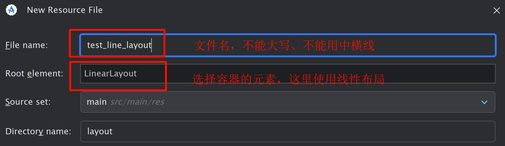
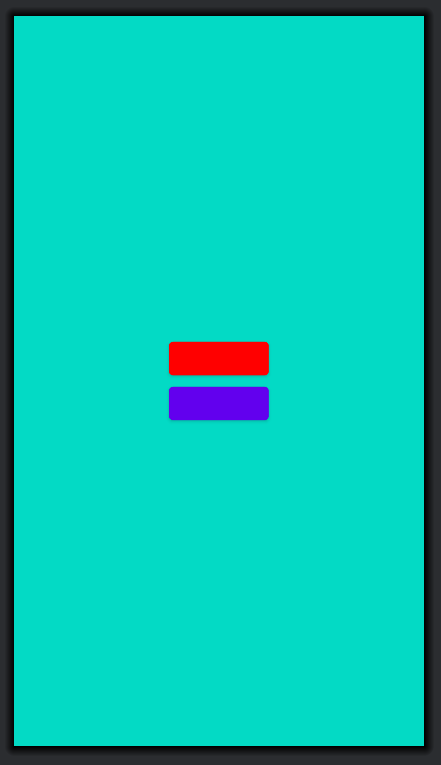
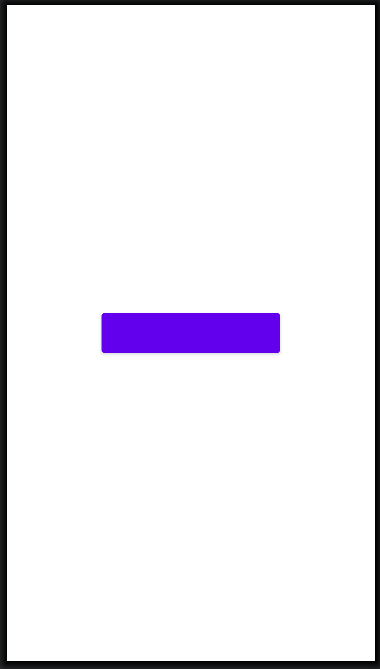

电子笔记: http://8.136.122.222/book/primary/


# 导论

## 来历

Android是一种基于Linux的开源的操作系统，主要使用于智能设备，右Google公司领头开发并推广，2008年推出第一个版本。此系统最初由安卓之父**Andy Rubin**开发（2003年）。

Android的每一个版本都有一个名字，比如`Android 5 => Lollipop(棒棒糖)`。


## 系统架构


<center>
    <b>Android架构图</b>
</center>


## 开发环境

**SDK**: 软件开发工具包，作用相当于JDK

Android Studio: 安卓应用开发工具

编程语言: Kotlin或者Java

SDK包下载之后，需要配置环境变量，一个是`tools`，另外一个是`platform-tools`。不过最新的SDK好像没有`tools`了，那么就只需要配置`platform-tools`.

然后需要下载一个模拟器，用于调试安卓程序。

> 部分电脑会出现模拟器不能创建或者启动的问题，主要原因是安装路径下包含了**中文**目录，解决的办法如下：
>
> - 删除`.android`文件夹
> - 配置环境变量: `ANDROID_SDK_HOME=D:\android-sdk-windows`
>
> 还有可能是电脑没有开启虚拟化


## 项目结构

### 主界面

项目创建完成之后，会有一个`MainActivity`的类，这个就是项目的主界面，即点击APP图标之后首先进入的界面

```kotlin
/*
主界面Activity类，
*/
class MainActivity : ComponentActivity() {
    /*
    重写回调函数: onCreate()
    	=> 在当前类创建的时候自动调用
    */
    override fun onCreate(savedInstanceState: Bundle?) {
        // 调用父类方法进行一些初始化工作
        super.onCreate(savedInstanceState)
        enableEdgeToEdge()
        // 设置窗口要显示的界面
        setContent {
            ChatUITheme {
            }
        }
    }
```


### R

在安卓中，有一个特殊的名为`R`的类，它对应着`res`目录，即资源文件夹：


```kotlin
drawable => 放置图片资源
values => 常量文件夹
			=> strings.xml => 包含固定的字符串，大概率是用于国际化的。引用: @string/name
mipmap => 为了适配不同分辨率的手机。里面有样子相同，但是形状和分辨率不一样的应用图标
xml => 不知道

// 使用
R.drawable.xxx
```


### manifest

manifest.xml文件中记录了软件的相关配置，包括图标、应用名称、支持的安卓版本、主题等，叫做**功能清单文件**

```xml
<?xml version="1.0" encoding="utf-8"?>
<manifest xmlns:android="http://schemas.android.com/apk/res/android"
          xmlns:tools="http://schemas.android.com/tools">

    <!--
    icon: 应用的图标
    label: 应用的名称
    theme: 应用的主题
    targetApi: 最佳的android版本
    -->
    <application
                 android:icon="@mipmap/ic_launcher"
                 android:label="@string/app_name"
                 android:theme="@style/Theme.ChatUI"
                 tools:targetApi="31">


        <!--
        activity标签: 配置我们的Activity类
        name: 全类名，包名可以省略
        label: 界面的标题
        -->
        <activity
                  android:name=".MainActivity"
                  android:label="@string/app_name">

            <!--
            让当前的Activity成为主界面Activity
            => 不是因为类中有Main才是主界面，而是因为是主界面，所以我们才取名为MainActivity
            => 即Activity类是否为主界面与类名无关，而是跟下面的<intent-filter>配置有关
            -->
            <intent-filter>
                <action android:name="android.intent.action.MAIN" />
                <category android:name="android.intent.category.LAUNCHER" />
            </intent-filter>
        </activity>
    </application>

</manifest>
```


## APK结构

APK本质上就是一个压缩包。


- res: 项目中的资源文件
- AndroidManifest.xml: 功能清单文件
- classes.dex: 包含所有class文件的供**DVM**执行的文件

下面是安卓打包编译的过程：


## adb

Android调试桥（Android Debug Bridge）是多种用途的**调试工具**，帮助管理设备或模拟器的状态。

```sh
# 1. adb shell: 进入安卓系统的终端
C:\Users\xxx>adb shell
emu64xa:/ $ 

# 2. adb install apk-path: 安装指定路径的apk文件

```


# Andriod UI


## 基础布局容器

安卓需要在`res/layout`中创建布局资源



### 线性布局

线性布局就是**从左到右**或者**从上到下**的顺序排列的布局

```xml
<?xml version="1.0" encoding="utf-8"?>
<LinearLayout xmlns:android="http://schemas.android.com/apk/res/android"
              android:orientation="vertical"
              android:layout_width="match_parent"
              android:background="@color/teal_200"
              android:gravity="center"
              android:layout_height="match_parent">

    <!--
    1. android:orientation="vertical" => 垂直布局
    2. android:background => 容器的背景
        => 可以使用安卓自带的颜色，以 @color 开头: "@color/cardview_dark_background"
        => 也可以使用HEX表示颜色: #c2c2c2
    3. android:gravity => 指定容器内元素的位置
        => "center" => 水平、垂直居中
        => center_vertical => 垂直居中
    4. android:layout_width => 设置元素的宽度
        => number + dp => 指定宽度
        => "match_parent" => 使用父元素剩余的宽度
    5. android:layout_height => 设置元素的高度
        => number + dp => 指定高度
        => "match_parent" => 使用父元素剩余的高度
    -->

    <Button
            android:layout_width="100dp"
            android:backgroundTint="#ff0000"
            android:layout_height="45dp"/>

    <!--
    android:backgroundTint => 高版本的 Android 用来修改button的背景颜色
    -->

    <Button
            android:layout_width="100dp"
            android:layout_height="45dp"/>
</LinearLayout>
```


效果图:




### 相对布局

相对布局在摆放子视图位置时，按照**指定的参考系**来摆放子视图的位置，默认以**屏幕左上角(0,0)**位置作为参考系。

#### 相对于父元素

```xml
<?xml version="1.0" encoding="utf-8"?>
<RelativeLayout xmlns:android="http://schemas.android.com/apk/res/android"
                android:layout_width="match_parent"
                android:layout_height="match_parent">


    <!--
    1. android中的button默认自带6dp的上边距和下边距
        => android:insetBottom="0dp" => 取消下边距(padding-bottom)
        => android:insetTop="0dp" => 取消上边距(padding-top)
    2. android:layout_alignParentX="true" => 位于父元素X方
    3. android:layout_centerHorizontal="true" => 水平居中
    4. android:layout_centerVertical="true" => 垂直居中
    5. android:layout_centerInParent="true" => 处于父元素正中

    -->
    <Button
            android:layout_width="200dp"
            android:insetBottom="0dp"
            android:insetTop="0dp"
            android:layout_centerInParent="true"
            android:layout_height="45dp"/>

</RelativeLayout>
```


效果图:




#### 相对于兄弟元素

```xml
<?xml version="1.0" encoding="utf-8"?>
<RelativeLayout xmlns:android="http://schemas.android.com/apk/res/android"
                android:layout_width="match_parent"
                android:layout_height="match_parent">


    <!--
    1. android:layout_above="@+id/btn1" => 与某元素的上边沿紧贴
    2. android:layout_below="@+id/btn1" => 与某元素的下边沿紧贴
    3. android:layout_toEndOf="@+id/btn1" => 与某元素的右边沿紧贴
    4. android:layout_toStartOf="@+id/btn1" => 与某元素的左边沿紧贴

    -->
    <Button
            android:id="@+id/btn1"
            android:layout_width="200dp"
            android:insetBottom="0dp"
            android:insetTop="0dp"
            android:backgroundTint="#c2c2c2"
            android:layout_centerInParent="true"
            android:layout_height="45dp"/>
    <Button
            android:id="@+id/btn2"
            android:layout_width="200dp"
            android:insetBottom="0dp"
            android:insetTop="0dp"
            android:layout_toEndOf="@+id/btn1"
            android:layout_height="45dp"/>

</RelativeLayout>
```


效果图：


<center>
    <b>与某元素的右边缘紧贴</b>
</center>


```xml
<?xml version="1.0" encoding="utf-8"?>
<RelativeLayout xmlns:android="http://schemas.android.com/apk/res/android"
                android:layout_width="match_parent"
                android:layout_height="match_parent">


    <!--
    边沿对齐
    1. android:layout_alignStart="@+id/btn1" => 与某元素的左边缘对齐
    2. android:layout_alignEnd="@+id/btn1" => 与某元素的右边缘对齐
    3. android:layout_alignTop="@+id/btn1" => 与某元素的上边缘对齐
    4. android:layout_alignBottom="@+id/btn1" => 与某元素的下边缘对齐

    -->
    <Button
            android:id="@+id/btn1"
            android:layout_width="200dp"
            android:insetBottom="0dp"
            android:insetTop="0dp"
            android:backgroundTint="#c2c2c2"
            android:layout_centerInParent="true"
            android:layout_height="45dp"/>
    <Button
            android:id="@+id/btn2"
            android:layout_width="200dp"
            android:insetBottom="0dp"
            android:insetTop="0dp"
            android:layout_alignStart="@+id/btn1"
            android:layout_height="45dp"/>

</RelativeLayout>
```


效果图：


<center>
    <b>与某元素的左边缘对齐</b>
</center>


### 帧布局

组件的默认位置都是左上角，组件之间可以重叠。像千层饼一样，一层压着一层，可以设置上下左右的对齐、水平垂直居中、设置方式与线性布局相似。

```xml
<?xml version="1.0" encoding="utf-8"?>
<FrameLayout xmlns:android="http://schemas.android.com/apk/res/android"
             android:layout_width="match_parent"
             android:layout_height="match_parent">

    <!--
    1. layout_gravity => 组件相对于父容器的位置
        => center => 居中
        => center_vertical => 垂直居中
        => center_horizontal => 水平居中
    2. layout_marginStart => 左外边距
    3. layout_marginEnd => 右外边距
    4. layout_marginTop => 上外边距
    5. layout_marginBottom => 下外边距
    -->

    <Button
            android:layout_width="200dp"
            android:layout_gravity="center"
            android:layout_marginStart="50dp"
            android:layout_height="200dp"/>
    <Button
            android:layout_width="150dp"
            android:layout_gravity="center"
            android:backgroundTint="#c2c2c2"
            android:layout_marginEnd="40dp"
            android:layout_height="150dp"/>
    <Button
            android:layout_width="100dp"
            android:layout_gravity="center"
            android:backgroundTint="#ff0000"
            android:layout_marginTop="30dp"
            android:layout_height="100dp"/>
    <Button
            android:layout_width="50dp"
            android:layout_gravity="center"
            android:backgroundTint="#0000ff"
            android:layout_marginBottom="20dp"
            android:layout_height="50dp"/>

</FrameLayout>
```


效果图:


<center>
    <b>帧布局</b>
</center>


### 约束布局

