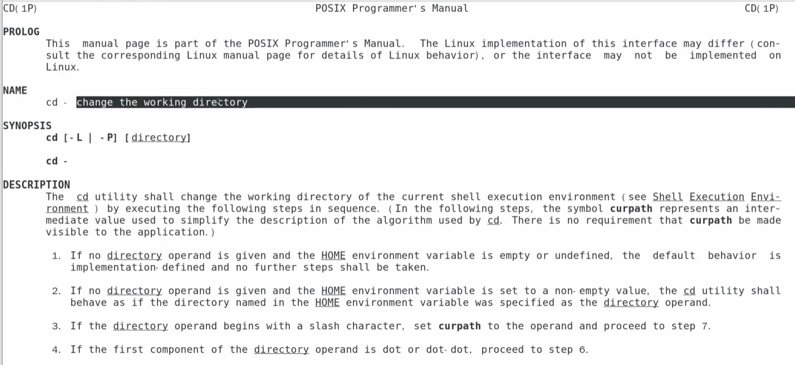
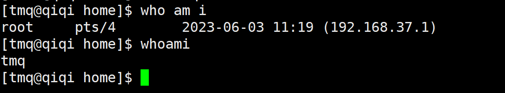
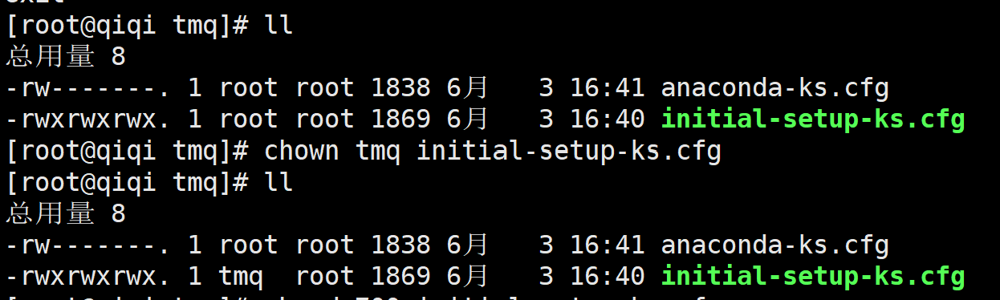
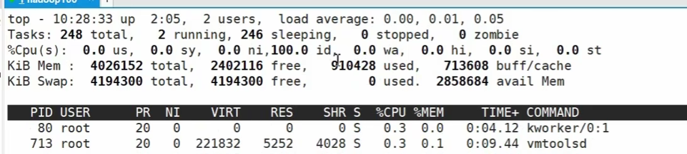

# 运维篇


## 系统配置

### 查看系统基本信息

查看centos版本：`cat /etc/redhat-release`或者`uname -a`

查看centos系统详细信息：`hostnamectl`


### 其他配置的位置

ssh配置：`/etc/ssh/sshd_config`


## 防火墙操作


# 基础篇

## 一、vim的使用及模式

用vim来编辑文件的话，可以打开终端，然后vim 文件名

vim默认为一般模式，只能进行复制、删除、粘贴操作

编辑模式，用来编辑文本

命令模式，可以用命令

模式的切换：

+ 一般模式进入编辑模式，可以敲一个i、a、o中的任意一个，编辑模式退回到一般模式，可以按esc键
+ 一般模式进入命令模式，敲一个英文的冒号或者反斜杠/，:w表示写入，:q表示退出vim

### 1.1 、一般模式常用操作

==复制一行：yy
粘贴：p
剪切一行：dd
撤销:u==

复制多行：`nyy或者yny`
复制从光标位置开始到该行结束：`y$`
复制光标位置之前的内容：`y^`
复制光标所在字符：`yw`

移动到下一个单词词头：`w`
移动到本行行首：`shift+^`
移动到行尾：`shift+$`
移动到当前词尾：`e`
移动到页头：`1+G或者gg或者H(gg是移动到整个页的页头，而H是移动到窗口所展示的页头)`
移动到页尾：`G或者L(有区别，G是移动到整个页的页尾，而L是移动到窗口所展示的页尾)`
移动到倒数第几行：`数字+L`
移动到目标行：数字 `N+G`
移动到上一个词的词头：`b`

删除某一个单词从光标所在字母开始：`dw`
删除从光标位置开始到该行结束：`d$`
删除光标位置之前的内容：`d^`

剪切光标所在的单个字符(删去右边)：`x(小写)`
剪切光标所在的单个字符(删去左边)：`X(大写)`

更改光标所在的字符：`r+更改的字符`
更改光标所在位置的字符串：`R+更改的字符串(这里按backspace是撤销)`
R这里其实是进入替换模式，所过之处都会被替换成输入的字符，直到退出替换模式

命令：
`:set nu`  显示每一行的行号
`:set nonu` 关闭显示行号

### 1.2 进出编辑模式

==i:		在当前光标前进入==
a:		在当前光标后进入
==o:		在当前光标行的下一行进入==
I:		在光标所在行行头进入
A:		在光标所在行行尾进入
O:		在当前光标行的上一行进入


esc:	退出编辑模式

### 1.3 指令模式

:w				保存
:q				退出
:wq				保存并退出
:q!				不保存强制退出
:set nu  		显示每一行的行号
:set nonu 		关闭显示行号
`/词`		查找出到所有要查的词，用n往下找，N往上找
:noh			取消高亮显示
:s/old/new		替换当前行匹配到的第一个old为new
:s/old/new/g		将当前行匹配到的所有的old替换成new
:%s/old/new		将文档中每一行匹配到的第一个old替换成new
:%s/old/new/g	将文档中所有匹配到的old替换成new


## 二、网络配置

```sh
Windows和Linux查网络是否连接，用ping 网络IP

Windows查IP 用指令：ipconfig

Linux查IP 用指令：ifconfig

Linux查看主机名：hostname
查看详细的主机信息：hostnamectl

快捷更改主机名：hostnamectl set-hostname xxx

# 修改ip地址
vim /etc/sysconfig/network-scripts/ifcfg-ens33

# 重启网卡
systemctl stop network
systemctl start network
systemctl restart network
```

## 三、远程登录

打开命令行，输入：

```markdown
ssh root@qiqi100
```

或者打开xshell，创建会话。


## 四、系统管理

进程：一个正在执行的程序或命令

服务：启动之后一直存在、常驻内存的程序

```markdown
CentOS-7启动服务基本语法
systemctl start/stop/restart/status 服务名

systemctl restart network  重启网络
```

运行级别：


tap键在setup界面切换按钮

GUI界面和命令行界面切换：

```
init 3				切换成命令行
init 5				切换成GUI
ctrl+alt+F1			切换成GUI
ctrl+alt+F2			切换成命令行
```

查看服务状态（开跟关）

```sh
--老版本--

chkconfig--list					查看network跟netconsole的状态
chkconfig network on			将network的服务全打开
chkconfig network off			将network的服务全关闭
chkconfig--level 3 network off	将network运行级别三的服务打开

--新版本--

systemctl status xxx			查看xxx的状态


```

关机重启命令

```
shutdown						一分钟后关机
shutdown - c					关机之前取消关机			
shutdown now					立刻关机
shutdown number					指定多少分钟之后关闭
shutdown time					指定某一个时间关机

sync							将数据由内存同步到硬盘中(一般用在关机之前)
halt							停机，但不断电，只是cpu停止运行
poweroff						关机、断电
reboot							重启

shutdown[选项]时间：
shutdown -r now					立刻重启
shutdown -H 					停机


```

## 五、常用基本命令-文件类

### 5.1 man获得帮助信息

#### 5.1.1 基本语法

man [命令或配置文件]					获得帮助信息

```
基操：
f					向下翻页
b					向上翻页
space				翻页


另外：
man -f 内嵌命令		查看不同解释下的命令，如下图

man 1p cd			查看1p下面的cd的解释

```




### 5.2 help获得内置命令信息

一部分命令是直接内嵌在shell中的，系统加载启动之后会随着shell一起加载，常驻在系统内存中。

语法： help 命令

```
help一般只能用于查看内嵌命令的解释

但外部命令也可以，语法：
外部命令 --help


补充常用快捷键：
ctrl+l			将屏幕的内容移到上方（另外可直接用命令clear清屏）
reset			将终端命令行重启
ctrl+c			停止进程
tab				提示
上下键			  查找执行过的命令
```


可以用==type==来查看命令是属于内嵌命令还是外部命令：

语法： type 命令


### 5.3 文件目录类

#### 5.3.1 pwd 显示当前工作目录的绝对路径

pwd：print working directory	打印工作目录

(确保不会敲着敲着不知道自己敲哪里去了)


#### 5.3.2 ls

列举出目录内容

```
ls				显示该文件夹的内容
ls -a			显示该文件夹的全部内容，包括隐藏档(.开头的文件)

ls -l			长数据串列出，包括文件的属性与权限等(等同于直接ll，就是其别名)
每列依次是：文件类型和权限-链接数-文件属主-文件属组-文件大小-最近修改时间-名字

ls -a -l		结合使用
```


#### 5.3.3 cd

切换目录位置

```
cd 				切换到主文件夹
cd - 			切换到上一次切换的目录下
cd /path		切换到某绝对路径
cd ../path		切换到某相对路径
cd ..			切换到上一级目录
cd ./path		切换到当前目录某一个路径

补充：
su 用户						切换用户
(switch user)
隐藏文件夹  一般以.文件的形式
```

#### 5.3.4 mkdir&rmdir

```
创建目录
mkdir d				在当前目录下创建d文件夹
mkdir a b			在当前目录下创建a文件夹和b文件夹
mkdir d/e			在d目录下创建e文件夹
mkdir -p f/g/h		在f文件夹不存在的情况下，依次创建f、g、h文件夹


移除目录(删除的必须是空目录)

rmdir a				在当前目录下删除a文件夹
rmdir f/g/h	f/g f	删除f文件夹(要先将文件夹中的内容删除掉)
rmdir -p f/g/h		删除文件夹h，若删除h后g为空，删除g，若删除g后f为空，删除f

```

#### 5.3.5 touch

```
创建空文件
touch 新文件名称					在当前目录下创建新的文件
touch /home/g/tachibana			在指定路径下创建tachibana文件


另外可以用vim：
vim 文件名					创建一个临时文件，直接:q退出vim文件不保存，:wq退出的话就可以了。
```

#### 5.3.6 cp

```
复制文件
cp[选项] source dest			将source复制到dest

如果dest是一个文件夹，则复制source文件；如果dest是一个文件，则source将覆盖dest文件。覆盖的话，系统会问是否要覆盖，回答如下：

覆盖：y			不覆盖：n

如果不想要系统提问是否要覆盖的话，可以这么写：
\cp[选项] source dest

\，反斜杠+命令表示使用原生命令


如果是想要复制文件夹的话：
cp -r source dest				递归复制整个文件夹


补充：查看别名
alias
```

#### 5.3.7 rm

```
删除文件
rm[选项] deleteFile		删除文件


-r						递归删除目录中的所有内容(rm默认只删除文件)

-f						强制执行删除，不提示

-rf						两者结合

-v						显示指令的详细执行过程

补充：删库跑路
rm -rf /*					把根目录下的所有文件全删除
```

#### 5.3.8 mv

```
移动文件与目录或者重命名

mv file path file1.0		将文件(或者文件夹)移动到path中并重命名为file1.0

mv file path				将文件(或者文件夹)移动到path中

mv file file1.0				将文件(或者文件夹)重命名为file1.0


```


#### 5.3.9 cat

查看文件内容

```
cat [选项] file

-n					显示所有行号，包括空行

一般用于查看比较小的文件
```

#### 5.3.10 more

文件内容分屏查看器，more指令是一个基于VI编辑器的文本过滤器。

```
语法：
more file

操作：
space					向下翻页
enter					向下翻一行
q						离开more，不再显示该文件内容
ctrl+f					向下滚动一屏
ctrl+b					返回上一屏
=						输出当前行的行号
:f						输出文件名和当前行的行号

注意：翻到最后直接退出
```


#### 5.3.11 less

分屏显示文件内容。less指令的功能与more相似，但比more指令强大，支持各种显示终端。less指令在显示文件内容时不是一次将整个文件加载之后才显示的，而是根据显示需要加载内容，对于显示大型文件具有较高的效率

```
less file

操作：
space						翻下一页
↑							上一行
↓							下一行
f							下一页
b							上一页
G							页尾
g							页头
/s							查找字串，此时n：向下查找，N：向上
?s							查找字串，此时n：向上查找，N：向下
q							离开
```


#### 5.3.12 echo

输出内容到控制台

```
语法：
echo [选项][输出内容]

-e						支持反斜杠控制的字符转换

\\						输出\本身
\n						换行
\t						制表符，也就是tab键

转义字符要在引号中使用

补充：
echo $		+tab
可以查看环境变量

echo $USER		查看user的路径

```


#### 5.3.13 >输出重定向和>>追加

```
内容 > 文件				把内容写入文件(覆盖)


内容 >> 文件			把内容追加进文件中


必须跟ls、ll、echo等一起使用

echo "I love you" > file	将echo后面的内容写入file中

ls -l > file				将ls的信息写入file中

```


#### 5.3.14 head

用于显示文件的开头部分内容，默认情况下head指令显示文件的前10行内容

```
语法：
head file						查看文件头10行内容
head -n number file				查看文件头number行内容	


```


#### 5.3.15 tail

用于输出文件中的尾部的内容，默认情况下显示后10行

```
语法：
tail file					查看尾部10行内容
tail -n number file			查看尾部number行内容

tail -f file				实时追踪该文档的所有更新(ctrl+s可以暂停监视，但写入的东西依然会记录，只是没有实时显示文件的更新，ctrl+q继续，ctrl+c退出)
开两个会话，一个会话tail -f file，另一个会话向file中写入东西


细节：
开启监视后，不能另起一个会话，然后用vim进行编辑，这样内容是不会被实时记录的，当然，不会实时显示文件更新而已，其实还是记录了的。

直接覆写的话会显示说文件已截断，但显示该条信息之后文件依然被监视，依然可以实时追踪文档的更新。那个提示只是在说文件内容发生了覆写。


补充：
ls -i file				查看文件在底层的索引号
用vim编辑的话，一单文件的内容发生了改变，文件的索引号就会改变，
而
tail -f file
实时追踪的是当前索引号所指向的文件，如果索引号发生变化，而又没有退出监视，那么文件的更新内容就不能在控制台显示了。


```


#### 5.3.16 ln

软链接，也称符号链接，类似于Windows里面的快捷方式，有自己的数据块，主要存放了链接其他文件的路径

另外还有一个硬链接，就是把"-s"去掉，但一般不用。

```
语法：
ln -s[原文件或目录][软链接名]				给原文件创建一个软链接

软链接是在当前的路径中创建的，而原文件或目录在其他的路径下

[root@qiqi ~]# cd /home/qiqi/
[root@qiqi qiqi]# ln -s /root/info myInfo
[root@qiqi qiqi]# cd /home/qiqi/
[root@qiqi qiqi]# ls
a  b  c  love.sh  myInfo  公共  模板  视频  图片  文档  下载  音乐  桌面


补充：
pwd -P					显示实际的路径(链接指向的路径，而不是软链接的路径)

cd -P 路径				跳转到实际的路径(链接指向的路径，而不是软链接的路径)
[root@qiqi qiqi]# ln -s /home/qiqi/ts /root/myTs
[root@qiqi myTs]# cd /root/myTs
[root@qiqi myTs]# cd -P /root/myTs
[root@qiqi ts]# 


rm [软链接名]				删除软链接(先跳转到链接所在位置，再rm)
rm -rf [软链接名]			在没有提示的情况下删除软链接

！！：
rm -rf[软链接名]/			软链接对于目录下的文件全部删除

```

#### 5.3.17 history

查看操作历史

```
history					查看所有使用过的命令历史
history number			查看最近number条的命令历史
！历史编号				重复使用该编号所指代的命令
history -c				清除命令历史
```

## 六、常用基本命令-日期类

### 6.1 显示当前时间


```
date							显示当前的日期

date +%Y						显示当前年份

date +%y						显示当前年份的后两位

date +%m						显示当前月

date +%d						显示当前是几号

date "+%Y-%m-%d %H:%M:%S"		显示年月日时分秒

date +%Y-%m-%d-%H-%M-%S			显示当前年月日时分秒

date +%s						显示时间戳
#时间戳就是UTC标准中，从1970年1月1日到现在的秒的累加
```


### 6.2 显示非当前时间

```
基本语法：
date -d"1 days ago"					显示昨天的时间
date -d"-1 days ago"				显示明天的时间

其中days可以改成years，months，hours，seconds等

```


### 6.3 设置系统时间

```
date -s"xxxx-xx-xx xx:xx:xx"		将系统时间设定为字符串中的

ntpdate xxx							将时间恢复到最新的时间
```

### 6.4 cal

```
查看日历
cal [year]							 	不加选项，则查看本月日历

cal 2017								查看2017年的日历

cal -number								显示前number个月的日历

cal -m									将周一放在前面的日历

cal -y									查看当前系统日期年的日历
```

### 6.5 补充

```
tzselect			该命令可以选择区域时间，但不能将时间更新到最新

如果修改了系统时间，退出Linux之后会恢复到最新时间
```


## 七、用户管理命令

### 7.1 useradd

```
useradd	username					添加username
(默认在home目录下创建用户)

useradd -g 组名 用户名				将新用户添加到某个组中

useradd -d Path username			在指定路径添加用户


```


### 7.2 passwd

```
更改用户密码
passwd username
```

### 7.3 id

```
查看用户所在的组
id username

查看所有用户的分组
cat /etc/passwd


```

### 7.4 su

```
切换用户
su username

查看最原始的用户(就是会话最初的用户)
who am i

查看当前会话的用户(使用su切换了的)
whoami
```




==用户的切换是个层层嵌套的关系==


```
从root切换到atguigu，相当于在root中嵌套了一个atguigu的用户，从atguigu切换到tony，也是在其中嵌套了一个tony用户。如果exit的话，会依次跳转到atguigu、root。
```

==同级别的用户不能查看对方的文件内容，但超级管理员root可以查看所有用户的文件==


### 7.5 userdel

```
删除用户
userdel username	删除用户但保留用户主目录

userdel -r username		用户和用户主目录都删除
```

### 7.6 sudo

```
以root的身份执行操作

首先要以root的身份在/etc/sudoers中将要赋予管理员身份的用户添加进去(专业叫做：修改配置文件)

然后切换成被赋予管理员身份的用户
su tmq

执行root身份的操作
sudo ls
```


### 7.7 group

```
查看所有的分组：
cat /etc/group

系统对用户组的添加、删除和修改，其实就是对/etc/group文件的更新

```


### 7.8 groupadd

```
新增组
groupadd groupname						添加一个组
```


### 7.9 usermod

```
修改用户相关属性
usermod -g group username			改变用户所在的组
```

### 7.10 groupmod

```
groupmod -n newName oldName			改变组名
```

### 7.11 groupdel

```
groupdel groupname			删除组
```

## 八、文件权限类

### 8.1文件属性

详见PDF

```
补充：
ls -al			查看所有内容，包括隐藏内容

```

### 8.2 chmod

```
改变权限
(1)chmod [{ugoa}{+-=}{rwx}] file/dir

解释：
u->user		g->group	o->others	a->all
+	添加权限
-	撤销权限
=	(一般和a用)统一修改权限

e:
chmod u+x file			将file的u权限中添加可执行权限
chmod a=rw file			将file的所有权限改为读和写

(2)chmod [mode=xxx] file/dir
1->x
2->w
3->1+2->wx
4->r
5->1+4->rx
6->2+4->rw
7->1+2+4->rwx

其实就是底层的二进制编码数转换为十进制数
r	w	x	
0	0	0	0	none
0	0	1	1	x
0	1	0	2	w
0	1	1	3	wx
1	0	0	4	r
1	0	1	5	rx
1	1	0	6	rw
1	1	1	7	rwx


如果想要把整个文件夹里面的文件权限都作更改，需要加一个-R(表示递归)
chmod -R xxx dir

e:chmod -R 777 dir		将dir目录下的所有文件的权限都修改为777
```


### 8.3 chown

```
改变所有者(属主)
chown[选项][最终用户][文件或目录]      改变文件或者目录的所有者

-R								   递归操作

```




### 8.4 chgrp

```
改变所属组
chgrp[最终用户组][文件或目录]		改变文件或目录的所属组


```


## 九、搜索查找类

### 9.1 find

```
查找文件或目录
find[搜索范围][选项]

find /home -user tmq			在home文件夹下寻找tmq这个用户

find /home -name info			在home文件夹下寻找info这个文件

find /root -name "*.cfg"		在root文件夹下寻找所有.cfg的文件

find /root -size +10M			在root文件夹中找所有大于10M的文件


补充：
ls -lh					显示出的文件大小带单位

```

### 9.2 locate

```
快速定位文件路径
locate file					将查找所有带了"file"的文件


在查找之前，要用updatedb更新一下locate数据库，locate是默认一天更新一次。
```

### 9.3 which

```
用于定位命令的位置
which cd						查找cd所在的路径

which xx
```

### 9.4 whereis

```
也是用于查找命令的
whereis cd					查找cd命令所在路径
```


### 9.5 grep

```
过滤查找
grep -n boot info		在info文件中查找"boot"关键字，并显示行号

管道符:|

ls | grep .cfg			在ls中查找含".cfg"关键字的文件


补充：
wc	tmq					统计tmq这个文件夹的单词数量

wc->word count
会显示三个数据
行数		单词数		字节数


对于 grep -n love LoveTMQ | wc
1->包含love字眼的句子有一行
6->包含love字眼的所有句子中的单词总数
27->包含love字眼的所有句子中的字节总数
```


## 十、压缩解压类

### 10.1 gzip/gunzip

```
压缩(Linux自带)
gzip	file			压缩文件，后缀为*.gz
gunzip file.gz			解压文件


细节：
1.只能压缩文件，不能压缩目录
2.压缩完后只有.gz文件，原文件不保留
3.多个文件压缩会产生多个压缩包
```


### 10.2 zip/unzip

```
zip[选项] newFile.zip file		将file压缩为newFile.zip文件

-r			压缩目录

unzip xxx.zip				解压
unzip -d Path xxx.zip		将文件解压到指定的路径
```

### 10.3 tar

```
打包
tar[选项]xxx.tar.gz file			打包目录，压缩后的文件格式为.tar.gz

-c						产生.tar打包文件
-v						显示详细信息
-f						指定压缩后的文件名
-z						打包同时压缩
-x						解包.tar文件
-C						解压到指定目录

常用的压缩指令
tar -zcvf tian.tar.gz info xiaoshuo.txt LoveTMQ

常用的解压指令
tar -zxvf tian.tar.gz -C /home/tmq
```

## 十一、磁盘查看和分区类

### 11.1 du

```
查看文件和目录占用的磁盘空间
du:disk usage

语法：
du dir/file					显示该目录下每个子目录的磁盘使用情况

-h						带单位显示
-a						查看子目录大小和文件
-c						显示所有文件和子目录的大小后，显示总和
-s						只显示总和
--max-depth=n			指定统计子目录的深度为第n层

例子中只统计第一层，就是tmq的下一级所有内容
```


### 11.2 df

```
查看磁盘空间使用的情况
df:disk free 				空余磁盘

语法：
df -h				
列出文件系统的整体磁盘使用量，检查文件系统的磁盘空间占用情况

补充：
shm->shared memory   共享内存
tmp->

```

### 11.3 free

```
查看磁盘整体的情况
free -h
```

### 11.4 lsblk

```
查看设备挂载情况

基本语法：
lsblk					查看设备挂载情况

-f				查看详细的设备挂载情况，显示文件系统信息


mountpoint：挂载点

rom：光盘
```

### 11.5 mount/umount

```
挂载/卸载
基本语法：
mount[-t vfstype][-o options]device dir		挂载设备

umount 设备名或挂载点							卸载设备
```

### 11.6 fdisk

```
分区
语法：
fdisk -l			


补充：
p->primary				主分区，最多四个主分区
e->extends				拓展分区，在主分区中
```

## 十二、进程管理类

PID：process ID，进程的唯一标识。

一般以“d.service”结尾的是守护进程。

### 12.1 ps

```
ps					查看当前用户正在运行的服务

ps aux | grep xxx				查看当前系统的所有服务

ps -ef | grep xxx				可以查看父子进程之间的关系


------BSD风格------
a			列出带有终端的所有用户的进程
x			列出当前用户的所有进程，包括没有终端的进程
u			面向用户友好的显示风格

------UNIX风格------
-e			列出所有进程
-u			列出某个用户关联的所有进程
-f			显示完整格式的进程列表

总结：
想看CPU跟内存占用率，用:ps aux
想看进程的父子关系，用:ps -ef
```


>ps -aux列出字段信息解释
>
>USER：当前用户名（该进程是由哪个用户产生的）
>
>PID：进程的ID号
>
>%CPU：该进程占用的CPU资源百分比
>
>%MEM：该进程占用物理内存百分比
>
>VSZ：该进程占用虚拟内存的大小，单位：KB
>
>RSS：该进程占用实际物理内存大小，单位：KB
>
>TTY：该进程是在哪个终端中运行的。对于CentOS来说，tty1 是图形化终端，tty2-tty6 是本地的字符界面终端。pts/0-255 代表虚拟终端。
>
>STAT：进程状态。
>
>常见的状态有：
>
>R：运行状态				S：睡眠状态					T：暂停状态
>
>Z：僵尸状态				s：包含子进程				l：多线程
>
>+：前台显示				N：优先级比较低		   <：优先级比较高
>
>START：该进程启动时间
>
>TIME：该进程占用CPU的运算时间
>
>COMMAND：产生此进程的命令名

>LRU算法：Linux系统内存分配的算法，比如要储存一个文件时，它会把经常使用到的部分存放在固体内存中，没有经常用到的就放在虚拟内存中。

>ps -ef显示信息说明
>
>UID：用户ID
>
>PID：进程ID
>
>PPID：父进程的ID
>
>C：CPU用于计算执行优先级的因子。数值越大，表明进程是CPU密集型运算，执行优先级会降低；数值越小，表明进程是I/O密集型运算，执行优先级会提高。
>
>STIME：进程启动的时间
>
>TTY：完整的终端名称
>
>TIME：CPU时间
>
>CMD：启动进程所用的命令和参数


### 12.2 kill

```
终止进程
kill [选项] PID		 通过进程号虾洗进程
killall 进程名称		通过进程名称杀死进程（将符合进程名的进程通通虾洗），也支持通配符，这在系统因负载过大而变得很慢时很有用

-9					  强迫进程立即停止（9是一个信号值，可以用kill -l查看）

对于正在使用的进程，比如bash，要想停止该进程，就必须强制停止。


如果将本机的守护进程sshd杀死，那么外部就再也连接不上Linux系统（远程登陆失败），但是在杀死这个进程之前已经连接上的用户不会受到影响。想要该线程再次开启的话，就用systemctl start sshd命令。
```


### 12.3 pstree

> pstree查看进程树
>
> 使用该命令之前得保证安装了pstree插件，没有安装的话需要：yum install pstree
>
> pstree可以以树的形式查看进程间的父子关系
>
> 
>
> 可以直接：pstree
>
> 也可以：pstree | less		进行分页显示
>
> 退出查看的话，直接按q
>
> 
>
> 具体语法：pstree [选项]
>
> -p		显示进程的PID
>
> -u		显示进程所属用户
>
> PID和User展示在括号里，如果跟父进程一致的话或者跟当前用户一样的话就没有显示在括号里。

### 12.4 top

> top：实时监控进程
>
> 

> top信息展示说明
>
> 第一行：
>
> 10:28:33		当前的系统时间，每三秒刷新一次
>
> 2:05				当前系统运行的时间（hour:minute）
>
> 2 users		  当前有两个用户正在使用系统（一个是xshell远程登陆的，一个是打开vm时登陆界面登录的，如果用root身份打开终端的话，将会有三个用户）
>
> load average：三个数据分别表示过去的一分钟、五分钟、十五分钟内系统的平均负载（负载<0.7，负载比较小；负载>1，超出系统负荷）
>
> 
>
> 
>
> 第二行：
>
> Tasks：当前的任务情况（进程）
>
> 248 total				 	总共248个进程
>
> 2 running					两个正在运行
>
> 246 sleeping			 246个处于睡眠状态
>
> 0 stopped				  0个处于暂停状态
>
> 0 zombie					0个处于僵尸状态
>
> 
>
> 第三行：
>
> %Cpu(s)：CPU占用
>
> 0.0 us ：用户进程（默认情况下为没有专门更改过优先级的用户进程）占用内存时间的时间比
>
> 0.0 sy ：系统进程占用内存时间的百分比
>
> 0.0 ni ：nice的前两个字，nice是系统的一个命令，可以改变优先级（越nice，优先级越低，可以理解为越友善越礼让）。在这里指用nice调节优先级之后的所有用户进程占用内存时间的时间比。
>
> 100.0 id ：idle，空闲的意思，这里指空闲时间占比。
>
> 0.0 wa ：wait，这里是等待时间占比（等待I/O操作，等待输入输出的消息）
>
> 0.0 hi ：硬件中断服务请求时间的占比
>
> 0.0 si ：软件中断服务请求时间的占比
>
> 0.0 st ：被虚拟化设备占用的时间占比（被虚拟机偷了）
>
> 
>
> 第四、五行：
>
> KiB Mem ：内存配比
>
> buff/cache ：在缓存中的
>
> KiB Swap ：虚拟内存占用情况
>
> 
>
> PR：任务调动的优先级
>
> NI：用户指定的优先级
>
> VIRT：虚拟内存占用大小
>
> RES：实际内存占用大小
>
> SHR：共享内存占用大小
>
> S：status，状态。
>
> 
>
> 表格中的数据默认按照CPU的占比来排
>
> 如果要按照内存占比来排：按出大写M（shift+m）
>
> 
>
> 退出直接按q




> top基本命令
>
> top [选项]
>
> 
>
> -d 秒数			指定top命令每隔几秒更新。默认是3秒。在top命令的交互模式当中可以执行的命令。
>
> -i						使top不显示任何闲置或者僵死进程（CPU占比不为0）
>
> -p PID			   通过指定监控进程ID来仅仅监控某个进程的状态
>
> 


### 12.5 netstat

```
显示网络状态和端口占用信息

netstat -anp | grep 端口号				查看该进程网络信息
netstat -nlp | grep 端口号				查看网络端口号占用情况

选项：
-a			显示所有正在监听和未监听的套接字
-n			拒绝显示别名，能显示数字的全部转化为数字
-l			仅列出监听的服务状态
-p			表示显示哪个进程在调用


```


## 十三、目录结构

==Linux中一切皆文件==

Linux的目录结构是一个树形结构，最顶层为根目录（/），所有文件都在根目录下。对于Windows系统，win有多个盘符（C、D、E盘等），这个盘符的地位和根目录类似，好比win有多棵树，而Linux只有一棵。

+ 在Linux系统中，路径之间的层级关系用：/ 来表示
+ 在Windows系统中，路径之间的层级关系用：\ 来表示

~表示当前用户进入操作系统时的主目录。


### 以根目录为父目录的目录

+ /bin
  + Binary的缩写，这个目录存放着最经常使用的命令（命令其实是一个个程序）
+ /sbin
  + s就是Super User的意思，这里存放着的是系统管理员使用的系统管理程序
+ /home
  + 存放普通用户的主目录，在Linux中的每个用户都有一个自己的目录，一般该目录名是以用户的账号命名的。
+ /root
  + 该目录为系统管理员，也称作超级权限者的用户主目录
+ /lib
  + library的缩写，系统开机所需要最基本的动态连接共享库，其作用类似于Windows里的dll文件。几乎所有的应用程序都需要用到这些共享库。
+ /lost+found
  + 这个目录一般情况下是空的，当系统非法关机后，这里就存放了一些文件。
+ /etc
  + 所有的系统管理所需要的配置文件和子目录
+ /user
  + 这是一个非常重要的目录，用户的很多应用程序和文件都放在这个目录下，类似于Windows下的program files目录。
+ /boot
  + 这里存放的是启动Linux时使用的一些核心文件，包括一些连接文件以及镜像文件，自己的安装别放这里。
+ /proc
  + 这个目录是一个虚拟的目录，它是系统内存的映射，我们可以通过直接访问这个目录来获取系统信息。
+ /srv
  + service的缩写，该目录存放一些服务启动之后需要提取的数据。
+ /sys
  + 这是linux2.6内核的一个很大的变化。该目录下安装了2.6内核中新出现的一个文件系统sysfs。
+ /tmp
  + 这个目录用来存放一些临时文件
+ /dev
  + 类似于Windows的设备管理器，把所有的硬件以文件的形式存储。
+ /media（CentOS6）
  + linux系统会自动识别一些设备，例如U盘、光驱等等，当识别后，linux会把识别的设备挂载到这个目录下。
  + CentOS7迁移到/run/media
+ /mnt
  + 该系统提供目录是为了让用户临时挂载别的文件系统的，我们可以将外部的存储挂载在/mnt上，然后进入该目录就可以查看里面的内容
+ /opt
  + 这是给主机额外安装软件所摆放的目录。比如你安装一个mysql数据库则就可以放在这个目录下。默认是空的。
+ /var
  + 这个目录中存放着不断扩充着的东西，我们习惯将那些经常被修改的目录放在这个目录下。包括各种日志文件。


## firewall-cmd

该工具是Linux提供的专门用来操作firewall的

查询防火墙中指定的端口是否开放

```
firewall-cmd --query-port=9001/tcp
```

如何开放一个指定的端口

```
firewall-cmd --permanent --add-port=7755/tcp
```

批量添加开发端口

```
firewall-cmd --permanent --add-port=8020/tcp
```

如何移除一个指定的端口

```
firewall-cmd --permanent --remove-port=9003/tcp
```

重新加载

```
firewall-cmd --reload
```

**其中**：

--permanent表示设置为持久 

--add-port表示添加指定端口 

--remove-port表示移除指定端口


## Linux安装东西


### tomcat

在linux上安装tomcat之前，得先安装jdk，并配置jdk的环境变量

然后根据安装的jdk版本，选择对应版本的tomcat，不然tomcat启动不了


### redis


### nginx

```sh
# 拉取nginx镜像
docker pull nginx

# 开放端口
firewall-cmd --add-port=80/tcp

# 重新加载防火墙
firewall-cmd --reload

# 创建nginx容器
docker run -d --name nginx -p 80:80 nginx

# 创建挂载目录
mkdir -p /data/nginx/{conf,log,html}

# 复制文件到主机
docker cp nginx:/etc/nginx/nginx.conf /data/nginx/conf/nginx.conf
docker cp nginx:/etc/nginx/conf.d /data/nginx/conf/conf.d
docker cp nginx:/usr/share/nginx/html /data/nginx

# 停止并删除刚才创建的nginx容器
docker rm -f xxx

# 重新创建新的容器
docker run -d --name nginx -p 80:80 \
-v /data/nginx/conf/nginx.conf:/etc/nginx/nginx.conf \
-v /data/nginx/conf/conf.d:/etc/nginx/conf.d \
-v /data/nginx/log:/var/log/nginx \
-v /data/nginx/html:/usr/share/nginx/html \
--privileged=true nginx
```


# Linux其他命令

## 配置相关

查看系统配置：`cat /etc/os-release`，或者简易的`uname -r`