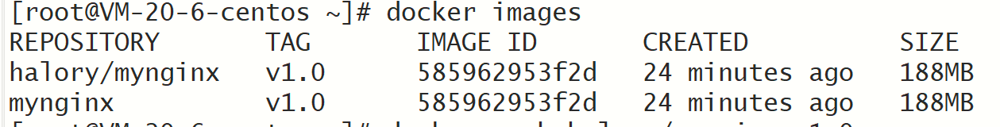
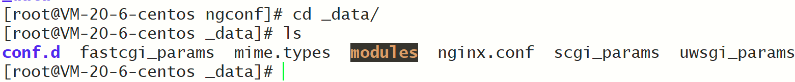
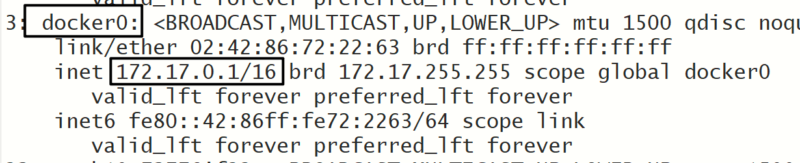
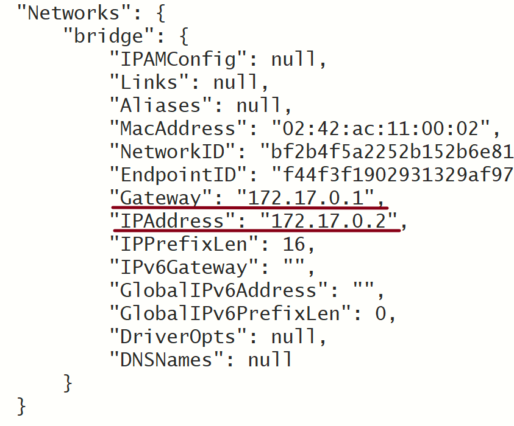
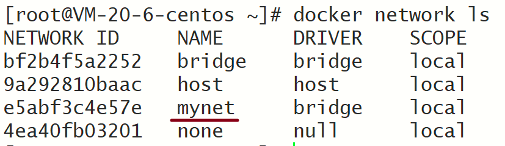
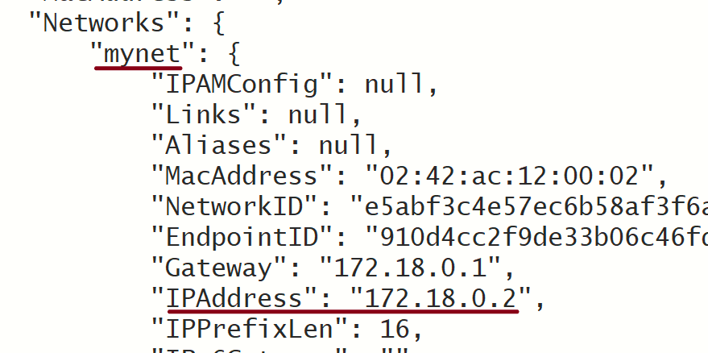
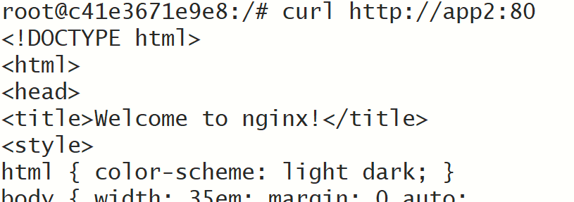
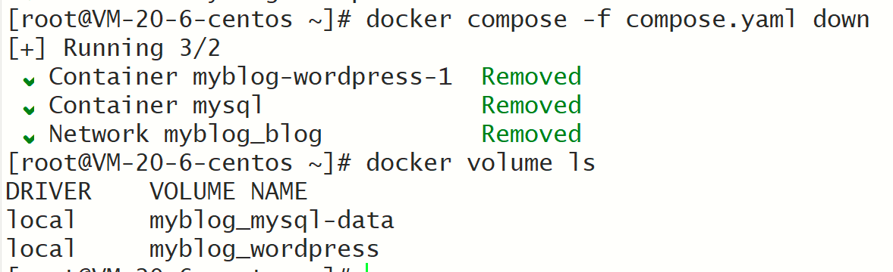

# 基础

## 安装docker

[官方手册](https://docs.docker.com/engine/install/centos/)


1. 下载docker引擎

   ```shell
   sudo yum remove docker \
                     docker-client \
                     docker-client-latest \
                     docker-common \
                     docker-latest \
                     docker-latest-logrotate \
                     docker-logrotate \
                     docker-engine
   ```

2. 配置docker yum源

   ```shell
   sudo yum install -y yum-utils
   yum-config-manager --add-repo http://mirrors.aliyun.com/docker-ce/linux/centos/docker-ce.repo
   ```

3. 安装docker引擎

   ```shell
   sudo yum install docker-ce docker-ce-cli containerd.io docker-buildx-plugin docker-compose-plugin
   ```

4. 启动docker

   ```shell
   sudo systemctl start docker
   ```


## 配置镜像加速器

```sh
# 创建/etc/docker目录（如果没有的话）
mkdir -p /etc/docker

# 创建daemon.json文件
touch /etc/docker/daemon.json

# 将下面内容写入daemon.json
{
    "registry-mirrors": [
        "https://mirror.ccs.tencentyun.com",
        "https://docker.mirrors.ustc.edu.cn",
        "https://registry.docker-cn.com",
        "http://hub-mirror.c.163.com",
        "https://docker.nju.edu.cn",
        "https://docker.m.daocloud.io"
    ]
}

# 重新加载daemon
systemctl daemon-reload

# 重启docker
systemctl restart docker

# 检查是否配置成功
docker info
```


# 命令

实验：启动一个nginx，并将它的首页改为自己的页面，发布出去，让所有人都能使用


## 通用命令

查看帮助手册：`docker xxx --help`


## 镜像操作

### 前置命令

检索镜像：`docker search`

下载镜像：`docker pull`

镜像列表：`docker images`

删除镜像：`docker rmi`


### 下载镜像

```shell
# 1. 检索nginx镜像
docker search nginx

# 2. 拉取nginx镜像
	# 2.1 默认拉取最新的nginx镜像
	docker pull nginx
	# 2.2 指定版本拉取镜像(去docker hub找)
	docker pull nginx:tags

# 3. 查看nginx镜像是否拉取成功
docker images

# 4. 删除指定镜像
	# 4.1 根据name删除
	docker rmi nginx
	# 4.2 根据镜像id删除
	docker rmi fffffc90d343
```


## 容器操作


### 前置命令

- 运行容器：`docker run`
- 查看容器：`docker ps`
- 停止容器：`docker stop`
- 启动容器：`docker start`
- 重启容器：`docker restart`
- 查看状态：`docker stats`
- 查看日志：`docker logs`
- 进入容器：`docker exec`
- 删除容器：`docker rm`
- 退出容器：`exit`


### 使用镜像

```shell
# 1. 运行nginx镜像
docker run nginx
#
#	注意，如果没有指定nginx版本的话，默认就会运行最新版本的nginx镜像，如果本地没有nginx镜像，
#	docker会去下载
#

# 2. 查看镜像运行情况
docker ps
#
#	使用第一步操作运行镜像的话，当前的会话会被阻塞，需要另外开启一个会话来查看容器运行情况
#

# 3. 关闭会话后，重新运行容器
docker start fdd
#
#	这里的fdd是容器的id，每一个镜像运行起来之后，就会得到一个容器，并且会分配一个容器id
#

# 4. 停止容器
docker stop intelligent_heisenberg
#
#	这里的intelligent_heisenberg是容器创建后随机生成的名字
#

# 5. 重启容器，无论容器是已经停止还是正在运行
docker restart fdd

# 6. 查看容器的状态
docker stats fdd

# 7. 查看容器的日志
docker logs fdd

# 8. 删除容器
docker rm fdd
#
#	该命令不能删除正在运行的容器，需要加上-f才行： docker rm -f fdd
#
```


### 关键使用

```shell
# 1. 后台启动容器
docker run -d nginx

# 2. 后台启动容器，并给容器命名
docker run -d --name myNginx nginx

# 3. 后台+命名+端口映射
docker run -d --name myNginx -p 81:80 nginx
#
#	端口映射：当访问服务器的81端口时，就会访问到容器的80端口，即nginx
#

# 4. 以交互的模式进入容器中，并指定交互的方式为：/bin/bash
docker exec -it myNginx /bin/bash

# 5. 切换到nginx的html目录下，并修改index.html文件
cd /usr/share/nginx/html
echo "<h1>Hello, Docker</h1>" > index.html
```


## 镜像保存

### 前置命令

提交镜像：`docker commit`

保存镜像：`docker save`

加载镜像：`docker load`


### 保存myNginx镜像

```sh
# 1. 提交镜像，并写上提交信息
docker commit -m "update index.html" myNginx mynginx:v1.0
#
#	注意，提交的镜像名必须都是小写的，比如 mynginx:v1.0 就不能写成 myNginx:v1.0
#

# 2. 将镜像保存为一个tar文件，可以发给朋友并被朋友使用
docker save -o mynginx.tar mynginx:v1.0
#
#	-o 用来表示将镜像保存为指定的文件。默认保存在当前目录下
#

# 3. 加载镜像
docker load -i mynginx.tar
#
#	-i 用来指定所要加载的文件路径
#
```


## 镜像分享

### 前置命令

登录：`docker login`

命名：`docker tag`

推送：`docker push`


### 将镜像分享到社区

```shell
# 1. 登录dockerHub账户
docker login
#
#	该步骤会输入用户名和密码
#

# 2. 重命名镜像
docker tag mynginx:v1.0 halory/mynginx:v1.0
#
#	利用tag命令，可以将镜像拷贝一份，并重新命名为 halory/mynginx:v1.0
#	但是拷贝出来的镜像id和原来的镜像id是一样的
#

# 3. 推送镜像
docker push halory/mynginx:v1.0
#
#	因为镜像的id是一样的，所以这里用镜像名来推送
#
```


<div>
    <center>
    
        <br>
        重命名镜像
    </center>
</div>


## 灵活使用命令

删除所有的容器：`docker rm -f $(docker ps -aq)`


# 存储

## 目录挂载

目录挂载的目的在于，我们希望可以在容器外修改一些文件，比如说nginx的index.html文件。主要是因为nginx容器中没有`vi`命令，这对于修改文件非常困难。如果使用目录挂载的话，就可以在本机创建修改文件时，容器内部也可以进行同步操作。

使用`-v 本机路径:容器内路径`进行目录挂载

另外，`即使删除了容器，本机挂载的目录下的文件依然是存在的`，比如删除了下面的`app01`容器，但是`/app/nghtml`下的文件还是存在的。

### 实操

```shell
# 1. 将本机的 /app/nghtml 目录与 nginx容器的 /usr/share/nginx/html 目录进行挂载
docker run -d -p 80:80 -v /app/nghtml:/usr/share/nginx/html --name app01 nginx
#
#	此时访问80端口的话，会出现403，因为/app/nghtml目录下还什么都没有
#

# 2. 创建index.html文件
cd /app/nghtml
echo "docker, Nginx, Nice" > index.html
#
#	此时再刷新页面，就可以看见"docker, Nginx, Nice"的内容了
#

# 3. 查看nginx容器的/usr/share/nginx/html
docker exec -it app01 bash
cat /usr/share/nginx/html/index.html
#
#	将会看到如下信息：docker, Nginx, Nice
#	说明容器内外的路径已经相通了
#
```


## 卷映射

目录挂载的一个问题在于，如果本机映射的路径下是空目录，那么会导致容器被映射的路径下原有的文件丢失。比如使用`/app/nghtml:/usr/share/nginx/html`时，容器内部的`index.html`文件就不存在了。万一映射的不是html目录，而是`conf`目录呢？那么使用目录挂载导致的最严重的后果，就是容器的配置文件丢失了，这样一来nginx容器根本无法成功启动。

`卷映射`就可以解决这种情况

卷映射：`-v 卷名:映射路径`

而docker会把卷映射的目录放在`/var/lib/docker/volumes/<卷名>`下

同样，`即使删除了容器，卷目录下的文件依然存在`。

### 实操

```sh
# 1. 卷映射 + 目录挂载
docker run -d -p 80:80 -v ngconf:/etc/nginx -v /app/nghtml:/usr/share/nginx/html --name app02 nginx
#
#	第一个 -v 是用来卷映射的，卷名为 ngconf，映射目录为：/etc/nginx
#	第二个 -v 是用来目录映射的
#

# 2. 查看ngconf卷
cd /var/lib/docker/volumes/ngconf
cd _data
ls
#
#	在_data目录下就是映射的路径了
#
```


<div>
    <center>
    
        <br>
        卷映射的目录
    </center>
</div>


```sh
# 3. 本机修改conf文件，并到容器中查看conf内容
vim nginx.conf
docker exec -it app02 bash
cat /etc/nginx/nginx.conf
# 结果发现内容被同步过来了
```


### 其他命令

列出所有的卷：`docker volume ls`

手动创建卷：`docker volume create 卷名`

查看某一个卷的详情：`docker volume inspect 卷名`


```sh
# 查看ngconf卷的详情
docker volume inspect ngconf
#
#
[
    {
        "CreatedAt": "2024-07-19T21:05:34+08:00",
        "Driver": "local",
        "Labels": null,
        "Mountpoint": "/var/lib/docker/volumes/ngconf/_data",
        "Name": "ngconf",
        "Options": null,
        "Scope": "local"
    }
]
#
#
```


# 网络

## 自定义网络

每启动一个容器，docker都会给这个容器分配唯一ip，使用`容器ip`+`容器端口`就可以实现容器之间的相互访问。这`对于集群的实现非常方便`。


### 相互访问方式一

```sh
# 1.启动两个nginx容器
docker run -d -p 81:80 --name app01 nginx
docker run -d -p 82:80 --name app02 nginx


# 2. 进入其中一个容器
docker exec -it app01 bash


# 3. 访问另外一个容器
curl http://xx.xx.xxx.xxx:82/

#
#	点评：可以访问成功，但是有点奇怪。因为你是在容器内访问的，你得跳出容器，进入主机环境，然后通过主机
# 	访问另外一个容器
#
```


### 相互访问方式二

前面说过，只要容器一启动，docker就会给容器分配ip。事实上，只要启动了docker，就会产生一个叫做`docker0`的网卡，容器的ip就是通过这个网卡分配的

输入：`ip a`，查看所有的网卡信息

<div>
    <center>
    
        <br>
        docker0网卡
    </center>
</div>


我们再来看看app01的ip信息: `docker inspect app01`

<div>
    <center>
    
        <br>
        app01的网络信息
    </center>
</div>


既然是app01和app02是同一个网关下的，自然就可以相互ping通了。

```sh
# 1. 进入app02
docker exec -it app02 bash

# 2. 访问app01
curl http://172.17.0.2:80

#
#	注意，这里使用的端口就不是82了，因为我们是直接访问的容器app01，所以使用的是app01的nginx端口，也就
#	是80端口
#
```


### 相互访问方式三

方式二是以ip地址进行访问的。但是使用ip会有一个缺点，那就是ip地址是动态分配的，一旦容器的ip地址发生了变化，就会无法访问。

想了想，或许可以使用域名来进行访问。因为你ip再怎么变，只要域名不修改，通过域名都可以访问到对应的容器。但是`docker0默认不支持通过主机域名进行访问`。因此，如果我们要采用域名的方式进行访问的话，就需要采取一定的手段了，那就是`自定义网络`。相关命令见`docker network --help`

```sh
# 1. 先自定义一个网络
docker network create mynet

# 2. 查看docker的网络列表
docker network ls
```

<div>
    <center>
    
        <br>
        查看docker网络列表
    </center>
</div>

```sh
# 3. 使用自定义网络启动两个nginx容器
docker run -d -p 81:80 --name app1 --network mynet nginx
docker run -d -p 82:80 --name app2 --network mynet nginx
#
#	使用 --network来指定网络
#

# 4. 查看容器的网络信息
docker inspect app1
#
#	此时的网络是network，ip也不再是 172.17 开头了
#
```

<div>
    <center>
    
        <br>
        自定义网络下的容器信息
    </center>
</div>

```sh
# 5. 通过容器名称进行访问（在自定义网络中，容器名就相当于域名了）
curl http://app2:80
```

<div>
    <center>
    
        <br>
        访问成功
    </center>
</div>


# Docker Compose

## 语法

语法见官方


## 实操

利用开源的博客系统`wordpress` + `mysql`搭建一个博客网站


### 编写yaml文件

下面是一个`compose.yaml`文件

```yaml
name: myblog
services:
	mysql:
		container_name: mysql
		image: mysql:latest
		ports:
			- "3306:3306"
		environment:
			- MYSQL_ROOT_PASSWORD=200414
			- MYSQL_DATABASE=wordpress
		volumes:
			- mysql-data:/var/lib/mysql
			- /app/myconf:/etc/mysql/conf.d
		# 开启自启动
		restart: always
		networks:
			- blog
	
	wordpress:
		image: wordpress
		ports:
			- "8080:80"
		environment: 
			WORDPRESS_DB_HOST: mysql
			WORDPRESS_DB_USER: root
			WORDPRESS_DB_PASSWORD: 200414
			WORDPRESS_DB_NAME: wordpress
		volumes:
			- wordpress:/var/www/html
		restart: always
		networks:
			- blog
		# 依赖mysql启动，所以这里的wordpress镜像实例会晚一点启动
		depends_on:
			- mysql
volumes:
	mysql-data:
	wordpress:
	
networks:
	blog:
```


### 一键启动

```sh
# 1. 利用docker compose自动化部署项目
docker compose -f compose.yaml up -d
#
#	如果compose的文件名就叫做 compose.yaml的话，-f可以忽略
#	-d 表示后台启动
#

# 2. 访问网站
http://42.194.138.186:8080/
```


### 其他操作

```sh
# 1. 一键下线
docker compose -f compose.yaml down
#
#	下线的话，docker默认并不会移除卷，目的是防止数据丢失
#

# 2. 下线的时候既移除镜像、又删掉卷
docker compose -f compose.yaml down --rmi all -v
#
#	--rmi all 表示删除所有镜像。如果只想删除某个镜像的话，可以把all替换成某个镜像名称
#
```


<div>
    <center>
    
        <br>
        下线默认不会移除卷
    </center>
</div>


# DockerFile

## 基本语法

dockerfile就是一个文本文件，其中包含一个个的指令，用指令来说明要执行什么操作来构建镜像。Docker可以根据Dockerfile帮助我们构建镜像。常见指令如下：

| 指令       | 说明                                         | 示例                                                         |
| ---------- | -------------------------------------------- | ------------------------------------------------------------ |
| FROM       | 指定基础镜像                                 | FROM centos:6                                                |
| ENV        | 设置环境变量，可在后面指令使用               | ENV key value                                                |
| COPY       | 拷贝本地文件到镜像的指定目录                 | COPY ./jre11.tar.gz /tmp                                     |
| RUN        | 执行Linux的shell命令，一般是安装过程的命令   | RUN tar -zxvf /tmp/jre11/tar/gz && EXPORTS path=/tmp/jre11:$path |
| EXPOSE     | 指定容器运行时监听的端口，是给镜像使用者看的 | EXPOSE 8080                                                  |
| ENTRYPOINT | 镜像中应用的启动命令，容器运行时调用         | ENTRYPOINT java -jar xx.jar                                  |

## 自定义镜像

部署一个Java项目

```sh
# 基础镜像
FROM openjdk:17

LABEL author=Halory

# 设置工作目录
WORKDIR /app

# 拷贝jar包
COPY app.jar /app.jar

# 指定端口
EXPOSE 4399

# 启动容器执行的命令
ENTRYPOINT ["nohup", "java","-jar","/app.jar"]
```

此时的Dockerfile在当前的文件夹下，而jar包也在当前文件夹下，此时构建镜像就可以使用下面的命令：`docker build -f Dockerfile -t labBook:1.0 .`

- `-f`：指定构建镜像的文件名
- `-t`：给镜像起名字，格式为：repository:tag
- `.`: 指定Dockerfile所在目录，如果就在当前目录，则指定为`.`

# 部署

遇事不决，重启docker。

## MySQL

可查官方文档

```sh
# 创建挂载目录
mkdir -p /root/mysql/data /root/mysql/logs /root/mysql/conf

touch /root/mysql/conf/my.cnf

docker run -p 3306:3306 --name mysql \
--restart=always \
-v /root/mysql/conf:/etc/mysql/conf.d \
-v /root/mysql/logs:/logs \
-v /root/mysql/data:/var/lib/mysql \
-e MYSQL_ROOT_PASSWORD=root  \
-d swr.cn-north-4.myhuaweicloud.com/ddn-k8s/docker.io/mysql:8.0


```


## Nginx

```sh
# 拉取nginx镜像
docker pull nginx

# 开放端口
firewall-cmd --add-port=80/tcp

# 重新加载防火墙
firewall-cmd --reload

# 创建nginx容器
docker run -d --name nginx -p 80:80 nginx

# 创建挂载目录
mkdir -p /data/nginx/{conf,log,html}

# 复制文件到主机
docker cp nginx:/etc/nginx/nginx.conf /data/nginx/conf/nginx.conf
docker cp nginx:/etc/nginx/conf.d /data/nginx/conf/conf.d
docker cp nginx:/usr/share/nginx/html /data/nginx

# 停止并删除刚才创建的nginx容器
docker rm -f nginx

# 重新创建新的容器
docker run -d --name nginx -p 80:80 -p 443:443 \
-v /data/nginx/conf/nginx.conf:/etc/nginx/nginx.conf \
-v /data/nginx/conf/conf.d:/etc/nginx/conf.d \
-v /data/nginx/log:/var/log/nginx \
-v /data/nginx/html:/usr/share/nginx/html \
-v /data/nginx/ssl:/data/nginx/ssl \
--privileged=true nginx
```


## redis

```sh
docker run \
--restart=always \
--log-opt max-size=100m \
--log-opt max-file=2 \
-p 6379:6379 \
--name redis \
-v /data/redis/redis.conf:/etc/redis/redis.conf \
-v /data/redis/data:/data \
-d redis:alpine redis-server /etc/redis/redis.conf \
--appendonly yes \
--requirepass 200414
```


## MongoDB

```sh
docker run --name=mongodb --restart=always -p 27017:27017 -d  -v /root/mongo/data:/data/mongo/data -v /root/mongo/backup:/data/mongo/backup -v /root/mongo/conf:/data/mongo/configdb mongo --auth
```


## Oracle

```sh
docker run -d  \
-p 1524:1521 -p 5502:5500 \
-e ORACLE_SID=ORCLCDB \
-e ORACLE_PDB=ORCLPDB1 \
-e ORACLE_PWD=123456 \
-e ORACLE_EDITION=standard \
-e ORACLE_CHARACTERSET=AL32UTF8 \
-v /data/oracle/oradata:/opt/oracle/oradata \
--name oracle19c \
registry.cn-hangzhou.aliyuncs.com/zhuyijun/oracle:19c

# 查看启动日志，检查是否成功启动
docker logs -ft oracle19c

# 进入oracle
docker exec -it oracle19c /bin/bash
sqlplus / as sysdba
show pdbs;

# 访问
https://localhost:5502/em
# username: sys
# password: 123456
# containerName: ORCLPDB1
```


