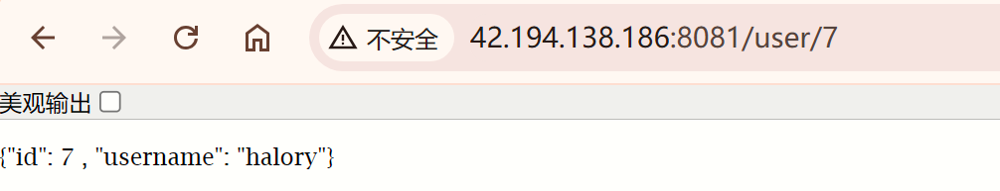

# Caffeine

Caffeine是性能最强的`本地缓存`，可以作为多级缓存的第一级缓存

[官网](https://github.com/ben-manes/caffeine/wiki/Home-zh-CN)

## 简单使用

导入依赖包

```xml
<dependency>
    <groupId>com.github.ben-manes.caffeine</groupId>
    <artifactId>caffeine</artifactId>
</dependency>
```


简单使用:

```java
@Test
void testBaseCache() {
    // 创建缓存对象
    Cache<String, String> cache = Caffeine.newBuilder().build();

    // 存数据
    cache.put("cn", "柯南");

    // 取数据
    String cn = cache.getIfPresent("cn");
    System.out.println("cn = " + cn);

    // 取数据，如果未命中则查询数据库
    String ai = cache.get("ai", key -> {
        // 根据库去查询数据库
        String data = "灰原哀";
        return data;
    });
    System.out.println("ai = " + ai);
}
```


## 缓存策略

Caffeine提供了三种缓存驱逐策略:

- 基于容量: 设置缓存的数量上限
  ```java
  /*
      基于大小设置缓存驱逐策略
       */
  @Test
  void testEvictByNum() throws InterruptedException {
      Cache<String, String> cache = Caffeine.newBuilder().maximumSize(1).build();
      cache.put("op1", "胡桃");
      cache.put("op2", "钟离");
      cache.put("op3", "七七");
      // 延迟10ms，给清理线程一点时间
      Thread.sleep(10L);
  
      // 获取数据
      System.out.println("op1 = " + cache.getIfPresent("op1"));
      System.out.println("op2 = " + cache.getIfPresent("op2"));
      System.out.println("op3 = " + cache.getIfPresent("op3"));
  }
  ```
  
- 基于时间: 设置缓存的有效时间
  ```java
  /*
      基于时间设置缓存驱逐策略
       */
  @Test
  void testEvictByTime() throws InterruptedException {
      Cache<String, String> cache = Caffeine.newBuilder()
          // 1秒后清除缓存
          .expireAfterWrite(Duration.ofSeconds(1))
          .build();
  
      cache.put("cn", "柯南");
      System.out.println("cn = " + cache.getIfPresent("cn"));
      //        Thread.sleep(1200L);
      System.out.println("cn = " + cache.getIfPresent("cn"));
  }
  
  ```
  
- 基于引用: 设置缓存为软引用或弱引用，利用GC来回收缓存数据。性能较差，不建议使用

在默认情况下，当一个缓存元素过期的时候，Caffeine不会自动立即将其清理和驱逐。而是在一次读或写操作后，或者在空闲时间完成对失效数据的驱逐。


## 实战案例

在项目中实现进程缓存的话，就要把这个Caffeine注册为Bean以供使用:

```java
@Configuration
public class CaffeineConfig {
    /*
    用户信息缓存
     */
    @Bean
    public Cache<Long, User> userCache() {
        return Caffeine.newBuilder()
                .initialCapacity(100)
                .maximumSize(10_000)
                .build();
    }
    
    /*
    // 商品缓存
    @Bean
    public Cache<Long, Item> itemCache() {
        return Caffeine.newBuilder()
                .initialCapacity(100)
                .maximumSize(10_000)
                .build();
    }
     */
}

```


然后再查询用户的时候，就可以使用这个缓存技术了:

```java
    @Resource
    private Cache<Long, User> userCache;


    @GetMapping("/{id}")
    public User findById(@PathVariable("id") Long id) {
        return userCache.get(id, key -> userService.getById(id));
    }
```

访问两次数据的时候，控制台却只有一次查询数据库的记录，第二次就直接走缓存了:


# OpenResty

过了本机这关，下面就不能不通过发送网络请求来获取数据了，但是如果使用了nginx作为代理服务器的话，我们还可以在nginx上设立缓存，作为第二级缓存


## Lua

在nginx中使用缓存的话，就得用lua进行缓存数据的存取了。

lua是一种轻量级脚本语言，用c语言编写，可以给nginx写扩展。

centOS系统自带lua

### hello-world

```sh
# 创建lua文件
vi hello.lua

# 编写lua代码
cat hello.lua
# print('hello world!')

# 执行lua文件
lua hello.lua
# hello world!
```


### 基本数据类型

| 数据类型 | 描述                                            |
| -------- | ----------------------------------------------- |
| nil      | 表示一个无效值，在条件表达式中相当于false       |
| boolean  | 包含true和false                                 |
| number   | 表示数字类型                                    |
| string   | 字符串，单双引号都行                            |
| function | 由 C 或者 Lua 编写的函数                        |
| table    | 关键数组，类似Map，既可以存键值对，又可以当数组 |

可以利用`type()`函数测试给定变量或值得类型


### 变量

Lua声明变量的时候，不需要指定数据类型，用`local`修饰的为局部变量，否则为全局变量:
```lua
-- 声明字符串
local str = 'hello'
-- 在Lua中字符串拼接使用 ..
local str2 = 'hello' .. 'world' print(str2)

-- 声明数字
local num = 21

-- 声明布尔类型
local flag = true

-- 声明数组，以key为索引的table
local arr = {'java', 'python', 'lua'}

-- 声明table，类似java的map
local map = {name='jack', age=21}

-- 取数组
arr[1]
-- 取map
map['name']
```


> 注意: 在Lua中，数组的下标是从1开始的


### 循环

数组和table的遍历有区别:

- 数组用index，而table用key
- 数组用`ipairs`，而table用`pairs`

数组:

```lua
-- 声明
local arr = {'java', 'python', 'lua'}
-- 遍历
for index,value in ipairs(arr) do
    print(index, value)
end
```

遍历table:

```lua
-- 声明
local map = {name='jack', age=21}
-- 遍历
for key,value in pairs(map) do
    print(key, value)
end
```


### 条件控制

语法:

```lua
if(布尔表达式)
    then
    -- true时执行的代码
else
    -- false执行的代码
end
-- 多层条件判断的时候还可以用elseif
elseif
```

另外，在Lua中不使用逻辑符号，而是用英文

> and not or


### 函数

定义函数语法:

```lua
function 函数名(参数1, 参数2, ...)
    -- 函数体
    return 返回值
end
```


示例:

```lua
-- 定义一个函数，用来打印数组
function printArr(arr)
    for index, value in ipairs(arr) do
        print(value)
    end
end

-- 定义数组
local arr = {'java', 'python', 'lua'}
-- 调用函数
printArr(arr)
```


## 认识和安装

OpenResty是一个基于 Nginx的高性能 Web 平台，用于方便地搭建能够处理超高并发、扩展性极高的动态 Web 应用、Web 服务和动态网关。具备下列特点:

- 具备Nginx的完整功能
- 基于Lua语言继续你扩展，集成了大量精良的Lua库、第三方模块
- 允许使用Lua自定义业务逻辑、自定义库

[官网](https://openresty.org/cn/)


安装:

```sh
# 安装OpenResty开发库
yum install pcre-devel openssl-devel gcc curl zlib-devel

# 安装OpenResty仓库
yum-config-manager --add-repo https://openresty.org/package/centos/openresty.repo

# 安装OpenResty
yum install -y openresty

# 安装opm工具
yum install -y openresty-opm
```


默认情况下，OpenResty的安装目录是: `/usr/local/openresty`


可以看到里面有`nginx`目录，OpenResty就是在Nginx基础上集成了一些Lua模块

而且OpenResty的bin目录下的`openresty`指向的是nginx命令，所以一般都是把OpenResty当作nginx使用的


`配置环境变量`

```sh
# 打开配置文件
vi /etc/profile

# 在最下面加入两行
export NGINX_HOME=/usr/local/openresty/nginx
export PATH=${NGINX_HOME}/sbin:$PATH
# NGINX_HOME: 后面是OpenResty安装目录下的nginx的目录

# 重新加载配置文件
source /etc/profile
```


稍微修改一下nginx的配置文件后，然后输入nginx的命令启动并访问:


## 快速入门

修改nginx文件

```sh
# 在http模块中添加
# lua模块
lua_package_path "/usr/local/openresty/lualib/?.lua;;";
# c模块
lua_package_cpath "/usr/local/openresty/lualib/?.so;;";

# 在server模块中添加
location /user {
	# 默认的响应类型
	default_type application/json;
	# 响应结果由lua/user.lua文件来决定
	content_by_lua_file lua/user.lua
}
```


编写lua文件:

```sh
# 在nginx目录下创建文件夹lua
[root@VM-20-6-centos nginx]# pwd
/usr/local/openresty/nginx
[root@VM-20-6-centos nginx]# mkdir lua

# 新建user.lua文件
touch lua/user.lua

# 编写内容，这里的ngx.say()函数的作用是: 将数据写到Response中
ngx.say('{"id": 7, "username": "halory"}')

# 重新加载nginx
nginx -s reload
```


然后访问: `http://42.194.138.186:8081/user`，就得到了假数据


## 获取请求参数

OpenResty提供了多种API用来获取不同类型的请求参数

- 路径占位符: `/user/7`
  ```
  # 1. 正则表达式匹配
  localtion ~ /user/(\d+) {
  content_by_lua_file lua/user.lua
  }
  
  # 2. 匹配到的参数会存入ngx.var数组中，可以利用角标获取
  local id = ngx.var[1]
  ```

- 请求头: `id: 7`
  ```lua
  -- 获取请求头，返回值是table类型
  local headers = ngx.req.get_headers()
  local id = headers['id']
  ```

- Get请求参数: `?id=7`
  ```lua
  -- 获取GET请求参数，返回值是table类型
  local params = ngx.req.get_uri_args()
  ```

- Post表单参数: `id=7`
  ```lua
  -- 读取请求体
  ngx.req.read_body()
  -- 获取POST表单参数，返回值是table类型
  local params = ngx.req.get_post_args()
  ```

- JSON参数: `{"id": 7}`
  ```lua
  -- 读取请求体
  ngx.req.read_body()
  -- 获取body中的json参数，返回值是string类型
  local jsonBody = ngx.req.get_body_data()
  ```


简单案例:

```
# 修改nginx文件
        location ~ /user/(\d+) {
            default_type application/json;
            content_by_lua_file lua/user.lua;
        }

# 修改lua文件
-- 获取参数
local id = ngx.var[1]

-- 修改数据，并且将id进行拼接
ngx.say('{"id": ' .. id .. ' , "username": "halory"}')
```

重新加载之后，访问`/user/n`，可以观察到输出的id的值，是跟路径中user后面数字是一致的，说明nginx已经获取到了请求参数



## 封装Http请求工具

nginx的缓存数据从何而来？就是从tomcat服务器上查来的。

nginx提供了内部API用以发送http请求:

```lua
local response = ngx.location.capture("/path", {
        method = ngx.HTTP_GET,	-- 请求方式
        args = {a=1, b=2},	-- get方式传参
        body = "c=3&d=4"	-- post方式传参
    })
```

返回的响应内容包括:

- response.status: 响应状态码
- response.header: 响应头，是一个table
- reponse.body: 响应体，响应的数据

> 这里的`/path`是路径，并不包含IP和端口。但是从前端发送的请求中肯定是包含了IP、端口、路径和参数这些的，而这个请求会被nginx内部的server监听并处理，想要将这个请求发送到tomcat服务器上的话，就需要对这个路径做反向代理

```sh
location /path {
	# 这里代理的是windows电脑的ip和Java服务端口（因为后端项目在本地运行的）
	# 需要确保windows防火墙处于关闭状态
	proxy_pass http://192.168.134.1:8081
}
```


由于http查询的函数是通用的，就跟前端的`axios`一样，我们也可以把http的查询请求封装成一个函数，放到`/usr/local/openresty/lualib`目录下的`common.lua`文件中

```lua
-- 封装函数，发送http请求，并解析响应
local function read_http(path, params)
    local response = ngx.location.capture(path, {
        method = ngx.HTTP_GET,
        args = params,
    })
    -- 查询失败
    if not response then
        -- 记录错误信息，返回404
        ngx.log(ngx.ERR, "http not found, path: ", path, ", args: ", args)
        ngx.exit(404)
    end
    return response.body
end

-- 将方法导出
local _M = {
    read_http = read_http
}

return _M
```


## 向tomcat发送HTTP请求

然后我们将`user.lua`文件修改为如下内容

```lua
-- 导入common函数库，因为common.lua是在/usr/local/openresty/lualib目录下的，所以可以直接导出，否则必须跟上路径
local common = require('common')
-- 从common库中接收read_http方法
local read_http = common.read_http

-- 获取参数
local id = ngx.var[1]

-- 查询用户: /user/id
local userJson = read_http("/user/" .. id, nil)

-- 返回数据
ngx.say(userJson)
```

鉴于没有资料来演示一下使用场景，所以就没有贴图了。


## json数据拼接

使用到了`cjson.so`这个模块，这个是openresty写的一个库，而且在lualib里面是自带的。

它可以将一个json转为table类型，而可以将table序列化为json类型。

```lua
-- 导入common函数库
local common = require('common')
-- 导入cjson
local cjson = require('cjson')
-- 从common库中接收read_http方法
local read_http = common.read_http

-- 获取参数
local id = ngx.var[1]

-- 查询数据
local userJson = read_http("/user/" .. id, nil)
local otherJson = read_http("/other/" .. id, nil)

-- json转为table
local user = cjson.decode(userJson)
local other = cjson.decode(otherJson)

-- 组合数据
user.other = other.other
user.base = other.base

-- 把user序列化为json，返回数据
ngx.say(cjson.encode(user))
```


## nginx集群的负载均衡

在线上环境，我们肯定是会利用tomcat集群的，有集群，我们在nginx上就会相应地设置负载均衡策略。不能让每一个请求都只打到一台服务器上，可是由于我们希望通过缓存来提高网站的性能，那么就需要同一个请求路径，访问的服务器应该是一致的，毕竟tomcat的缓存不能共享。

那么这个负载均衡策略就不能使用轮询了，而`应该改用hash`。使用hash的策略，就能够保证同一个请求都能够打到同一个服务器上，这样在tomcat的缓存就可以被充分利用起来了。

```sh
# tomcat集群
upstream tomcat-cluster {
	hash $request_uri;
	server 192.168.134.1:8081;
	server 192.168.134.1:8082;
}

# 反向代理配置，将/item路径的请求代理到tomcat集群
location /item {
	proxy_pass http://tomcat-cluster;
}
```


## Redis缓存

### 缓存预热

`冷启动`: 服务刚刚启动时，Redis中并没有缓存，如果所有商品数据都在第一次查询时添加缓存，可能会给数据库带来较大压力

`缓存预热`: 在实际开发中，我们可以利用大数据统计用户访问的热点数据，在项目启动时将这些热点数据提前查询并保存到redis中

在SpringBoot导入Redis的依赖，配置好redis的连接信息之后，编写一个`redis初始化类`

```java
@Component
public class RedisHandler implements InitializingBean {

    @Resource
    private StringRedisTemplate stringRedisTemplate;

    @Resource
    private IUserService userService;

    private static final ObjectMapper MAPPER = new ObjectMapper();

    @Override
    public void afterPropertiesSet() throws Exception {
        // 查询用户信息
        List<User> userLst = userService.list();

        // 放入缓存
        for (User user : userLst) {
            // 将user序列化为json字符串
            String json = MAPPER.writeValueAsString(user);
            // 存入redis
            stringRedisTemplate.opsForValue().set("user:id:" + user.getId(), json);
        }
    }
}
```


> 实现了InitializingBean的话，就需要重写afterPropertiesSet()方法，该方法会在初始化Bean的时候执行，这样就实现了项目启动的时候，就可以将数据缓存到redis中。


### Redis模块

OpenResty提供了操作Redis的模块，我们只要引入该模块就能直接使用:

- 引入Redis模块，并初始化Redis对象
  ```lua
  -- 引入redis模块
  local redis = require('resty.redis')
  -- 初始化redis对象
  local red = redis:new()
  -- 设置redis超时时间(建立连接的超时时间、发送请求的超时时间、响应结果的超时时间)
  red:set_timeouts(1000, 1000, 1000)
  ```

- 封装函数，用来释放Redis连接，放入连接池
  ```lua
  -- 关闭redis连接的工具方法，其实是放入连接池
  local function close_redis(red)
      -- 连接的空闲时间，单位为毫秒
      local pool_max_idle_time = 10000
      -- 连接池大小
      local pool_size = 100
      -- ok是返回的结果， err是错误的消息
      local ok, err = red:set_keepalive(pool_max_idle_time, pool_size)
      if not ok then {
              ngx.log(ngx.ERR, '放入redis连接池失败: ', err)
          }
      end
  end
  ```

- 封装函数，从Redis读数据并返回
  ```lua
  -- 查询redis的方法，ip和port是redis的地址，key是查询的key
  local function read_redis(ip, port, key)
      -- 获取一个连接
      local ok, err = red:connect(ip, port)
      if not ok then
          ngx.log(ngx.ERR, '连接redis失败: ', err)
          return nil
      end
      -- 查询redis
      local res, err = red:get(key)
      -- 查询失败处理
      if not res then
          ngx.log(ngx.ERR, '查询redis失败: ', err, ", key = ", key)
      end
      -- 得到的数据为空处理
      if res == ngx.null then
          res = nil
          ngx.log(ngx.ERR, '查询redis数据为空, key = ', key)
      end
      close_redis(red)
      return res
  end
  ```


总体封装后:

```lua
-- 引入redis模块
local redis = require('resty.redis')
-- 初始化redis对象
local red = redis:new()
-- 设置redis超时时间(建立连接的超时时间、发送请求的超时时间、响应结果的超时时间)
red:set_timeouts(1000, 1000, 1000)


-- 关闭redis连接的工具方法，其实是放入连接池
local function close_redis(red)
    -- 连接的空闲时间，单位为毫秒
    local pool_max_idle_time = 10000
    -- 连接池大小
    local pool_size = 100
    -- ok是返回的结果， err是错误的消息
    local ok, err = red:set_keepalive(pool_max_idle_time, pool_size)
    if not ok then {
            ngx.log(ngx.ERR, '放入redis连接池失败: ', err)
        }
    end
end

-- 查询redis的方法，ip和port是redis的地址，key是查询的key
local function read_redis(ip, port, key)
    -- 获取一个连接
    local ok, err = red:connect(ip, port)
    if not ok then
        ngx.log(ngx.ERR, '连接redis失败: ', err)
        return nil
    end
    -- 查询redis
    local res, err = red:get(key)
    -- 查询失败处理
    if not res then
        ngx.log(ngx.ERR, '查询redis失败: ', err, ", key = ", key)
    end
    -- 得到的数据为空处理
    if res == ngx.null then
        res = nil
        ngx.log(ngx.ERR, '查询redis数据为空, key = ', key)
    end
    close_redis(red)
    return res
end

-- 封装函数，发送http请求，并解析响应
local function read_http(path, params)
    local response = ngx.location.capture(path, {
            method = ngx.HTTP_GET,
            body = params,
        })
    -- 查询失败
    if not response then
        -- 记录错误信息，返回404
        ngx.log(ngx.ERR, "http not found, path: ", path, ", args: ", args)
        ngx.say(ngx.ERR, "http not found, path: ", path, ", args: ", args)
        ngx.exit(404)
    end
    return response.body
end


-- 将方法导出
local _M = {
    read_http = read_http,
    read_redis = read_redis
}

return _M
```


使用:

```lua
-- 导入common函数库，因为common.lua是在/usr/local/openresty/lualib目录下的，所以可以直接导出，否则必须跟上路径
local common = require('common')
local read_redis = common.read_redis
-- 从common库中接收read_http方法
local read_http = common.read_http

-- 封装redis查询函数
function read_data(key, path, params)
    -- 查询redis
    local res = read_redis('127.0.0.1', 6379, key)
    -- 判断查询结果
    if not res then
        ngx.log('redis查询失败，尝试查询http， key: ', key)
        -- 查询http
        res = read_http(path, params)
    end
    return res
end

-- 获取参数
local id = ngx.var[1]

-- 查询用户
local userJson = read_data('user:id:' .. id ,"/user/" .. id, nil)

-- 返回数据
ngx.say(userJson)
```


## nginx本地缓存

OpenResty为Nginx提供了shard dict的功能，可以在nginx的多个worker之间共享数据，实现缓存功能。

- 开启共享字典，在nginx.conf的http下添加配置:
  ```sh
  # 共享字典，也即是本地缓存，这里取名为: user_cache，大小为150m
  lua_shared_dict user_cache 150m;
  ```

- 操作共享字典:
  ```lua
  -- 获取本地缓存对象
  local user_cache = ngx.shared.user_cache
  -- 存储数据，指定key、value、过期时间。过期时间的单位为s，0代表永不过期
  user_cache:set('key', 'value', 1000)
  -- 读取缓存
  local val = user_cache:get('key')
  ```


使用:

```lua
-- 导入common函数库，因为common.lua是在/usr/local/openresty/lualib目录下的，所以可以直接导出，否则必须跟上路径
local common = require('common')
local read_redis = common.read_redis
local read_http = common.read_http
local user_cache = ngx.shared.user_cache

-- 封装查询函数
function read_data(key, expire, path, params)
    -- 查询本地缓存
    local val = user_cache:get(key)
    if not val then
        ngx.log(ngx.ERR, '本地缓存查询失败，尝试查询redis， key: ', key)
        -- 查询redis
        val = read_redis('127.0.0.1', 6379, key)
        -- 判断查询结果
        if not val then
            ngx.log(ngx.ERR, 'redis查询失败，尝试查询http， key: ', key)
            -- 查询http
            val = read_http(path, params)
        end
    end
    -- 查询成功，将数据写入本地缓存
    user_cache:set(key, val, expire)
    -- 返回数据
    return val
end

-- 获取参数
local id = ngx.var[1]

-- 查询用户
local userJson = read_data('user:id:' .. id, 10000 ,"/user/" .. id, nil)

-- 返回数据
ngx.say(userJson)
```


# 缓存同步


## 缓存同步策略

缓存数据同步的常见方式有三种:

- `设置有效期`: 给缓存设置有效期，到期后自动删除。再次查询时更新
  - 优势: 简单、方便
  - 缺点: 时效性差， 缓存过期之前可能不一致
  - 场景: 更新频率较低，时效性要求低的业务
- `同步双写`: 在修改数据库的同时，直接修改缓存
  - 优势: 时效性强，缓存与数据库强一致
  - 缺点: 有代码侵入，耦合度高
  - 场景: 对一致性、时效性要求较高的缓存数据
- `异步通知`: 修改数据库时发送事件通知，相关服务监听到通知后修改缓存数据
  - 优势: 低耦合，可以同时通知多个缓存服务
  - 缺点: 时效性一般，可能存在中间不一致状态
  - 场景: 时效性要求一般，有多个服务需要同步


基于MQ的异步通知:


基于Canal的异步通知:


## 安装Canal


# Spring Cache

Spring Cache是一个框架，实现了基于注解的缓存功能，只需要简单地加一个注解，就能实现缓存功能

Spring Cache提供了一层抽象，底层可以切换不同的缓存实现:

- EHCache
- Caffeine
- Redis


`常用注解`
| 注解           | 说明                                                         |
| -------------- | ------------------------------------------------------------ |
| @EnableCaching | 开启缓存注解功能，加在启动类上                               |
| @Cacheable     | 如果缓存有数据，直接返回缓存数据；否则去数据库中查，并将数据放入缓存 |
| @CachePut      | 将方法的返回值放到缓存中                                     |
| @CacheEvict    | 将一条或多条数据从缓存中删除                                 |


## 使用Redis

```java
/**
 * <p>
 *  前端控制器
 * </p>
 *
 * @author Halory
 * @since 2024-08-19
 */
@RestController
@RequestMapping("/user")
public class UserController {

    @Resource
    private IUserService userService;

    /*
    保存用户
     */
    @PostMapping
    @CachePut(cacheNames = "userCache", key = "#user.id")
    public User addUser(@RequestBody User user) {
        userService.save(user);
        return user;
    }
    /*
    注解中的key用到了Spring EL，即Spring表达式的语法
    在addUser方法中，下面的语法实现效果相同:
        #user.id
        #result.id
        #po.id
        #a0.id
        #root.args[0].id
     */

    /*
    查询用户，先去找缓存，缓存没有再去查数据库
     */
    @GetMapping
    @Cacheable(cacheNames = "userCache", key = "#id")
    public User getUser(Long id) {
        return userService.getById(id);
    }

    /*
    删除用户，并删除缓存
     */
    @DeleteMapping
    @CacheEvict(cacheNames = "userCache", key = "#id")
    public String deleteUser(Long id){
        userService.removeById(id);
        return "删除成功";
    }

    /*
    删除所有用户，并清除所有缓存
     */
    @DeleteMapping("all")
    @CacheEvict(cacheNames = "userCache", allEntries = true)
    public String deleteAllUser(){
        List<Integer> list = userService.lambdaQuery().list().stream().map(User::getId).toList();
        userService.removeByIds(list);
        return "删除成功";
    }
}

```


> 删除缓存有弊端，它只能删除单个跟删除全部，不能删除指定的缓存，如下: 在代码中只是想要删除指定条件（id > 7）的数据，但是代码执行完之后，缓存中的数据却被全部删除了。

```java
    /*
    删除所有用户
     */
    @DeleteMapping("all")
    @CacheEvict(cacheNames = "userCache", allEntries = true)
    public String deleteAllUser(){
        List<Integer> list = userService.lambdaQuery().gt(User::getId, 7).list().stream().map(User::getId).toList();
        userService.removeByIds(list);
        return "删除成功";
    }
```

