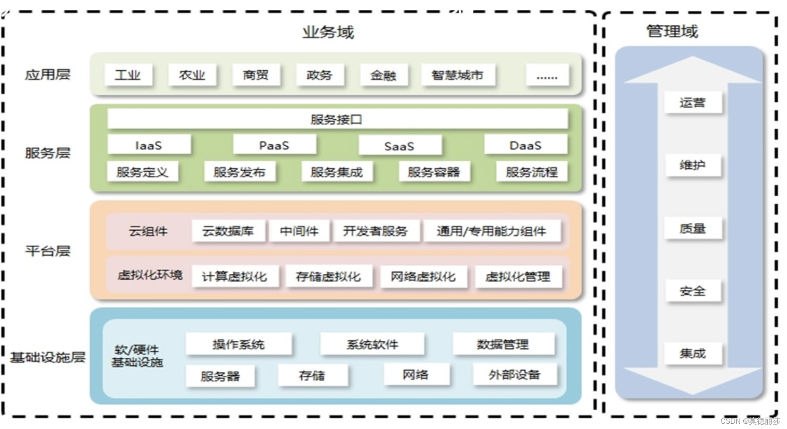

平时40%：考勤 + 上机

课程设计60%：大论文

计算机学报、知乎学报等下载论文作为参考

查重不能超过20%

字数3000字以上，按照论文的要求来，需要有文献引用

`开发一个系统一定要考虑灾备`

云计算导论（第二版），李伯虎主编

敏捷迭代

SLA：服务等级协议，用于评判云服务优质

CICD

提示工程

SOA架构

`教育邮箱`

《计算理论导引》

DDD：面向领域开发

中国互联网络发展状况统计报告

# 绪论

## 身边的云计算

比如搜索引擎、滴滴出行、共享单车

麦特卡夫定律

贝索斯定律

SOA与微服务的概念类似

SOA架构是面向服务的，只不过是基于面向对象。

# 云计算系统的系统架构

## 概念

### 云计算的定位

各个领域对数据的处理：

- 物联网：收集和传输数据
- 人工智能、大数据：价值发现、呈现和变现
- 云计算：存储、加工与处理
- 移动互联网：生产与消费

### 架构产生背景

IT的内涵包括三个层次：

- 第一层是`硬件`
- 第二层是`通用平台软件`，包括数据库、中间件等
- 第三层是`应用`，既包含企业资源计划（ERP）、客户关系管理（CRM）、供应链管理（SCM）、办公自动化（OA）等商用管理软件，也包括用来加强流程管理的工作流管理软件、辅助分析的数据仓库和数据挖掘软件等

云计算的核心思想：

- IT平台化：资源池模式，弹性自动管理
- IT简单化：实现业务自动化等
- IT服务化

云计算，让用户像用水用电一样便捷低使用计算资源

- 网络访问服务
- 按需自助服务
- 灵活的可计量服务
- 快速灵活
- 资源共享

### 云计算的架构特征

- 应用与平台解耦
- 虚拟化提供的自服务
- 资源的可扩展性
- 服务的云化
- 高效运营简便运维
- 灵活的计量计费

### 参考模型

业界对云计算的实践经验总结出一套“四层两域”云计算架构

## 参考模型

`OpenStack`是`IaaS`的参考实现

`K8S`是`PaaS`的顶级开源产品

## 业务模型

## 部署模型

## 开源与标准

# 云计算系统使能技术

# 云计算系统的管理与服务

## 云服务质量与评价

### 云服务SLA

服务水平协议，是服务商与用户间定义的一种约定，用以保障服务的性能和可靠性。

关键内容为：SLA的核心保障内容、第三方监测（因为由服务提供方或服务使用方来监测都不太公正）和条款的书写方式

云用户接口API，接口的评价标准：功能、性能、安全性、易用性和可靠性

售后服务体系

## 云计算系统的运维

### 云产品运维准入标准

数据中心，要考虑`绿色节能`、`灾备`和`自动运维`

产品设计运维准入：`安全防攻击`、热升级、模块服务冗余、数据容灾（数据备份）和过载保护

异地多活：每一个数据中心都随时可用，数据都是最新的

过载保护：请求过多，需要进行限流熔断。当CPU和内存都达到阈值，就需要进行过载保护了

数据容灾分为冷备（恢复时间长、且不可预知）、暖备（恢复时间较短，人工，实现简单）、热备（恢复时间较短，自动）和多活（恢复时间较短，自动）

### 数据中心自动化运维

主动故障预防：减少人工操作引入故障

及时故障发现：构建全链路、主动、智能的全方位、多手段和多指标监控体系。

智能故障定位：利用业务流跟踪系统快速故障定位

自动故障修复

# 云计算安全

# 

