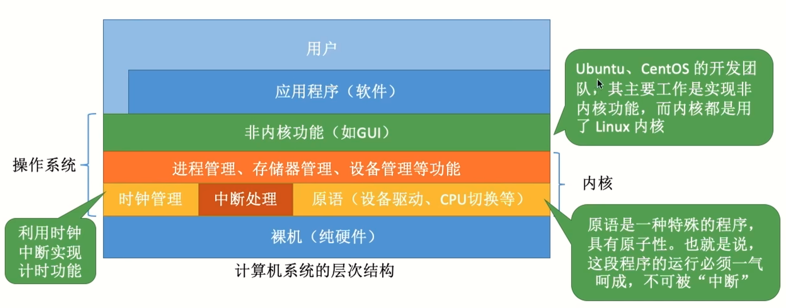

# 操作系统概述

## 操作系统的定义

1. 是系统的资源的管理者
2. 向上层提供方便易用的服务
3. 是最接近硬件的一层`软件`

### 系统资源的管理者

提供的功能:

- 处理机管理（step3）
- 存储器管理（step2）
- 文件管理（step1）
- 设备管理（step4）

以QQ聊天为例:

补充: 执行一个程序前，`需要将该程序放到内存中`，才能被CPU处理。

### 向上层提供方便易用的服务

`封装`思想: 操作系统把一些丑陋的硬件功能封装成简单易用的服务，使用户能更方便地使用计算机，用户无需关心底层硬件的原理，只需要对操作系统发出命令即可

- GUI
- 交互式命令接口（联机命令接口）(cmd)
- 批处理命令接口（脱机命令接口）(.bat)
- 程序接口: 可以在程序中进行`系统调用`来使用程序接口（程序员经常用，比如使用print函数，`系统调用类似于函数调用`，是应用程序请求操作系统服务的唯一方式）

> 系统调用也可以说是`广义指令`

### 作为最接近硬件的层次

`操作系统`需要实现`对硬件机器的拓展`

类比汽车: 发动机只会转，轮胎只会滚。在原始的硬件机器上覆盖一层传动系统——让发动机带着轮子转——使原始的硬件机器得到拓展

操作系统对硬件机器的拓展: 将CPU、内存、磁盘、显示器、键盘等硬件合理地组织起来，`让各种硬件能够相互协调配合，实现更多更复杂的功能`

> 没有任何软件支持的计算机称为`裸机`

## 操作系统的特征

操作系统有`四个特征`: 并发、共享、虚拟和异步。其中`并发`和`共享`是两个最基本的特征，二者互为存在条件。

### 并发

`并发`: 指两个或多个事件在`同一时间间隔`内发生。这些事件`宏观上是同时`发生的，但`微观上是交替`发生的。

> 并行：指两个或多个事件在`同一时刻`内`同时`发生。

举例: 

`操作系统的并发性`: 指计算机系统中"同时"运行着多个程序，这些程序宏观上看是同时运行着的，而微观上看是交替运行的。

操作系统就是伴随着"多道程序技术"而出现的。因此，`操作系统和程序并发是一起诞生的`。

注意:

- `单核CPU`同一时刻只能执行一个程序，各个程序`只能并发`地执行
- `多核CPU`同一时刻可以同时执行多个程序，多个程序`可以并行`地执行

### 共享

`共享`: 即资源共享，是指系统中的资源可供内存中多个并发执行的进程共同使用。

有两种资源共享方式:

- `互斥共享`: 系统中的某些资源，虽然可以提供给多个进程使用，但`一个时间段内只允许一个进程`访问该资源
- `同时共享`: 系统中的某些资源，允许`一个时间段内由多个进程`“同时（宏观上）”对它们进行访问

举例:

`互斥共享`方式：使用QQ和微信视频。同一时间段内`摄像头`只能分配给其中一个进程。

`同时共享`方式：使用QQ发送文件A，同时使用微信发送文件B。宏观上看，两边都在同时读取并发送文件，说明两个进程都在访问硬盘资源，从中`读取数据`。微观上看，两个进程是交替着访问硬盘的。

### 并发和共享的关系

场景: 使用QQ发送文件A，同时使用微信发送文件B。

- 两个进程正在并发执行 (并发性)
- 需要共享地访问硬盘资源 (共享性)

如果失去并发性，则系统中只有一个程序正在运行，则共享性失去存在的意义.

如果失去共享性，则QQ和微信不能同时访问硬盘资源，就无法实现同时发送文件，也就无法并发.

即: `并发和共享互为存在条件`

### 虚拟

`虚拟`: 指把一个物理上的实体变为若干个逻辑上的对应物。物理实体（前者）是实际存在的，而逻辑上对应物（后者）是用户感受到的。

比如: GTA5需要4GB的运行内存，QQ需要256MB的内存，迅雷需要256MB的内存，网易云音乐需要256MB的内存，而我的电脑`只有4GB内存`，这些程序同时运行`需要的内存远大于4GB`，那么为什么它们还可以在我的电脑上同时运行呢？`这是虚拟存储器技术`中的`空分复用技术`。实际只有4GB的内存，在用户看来似乎远远大于4GB。

又比如一个`单核CPU`的计算机中，可以`同时打开多个软件`。既然一个程序需要被分配CPU才能正常执行，那么为什么单核CPU的电脑中能同时运行这么多个程序呢？这是虚拟处理器技术中的`时分复用技术`（微观上处理机在各个微小的时间段内交替着为各个进程服务）。实际上只有一个单核CPU，在用户看来似乎有6个CPU在同时为自己服务

显然，如果失去了并发性，则一个时间段内系统中只需运行一道程序，那么就失去了实现虚拟性的意义了。因此，`没有并发性，就谈不上虚拟性`

### 异步

`异步`: 在多道程序环境下，允许多个程序并发执行，但由于资源有限，进程的执行不是一贯到底的，而是走走停停，以不可预知的速度向前推进，这就是进程的异步性。

如果失去了并发性，即系统只能串行地运行各个程序，那么每个程序的执行会一贯到底。只有系统拥有并发性，才有可能导致异步性。

## 操作系统的发展和分类

### 手工操作阶段

操作流程: 

用户手动将程序写在纸带上，然后将纸带放在纸带机中。计算机经过计算之后，用户再手动从纸带机上获取到计算机的输出数据

`时间-作业`: 

`主要缺点`: 用户`独占全机`、人机速度矛盾导致`资源利用率极低`。从图中也可以看到，计算机在这个过程中`有很长时间是处于空闲状态`的。

### 单道批处理系统

引入了`脱机输入/输出技术`（用外围机和磁带完成），并由`监督程序（操作系统的雏形）`负责控制作业的输入、输出。

将数据写入磁带: 

准备好数据后，交给计算机进行计算:

时间-作业:

主要优点: 缓解了一定程度的人机速度矛盾，资源利用率有所提升。

主要缺点：`内存中仅能有一道程序运行`，只有该程序运行结束之后才能调入下一道程序。`CPU有大量的时间是在空闲等待I/O完成`。资源利用率依然很低

### 多道批处理系统

每次往内存中读入多道程序。`操作系统正式诞生，用于支持多道程序并发运行`。

`时间-作业`:

主要优点: 多道程序`并发`执行，`共享`计算机资源。`资源利用率大幅提升`，CPU和其他资源更能保持“忙碌”状态，系统吞吐量增大。

主要缺点: 用户响应时间长，`没有人机交互功能`（用户提交自已的作业之后就只能等待计算机处理完成，中间不能控制自己的作业执行。eg：无法调试程序/无法在程序运行过程中输入一些参数)

### 分时操作系统

`分时操作系统`: 计算机以`时间片`为单位`轮流为各个用户/作业服务`，各个用户可通过终端与计算机进行交互。

主要优点: 用户请求可以被即时响应，`解决了人机交互问题`。允许多个用户同时使用一台计算机，并且用户对计算机的操作相互独立，感受不到别人的存在。

主要缺点: `不能优先处理一些紧急任务`。操作系统对各个用户/作业都是`完全公平`的，循环地为每个用户/作业服务一个时间片，不区分任务的紧急性。

### 实时操作系统

主要优点: 能够优先响应一些紧急任务，某些紧急任务不需时间片排队。

在实时操作系统的控制下，计算机系统接收到外部信号后及时进行处理，并且`要在严格的时限内处理完事件`。实时操作系统的主要特点是`及时性`和`可靠性`

实时操作系统分为两种:

- `硬实时系统`: 必须在绝对严格的规定时间内完成处理，比如`导弹控制系统`、`自动驾驶系统`
- `软实时系统`: 能接受偶尔违反时间规定，比如`12306`火车订票系统

### 其他操作系统

网络操作系统

分布式操作系统

个人计算机操作系统

## 操作系统的运行机制

### 内核程序和应用程序

程序员写的就是应用程序

微软、苹果有一帮人负责实现操作系统，他们写的是`内核程序`。由很多内核程序组成了`操作系统内核`，或简称`内核（Kernel)`。内核时操作系统最重要最核心的部分，也是`最接近硬件的部分`。甚至可以说，一个操作系统只需要一个内核就够了，比如说`docker`中的容器。

### 特权指令和非特权指令

应用程序只能使用`非特权指令`，比如加法指令、减法指令。

操作系统内核作为管理者，有时会让CPU执行一些`特权指令`，比如`内存清零`指令。这些指令影响重大，`只允许`操作系统内核使用。

`CPU在设计和生产的时候就划分了特权指令和非特权指令`，因此CPU执行一条指令前就能判断出其类型。

### 内核态和用户态

CPU有两种状态: `内核态`和`用户态`

处于`内核态`时，说明此时正在`运行的是内核程序`，`可以执行特权指令`

处于用户态时，说明此时正在运行的是应用程序，此时只能执行非特权指令。

> CPU中有一个寄存器叫做`程序状态字寄存器（PSW）`，其中有个二进制位，1表示内核态，0表示用户态

### 内核态和用户态的切换

- 刚开机时，CPU为`内核态`，操作系统内核程序先上CPU运行
- 开机完成后，用户可以启动某个应用程序
- 操作系统内核程序在合适的时候主动让出CPU，让该应用程序上CPU运行（操作系统内核在让出CPU之前，会`用一条特权指令把PSW的标志位设置为用户态`）
- 应用程序运行在`用户态`
- 此时，一位黑客在应用程序中植入了一条特权指令，企图破坏系统
- CPU发现接下来要执行的这条指令是`特权指令`，但是自己又处于`用户态`
- 这个非法事件会引发一个`中断信号`（CPU检测到中断信号后，会立即`变为核心态`，并停止运行当前的应用程序，转而运行`处理中断信号的内核程序`）
- 中断”使操作系统再次夺回CPU的控制权
- 操作系统会对引发中断的事件进行处理，处理完了再把CPU使用权交给别的应用程序

综上:

- `内核态` -> `用户态`: 执行一条特权指令--`修改PSW`的标志位为“用户态”，这个动作意味着操作系统将主动让出CPU使用权
- `用户态` -> `内核态`: 由`中断`引发，`硬件`自动完成变态过程，触发中断信号意味着操作系统将强行夺回CPU的使用权

> 除了非法使用特权指令之外，还有很多事件会触发中断信号，一个共性是: `但凡需要操作系统介入的地方，都会触发中断信号`。

## 中断和异常

### 中断的作用

`中断`是让操作系统内核`夺回CPU`使用权的`唯一途径`。

`中断`会使CPU由用户态`变为内核态`，使操作系统`重新夺回对CPU`的控制权。

>如果没有`中断`机制，那么一旦应用程序上CPU运行，CPU就会一直运行这个应用程序，一个应用程序独占CPU，也就没有并发了。

### 中断的类型

- `内中断`: 与当前执行的指令`有关`，中断信号来`源于CPU内部`
- `外中断`: 与当前执行的指令`无关`，中断信号来`源于CPU外部`

`内中断`举例:

- 试图在用户态下执行特权指令
- 执行除法指令时发现除数为0
- 有时候应用程序想请求操作系统内核的服务，此时会执行一条特殊的指令——`陷入指令`，该指令会引发一个内部中断信号

> 执行`陷入指令`，意味着应用程序主动地将CPU控制权还给操作系统内核。`系统调用`就是通过陷入指令完成的。但是陷入指令`不是特权指令`，因为它可以在用户态执行。

`外中断`举例:

- 时钟中断——由时钟部件发来的中断信号
- I/O中断——由输入/输出设备发来的中断信号

> 时钟部件每隔一个时间片（如50ms）会给CPU发送一个时钟中断信号，CPU收到中断信号后就会终止当前的应用程序，转向处理中断信号的内核程序。处理完成之后，操作系统可能会把CPU的使用权交给另外一个应用程序，直到下一个时间片。（所以时钟中断可以实现并发）

### 中断机制的基本原理

`不同的中断信号`，`需要用不同的中断处理程序来处理`。当CPU检测到中断信号后，会根据中断信号的类型去查询`中断向量表`，以此来找到`相应的中断处理程序`在内存中的存放位置。

显然，中断处理程序一定是内核程序，需要运行在`内核态`

## 系统调用

`系统调用`是操作系统提供给应用程序（程序员/编程人员）使用的接口，可以理解为一种可供应用程序调用的特殊函数，应用程序可以通过系统调用来请求`获得操作系统内核的服务`

### 系统调用与库函数的区别

- 普通应用程序: 可直接进行系统调用，也可以使用库函数。有的库函数涉及系统调用，有的不涉及
- 编程语言: 向上提供库函数。有时会将系统调用封装成库函数，以隐藏系统调用的一些细节，使程序员编程更加方便。
- 操作系统: 向上提供系统调用，使得上层程序能请求内核的服务

### 为什么说系统调用是必须的

比如在一台电脑上，一个人用word打印论文、另外一个人用wps打印论文。如果这两个进程可以随意、并发地共享打印机资源的话，那么打印机就会交替收到wps和word两个进程发来的打印请求，结果就会导致两篇论文的内容混杂在一起了。

解决办法: 由操作系统内核对共享资源进行统一的管理，并向上提供`系统调用`，用户进程想要使用打印机这种共享资源，只能通过系统调用向操作系统内核发出请求。内核会对各个请求进行`协调处理`。

### 系统调用的分类

应用程序通过系统调用请求操作系统的服务。而系统中的各种共享资源都由操作系统内核统一掌管，因此`凡是与共享资源有关的操作`（如存储分配、I/O操作、文件管理等），都`必须通过系统调用`的方式向操作系统内核提出服务请求，由操作系统内核代为完成。这样`可以保证系统的稳定性和安全性`，防止用户进行非法操作。

### 系统调用的过程

传递系统调用参数 -> 执行陷入指令（`用户态`） -> 执行相应的内请求核程序处理系统调用（`核心态`） -> 返回应用程序

> 注意: 
>
> - `陷入指令`是在`用户态`执行的，执行陷入指令之后立即引发一个`内中断`，使CPU`进入核心态`
> - `发出系统调用请求`是在`用户态`，而`对系统调用的相应处理`在`核心态`下进行

另外，`陷入指令 == trap指令 == 访管指令`

## 计算机系统的层次结构

### 操作系统的内核

其中内核分为`大内核`和`微内核`两种:

对于`大内核`而言，进程管理、时钟管理这些在`内核态`才能执行处理。而对于`微内核`，时钟管理、中断处理、原语属于`内核态`服务，而进程管理、存储管理和设备管理属于`用户态`服务

如果某个应用程序想要请求操作系统的服务，这个服务的处理同时设计到进程管理、存储管理和设备管理，那么对于`大内核`而言，只需要经过`两次状态转换`；而对于`微内核`，则需要经过`六次状态转换`。

> 状态转换过程是有成本的，要消耗不少时间，`频繁地状态转换会降低系统性能。`

Linux、UNIX是大内核

Windows NT是微内核

### 分层结构

最底层是硬件，最高层是用户接口，`每层可调用更低的一层`。

优点:

- 便于调试和验证，只需要自底向上逐层调试验证
- 易扩充和易维护，各层之间调用接口清晰固定

缺点:

- 仅可调用相邻低层，难以合理定义各层的边界
- 效率低，不可跨层调用，系统调用执行时间长

### 模块化

模块化是将操作系统`按功能划分为`若干个具有一定独立性的模块。每个模块具有某方面的管理功能，并规定好各模块间的接口，使各模块之间能`通过接口进行通信`。还可以进一步将各模块细分为若干个具有一定功能的`子模块`，同样也规定好各子模块之间的接口。把这种设计方法称为`模块-接口法`

将内核划分为多个模块，各模块之间相互协作

`内核 = 主模块 + 可加载内核模块`

主模块: 只负责核心功能，如进程调度、内存管理

可加载内核模块: 可以动态加载新模块到内核，而无需重新编译整个内核。

优点:

- 模块间逻辑清晰`易于维护`，确定模块间接口后即可多模块同时开发
- 支持动态加载新的内核模块（如：安装设备驱动程序、安装新的文件系统模块到内核），增强OS适应性
- 任何模块都可以`直接调用其他模块`，无需采用消息传递进行通信，`效率高`

缺点:

- 模块间的接口定义未必合理、实用
- 模块间相互依赖，更难调试和验证

### 宏内核

所有的系统功能都放在内核里（大内核结构的OS通常也采用了`模块化`的设计思想）

优点: 性能高，内核内部各种功能可以直接相互调用

缺点:

- 内核庞大功能复杂，难以维护
- 大内核中某个功能模块出错，就可能导致整个系统崩溃

### 微内核

只把中断、原语、进程通信等最核心的功能放入内核。进程管理、文件管理、设备管理等功能以用户进程的形式运行在用户态

优点:

- 内核小功能少、易于维护，内核可靠性高
- 内核外的某个功能模块出错不会导致整个系统崩溃

缺点:

- 性能低，需要频繁的切换用户态/核心态。用户态下的各功能模块不可以直接相互调用，只能通过内核的"消息传递"来间接通信
- 用户态下的各功能模块不可以直接相互调用只能通过内核的"消息传递"来间接通信

### 外核

内核负责进程调度进程通信等功能，`外核`负责为用户进程分配未经抽象的硬件资源，且由外核负责保证资源使用安全

优点:

- 外核可直接给用户进程分配"不虚拟、不抽象"的硬件资源，使用户进程可以更灵活的使用硬件资源
- 减少了虚拟硬件资源的"映射层"，提升效率

缺点:

- 降低了系统的一致性
- 使系统变得更复杂

## 操作系统引导

开机的时候，如何让操作系统运行起来？

对于刚买来的新磁盘，里面是什么都没有的，空空如也:

安装完操作系统之后，里面才会`磁盘分区`、`引导程序`等:

`操作系统一般就安装在C盘`，此时的C盘称为磁盘的`活动分区`。除了这些磁盘分区之后，磁盘还会留一部分空间用于存储`主引导记录`，包含了:`磁盘引导程序`和`分区表`。其中分区表就是一个数据结构，用于记录每一个磁盘分区在磁盘中的位置、大小等信息。

再对C盘进行细分的话，会分为`引导记录PBR`、根目录和其他:

下面是电脑的`开机过程`:

主存包含了`RAM`和`ROM（包含ROM引导程序，即自举程序）`，RAM断电之后数据就会丢失，而ROM中的数据是永久存储的。电脑开机之后，就会去ROM中找到`自举程序`，它会指导CPU去磁盘中找到`主引导记录`，将它读入内存中，接着CPU就可以去执行`磁盘引导程序`，而磁盘引导程序会根据`分区表`来找到`C盘`所处的位置，接着就可以读取C盘的`引导记录（PBR）`，负责找到启动管理器，而启动管理器一般在C盘的根目录下面，然后CPU就执行根目录下面的启动管理程序，就会完成操作系统初始化的一系列工作。

所以大致可以分为如下步骤:

1. CPU从一个特定主存地址开始，取指令，执行ROM中的引导程序（先进行硬件自检，再开机)
2. 将磁盘的第一块——主引导记录读入内存，执行磁盘引导程序，扫描分区表
3. 从活动分区（又称主分区，即安装了操作系统的分区）读入分区引导记录，执行其中的程序
4. 从根目录下找到完整的操作系统初始化程序（即启动管理器）并执行，完成“开机”的一系列动作

## 虚拟机

