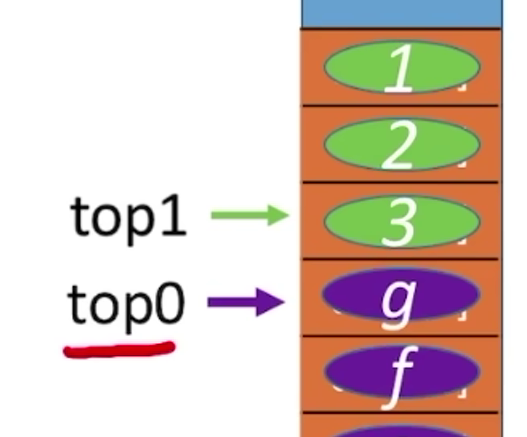

# 导论

## 数据结构的基本概念

==数据元素==：数据的基本单位（类的一个实例）

==数据项==：一个数据元素可由若干个数据项组成（类的属性），数据项是构成数据元素的不可分割的最小单位

==数据对象==：数据对象是具有==相同性质==的数据元素的集合（实体类），是==数据==的一个子集

==数据结构==：数据结构是相互之间存在一种或多种==特定关系==的数据元素的集合。


同一个数据对象里的数据元素，可以组成不同的数据结构。比如现在有几个人的信息，我们可以使用`线性结构`来做成财富榜，也可以使用`网状结构`来做成朋友圈。

> 数据结构这门课着重关注数据元素之间的关系，和对这些数据元素的操作，而不关心具体的数据项内容。


## 数据结构的三要素

逻辑结构、数据的运算和存储结构

### 逻辑结构

- 线性结构

  - 数据元素之间是一对一的关系
  - 除了第一个元素，所有元素都有唯一前驱
  - 除了最后一个元素，所有元素都有唯一后继

- 树形结构
  - 元素之间一对多的关系

- 图结构
  - 元素之间是多对多的关系


### 数据的运算

针对某种逻辑结构，结合实际需求，定义基本运算。

比如线性结构，会有：

1. 查找第$i$个元素
2. 在第$i$个位置插入新的元素
3. 删除第$i$个位置的元素
4. ...


### 物理结构

逻辑结构和数据的运算都属于==定义一种数据结构==，物理结构则是如何==实现==这种数据结构，即如何用计算机表示数据元素的逻辑关系。

数据的存储结构（物理结构）分为：

- 顺序存储：把**逻辑上相邻的元素存储在物理位置上也相邻的存储单元中**，元素之间的关系由存储单元的邻接关系体现。
- 链式存储：**逻辑上相邻的元素在物理位置上可以不相邻**，借助指示元素存储地址的指针来表示元素之间的逻辑关系。
- 索引存储：在存储元素信息的同时，还建立附加的索引表。索引表中的每项称为索引项，索引项的一般形式是`(关键字, 地址)`
- 散列存储：根据元素的关键字直接计算出该元素的存储地址，又称`哈希存储`

> 链式存储、索引存储和散列存储统称为`非顺序存储`或者`离散存储`


数据的存储结构会影响存储空间分配的方便程序和对数据的运算速度。

- ==运算的定义==是==针对逻辑结构==的，指出运算的功能
- ==运算的实现==是==针对存储结构==的，指出运算的具体操作步骤


## 数据类型

数据类型是一个值的集合和定义在此集合上的一组操作的总称。

- 原子类型。其值不可以再分的数据类型，比如`int`，它可以进行的操作是加、减、乘、除、取模等
- 结构类型。其值可以再分解为若干成分的数据类型。比如`类`，它可以含有许多属性，并且可以在结构体中定义一些操作（函数、方法）


`抽象数据类型`，即`ADT`，是抽象数据组织及与之相关的操作。

- 定义一个`ADT`，就是在定义一种数据结构（使用者关注定义）
- 确定了`ADT`的存储结构，才能实现这种数据结构（实现者关注实现）


## 算法的概念

> 程序 = 数据结构 + 算法


算法是**对特定问题求解步骤的一种描述**，它是指令的有限序列，其中每条指令表示一个或多个操作。


 

算法的特性：

- **有穷性**。一个算法必须总在执行有穷步之后结束，且每一步都可以在有穷时间内完成。
- **确定性**。算法中每条指令必须有确切的含义，对于**相同的输入**只能得出**相同的输出**。
- **可行性**。算法中描述的操作都可以通过已经实现的**基本运算执行有限次**来实现。
- **输入**。一个算法有**零个或者多个输入**，这些输入取自于某个特定对象的集合。
- **输出**。一个算法有**一个或多个输出**，这些输出是与输入有着某种特定关系的量。


“好”算法的特质：正确性（算法可以解决问题）、可读性（写代码带注释）、健壮性（非法输入时能适当进行处理）、**高效率和低存储需求**（时间复杂度和空间复杂度）


## 复杂度

无法使用事后统计法判断算法的时间开销：

- 运行时间和机器的性能有关
- 运行时间和编程语言有关
- 运行时间和编译程序产生的机器指令质量有关
- 有些算法是不能事后再统计的（比如导弹控制算法）

  

时间复杂度：
$$
1 < log_2n < n < nlog_2n < n^2 < n^3 < 2^n < n! < n^n
$$


空间复杂度（Space）：

- 当算法运行所需的内存空间是常量，那么算法的空间复杂度$S(n) = O(1)$，也叫做**原地工作**


# 线性表

## 定义

线性表是具有**相同数据类型**的 n 个数据元素的**有限序列**，其中 n 为**表长**，当 n=0 时线性表是一个**空表**。

- $a_i$是线性表中的“第$i$个”元素线性表中的**位序**
- $a_1$是**表头元素**；$a_n$是**表尾元素**
- 除第一个元素外，每个元素有且仅有一个**直接前驱**；除最后一个元素外，每个元素有且仅有一个**直接后继**


## 基本操作

```c
// 初始化表
initList(&L);

// 销毁线性表
destoryList(&L);

// 增删查
insertList(&L, i, e);
deleteList(&L, i, &e);
getElem(L, i);
```


什么时候要传入引用`&` —— 对参数的修改结果需要**带回来**

```cpp
// 使用 & 前
#include<stdio.h>

void test(int x) {
    x = 1024;
    printf("test函数内部 x=%d\n", x);
}

int main() {
    int x = 1;
    printf("调用test前 x=%d\n", x);
    // 实际传入test()函数中的x只是一个复制品，并没有修改main函数中x的值
    test(x);
    printf("调用test后 x=%d\n", x);
}

/*
调用test前 x=1
test函数内部 x=1024
调用test后 x=1
*/


// 使用 & 后
#include<stdio.h>

void test(int & x) {
	x = 1024;
	printf("test函数内部 x=%d\n", x);
}

int main() {
	int x = 1;
	printf("调用test前 x=%d\n", x);
    // 使用引用类型，这里x就会带入test()中，并将x带回来
	test(x);
	printf("调用test后 x=%d\n", x);
}
```


> C语言不支持`&`，而C++支持。


## 顺序表

### 定义

顺序表——用**顺序存储**的方式实现线性表。

> C语言中，有`sizeof(elemType)`来计算一个数据元素的大小，比如`sizeof(int)=4B`


### 实现方式

静态分配：

```cpp
#define MaxSize 10				   // 定义最大长度
typedef struct {
    ElemType data[MaxSize];		 // 用静态的数组存放数据元素
    int length;						// 顺序表的当前长度
}SqList;							 // 顺序表的类型定义（静态分配方式）
// Sq: sequence，顺序、序列

// 静态方式: 一旦数组大小确定之后，就不能改变。

// 需要给该线性表的存储空间为:
MaxSize * sizeof(ElemType)
```


  

### 插入

```cpp
/**
L: 操作的顺序表
i: 插入的位置
e: 插入的元素
*/
bool ListInsert(SqList &L, int i, int e) {
    if(i < 1 || i > L.length + 1)			// 判断i的范围是否有效
        return false;
    if(L.length >= MaxSize)					// 存储空间已满，不能插入
        return false;
    for(int j = L.length;j >= i;j--){		// 将第i个元素及之后的元素后移
        L.data[j] = L.data[j-1];
    }
    L.data[i-1] = e;						// 将元素e插入到第i个位置
    L.length++;								// 线性表长度+1
    return true;
}
```

时间复杂度计算：

- 最好情况：新元素插入到表尾，不需要移动元素。$i = n + 1$，循环$0$次，时间复杂度为：$O(1)$
- 最坏情况：新元素插入到表头，需要将原有的$n$个元素全都向后移动。$i = 1$，循环$n$次，时间复杂度为：$O(n)$
- 平均情况：假设新元素插入到任何一个位置的概率相同，即：$i = 1,2,3,...,length+1$ 的概率都是 $p = \frac {1} {n+1}$，平均的循环次数为：$1p + 2p + ... + (n-1)p + np = \frac n 2 \Rightarrow O(n) $


### 删除

删除表 $L$ 中第 $i$ 个位置的元素，并用 $e$ 返回删除元素的值：

```cpp
bool ListDelete(SqList &L, int i, int &e) {
    if(i < 1 || i > L.length)				// 判断 i 的范围是否有效
        return false;
    e = L.data[i - 1];						// 将被删除的元素赋值给 e
    for(int j = i; j < L.length; j++){		// 将第 i 个位置后的元素前移
        L.data[j - 1] = L.data[j];
    }
    L.length--;								// 线性表长度减 1
    return true;
}
```


时间复杂度计算：

- 最好情况：新元素插入到表尾，不需要移动元素。$i = n$，循环 $0$ 次，时间复杂度为：$O(1)$
- 最坏情况：新元素插入到表头，需要将原有的 $n$ 个元素全都向后移动。$i = 1$，循环 $n - 1$ 次，时间复杂度为：$O(n)$
- 平均情况：假设新元素插入到任何一个位置的概率相同，即：$i = 1,2,3,...,length$ 的概率都是 $p = \frac {1} {n}$，平均的循环次数为：$1p + 2p + ... + (n-1)p = \frac {n - 1} 2 \Rightarrow O(n) $


### 按位查找

获取表 $L$ 中第 $i$ 个位置的元素的值：

```cpp
ElemType getElem(SqList L, int i) {
    return L.data[i - 1];
}
```

时间复杂度为：$O(1)$


### 按值查找

在表 $L$ 中查找具有给定关键字值的元素，并返回索引下标：

```cpp
int locateElem(SqList L, ElemType e) {
    for(int i = 0; i < L.length; i++)
        if(L.data[i] == e) 
            return i + 1;			// 找到元素
    return 0;						// 没找到元素
}
```

> 对于基本数据类型，可以使用`==`来进行判断是否相等；对于结构体而言，只能自己写一个方法逐一判断结构体的属性是否相同。


## 单链表

单链表不要求大片连续空间，改变容量方便；缺点是**不可随机存取**，要耗费一定空间存放指针。

### 定义单链表

```cpp
typedef struct LNode {		// 定义单链表结点类型
    ElemType data;			// 每个节点存放一个数据元素
    struct LNode *next;		// 指针指向下一个节点
}LNode, *LinkList;

// 上下等价

struct LNode {		
    ElemType data;			
    struct LNode *next;		
};
typedef struct LNode LNode;
typedef struct LNode *LinkList;
```


如果要表示一个单链表时，只需要声明一个**头指针** $L$，指向单链表的第一个结点：

```cpp
LNode * L;	// 强调这是一个结点
// 或
LinkList L;  // 强调这是一个单链表，代码可读性更强
```

### 初始化链表

#### 不带头结点

```cpp
bool initList(LinkList &L) {
    L = null;		// 空表，暂时还没有节点，该步的目的是防止脏数据
    return true;
}

bool isEmpty(LinkList L) {		// 判断链表是否为空
    if(L == null)
        return true;
    else
        return false;
}

void test() {
    LinkList L;			// 声明一个指向单链表的指针，此时在内存中会为该变量分配空间
    initList(L);		// 初始化空链表
}
```


#### 带头结点

```cpp
bool initList(LinkList &L) {
    L = (LNode *) malloc (sizeof(LNode));		// 分配一个头结点
    if (L == null)								// 内存不足，分配失败
        return false;
    L->next = null;								// 头结点之后暂时还没有结点
    return true;
}
```

> 头结点一般不存储数据。


带头结点的空链表会更常用一点，使用起来比不带头结点的更方便。


### 按位插入

```cpp
bool insertList(LinkList &L, int i, ElemType e) {
    if (i < 1) {			// 新结点只能在非头结点的位置插入
        return false;
    }
    LNode * p;				// 指针p指向当前扫描到的结点
    int j = 0;				// 当前p指向的是第几个结点
    p = L;					// L指向头结点，头结点是第 0 个结点（不存数据）
    while (p != null && j < i - 1) {
        p = p->next;
        j++;
    }
    if (p == null) {		// i 不合法（如链表只有4个结点，它想在第10个位置插入）
        return false;
    }
    LNode * s = (LNode *) malloc(sizeof(LNode));
    s->data = e;
    
    // 下面两个顺序不能颠倒
    s->next = p->next;
    p->next = s;			// 将新结点s连到p之后
    return true;
}
```


### 指定结点后插

在结点 $p$ 的后面插入元素 $e$：

```cpp
bool insertNextNode (LNode * p, ElemType e) {
    if (p == null)
        return false;
    LNode * s = (LNode *) malloc(sizeof(LNode));
    if (s == null) {			// 内存分配失败
        return false;
    }
    s->data = e;				// 用结点 s 保存数据元素 e
    s->next = p->next;
    p->next = s;				// 将结点 s 连到 p 之后
    return true;
}
```

有了后插之后，前面的按位插入的代码就可以简化一下：

```cpp
bool insertList(LinkList &L, int i, ElemType e) {
    if (i < 1) {			// 新结点只能在非头结点的位置插入
        return false;
    }
    LNode * p;				// 指针p指向当前扫描到的结点
    int j = 0;				// 当前p指向的是第几个结点
    p = L;					// L指向头结点，头结点是第 0 个结点（不存数据）
    while (p != null && j < i - 1) {
        p = p->next;
        j++;
    }
    return insertNextNode(p, e);
}
```


### 指定结点前插

在结点 $p$ 的前面插入元素 $e$：

```cpp
bool insertPriorNode (LNode * p, ElemType e) {
    if(p == null) 
        return false;
    LNode * s = (LNode *)malloc(sizeof(LNode));
    if (s == null)				// 内存分配失败
        return false;
    
    // 下面做法是：将 s 作为 p 的一个后插结点，然后将 s 和 p 的值互换，实现了一个前插效果
    s->next = p->next;
    p->next = s;				// 新结点 s 连到 p 之后
    s->data = p->data;			// 将 p 中元素复制到 s 中
    p->data = e;				// p 中元素覆盖为 e
    return true;
}
```


### 按位删除

删除表 L 中第 i 个位置的元素，并用 e 返回删除元素的值：

```cpp
bool deletList(LinkList &L, int i, ElemType &e) {
    if(i < 1) {
        return false;
    }
    LNode * p;
    int j = 0;
    while(p != null && j < i - 1) {
        p = p->next;
        j++;
    }
    if(p == null)
        return false;
    if(p->next == null)		// 第 i-1 个结点之后已无其他结点
        return false;
    LNode *q = p->next;		// q 指向被删除结点
    e = q->data;			// 用 e 返回元素的值
    p->next = q->next;		// 将 q 结点从链中断开
    free(q);				// 释放结点的内存空间
    return true;
}
```


### 删除指定结点

```cpp
bool deleteNode(LNode * p) {
    if(p == null)
        return false;
    LNode * q = p->next;			// q 指向 p 的后继节点
    p->data = p->next->data;		// 把 p 的后继节点的数据元素复制给 p
    p->next = q->next;				// 将 p 的后继节点指向 p 的后继节点的下一结点
    free(q);
    return true;
}
```


<center>
    <b>将p的后继节点数据复制一份给p，然后把p原来的后继节点给删掉</b>
</center>


### 按位查找

返回链表 L 中的第 i 个结点：

```cpp
LNode * GetElem(LinkList L, int i) {
    if(i < 0)
        return null;
    LNode * p;
    int j = 0;
    p = L;
    while(p != null && j < i) {
        p = p->next;
        j++;
    }
    return p;
}
```


### 按值查找

在链表 L 中找到数据域为 e 的结点：

```cpp
LNode * LocateElem(LinkList L, ElemType e) {
    LNode * p = L->next;
    while(p != null && p->data != e)
        p = p->next;
    return p;
}
```


### 链表长度

```cpp
int getLength(LinkList L) {
    LNode * p = L->next;
    int length = 0;
    while(p != null) {
        p = p->next;
        length++;
    }
    return length;
}
```


### 尾插法建表

```cpp
LinkList tail(LinkList &L) {
    int x;									// 设ElemType为整型
    L = (LinkList)malloc(sizeof(LNode));	// 头结点
    LNode *s,*r = L;						// r 为表尾指针
    scanf("%d", &x);
    while(x != 9999) {
        s = (LNode *)malloc(sizeof(LNode));
        s->data = x;
        r->next = s;
        r = s;								// r 重新指向新的表尾结点
        scanf("%d", &x);
    }
    r->next = null;							// 尾结点指针置空
    return L;
}
```


<center>
    <b>尾插法建表</b>
</center>


### 头插法建表

每一次添加的新结点，都作为头结点的后继结点：

```cpp
LinkList tail(LinkList &L) {
    int x;									// 设ElemType为整型
    L = (LinkList)malloc(sizeof(LNode));	// 头结点
    L->next = null;							// 初始为空链表
    LNode *s = L;						
    scanf("%d", &x);
    while(x != 9999) {
        s = (LNode *)malloc(sizeof(LNode));
        s->data = x;
        s->next = L->next;
        L->next = s;						// 新结点作为链表的后继结点
        scanf("%d", &x);
    }
    return L;
}
```


<center>
    <b>头插法建表</b>
</center>


## 其他链表

双链表：在单链表的基础上增加了一个**指向前结点的指针**

循环链表：在双链表的基础上，使**尾结点的后继结点始终为头结点**

静态链表：定义一个结点数组


```cpp
// 3. 静态链表的结构定义
#define MaxSize 10		// 静态链表的最大长度
typedef struct {
    ElemType data;		// 数据元素
    int next;			// 下一个元素的数组下标
}SLinkList[MaxSize];
void test() {
    SLinkList a;		// 等价于 SlinkList[MaxSize] a;
}
  
```


# 栈

栈（Stack）是**只允许在一端进行插入或删除操作**的线性表

## 概念

空栈、栈顶、栈底、LIFO


## 基本操作

```cpp
initStack(&S); // 初始化栈。构造一个空栈 S，分配内存空间
destroyStack(&L); // 销毁栈。销毁并释放栈 S 所占用的内存空间
push(&S, x); // 进栈，若栈 S 未满，则将 x 加入使之成为新栈顶
pop(&S, &x); // 出栈，若栈 S 非空，则弹出栈顶元素，并用 x 返回
getTop(S, &x); // 读栈顶元素。若栈 S 非空，则用 x 返回栈顶元素
```

> 栈的使用场景中大多只访问栈顶元素


## 顺序存储

### 定义

```cpp
#define MaxSize 10
typedef struct {
    ElemType data[MaxSize];	// 静态数组存放栈中元素
    int top;				// 栈顶指针
} SqStack;
```


### 初始化和判断栈空

```cpp
// 初始化
void initStack(SqStack &S) {
    S.top = -1;		// 初始化栈顶指针
}

// 判断栈空
bool stackEmpty(SqStack S) {
    if(S.top == -1)
        return true;
    return false;
}
```


### 进出栈

```cpp
// 进栈
bool push(SqStack &S, ElemType x) {
    if(S.top == MaxSize - 1)	// 栈满报错
        return false;
    S.top = S.top + 1;			// 栈顶指针加一
    S.data[S.top] = x;			// 新元素入栈
    return true;
}

// 出栈
bool pop(SqStack &S, ElemType &x) {
    if(S.top == -1)			// 栈空，报错
        return false;
    x = S.data[S.top];		// 栈顶元素先出栈
    S.top = S.top - 1;		// 指针再减一
    return true;
}
```


### 读栈顶元素

```cpp
bool getTop(SqStack S, ElemType &x) {
    if(S.top == -1)			// 栈空，报错
        return false;
    x = S.data[S.top];		// x 记录栈顶元素
    return true;
}
```


## 共享栈

一般的栈只有一个进/出栈口，就像盒子一样；而**共享栈是有两个进/出栈口**，就跟吸管一样。



<center>
    <b>共享栈</b>
</center>


定义如下：

```cpp
#define MaxSize 10
typedef struct {
    ElemType data[MaxSize];
    int top0;
    int top1;
} ShStack;

// 初始化栈
void initStack(ShStack &S) {
    S.top0 = -1;
    S.top1 = MaxSize;
}

// 栈满
void full(ShStack S) {
    return S.top0 + 1 == S.top1;
}
```


# 队列

队列（Quene）是**只允许在一端进行插入，在另一端删除**的线性表


## 概念

队头、队尾、FIFO


## 基本操作

```cpp
initQuene(&Q); // 初始化队列，构造一个空队列 Q
destoryQuene(&Q); // 销毁队列。销毁并释放队列 Q 所占用的内存空间
enQuene(&Q, x); // 入队，若队列 Q 未满，将 x 加入，使之成为新的队尾
deQuene(&Q, &x); // 出队，若队列 Q 非空，删除队头元素，并用 x 返回
getHead(Q, &x); // 读队头元素，若队列 Q 非空，则将队头元素赋值给 x
```


## 顺序存储

### 结构定义

```cpp
#define MaxSize 10
typedef struct {
    ElemType data[MaxSize];		// 用静态数组存放队列元素
    int front, rear;			// 队头指针和队尾指针
} SqQuene;
```


### 初始化和队空

```cpp
// 初始化
void initQuene(SqQuene &Q) {
    Q.rear = Q.front;	// 初始时，队头、队尾指针指向 0
}

// 判断队空
bool queneEmpty(SqQuene Q) {
    if(Q.rear == Q.front)
        return true;
    return false;
}
```


### 入出队

```cpp
// 入队
bool enQuene(SqQuene &Q, ElemType x) {
    if((Q.rear + 1) % MaxSize == Q.front)	// 判断队满
        return false;
    Q.data[Q.rear] = x;						// 新元素插入队尾
    Q.rear = Q.rear + 1 % MaxSize;			// 队尾指针加1取模，逻辑上为环状
    return true;
}

// 出队
bool deQuene(SqQuene &Q, ElemType &x) {
    if(Q.rear == Q.front)
        return false;
    x = Q.data[Q.front];
    Q.front = (Q.front + 1) % MaxSize;
    return true;
}
```


> 需要牺牲一个元素的存储空间来判断队满


### 获取队头元素

```cpp
bool getHead(SqQuene Q, ElemType &x) {
    if(Q.rear == Q.front)
        return false;		// 队空
    x = Q.data[Q.front];
    return true;
}
```

### 判断队列元素个数

```cpp
int queneLength(SqQuene Q) {
    return (Q.rear + MaxSize - Q.front) % MaxSize;
}
```


### 其他判断队空队满的方法

为了不浪费那个元素的存储空间，可以采用下面的几种方法：

```cpp
// 1. 在队列结构中增加一个 size 属性，用于记录当前的元素个数
bool empty1(SqQuene Q) {
    if(size == MaxSize)		// 队满
        return false;
    return true;
}

// 2. 在队列结构中增加一个 tag 属性，如果是入队操作，则tag赋值为1，否则为0
bool empty2(SqQuene Q) {
    if(Q.rear == Q.front && tag == 1){		// 队满
        return false;
    }
    return true;
}
```


## 双端队列

就是队首跟队尾都可以进行插入和删除的队列


# 串

## 概念


## 存储结构


## 朴素匹配算法

就是暴力匹配。

在一个字符串中，判断子串是否存在，可以按照模式串的长度来依次遍历主串


## KMP算法

KMP算法的关键在于构建`next数组`

```py
def build_next(patt):
    next = [0]
    prefix_len = 0
    i = 1
    while i < len(patt):
        if patt[prefix_len] == patt[i]:
            prefix_len += 1
            next.append(prefix_len)
            i += 1
        else:
            if prefix_len == 0:
                next.append(0)
                i += 1
            else:
                prefix_len = next[prefix_len - 1]
    return next


def kmp_search(string, patt):
    next = build_next(patt)			# next 数组
    
    i = 0							# 主串中的指针
    j = 0							# 子串中的指针
    while i < len(string):
        if string[i] == patt[j]:	# 字符匹配，指针后移
            i += 1
            j += 1
        elif j > 0:					# 字符失配，根据 next 跳过子串前面的一些字符
            j = next[j - 1]
        else:						# 子串第一个字符就失配
            i += 1
        if j == len(patt):			# 匹配成功
            return i - j
```


# 树

## 基本概念

- 根结点：有子无父的结点
- 分支结点：有子有父的结点
- 边：结点与结点之间的线段
- 叶子结点：有父无子的结点
- 空树：结点数为 0 的树
- 非空树：有且仅有一个根结点
- 两个结点之间的路径：从上往下
- 路径长度：经过了几条边
- 结点的层次（深度）：从上往下数
- 结点的高度：从下往上数
- 树的高度（深度）：总共多少层
- **结点的度**：该结点有几个孩子（分支）
- **树的度**：各结点中度的**最大值**
- 有序树：逻辑上看，树中结点的各子树从左至右是**有次序**的，不能互换。比如族谱
- 无序树：逻辑上看，树中结点的各子树从左至右是**无次序**的，可以互换。比如国家省份分区图
- 森林：由多个互不相交的树组成（就是一个树去掉根结点）

> 除了根结点之外，所有结点都有且仅有一个前驱结点


## 常见性质

- 结点数 = 总度数 + 1
- 度为 m 的树和 m 叉树的区别：

| 度为 m 的树                           | m 叉树                                |
| ------------------------------------- | ------------------------------------- |
| 任意结点的度 $\le$ m（最多 m 个孩子） | 任意结点的度 $\le$ m（最多 m 个孩子） |
| 至少有一个结点的度 = m（有 m 个孩子） | 允许所有结点的度都 $\lt$ m            |
| 一定是非空树，至少有 m + 1 个结点     | 可以是空树                            |


<center>
    <b>度为3的树和3叉树</b>
</center>


- 度为 m 的树第 i 层至多有 $m^{i-1}$ 个结点（$i \ge 1$）
- m 叉树第 i 层至多有 $m^{i-1}$ 个结点（$i \ge 1$）
- 高度为 h 的 m 叉树至多有 $\frac {m^h-1} {m-1}$ 个结点
- 高度为 h 的 m 叉树至少有 h 个结点
- 高度为 h 、度为 m 的树至少有 $h+m-1$ 个结点
- 具有 n 个结点的 m 叉树的最小高度为 $\left\lceil \log_m(n(m-1)+1) \right\rceil$（向上取整）


## 二叉树

### 基本概念


# 应用

## 栈

### 括号匹配

```c
(((())))
// 最后出现的左括号会最先被匹配（LIFO），可以用栈实现该特性
```

算法实现：

```cpp
bool bracketCheck(char str[], int length) {
    SqStack S;
    initStack(S);
    for (int i = 0; i < length; i++) {
        if(str[i] == '(' || str[i] == '[' || str[i] == '{'){
            push(S, str[i])
        }else{
            if(stackEmpty(S))	// 扫描到右括号，且当前栈空，则匹配失败
                return false;
            char topElem;
            pop(S, topElem);	// 栈顶元素出栈
            if(str[i] == ')' && topElem != '(')
                return false;
             if(str[i] == ']' && topElem != '[')
                return false;
             if(str[i] == '}' && topElem != '{')
                return false;
        }
    }
    return stackEmpty(S); // 检索完括号后，判断栈空，栈空则匹配成功
}
```


# 拓展

## 数学

### 卡特兰数

卡特兰数可以用来判断进出栈合法序列的个数：
$$
\frac {1}{n + 1} {C^n_{2n}}
$$
比如有 1，2，3，4四种序列，那么可以得出的合法序列的个数为：
$$
\frac {1}{4 + 1} C^4_8 = 14
$$


