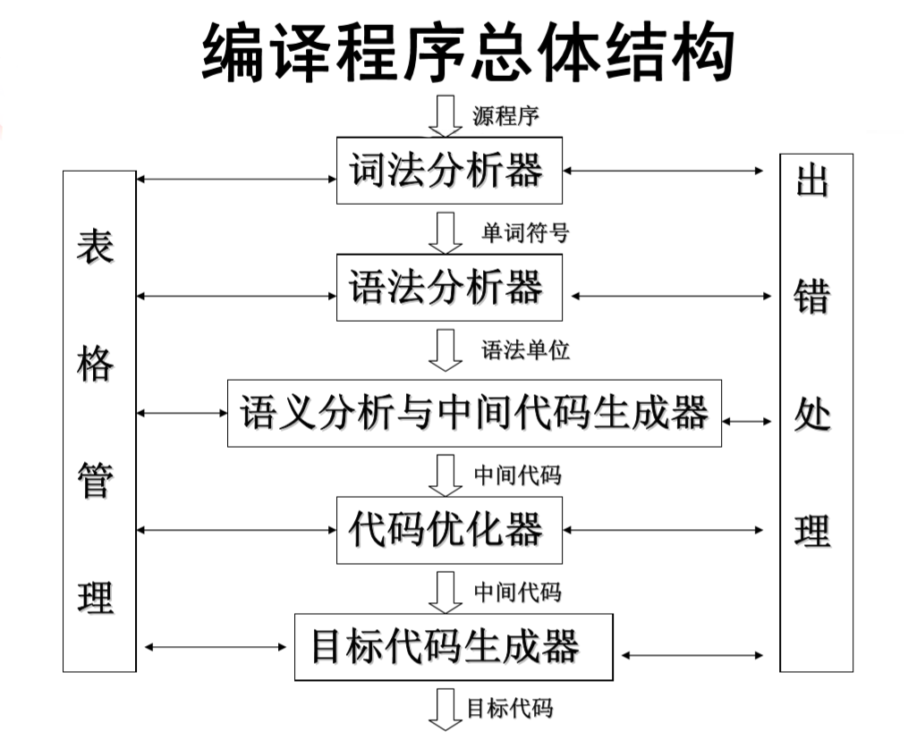
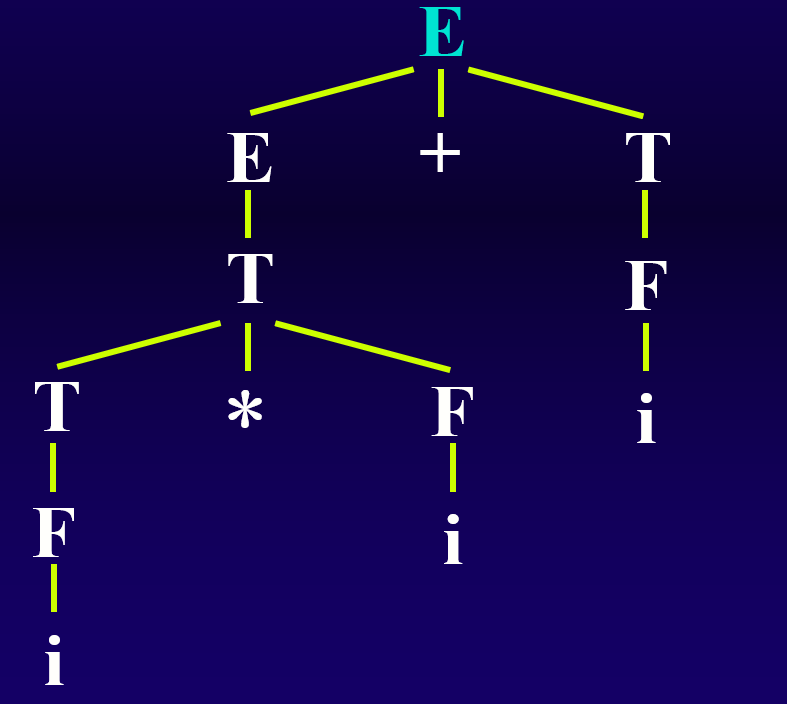
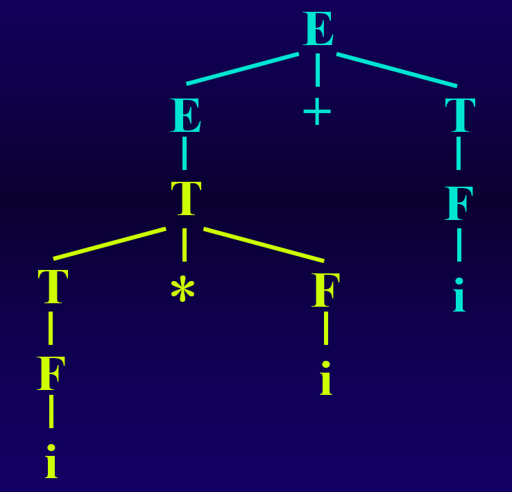
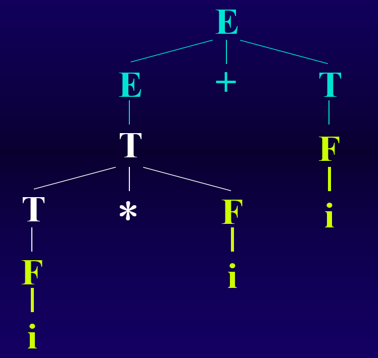
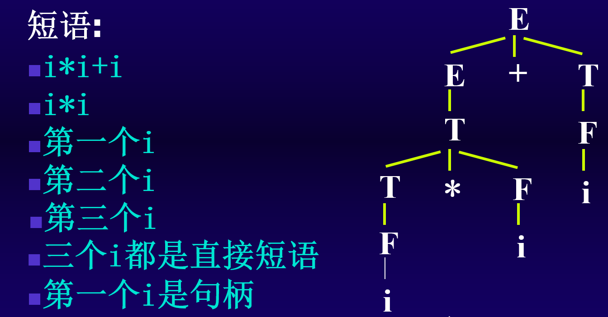
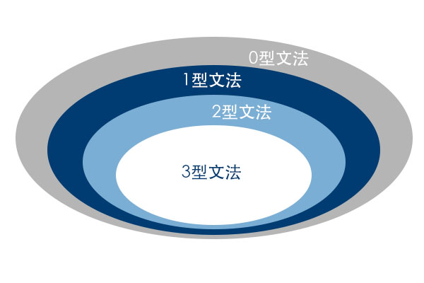
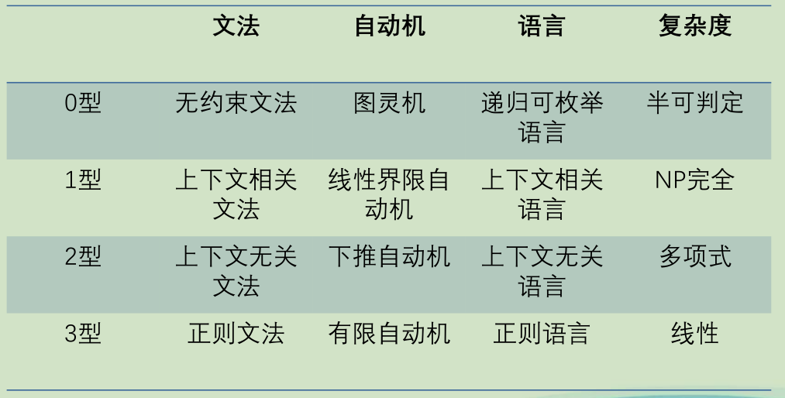

# 重点

语法树、NFA


# 编译原理概述


翻译程序是指一个把一种语言(称作源语言)所写的程序(源程序)翻译成`等价`的另一种语言(称作目标语言)的程序(目标程序)。 

编译程序是一种翻译程序，它将`高级语言`所写的源程序翻译成等价的`机器语言`或`汇编语言`的目标程序。 

在编译程序的各个阶段中，都要涉及`表格管理`(登记源程序中所提供的或在编译过程中所产生的一些信息)和`错误处理`(程序查错能力，并能准确地报告错误的种类及出错位置，以便用户查找和纠正)。

分为四步或者五步，其中五步比四步会多一个`代码优化程序`

`默认认为编译程序的五个组成部分缺一不可`


> S.P -> 词法分析程序 -> 语法分析程序 -> 语义分析生成中间代码 -> 代码优化程序 -> 目标代码生成程序 -> O.P





翻译程序可以分为`解释程序`和`编译程序`。其中编译程序是本课程的重点。


编译程序类似于外文翻译。

- 识别单词 -> 词法分析
- 分析句子 -> 语法分析
- 初步翻译 -> 生成中间代码
- 修饰加工 -> 代码优化
- 写出译文 -> 目标代码生成


编译程序和解释程序的根本区别在于: `是否生成中间代码`


含有优化部分的编译程序的执行效率未必高，含有优化功能的编译程序，其优化是指`对生成的目标代码进行优化`，而`不是编译程序本身得到优化`，它提高目标代码的效率，而不是编译程序的效率。


编译程序与具体的机器有关

C语言的编译程序可以用C语言编写

现代的编译程序基本都用的高级语言

# 文法和语言的基本知识


- 语义: 研究语法的含义
  - 静态语义: 用于确定程序是否合乎语法
  - 动态语义: 执行语义，表示程序要做什么


## 符号和符号串

### 概念

$字母表\Sigma$: 元素的非空有穷集合

符号: 字母表中的元素

符号串: $字母表\Sigma$中的符号组成的`任意有穷序列`。其中空符号串记为$\varepsilon$。

> 例如: $\Sigma = \{a, b\}$，则$\varepsilon$、a、ab、aab、aabb等都是符号串


### 符号串的运算

符号串的长度: 符号串中符号的个数，记为$\left|\  s \ \right|$，其中只有符号串$\varepsilon$的长度为0

符号串的连结: 设`x`和`y`是符号串，则串`xy`称为它们的`连结`。

集合的乘积: 设A和B是符号串的集合，则A和B的乘积定义为: $AB=\{xy\ | \ x\in A,y \in B \}$

> 例如: $A=\{a, b\},\ B=\{c, d\},\ 则AB=\{ac, ad, bc, bd\}$

符号串的幂运算: 设x是符号串，则x的幂运算定义为: $x^0=\varepsilon, x^1=x, x^2=xx, ...$

集合的幂运算: 设A是符号串的集合，则集合A的幂运算定义为: $\begin {cases} A^0 = \{\varepsilon\} \\ A^1 = A \\ A^2 = AA \\ ... \end {cases}$

闭包: 设A是符号串的集合，则A的正闭包和闭包的定义为:

- 正闭包: $A^+=A^1\cup A^2 \cup ... \cup A^n ...$
- 闭包: $A^* = A^0 \cup A^1\cup A^2 \cup ... \cup A^n ... = \{\varepsilon\} \cup A^+$


> 例如: 设$\Sigma ^ *$ = $\{0, 1\}$，则闭包为: $\{\varepsilon ,0, 1, 00, 01, 11, 000 ...\}$


## 形式语言

序列的集合称为形式语言。形式语言不考虑`语义`，比如`英语学习我`，这是符合主谓宾的，但不符合语义，这就是一种形式语言


如果语言是有穷的，可以将句子逐一列出:

> 例如，有字母表$A=\{a,b,c\}$，则$\begin{cases} L_1=\{a,b,c\} \\ L_2=\{a,aa,ab,ac\} \\ L_3=\{c,cc\} \end{cases}$都是字母表A的一个形式语言

如果语言是无穷的，找出语言的有穷表示，有两个途径:

- 生成方式: 利用`文法的规则和推导`手段，将语言中的每个句子用严格定义的规则来构造。
- 识别方式: 即`使用自动机的行为描述语言`，它的行为相当于一个过程：输入一个符号串判断是否属于某语言，如果是，则该过程经过有限次的计算然后停止回答"是"；如果不属于，则该过程要么停止回答"不是"，要么该过程永远的运行下去。


一种语言的描述如下:

```
<句子> ::= <主语><谓语>
<主语> ::= <代词>|<名词>
<代词> ::= 你|我|他
<名词> ::= 王民|大学生|工人|英语
<谓语> ::= <动词><直接宾语>
<动词> ::= 是|学习
<直接宾语> ::= <代词>|<名词>

推导分析:
<句子> =><主语><谓语>
	  =><代词><谓语>
      =>我<谓语>
	  =>我<动词><直接宾语>
	  =>我是<直接宾语>
	  =>我是大学生
```


## 文法的形式定义

### 规则

规则(也称产生式): 是一个符号与一个符号串的有序对($A,\beta$) ，通常写作: $A \rightarrow \beta $ 或者 $A::=\beta$

> 规则的作用是告诉我们如何用规则中的符号串生成语言中的序列。
>
> 比如下面这个例子: $\begin{cases} \ A \rightarrow 0 \\ \ A \rightarrow 1 \\ \ A \rightarrow A0 \\ \ A \rightarrow A1   \end{cases}$ ，这个描述的语言序列只可能是由0和1组成的符号串


规则中的符号分为两类: 

- `终结符号`: 是组成语言的基本符号，不可再拆分。比如上面的0和1
- `非终结符号`: 出现在规则左部，是可以派生出符号的，比如上面的A

### 文法

文法的定义: 文法G定义为四元组($V_N, V_T, P, S$)

- $V_N$: 规则中的非终结符号集
- $V_T$: 规则中的终结符号集
- $P$: 文法规则的集合
- $S$: 文法的开始符号或者识别符号，属于非终结符号。`它至少要在一条规则中作为左部出现`，由它开始，识别出我们所定义的语言

> 为了书写方便，对于若干个`左部相同`的规则，可以进行一个缩写，如:
>
>  $\begin{cases} \ A \rightarrow \alpha_1 \\ \ A \rightarrow \alpha_2 \\ \ ... \\ \ A \rightarrow \alpha_n \end{cases}$ $\Rightarrow \ A\rightarrow \alpha_1 \ |\ \alpha_2 \ | \ ... \ | \ \alpha_n$
>
> 其中每个$\alpha_i$有时候称为A的一个`候选式`


约定:

- 第一条规则的左部是`识别符号`
- 对文法G不用四元式显式表示，`只需要将规则写出`
- $V_N \cap V_T = \phi$
- $V_N,V_T$为非空有穷集合

> 其中，非终结符和终结符可以不用写出来，因为都可以从规则中看出来。大写字母就是非终结符，小写字母或数字就是终结符


对于[规则](###规则)中的例子，其文法描述如下:
$$
G = (V_N, V_T, P, S) \\
\begin{cases}
\ V_N = \{A\} \\
\ V_T = \{0, 1\} \\
\ P: A \rightarrow 0 \ | \ 1 \ | \ A0 \ | \ A1 \\
\ S = A
\end{cases}
$$


若`G`和`G'`是两个不同的文法，如果它们描述的语言相同，那么称G和G'为`等价文法`。

如果`G''`所产生的符号串多于语言L所能表示符号串数量，则称`设计的文法超出了所定义语言的范围`


## 语言的形式定义

### 直接推导

直接推导: $xAy \Rightarrow x \alpha y$，其中`仅使用了文法的一次规则`

> 例如，设有文法$G[S]$，P为: $S \rightarrow 01 \ | \ 0S1$
>
> 有如下的直接推导:
>
> $S \Rightarrow 01$	使用规则$S \rightarrow 01$，此时$\begin{cases} \ x = \varepsilon  \\ \ y = \varepsilon\end{cases}$
>
> $0S1 \Rightarrow 0011$	使用规则$S \rightarrow 01$，此时$\begin{cases} \ x = 0  \\ \ y = 1 \end{cases}$
>
> $000S111 \Rightarrow 00001111$	使用规则$S \rightarrow 01$，此时$\begin{cases} \ x=000 \\ \ y=111 \end{cases}$


需要注意`推导`和`规则`的区别:

- 形式上的区别: 推导使用$\Rightarrow$，规则使用$\rightarrow$
- 对文法G中任何规则$A \rightarrow \alpha$，我们有$A \Rightarrow \alpha$，即`推导的依据是规则`


### 推导

如果存在一个直接推导序列:
$$
a_0 \Rightarrow a_1 \Rightarrow a_2 \Rightarrow ... \Rightarrow a_n
$$
则称这个序列是一个从$a_0$到$a_n$的长度为n的推导，记为: 
$$
a_0 \stackrel {+} {\Rightarrow} a_n
$$
==表示从$a_0$出发，使用若干次可推导出$a_n$==


> 例如，设有文法$G[E]=(\{E,T,F\},\{i,+,*,(,)\},P,E)$，其中P为: $\begin{cases} \ E\rightarrow E+T \ | \ T  \\ \ T \rightarrow T*F \ | \ F \\ \ F \rightarrow (E) \ | \ i\end{cases}$
>
> 则对于$i+i*i$有如下直接推导序列:
>
> $E\Rightarrow E+T \Rightarrow T+T \Rightarrow F+T \Rightarrow i+T \Rightarrow i+T*F \Rightarrow i+F*F \Rightarrow i+i*F \Rightarrow i+i*i$
>
> 可以记为==$E \stackrel {+} {\Rightarrow} i+i*i$==


> 推导方法: 从一个要识别的符号开始推导，即用相应规则的`右部来代替规则的左部`，每次仅用一条规则去进行推导


### 广义推导

$a_0 \stackrel {*} \Rightarrow a_n$表示从$a_0$出发，经`0`步或`若干`步，可推导出$a_n$

==即$a_0 \stackrel {*} \Rightarrow a_n$ 包含了 $a_0 \stackrel {+} \Rightarrow a_n$ 和 $a_0 = a_n$==


三个推导的区别:

- 直接推导长度为1
- 推导长度大于等于1
- 广义推导长度大于等于0


==最左推导(最右推导)==: 每次都替换最左边(最右)，则是最左(最右)推导。其中`最右推导`为`规范推导`，由规范推导得出的句型称为`规范句型`


```java
// 最右推导

S => (T) => (T, S) => (T, (T)) => (T, (T, S)) => (T, (T, a)) => (T, (S, a)) => (T, (a, a)) => (S, (a, a)) => (a, (a, a))
```


### 归约

归约是跟推导相对的概念。如果推导是$A \Rightarrow B$，则归约是$B \Rightarrow A$。

若用$\stackrel · \Rightarrow $表示归约，设$A \rightarrow \alpha$是文法G中的一个规则，则有:
$$
xAy \Rightarrow x \alpha y \\
x \alpha y \stackrel · \Rightarrow xAy
$$
规范推导的逆过程，称为`最左归约`，也称为`规范约束`

## 句型和句子

设有文法$G[S]$:

- 如果$S \stackrel * \Rightarrow x , \ x \in (V_N \cup V_T)^*$，则称符号串$x$为文法$G[S]$的`句型`
- 如果$S \stackrel * \Rightarrow x, \ x \in {V_T}^*$，则称符号串$x$为文法$G[S]$的`句子`

简单来说，==句子里面只有终结符号，而句型中非终结符和终结符都有==

> 例如: 设有文法$G[S]$: $S \rightarrow 01 \ | \ 0S1$，则我们有:
> $$
> S \stackrel * \Rightarrow 01 \\
> S \stackrel * \Rightarrow 0S1 \\
> S \stackrel * \Rightarrow 00S11 \\
> S \stackrel * \Rightarrow 000111 \\
> $$
> 显然，符号串01、0S1、00S11和000111都是文法$G[S]$的`句型`
>
> 而01和000111又是文法$G[S]$的`句子`


==句子一定是句型，句型不一定是句子==


`语言`: 文法$G[S]$产生的所有句子的集合称为文法G所定义的语言，记为$L(G[S])$:
$$
L(G[S]) = \{x \ | \ S \stackrel * \Rightarrow x \ 且 \ x \in {V_T} ^*\}
$$

- 文法确定时，语言也就确定了
- $L(G)$是${V_T}^*$的子集


根据文法可以推出语言，根据语言可以构造文法:
$$
G \rightarrow L(G) \\
L(G) \rightarrow G_1, G_2, ..., G_n
$$
> 例如: $G[S], S ::= aSb \ | \ ab$，其产生的语言为:
> $$
> L(G[S]) = \{a^n b^n, n\ge 1\}
> $$


## 递归文法

递归规则: 规则右部有与左部相同的符号

- 规则左递归: $A \rightarrow A ...$
- 规则右递归: $A \rightarrow ...A$
- 规则递归: $A \rightarrow ...A...$


递归文法

- 文法左递归: $A \stackrel + \Rightarrow A...$
- 文法右递归: $A \stackrel + \Rightarrow ...A$
- 文法递归: $A \stackrel + \Rightarrow ...A...$


递归文法的优点: `可用有穷的规则，定义无穷集合的语言`:

> 例如，文法中有如下规则:
> $$
> U \rightarrow V_x \\
> V \rightarrow U_z \ | \ z
> $$
> 这三条规则都不是递归规则，但有$U \Rightarrow V_x \Rightarrow U_{yx}$，则该文法是左递归的。

当一个语言是无穷集合时，则定义该语言的文法一定是递归的。


## 语法树

语法树是对句型的`推导过程`给出的一种`图形表示`，也称作推导树


==从语法树中找短语是考点==


> 例如，设有文法$G[E]$:
> $$
> E \rightarrow E + T \ | \ E - T \ | \ T \\
> T \rightarrow T * F \ | \ T / F \ | \ F \\
> F \rightarrow (E) \ | \ i
> $$
> 则句型$i * i + i$的最左推导为:
>
> $E \Rightarrow E + T \\ \Rightarrow T + T \\ \Rightarrow T * F + T \\ \Rightarrow F*F+T \\ \Rightarrow i*F+T \\ \Rightarrow i*i+T \\ \Rightarrow i*i+F \\ \Rightarrow i*i+i$
>
> 语法树如下:
>
> 


由例可知，语法树的构造过程是`从文法的开始符号`出发，构造一个推导的过程。

文法的每个句型都存在一棵对应的语法树。

子树: 语法树的某一结点连同所有分枝组成的部分:



简单子树: 只有单层分支的子树




- 短语: `子树`的`末端结点`形成的符号串是相对于子树根的短语。
- 直接短语: `简单子树`的`末端结点`形成的符号串是相对于简单子树根的直接短语（树高为1的）。
- 句柄: `最左简单子树`的`末端结点`形成的符号串是句柄。

例如:




[短语、直接短语和句柄](https://blog.csdn.net/qq_43543789/article/details/104818368)


如果一个文法存在某个句子`有两个不同的最左（最右）推导`，则说这个文法是`二义性`的


## 文法和语言分类

Chomsky将文法和语言分为四大类: 

- 0型: 短语文法（无限制文法）
- 1型: 上下文有关文法
- 2型: 上下文无关文法
- 3型: 正则文法


0型文法: $P: \alpha \rightarrow \beta$

1型文法: $P: \alpha A \beta \rightarrow \alpha \gamma \beta$，其中$\begin {cases} A \in V_N \\ \alpha, \beta \in V^* \\ \gamma \in V^+ \end {cases}$

> 1型文法中，左边长度一定是小于等于右边长度的

2型文法: $P: A \rightarrow \beta$，其中$\begin {cases} \ A \in V_N \\ \  \beta \in V^* \end {cases}$

> 2型文法中左边只有非终结符，即A、B、C等

3型文法:

- 左线性: $P: A \rightarrow a$或者$A \rightarrow Ba$，其中$\begin {cases} \ A,B \in V_N \\ \ a \in V_T \end {cases}$
- 右线性: $P: A \rightarrow a$或者$A \rightarrow aB$，其中$\begin {cases} \ A,B \in V_N \\ \ a \in V_T \end {cases}$

> 3型文法中，每个产生式右边至少有一个终结符出现，即0、1等




0型 -> 图灵机

1型 -> 线性限界自动机

2型 -> 下推自动机

3型 -> 有限自动机




## 文法的实用限制

文法中不能含有`有害规则`和`多余规则`

比如$U \rightarrow U$就是有害规则，它会引起二义，且无用

多余规则就是:

- `推导的过程中用不上的规则`
- 规则中含有推不出任何终结符的非终结符


# 词法分析

## 词法分析的任务

- 分析和识别单词及属性
- 跳过各种分隔符
- 删除注释
- 词法检查
- 建立符号表


词法分析程序的输出形式: 二元式，比如`(1, if)`


## 单词符号的两种定义方式

设有字母表$\Sigma = \{a_1, a_2, ..., a_n\}$:

- $\phi$是$\Sigma$上的正规式，它所表示的正规集是$\phi$，即空集$\{\}$
- $\varepsilon$是$\Sigma$上的正规式，它所表示的正规集仅含一空符号串，即$\{\varepsilon\}$
- $a_i$是$\Sigma$上的一个正规式，它所表示的正规集是由单个符号$a_i$所组成的，即$\{a_i\}$
- 如果$e_1$和$e_2$是$\Sigma$上的正规式，它们所表示的正规集分别为$L(e_1)$和$L(e_2)$，则:
  - $L(e_1 \ | \ e_2)=L(e_1) \cup L(e_2)$
  - $L(e_1e_2)=L(e_1)L(e_2)$
  - $L((e_1)^*)=(L(e_1))^*$


运算符的优先级: 先闭包(\*)，再(·)，最后(|)

产生式 $\Leftrightarrow$ 正规式:

|       | 文法产生式                          | 正规式          |
| :---: | ----------------------------------- | --------------- |
| 规则1 | $A \rightarrow xB, B \rightarrow y$ | $A = xy$        |
| 规则2 | $A \rightarrow xA \ | \ y$          | $A = x ^* y$    |
| 规则3 | $A \rightarrow x, A \rightarrow y$  | $A = x \ | \ y$ |


## DFA

有穷自动机分为: 确定的有穷自动机(DFA)和不确定的有穷自动机(NFA)

DFA: $M = (\Sigma, Q, f, S, Z)$

- $\Sigma$: 有穷字母表
- $Q$: 有穷集，它的每个元素称为一个状态
- S: $S \in Q$，是唯一的初态
- Z: $Z \subseteq Q$，终态集

所谓的确定的状态机，其确定性表现在状态转移函数是单值函数


$$
文法:  \\
S \rightarrow (L) | aS | a \\
L \rightarrow L ,S |  S
$$
消除左递归：


$$
S \rightarrow aBc \\
S \rightarrow bAB \\
A \rightarrow aAb \\
A \rightarrow b \\
B \rightarrow b \\
B \rightarrow \varepsilon
$$


|      | a                   | b                   | c    | $\varepsilon$               |
| ---- | ------------------- | ------------------- | ---- | --------------------------- |
| S    | $S \rightarrow aBc$ | $S \rightarrow bAB$ |      |                             |
| A    |                     | $A \rightarrow b$   |      |                             |
| B    |                     | $B \rightarrow b$   |      | $B \rightarrow \varepsilon$ |


# 语法分析


## 递归下降分析法

PL/0

必须是`LL(1)`的文法才能用递归下降分析法


