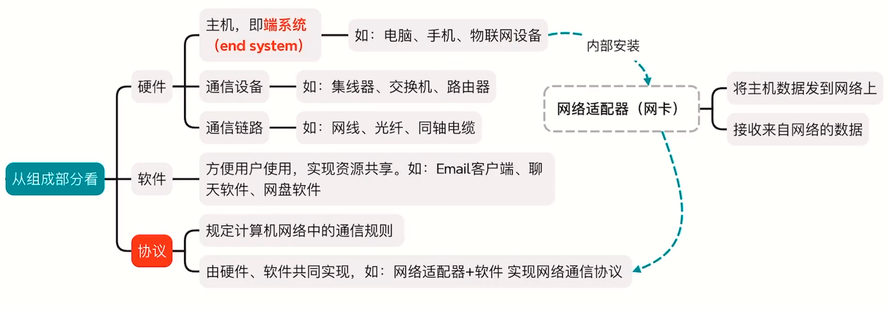
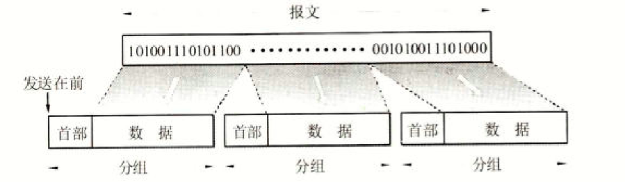

# 概述

互联网之所以能够向用户提供许多服务，就是因为互联网具有两个重要的基本特点:

- 连通性: 互联网上的用户之间不管都远都能便捷、经济地交换各种信息，仿佛这些用户终端都彼此直接连通一般。
- 共享性: 指资源共享。可以是信息、软件、硬件共享。

## 互联网概述

计算机网络，简称网络，由若干`节点`（可以为计算机、集线器、交换机或路由器等）和连接这些节点的`链路`组成，比如下面就是一个网络:

    

    
         
        

            四个节点和三条链路的网络
        

    

多个网络之间通过`路由器`连接起来，形成了覆盖范围更大的计算机网络，称为`互连网`

    

        
         
        
            互连网
        
    

习惯上，与网络直接相连的计算机常称为`主机`:

    

        
         
        
            主机
        
    

根据上面建立了初步的概念:

> 网络把许多计算机连接在一起，而互联网则把许多网络通过一些路由器连接在一起。与网络相连的计算机常称为主机

互联网整体发展分为三个阶段:

- 从单个网络ARPANET向互连网发展
- 建成了三级结构的互联网（主干网、地区网和校园网）
- 形成了全球范围的多层次 ISP 结构的互联网

> 因为TCP/IP是在1983年作为ARPANET的标准协议的，所以人们把1983年作为互联网的诞生时间
>
> ISP译为互联网服务提供商，比如中国电信、中国联通和中国移动

需要注意两个概念`internet`和`Internet`:

- internet: 互连网，是一个`通用名词`，它泛指由多个计算机网络互连而成的计算机网络。通信协议可以不是TCP/IP
- Internet: 互联网，是一个`专用名词`，它指当前全球最大的、开放的、由众多网络相互连接而成的特定互连网，它`采用TCP/IP协议`族作为通信的规则，且其前身是美国的ARPANET。

## 计算机网络的组成和功能

从组成上看，包含了硬件、软件和协议:

从工作方式上看:

边缘部分就是连接在互联网上的所有`主机`，小到网络摄像头、PC机，大到服务器。

常说的"主机A和主机B进行通信"，实际上是指`主机A的某个进程和主机B上的另一个进程进行通信`，简称为`计算机之间的通信`

    

    
         
        互联网的边缘部分与核心部分
    

网络边缘的端系统之间的通信方式通常可划分为两大类:

- 客户-服务器方式（C/S方式）
- 对等方式（P2P方式）

### 核心部分

网络的核心部分是互联网中最复杂的部分，因为网络中的核心部分要向网络边缘部分中的大量主机提供连通性，使边缘部分中的任何一台主机都能够与其他主机通信。

在网络核心部分起特殊作用的是`路由器`，是实现`分组交换`的关键构件，其任务是`转发收到的分组`

### 电路交换

必须经过三个步骤: 

- `建立连接`: 占用通信资源
- `通话`: 一致占用通信资源
- `释放连接`: 归还通信资源

主要的特点是`在通话的全部时间内，通话的两个用户始终占用端到端的通信资源`

    

    
         
        用户始终占用端到端的通信资源
    

当使用电路交换来传送计算机数据时，其`线路的传输效率往往很低`

### 分组交换

分组交换采用`存储转发`技术。

我们把要发送的整块数据称为一个`报文`，发送报文之前，将报文划分为一个个更小的数据段，每个数据段前面加上一些必要的控制信息组成的`首部`，构成了`分组`，也称作`包`

互联网核心部分的`路由器之间`一般都用`高速链路`相连接，而边缘部分的`主机接入到核心部分`则通常以相对`较低速率的链路`相连接

路由器收到一个分组，先暂时存储一下，检查其首部，查找转发表，按照首部中的目的地址，找到合适的接口转发出去，把分组交给下一个路由器。这样一步步地以存储转发的形式，把分组交付最终的目的主机。各路由器之间必须经常交换彼此掌握的路由信息，以便`创建和动态维护`路由器中的`转发表`，使得转发表能够在整个网络拓扑发生变化时`及时更新`。

单个网络可简化为`链路`，路由器则为核心部分的`节点`

> 注意: 路由器暂时存储的是一个个`分组`，而不是报文。短分组是暂存在路由器的存储器中，而不是存储在磁盘中。

### 总结

三种交换方式在数据传送阶段的主要特点:

- 电路交换: 整个报文的比特流连续地从源点直达终点，好像在一个管道中传送
- 报文交换: 整个报文先传送到相邻节点，`全部存储`下来后查找转发表，转发到下一个节点。
- 分组交换: 单个分组（这只是整个报文的一部分）传送到相邻节点，存储下来后查找转发表，转发到下一个节点

    

    
         
        三种交换方式比较
    

## 计算机网络的类别

按照网络的作用范围进行分类:

- 广域网（WAN）: 作用范围是`几十到几千公里`
- 城域网（MAN）: 作用范围是一个城市，作用范围是`5~50km`
- 局域网（LAN）: 校园网、企业网。作用范围是`1km`左右
- 个人局域网（PAN）: 个人热点。作用范围是`10m`左右

按照网络的使用者进行分类:

- 公用网: 指电信公司出资建造的大型网络，用户交钱就能用的网
- 专用网: 这种网络不向本单位以外的人提供服务，比如军队、铁路、银行等系统均有本系统的专用网

## 计算机网络性能

- 速率: 比特率，单位有`bit/s`、`Mbit/s`、`Gbit/s`等
- 带宽: 最高传输率
- 吞吐量: 单位时间内通过某个网络的实际数据量
- 时延(延迟、迟延): 数据从一端发送到另一端的时间:
  - 发送时延: 主机或者路由器发送数据帧所需要的时间。也叫做传输时延，计算公式为:
  
  $$
  发送时延 = \frac {数据帧长度(bit)} {发送速率()} 
  $$
  
  
  
  - 传播时延: 电磁波在信道中传播一定的距离需要花费的时间，计算公式为:
  
  $$
  传播时延 = \frac {信道长度(m)} {电磁波在信道上的传播速率(m/s)}
  $$
  
  
  
  - 处理时延: 主机或者路由器处理分组的时间
  - 排队时延: 分组在路由器中等待处理和等待转发的时间
  - 总时延:
  
  $$
  总时延 = 发送时延 + 传播时延 + 处理时延 + 排队时延
  $$
  
- 时延带宽积: $时延带宽积 = 传播时延 \  \times \ 带宽$
- 往返时间RRT
- 利用率:
  - 信道利用率: 某信道有百分之几的时间是被利用的（即有数据通过）。完全空闲的信道的利用率是零
  - 网络利用率: 全网络的信道利用率的加权平均值
  - 网络利用率太高的话，意味着传输的东西越多，时延便越高。

## 计算机网络体系结构

`网络的体系结构`是计算机网络的各层及其协议的`集合`，就是这个计算机网络及其构件所应完成的`功能的精确定义`（不涉及实现）

> 体系结构是抽象的，而实现则是具体的，是真正在运行的计算机硬件和软件。

### 计算机网络体系结构的形成

两台计算机要互相传送文件需要解决很多问题:

- 两台计算机之间必须有一条传送数据的通路
- 发起方必须将数据通信的`通路激活`
- 告诉网络如何识别接收数据的计算机
- 发起通信的计算机必须查明对方计算机是否已开机，并且与网络连接正常
- 发起通信的计算机中的应用程序必须弄清楚，在对方计算机中的文件管理程序是否已做好接收文件和存储文件的准备工作
- 若计算机的文件格式不兼容，要完成格式转换
- 对出现的各种差错和意外事故，如数据传送错误、重复或丢失，网络中某个节点交换机出现故障等，应当有可靠的措施保证对方计算机最终能够收到正确的文件。

ARPANET设计时提出了`分层`的设计方法，将庞大而复杂的问题转化为若干较小的局部问题

1974年，IBM按照分层的方法指定并提出了SNA(系统网络体系结构)

> 但由于网络体系结构的不同，不同公司的设备很难相互连通。
>
> 之前中国几家的银行卡也是不能相互流通的，后来制定了`银联卡`，将银行卡都统一了系统

ISO提出了`OSI/RM`是使各种计算机在世界范围内互连成网的`标准框架`，但是失败了。

法律上是ISO，实际上却是`TCP/IP`

> 五层协议只是`谢希仁`老师方便讲课的时候设立的，但是`实际上并没有这个协议`。

各层完成的主要功能:

- 差错控制: 确保数据传输不能出错，出错要用对应的处理
- 流量控制: 短时间内的请求不能超过接收方可以处理的数量
- 分段和重装: 将数据切割成小块传输，接收时重新组装成完成的数据
- 复用和分用: 发送端几个高层会话复用一条低层的连接，在接收端再进行分用
- 连接建立和释放: 交换数据前要先建立一条逻辑连接，数据传送结束后释放连接

数据在OSI层的传输过程:

> 体系结构是抽象的，而实现则是具体的，是真正在运行的计算机硬件和软件

### 网络协议

网络协议，简称协议，是为进行网络中的数据交换而建立的规则、标准或约定

网络协议有三个组成要素:

- `语法`: 数据与控制信息的结构或格式
- `语义`: 需要发出何种控制信息，完成何种动作以及做出何种响应
- `同步`: 事件实现顺序的详细说明

实体: 表示任何可发送或者接收信息的硬件或者软件进程

协议: 控制两个对等实体进行通信的规则的集合

在协议的控制下，两个对等实体间的通信使得本层能够`向上一层提供服务`

要实现本层协议，还需要`使用下层所提供的服务`

> 横向协议，纵向服务

五层体系结构中，每一层都有对应的协议。

其中传输层最重要的协议是`TCP`和`UDP`协议，而网络层最重要的协议是`IP`协议。

# 物理层

物理层考虑的是怎样才能在连接各种计算机的传输媒体上传输数据比特流，而不是指具体的传输媒体。
