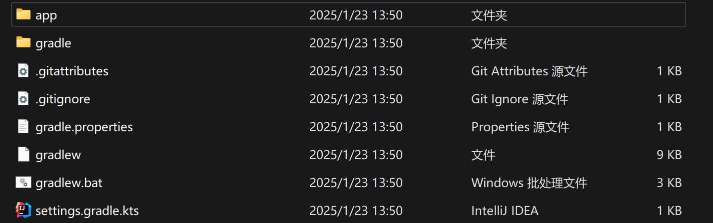
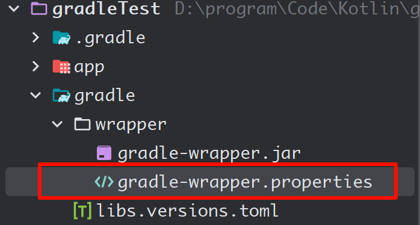

> [本篇笔记参考](https://www.bilibili.com/video/BV1Fc411x7xF?vd_source=b0e615d38d99501542b4ad41dbfdddcb)


# 基础篇

## 安装

[gradle下载地址，选择二进制的](https://gradle.org/releases/?_gl=1*rvy16h*_gcl_au*MTA3Nzk0MzI2Ny4xNzM3NjEwMjQ4*_ga*MTg1OTUyMzM5NC4xNzM3NjEwMjQ4*_ga_7W7NC6YNPT*MTczNzYxMDI0Ny4xLjAuMTczNzYxMDI1NC41My4wLjA.)

选择一个地方解压出来，然后进行环境变量的配置：

```sh
$GRADLE_HOME$
D:\program\ENV\gradle-8.12

# 添加到path路径上
%GRADLE_HOME%\bin
```


安装测试：

```sh
C:\Users\admin>gradle -v

------------------------------------------------------------
Gradle 8.12
------------------------------------------------------------

Build time:    2024-12-20 15:46:53 UTC
Revision:      a3cacb207fec727859be9354c1937da2e59004c1

Kotlin:        2.0.21
Groovy:        3.0.22
Ant:           Apache Ant(TM) version 1.10.15 compiled on August 25 2024
Launcher JVM:  20.0.2 (Oracle Corporation 20.0.2+9-78)
Daemon JVM:    C:\Program Files\Java\jdk-20 (no JDK specified, using current Java home)
OS:            Windows 11 10.0 amd64
```


## 创建项目

```sh
# 选择一个空文件夹
gradle init
```

选择题做完之后产生的目录结构：



下面介绍一下各个目录的作用：

- **.gradle**: Gradle自动生成的项目缓存目录
- **app**: 存放整个项目源代码、测试等
  - **build.gradle.kts**: 项目的gradle**构建脚本**，类似Maven中的pom.xml文件
  - **src**: 存放源代码和测试代码
- **gradle**: 包含JAR文件和Gradle Wrapper的配置
- **gradlew**: 适用于**macOS**和**Linux**的使用Gradle Wrapper执行构建的脚本
- **gradlew.bat**: 适用于**Windows**的使用Gradle Wrapper执行构建的脚本
- **settings.gradle.kts**: 定义子项目列表的**项目配置文件**，也是最**关键**的设置文件

使用`IDEA`或者`Andriod Studio`打开项目之后，会自动下载`gradle`，这是`gradle wrapper`在起作用，由于`gradle`的**版本兼容性很差**，使用`wrapper`可以确保项目启动时使用的`gradle`版本是正确的。总之是好东西。

但是gradle下载的资源很多都被墙，而且最近（2025年）的梯子不稳定，都不稳定，下载了半分钟就没有信号了。所以最好配置一下镜像源。

由于项目创建时安装的那些包都是`gradle wrapper`下载的，那么就只需要修改它的配置即可。观察一下目录结构，很快就能找出`gradle wrapper`的配置文件了：



文件的内容如下：

```properties
distributionBase=GRADLE_USER_HOME
distributionPath=wrapper/dists
distributionUrl=https\://services.gradle.org/distributions/gradle-8.12-bin.zip
networkTimeout=10000
validateDistributionUrl=true
zipStoreBase=GRADLE_USER_HOME
zipStorePath=wrapper/dists
```

很明显，`distributionUrl`属性应该是指定下载地址的，我们可以将地址改为国内的：

```properties
# 阿里: https://mirrors.aliyun.com/macports/distfiles/gradle/
distributionUrl=https://mirrors.aliyun.com/macports/distfiles/gradle/gradle-8.12-all.zip
```

