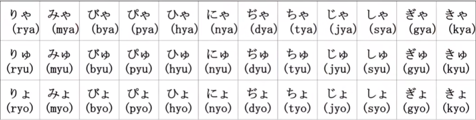

## 日语的文字

日语的文字分为三类：汉字、平假名、片假名和罗马字

### 汉字

汉字这一块，是因为日文起源于中文，所以会夹带一些中文，有些甚至保留了日语的读音，比如：**山（さん）**、**水（すい）**

但是随着历史的演变，有一些汉字可能会跟我们中文中的字有些不一样，比如 **强**，在日语中的写法是 **強**。

除了夹带一些中文，日本人也根据中文的特点自己造了一些字，这些字在新华字典里是查不到的，比如：**峠（touge）**（鬼灭之刃作者的名字就有这个）

### 平假名

由于汉字学习的难度很大（尤其是对于外国人），但是日本人又觉得这个很好用，因此他们就发明了 **万叶假名** 来帮助学习。比如下面的例子：

| 假名     | 万叶假名   |
| :------: | :--------: |
| かわいい | 卡哇伊     |
| 愛 してる | 阿姨洗铁路 |

学习日语之前，看假名的话会看不懂，但是看万叶假名的话一看就知道，所以万叶假名的用途是 **用来标音的**。而万叶假名来源于 **《万叶集》**，万叶集就是整本都是这种万叶假名，中国人看不懂，很多日本人也看不懂。

平假名源于汉字的草书

### 片假名

片假名来源于汉字的楷书，最早是用于诵读佛经，但是佛经很多都是繁体字，抄起来太麻烦了，于是日本人就用偏旁部首来表示

### 罗马字

罗马字也是用于标音的，现在对于日语学习非常重要。

比如：大坂（おさか，osaka）

## 五十音图

阿卡萨塔娜，蛤蟆压拉瓦

|      |  あ  |  い  |  う  |  え  |  お  |
| :--: | :--: | :--: | :--: | :--: | :--: |
|  あ  |  あ  |  い  |  う  |  え  |  お  |
|  か  |  か  |  き  |  く  |  け  |  こ  |
|  さ  |  さ  |  し  |  す  |  せ  |  そ  |
|  た  |  た  |  ち  |  つ  |  て  |  と  |
|  な  |  な  |  に  |  ぬ  |  ね  |  の  |
|  は  |  は  |  ひ  |  ふ  |  へ  |  ほ  |
|  ま  |  ま  |  み  |  む  |  め  |  も  |
|  や  |  や  |      |  ゆ  |      |  よ  |
|  ら  |  ら  |  り  |  る  |  れ  |  ろ  |
|  わ  |  わ  |      |      |      |  を  |
|  ん  |      |      |      |      |      |

几个特殊的发音：

|  罗马音   | 读音 |
| :-------: | :--: |
| し（shi） |  xi  |
| す（su）  |  si  |
| ち（chi） |  qi  |
| つ（tsu） |  ci  |
| を（wo）  |  o   |

五十音图发音有两个重要的点：

1. 嘴型幅度比较小
2. 发音靠舌前，声带不会震动

读五十音图的时候，是不会 **送气** 的，所谓送气就是没有气流从嘴里喷出来，练习的时候可以把手掌对着嘴巴，看看有没有气流。要尽量把气流收回去，这样才是标准的日语读法。

## 日本的文化符号

さくら：sa ku ra，桜

はる：ha ru，春

やま：ya ma，山

なつ：na tsu，夏

うし：su shi，寿司

あき：a ki，秋

おんせん：onn senn，温泉

ふゆ：hu yu，冬

## 儿歌

### 小星星

- きらきらひかる おそらのほしよ

- ki ra ki ra hi ka ru o so ra no ho shi yo

  一闪一闪亮晶晶 满天都是小星星

- まばたきしては みんなをみてる

- ma ba ta ki shi te wa mi n na wo mi te ru

  转瞬之间的出现 大家一起都看见

- きらきらひかる おそらのほしよ

- ki ra ki ra hi ka ru o so ra no ho shi yo

  一闪一闪亮晶晶 满天都是小星星

- きらきらひかる おそらのほしよ

- ki ra ki ra hi ka ru o so ra no ho shi yo

  一闪一闪亮晶晶 满天都是小星星

- みんなのうたが とどくといいな

- mi n na no u ta ga ro do ku to i i na

  满载大家的梦想 传递梦想到远方

- きらきらひかる おそらのほしよ

- ki ra ki ra hi ka ru o so ra no ho shi yo

  一闪一闪亮晶晶 满天都是小星星

- きらきらひかる おそらのほしよ

- ki ra ki ra hi ka ru o so ra no ho shi yo

  一闪一闪亮晶晶 满天都是小星星

- まばたきしては みんなをみてる

- ma ba ta ki shi te wa mi n na wo mi te ru

  转瞬之间的出现 大家一起都看见

- きらきらひかる おそらのほしよ

- ki ra ki ra hi ka ru o so ra no ho shi yo

  一闪一闪亮晶晶 满天都是小星星

## 浊音和半浊音

|          |          |          |          |          |
| :------: | :------: | :------: | :------: | :------: |
| が（ga） | ぎ（gi） | ぐ（gu） | げ（ge） | ご（go） |
| ざ（za） | じ（ji） | ず（zu） | ぜ（ze） | ぞ（zo） |
| だ（da） | ぢ（di） | づ（du） | で（de） | ど（do） |
| ば（ba） | び（bi） | ぶ（bu） | べ（be） | ぼ（bo） |

> 其中 ぢ 跟 じ 的发音一致，读作 ji
>
> づ　跟 ず　的发音一致，读作 zi

> 下面是半浊音：

|          |          |          |          |          |
| :------: | :------: | :------: | :------: | :------: |
| ぱ（pa） | ぴ（pi） | ぷ（pu） | ぺ（pe） | ぽ（po） |

## 拗音

1. 前面的假名都是 **い** 段假名，而且只有辅音发音：きゃ => ki + ya => kya
2. 后面的假名都有 **や**、**ゆ**、**よ**，并且都是 **小写**

